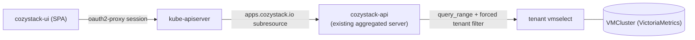
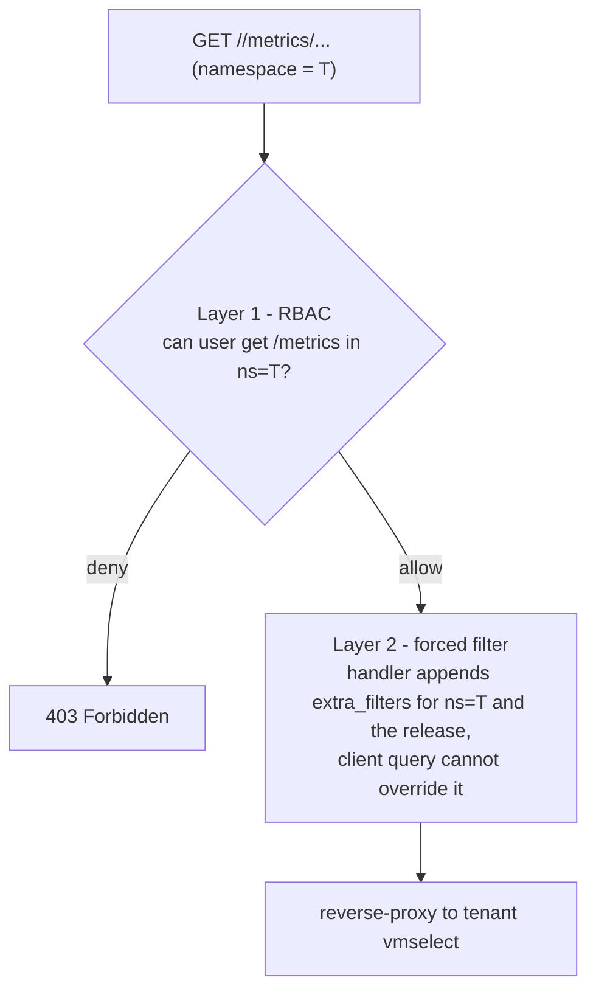

# Tenant resource-consumption metrics via an application subresource

- **Title:** `Tenant resource-consumption metrics via an application subresource`
- **Author(s):** `@IvanHunters`
- **Date:** `2026-10-08`
- **Status:** Review

## Overview

Clients running managed databases and VMs on Cozystack want to see their own real consumption (CPU, memory, network) directly in the dashboard, without opening Grafana and without deploying their own per-tenant monitoring stack. Today the data already lives in VictoriaMetrics, but a tenant has no way to read it: the dashboard is a pure SPA that talks only to the Kubernetes API, there is no per-tenant query path into VictoriaMetrics, and a VM or database detail page shows status and controls but no consumption graph over time. A tenant can set quotas and presets but cannot see how much it actually uses, which is a concrete ask from real clients.

This proposal exposes consumption metrics as a **subresource of the existing `apps.cozystack.io` application resource**, served by the existing `cozystack-api` aggregated API server. The dashboard calls `.../namespaces/<ns>/<plural>/<name>/metrics/api/v1/query_range?query=...`; `cozystack-api` authorizes the call with ordinary Kubernetes RBAC, forwards the Prometheus-compatible query to the tenant's `vmselect` with a server-forced tenant filter, and returns the Prometheus-compatible JSON unmodified for the dashboard to chart. There is **no new API server, no new resource kind, and no Kubernetes envelope (`apiVersion`/`kind`) in the payload**.

This proposal was redrafted during review. An earlier draft in this same PR designed a standalone `metrics.cozystack.io` aggregation API server with a `MetricQuery` kind; after a design discussion that shape was dropped in favor of the subresource described here, and the Alternatives section records why.

## Scope and related proposals

- **Replaces an earlier draft in this PR** (standalone `metrics.cozystack.io` server with a `MetricQuery` kind). See Alternatives.
- **Modeled on the Cozystack portal logs API** (external: `aenix-org/cozyportal`, group `logging.portal.cozystack.io`, resource `logs`): a virtual, non-etcd resource that proxies a time-series backend behind Kubernetes authorization. This proposal adapts that pattern and improves on it (RBAC comes for free here, which it did not in the portal; see Design).
- **Complements, does not replace, Grafana.** Grafana stays the place for deep exploration; this serves embedded, basic per-resource graphs for tenants who do not run their own Grafana.
- **Billing is out of scope.** The external `billing.aenix.io` server is referenced only as a pattern; this proposal does not depend on it and does not produce invoices.
- **Alert management is a separate proposal.** Managing alert rules and routing is read-write and stateful; unlike metrics, it likely does need an aggregation API. Deferred (see Non-goals).
- **Foundational dependency: multi-tenancy for the metrics store.** The real underlying work flagged in the discussion is proper per-tenant isolation of the metrics backend, whatever it is. This proposal's forced-filter and store resolution are the per-tenant access layer on top of that (see Design and Rollout).

## Prior art

- **Portal logs API (the model, external).** `aenix-org/cozyportal` serves a top-level namespaced virtual resource `logs` (group `logging.portal.cozystack.io`, not stored in etcd) from an aggregated API server, projecting requests into VictoriaLogs and streaming the backend's native response as `text/plain` rather than a Kubernetes object. Its ADR-001 chose a top-level resource over a per-kind subresource specifically because logs must survive their parent (post-mortem), a constraint that does not apply to live metrics. Crucially, the portal's authorization needed a **custom `SubjectAccessReview`** in the handler, because its logs server lives in a different API group than the resources it reports on; its RBAC did not come for free. This proposal avoids that by living in the same group as its target.
- **cozystack-api (the host).** `cozystack-api` is the aggregated API server for `apps.cozystack.io`, registering one storage per application kind from the `ApplicationDefinition` set, with delegated authentication and authorization. It has no subresource today, so this adds the first one.
- **Kubernetes subresource precedents.** Upstream `pods/log` uses `GetterWithOptions` + `ResourceStreamer` to stream a non-JSON body; `pods/proxy` uses `rest.Connecter` to return an `http.Handler` that reverse-proxies arbitrary methods and response bodies. The latter is the closer fit for a Prometheus passthrough.
- **vmauth for traces (in cozystack).** Cozystack already runs `vmauth` to isolate traces per tenant, via a `VMUser` that injects `AccountID`/`ProjectID` headers (the VictoriaTraces account dimension), not a label filter. The metrics alternative in this proposal would instead force `extra_filters` (VictoriaMetrics' documented label-filter mechanism). So `vmauth` is a component precedent in cozystack, but the isolation mechanism for metrics would differ from the one used for traces.

## Decisions

<!-- Filled in as implementation proceeds; records live under this
proposal's decisions/ directory, numbered from 0001, linked newest first.
Empty while the proposal is still intent. -->

## Context

Today, the relevant pieces are:

- **Metrics stack: VictoriaMetrics** (not Prometheus). A cluster-wide `vmagent` (`selectAllByDefault: true`) scrapes cAdvisor, kubelet, node-exporter, kube-state-metrics, and the control plane, remote-writing to the `tenant-root` VMCluster by default (`packages/core/platform/templates/bundles/system.yaml`, `global.target`). Each VMCluster exposes a Prometheus-compatible read API at `vmselect-<name>.<ns>.svc:8481/select/0/prometheus/`.
- **Per-tenant monitoring is optional** (`tenant.spec.monitoring`, default `false`). When enabled, a tenant gets its own VMCluster, and its namespace label `namespace.cozystack.io/monitoring` names the owning namespace; when not enabled the label carries the nearest ancestor that has its own monitoring, or is empty if none does. Platform-scraped workload metrics still land in `tenant-root` regardless, via the hardcoded remote-write target. So cozystack isolates tenants by **separate stores plus NetworkPolicy**, not by an account dimension inside one store.
- **Tenant RBAC and OIDC groups.** The tenant chart binds four aggregated ClusterRoles `cozy:tenant:{view,use,admin,super-admin}` (labels `rbac.cozystack.io/aggregate-to-tenant-<level>`) in each tenant namespace to `kind: Group` subjects `<tenant>-{view,use,admin,super-admin}` (created by the Keycloak operator) plus ancestor tenants' groups and service accounts, with the view < use < admin < super-admin rollup. The OIDC `groups` claim is used without a prefix, so bindings name the groups directly.
- **Dashboard.** `cozystack-ui` is a pure SPA (no BFF): in production an in-pod nginx proxies `/api`, `/apis`, `/k8s` to `kubernetes.default.svc`, with oauth2-proxy (OIDC) or a built-in token-proxy (non-OIDC) in front. Application objects are served by `cozystack-api` through that same kube-apiserver path. There is no charting library, no Prometheus proxy, and no Grafana embed in the bundle.

### The problem

- A tenant opens a database or VM page and wants "how much CPU / RAM / network has this been using". There is no such graph and no API the SPA could call to build one.
- Telling the client to open Grafana does not work for the target audience: clients bought through a reseller who do not run their own Grafana, and who should not have to deploy and pay for a full monitoring stack just to read basic usage.
- Reaching `vmselect` directly from the SPA (for example via the kube-apiserver `services/<vmselect>/proxy` subresource) is unsafe: it authorizes coarsely and cannot constrain the query, so against the shared `tenant-root` store it reads every tenant's series.

## Goals

- A tenant can retrieve time-series consumption for a resource it owns (a managed app / database / VM), over a chosen range, and the dashboard renders it as a graph.
- A tenant can never read another tenant's series, enforced server-side by a forced filter the client cannot override.
- Authorization reuses the existing tenant RBAC and Keycloak groups with **no new RBAC rule**: metrics-read inherits the existing app-read grant because the subresource is in the `apps.cozystack.io` group.
- The dashboard consumes a **Prometheus-compatible response with a standard client**, with no second Kubernetes-style API or client to maintain.
- Minimal implementation: a subresource handler plus a forced filter in the existing `cozystack-api`, not a new API server, not a new CRD, not a large new code and E2E surface.

### Non-goals

- Not billing, metering, or invoices.
- Not alert-rule or alert-routing management (separate proposal).
- Not a replacement for Grafana or for `metrics.k8s.io`.
- Not a new durable store; retention and downsampling stay in VictoriaMetrics.
- Not a Kubernetes-style `MetricQuery` kind with `apiVersion`/`kind` envelopes (the dropped earlier revision).
- Not metrics for resources inside guest Kubernetes clusters (Kamaji); that has a different authorization model and is out of scope.

## Design

### 1. Shape: a metrics subresource on `application`

Add a `metrics` subresource to each `apps.cozystack.io` application kind in `cozystack-api`, registered under the storage key `"<plural>/metrics"` and implemented as a `rest.Connecter` (the `pods/proxy` pattern): the handler returns an `http.Handler` that reverse-proxies to the tenant's `vmselect`.

- **Request:** `GET .../namespaces/<ns>/<plural>/<name>/metrics/api/v1/query_range?query=<promql>&start=&end=&step=`. The path tail (`api/v1/query_range`) and the query string are the native VictoriaMetrics request.
- **Response:** the `vmselect` Prometheus-compatible JSON, returned as the body unchanged, with no `apiVersion`/`kind` wrapper. The dashboard parses it with a standard Victoria/Prometheus client.

### 2. Why this shape

Compared with the dropped standalone-aggregation-API revision and with the portal's separate-group logs model:

| property | this proposal (subresource on `application`) | earlier revision (new `metrics.cozystack.io` + `MetricQuery` kind) | portal-style separate group |
| --- | --- | --- | --- |
| RBAC | free: already covered by the existing `apps.cozystack.io` wildcard app-read grant, zero new rules | custom resource, new ClusterRole, still workable but a second surface | needs a custom `SubjectAccessReview` (different group) |
| payload | native Prometheus JSON, no kube envelope | kube object with `apiVersion`/`kind` | native, but behind a custom SAR |
| dashboard client | standard Prometheus/Victoria client | a second, kube-style client to build and maintain | standard |
| new components | none (handler in existing `cozystack-api`) | a new aggregated API server | a new aggregated API server |
| per-kind cost | none: one shared handler, registered per plural in the existing loop, no per-kind code or recompile | one resource for all | one resource, but per-target SAR wiring |

The decisive points: RBAC is genuinely free because the subresource shares the `apps.cozystack.io` group with its target, so it inherits the existing wildcard `get apps.cozystack.io/*` grant (the portal could not get this); the response is the backend's own Prometheus JSON, so the dashboard reuses a standard client instead of a second kube-style API; and because `cozystack-api` builds its application storages in one loop over `ApplicationDefinition`, the `metrics` subresource is one shared handler registered per plural in that loop rather than hand-written per application type, avoiding the per-kind recompile that the portal and similar systems hit.

### 3. Authorization: two layers, the first free

**Layer 1 (RBAC), free and already granted.** Because the subresource is in `apps.cozystack.io`, the kube-apiserver and `cozystack-api`'s delegated authorizer check `get <plural>/metrics` in the request namespace with no custom code. And it needs no new rule: the existing `cozy:tenant:view:base` ClusterRole already grants `get` on `apps.cozystack.io` with resources `["*"]`, and an RBAC resource wildcard matches subresources, so `get <plural>/metrics` is already authorized at tenant `view` and above through the existing `<tenant>-view` group bindings. Metrics-read therefore inherits app-read, with zero new ClusterRole, no new Keycloak group, and no tenant-chart change. The consequence is that metrics-read cannot be gated separately from app-read while that wildcard stands: gating it differently would mean narrowing the existing wildcard, which is out of scope here (see Open questions).

**Layer 2 (forced filter), the isolation hinge.** The handler takes the tenant from the request namespace (already authorized) and the release from the object name, and appends a mandatory `extra_filters` label matcher to the forwarded query. In VictoriaMetrics `extra_filters` is ANDed into every selector of the query, so even a raw client-supplied PromQL cannot escape the tenant's own `namespace` (and release) scope. This is the same shape the portal uses for logs (a scope-label always added to the backend query, empty selector rejected); `extra_filters` is VictoriaMetrics' documented way to do the equivalent for metrics. Because the filter is forced server-side, raw Prometheus passthrough is isolation-safe and no fixed metric catalog is required.

### 4. Tenant and `vmselect` resolution

The handler reads `namespace.cozystack.io/monitoring` on the request namespace. The label is baked at tenant-render time to the namespace of the nearest ancestor that has its own monitoring (the tenant itself when it does), and is the empty string otherwise, which is the default. A non-empty value names the `vmselect` holding that tenant's data. An empty value means the tenant has no dedicated store, so its workload metrics live in the platform default store `tenant-root` (where the cluster-wide `vmagent` remote-writes), and the handler queries `tenant-root`. Note this empty-to-`tenant-root` rule is specific to this feature: the existing `workloadmonitor` controller treats an empty label as "no store" because it only reads metrics that exist solely in a per-tenant store (S3 bucket sizes), whereas workload CPU/memory/network for every tenant is in `tenant-root` regardless. The forced filter is applied in both branches: redundant for an isolated per-tenant store, mandatory for the shared `tenant-root` one.

### 5. Scope: per-object now, tenant-wide aggregate later

A subresource answers "metrics for this one object". A tenant-wide view ("all my databases") needs either a top-level resource with the field-selector trick the portal uses for `list`, or a `metrics` subresource on the `Tenant`. This is deferred (see Open questions). A subresource also returns 404 once the application is deleted, which is acceptable for live graphs (unlike logs, which the portal kept post-mortem).

### 6. Foundational: metrics multi-tenancy

The real underlying work is proper per-tenant isolation of the metrics store. Cozystack does this today with separate per-tenant VMClusters plus NetworkPolicy rather than an account dimension, so the forced-filter plus store-resolution in this proposal is the per-tenant access layer. Hardening that model (and deciding whether a shared multi-tenant store with enforced per-tenant filtering is preferable) is a prerequisite tracked in Rollout.

## User-facing changes

- **Dashboard:** a consumption graph section on database and VM detail pages (CPU / RAM / network over a selectable range), rendered from the Prometheus JSON returned by the subresource. This needs a charting approach added to `cozystack-ui`, which has none today.
- **API:** a new `metrics` subresource on `apps.cozystack.io` application kinds, usable as `kubectl get --raw .../namespaces/<ns>/<plural>/<name>/metrics/api/v1/query_range?query=...` and from the SPA over the existing path.
- **RBAC:** granted automatically at tenant `view` and above through existing groups; no new group to manage.

## Upgrade and rollback compatibility

- Additive: a new subresource and no new RBAC rule; existing clusters, manifests, and APIs are unaffected.
- No CRD and no stored objects. Removing the subresource removes the feature; the dashboard degrades to "no graph" (today's state).
- This introduces the first subresource in `cozystack-api`, so the apiserver wiring (storage map key, `Connecter` registration) is new ground and should be validated in `cozystack-api` tests.

## Security

- **Trust boundary:** `cozystack-api` issues queries to `vmselect` on behalf of users. The forced `extra_filters` is server-decided; a client-supplied query is passed through only after the tenant filter is ANDed into every selector, so it cannot widen past the tenant.
- **Why not `services/proxy` to `vmselect`:** coarse authz, no forced filter, leaks across tenants on the shared store.
- **No stored credentials:** `cozystack-api` reaches `vmselect` with its own identity and authorizes callers by delegated kube authn, unlike a `vmauth` path which would require per-tenant tokens.
- **Query cost:** since raw PromQL is accepted, the handler must bound it (max range, step, series, timeout) to protect `vmselect`; this replaces a fixed catalog as the abuse control.
- **Endpoint allowlist:** the reverse-proxy forwards only an allowlisted set of read endpoints (for example `query` and `query_range`), not the arbitrary `api/v1/*` tail. `/api/v1/export`, `/api/v1/series`, the label endpoints, and any admin or write paths are not exposed, and `extra_filters` is confirmed to apply on every allowed endpoint.
- **Input:** the object name flows into the forced filter and must be used as an exact label match, not interpolated into a regex.

## Failure and edge cases

- Tenant has no dedicated monitoring stack (empty label): resolves to `tenant-root` where the series are (see Design 4); this is the common case, not a failure. The genuine no-store case (not even `tenant-root` has monitoring) is not a normal deployment; if it occurs, return an empty Prometheus result with a warning, not an error.
- `vmselect` unreachable: surface a backend error distinct from "no data".
- Caller lacks `get <plural>/metrics` in the namespace: 403 before any query runs.
- Client query tries to drop or widen the tenant filter: impossible, `extra_filters` is ANDed in server-side.
- Application deleted mid-session: 404 from the subresource (acceptable for live graphs).
- Range or step out of bounds: rejected by the cost limits.

## Testing

- **Unit:** the forced `extra_filters` is always present and cannot be overridden by the client query; the `vmselect` resolver picks the right store (including the empty-label fallback to `tenant-root`); cost limits.
- **Integration:** the delegated authz allows `<tenant>-view` for `get <plural>/metrics` in the tenant namespace and denies a foreign tenant; the `Connecter` subresource is reachable through the aggregated server.
- **e2e:** two tenants on a shared `tenant-root` store; tenant A's query returns only A's series; a VM/database graph renders end to end in the dashboard.

## Rollout

- **Phase 0 (prerequisite): scrape per-VM metrics.** Confirm on a live cluster whether `kubevirt_vmi_*` (cpu/memory/network/storage) are collected, by querying `vmselect` for one of them or checking for the KubeVirt scrape object (the virt-operator `ServiceMonitor` lands in its `monitorNamespace`, `tenant-root`, converted to a `VMServiceScrape`); if not, add the scrape. Per-VM network is the blocking gap today. This phase is useful on its own.
- **Phase 1: subresource in `cozystack-api`.** Register `"<plural>/metrics"` as a `Connecter`, force `extra_filters`, and resolve the `vmselect`. No new RBAC rule is needed (metrics-read inherits the existing app-read grant, see Design 3). Usable via `kubectl --raw`.
- **Phase 2: dashboard graphs.** Add a Prometheus/Victoria client and charts to `cozystack-ui`.
- **Foundational, parallel:** harden metrics-store multi-tenancy (the team-flagged underlying work).

## Open questions

- Handler mechanism: `rest.Connecter` (reverse-proxy, GET/POST, arbitrary body, closest to a passthrough) versus `GetterWithOptions` + `ResourceStreamer` (as the portal does); confirm the `Connecter` wiring works cleanly in `cozystack-api`'s assembler.
- Tenant-wide aggregate ("all my databases"): a top-level resource with the portal's `list` field-selector trick, or a `metrics` subresource on `Tenant`?
- Raw PromQL passthrough with cost limits, versus a small server-side allowlist of queries for tighter cost control.
- Which store to query for a given range when a tenant has both shortterm and longterm VMClusters.
- Prerequisite to confirm: the Layer 1 group-based authz assumes the management apiserver has OIDC enabled with a flat `groups` claim and no `oidc-groups-prefix` (set out-of-band via talm, the same assumption the existing tenant RBAC relies on); define the behavior on a cluster with a prefix or without OIDC.
- Request method: the normative path is GET (RBAC verb `get`); a POST query, common for large PromQL, maps to verb `create` on `<plural>/metrics` and would need a separate grant and authz, so the first cut restricts the proxy to GET.
- Whether metrics-read should be gateable separately from app-read: today it inherits the existing `apps.cozystack.io` wildcard `get` grant, so it cannot be gated independently without narrowing that wildcard.
- Confirm the guest-cluster (Kamaji) exclusion is acceptable, or scope a follow-up.

## Alternatives considered

- **Standalone aggregation API with a `MetricQuery` kind (this proposal's earlier revision).** A new `metrics.cozystack.io` API server, storage-less, returning structured series in a Kubernetes object. Rejected in the design discussion: it wraps every response in a kube `apiVersion`/`kind` envelope, forces a second kube-style API spec and a second dashboard client to maintain, and adds a new server and E2E surface, for no benefit over a reverse-proxy subresource that returns native Prometheus JSON.
- **Portal-style separate logging-like group.** A dedicated `metrics.*` virtual resource in its own group, like the portal's `logs`. Rejected: being in a different group from the target resource means RBAC is not free (the portal needed a custom `SubjectAccessReview` and two-rule roles), which is exactly the cost the subresource avoids.
- **vmauth or a thin self-written proxy to Victoria, bypassing the Kubernetes API.** The simplest infrastructure, and `vmauth` can force per-tenant isolation via `extra_filters`. Rejected as the primary because its authorization is `vmauth`-native (its own tokens or a JWT with a tenant claim), not Kubernetes RBAC, so it needs per-tenant credentials or an OIDC-JWT-to-tenant mapping and a second auth path in the dashboard. Kept as a fallback if the subresource wiring proves too awkward; cozystack already runs `vmauth` for traces. Decision criterion from the discussion: take the subresource route only if it buys Kubernetes RBAC cheaply (it does) and `vmauth` cannot isolate per tenant without bespoke credentials (it cannot, cleanly).
- **A deep-link button to Grafana** (open the right dashboard with the right metrics preselected). Low effort and good for clients who already run Grafana, but rejected as the primary because the target audience is exactly the clients who do not run their own Grafana or monitoring stack. Worth shipping as a complementary convenience.
- **Fixed metric catalog / no free-form PromQL** (the earlier revision's stance). Unnecessary once the handler forces `extra_filters` on every selector, which makes raw passthrough isolation-safe; query-cost limits handle abuse instead of a catalog.

---

<!--
Inspired by KubeVirt enhancement proposals
(https://github.com/kubevirt/enhancements) and Kubernetes Enhancement
Proposals (KEPs).
-->
