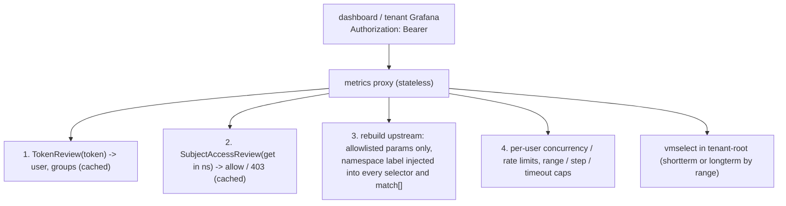

# Tenant resource-consumption metrics via an authorizing proxy

- **Title:** `Tenant resource-consumption metrics via an authorizing proxy`
- **Author(s):** `@IvanHunters`
- **Date:** `2026-10-22`
- **Status:** Review

## Overview

Clients running managed databases and VMs on Cozystack want to see their own real consumption (CPU, memory, network) directly in the dashboard, without opening Grafana and without deploying their own per-tenant monitoring stack. The data already lives in VictoriaMetrics, but a tenant has no way to read it: the dashboard is a pure SPA, there is no per-tenant query path into VictoriaMetrics, and a VM or database detail page shows status and controls but no consumption graph over time. The requirement that makes this a platform feature is that **Kubernetes identity and RBAC** decide who may read which tenant's metrics: the same tokens, the same tenant groups, the same view < use < admin rollup, the same ancestor access.

That requirement is about authentication and authorization, not about routing query traffic through the control plane. This proposal puts a **small stateless authorizing proxy in front of `vmselect`**. The proxy validates the bearer token the dashboard already holds with a `TokenReview`, authorizes the namespace with a `SubjectAccessReview` against a virtual resource in a new `observability.cozystack.io` group, forces the tenant's `namespace` label into every selector of the query, and reverse-proxies the native Prometheus request to `vmselect`, returning the Prometheus JSON unchanged. Identity and policy stay Kubernetes; only the query bytes stay out of the API server. It also serves an optional per-application scope so an application page shows only that application's series. The logs read path (cozystack/community#95) sits behind the same proxy and the same group.

An earlier draft of this proposal (in this same PR) routed metrics through `cozystack-api`, first as a standalone `metrics.cozystack.io` API server with a `MetricQuery` kind, then as a `metrics` subresource on `apps.cozystack.io`. Both are now in Alternatives with the reasons the proxy is preferred.

## Scope and related proposals

- **Companion to the logs (cozystack/community#95) and alerts (#96) proposals.** Metrics and logs are read paths behind the same authorizing proxy and the same `observability.cozystack.io` group (`*/metrics` and `*/log`); alert management is read-write CRUD and stays a Kubernetes resource.
- **Complements, does not replace, Grafana.** Grafana stays the place for deep exploration; this serves embedded, basic per-resource graphs for tenants who do not run their own Grafana.
- **Billing is out of scope.** This exposes measured consumption for graphs; it does not meter, price, or produce invoices.
- **Foundational dependency: write-path multi-tenancy for the metrics store.** A `namespace` label in the shared store is trusted today; closing that gates proxy exposure (see Security and Rollout).

## Prior art

- **`kube-rbac-proxy` (identity and RBAC).** A small proxy that authenticates a request with `TokenReview` and authorizes it with `SubjectAccessReview` against a configured resource attribute, then forwards it. It is the "ask Kubernetes who you are and whether you may" step, with no API server of its own.
- **`prom-label-proxy` (single-label enforcement).** A proxy that injects one mandatory label matcher into a Prometheus/VictoriaMetrics request and rejects attempts to override it. It covers the namespace scope, but it enforces a single label and retains other request parameters, so it does not cover the OR-of-branches of the application scope nor the parameter stripping below; those need the Go service.
- **OpenShift per-project metrics.** OpenShift serves per-namespace metrics to users holding the project `view` role through this same pattern (an authorizing proxy enforcing a namespace label), rather than a Kubernetes aggregated API. This is the deployed precedent the proposal follows.
- **cozystack tenant RBAC.** The tenant chart binds aggregated ClusterRoles `cozy:tenant:{view,use,admin,super-admin}` (labels `rbac.cozystack.io/aggregate-to-tenant-<level>`) to the `<tenant>-<level>` Keycloak groups and ancestor subjects. A new aggregated rule naming a virtual resource reaches those groups with no tenant-chart change; `backup-controller` ships such tenant ClusterRoles the same way.

## Decisions

<!-- Filled in as implementation proceeds; records live under this
proposal's decisions/ directory, numbered from 0001, linked newest first.
Empty while the proposal is still intent. -->

## Context

- **Metrics stack: VictoriaMetrics.** A cluster-wide `vmagent` (`selectAllByDefault: true`) scrapes cAdvisor, kubelet, node-exporter, kube-state-metrics, and the control plane, remote-writing to the `tenant-root` VMCluster by default. Each VMCluster exposes a Prometheus-compatible read API at `vmselect-<name>.<ns>.svc:8481/select/0/prometheus/`.
- **Where the resource metrics live: `tenant-root`.** The series these graphs need (cAdvisor, kube-state-metrics, `kubevirt_vmi_*`) come from node-level, cluster-wide scrapes that remote-write to `tenant-root`. A tenant with its own monitoring (`tenant.spec.monitoring: true`, default `false`) runs a `vmagent` with `selectAllByDefault: false` that scrapes only the app scrape objects in namespaces pointing at it, so its own store does **not** hold cAdvisor/KSM/`kubevirt_vmi_*`. For the metrics in this proposal the store is therefore always `tenant-root` (shortterm or longterm chosen by range), regardless of whether the tenant runs its own stack.
- **Tenant RBAC and OIDC groups.** The `cozy:tenant:{view,use,admin,super-admin}` ClusterRoles are bound per tenant namespace to `kind: Group` subjects `<tenant>-{view,use,admin,super-admin}` (from the Keycloak operator) plus ancestor subjects, with the view < use < admin < super-admin rollup. The group-based path relies on the management apiserver passing a flat OIDC `groups` claim without a prefix.
- **Dashboard.** `cozystack-ui` is a pure SPA (no BFF): an in-pod nginx proxies `/api`, `/apis`, `/k8s` to `kubernetes.default.svc`, with oauth2-proxy (OIDC) or a built-in token-proxy (non-OIDC) in front. There is no charting library, no Prometheus proxy, and no Grafana embed in the bundle.

### The problem

- A tenant opens a database or VM page and wants "how much CPU / RAM / network has this been using". There is no such graph and no endpoint the SPA could call to build one.
- Telling the client to open Grafana does not work for the target audience: clients who do not run their own Grafana and should not have to deploy and pay for a full monitoring stack just to read basic usage.
- Reaching `vmselect` directly from the SPA (for example via the kube-apiserver `services/<vmselect>/proxy` subresource) is unsafe: it authorizes coarsely and cannot constrain the query, so against the shared `tenant-root` store it reads every tenant's series.

## Goals

- A tenant can retrieve time-series consumption for a resource it owns (a managed app / database / VM), over a chosen range, and the dashboard renders it as a graph.
- A tenant can never read another tenant's series, enforced server-side by a forced namespace matcher the client cannot override.
- Authorization uses Kubernetes identity and RBAC: the same bearer token the dashboard already sends, validated by `TokenReview`, authorized by `SubjectAccessReview`, reaching the existing tenant groups and ancestor access through one aggregated ClusterRole rule.
- The dashboard consumes a Prometheus-compatible response with a standard client, with no second API or client to maintain.
- Minimal implementation: one small stateless proxy, no new Kubernetes API surface, no change to `cozystack-api`.

### Non-goals

- Not billing, metering, or invoices.
- Not alert-rule or alert-routing management (separate proposal).
- Not a replacement for Grafana or for `metrics.k8s.io`.
- Not a new durable store; retention and downsampling stay in VictoriaMetrics.
- Not a new Kubernetes API group or subresource served by an API server (see Alternatives); the `observability.cozystack.io` group exists only in RBAC and the proxy's `SubjectAccessReview`.
- Not metrics for resources inside guest Kubernetes clusters (Kamaji); a different authorization model, out of scope.

## Design

### 1. Shape: an authorizing proxy in front of `vmselect`

A small stateless proxy sits between the caller and `vmselect`. It does identity and RBAC with Kubernetes, forces the tenant scope into the query, and reverse-proxies the native Prometheus request.


```mermaid
flowchart TD
  UI["dashboard / tenant Grafana<br/>Authorization: Bearer <same kube token>"] --> P["metrics proxy (stateless)"]
  P --> T["1. TokenReview(token) -> user, groups (cached)"]
  P --> S["2. SubjectAccessReview(get <virtual resource> in ns) -> allow / 403 (cached)"]
  P --> R["3. rebuild upstream: allowlisted params only,<br/>namespace label injected into every selector and match[]"]
  P --> L["4. per-user concurrency / rate limits, range / step / timeout caps"]
  P --> VS["vmselect in tenant-root (shortterm or longterm by range)"]
```

The proxy is reachable two ways, both of which carry the user's own token: a path behind the dashboard's existing nginx (next to `/apis`) for the SPA, and an in-cluster Service for a tenant's Grafana datasource. `kube-rbac-proxy` plus `prom-label-proxy` cover the namespace scope, but the application scope (4a) needs an OR of label branches and strict parameter stripping that `prom-label-proxy` does not do, so the implementation is **one small Go service** performing all four steps; it is still far less code than a Kubernetes API server or subresource with its tests.

### 2. Endpoints

`GET|POST /namespaces/<ns>/metrics/api/v1/{query,query_range,series,labels,label/<name>/values}`. The `metrics/` segment leaves room for the logs read path (`log/`, #95) behind the same proxy. These are the native VictoriaMetrics read endpoints the dashboard and a Grafana datasource need (a Grafana metric browser needs `labels`, `label/<name>/values`, and `series`). The proxy does its own authentication and authorization, so a POST query, which Grafana sends by default, is fine: it is not subject to the Kubernetes rule that a POST through the API server authorizes as `create`. The response is the `vmselect` Prometheus JSON, unchanged.

### 3. Authorization: the virtual resource

- **Identity.** `TokenReview` validates the bearer token the dashboard already holds, covering OIDC and ServiceAccount tokens alike, because kube-apiserver answers with its own authenticators. The proxy caches the result briefly.
- **Policy.** `SubjectAccessReview` asks RBAC whether that user, with their groups, may `get` a virtual resource in the request namespace. The proxy caches the decision briefly, and this is authorized by Kubernetes RBAC exactly as much as an aggregated API server would be; only the query traffic stays out of the API server.

The virtual resource lives in a group that no tenant role wildcards and that no API server serves: `observability.cozystack.io`. It exists only in RBAC rules and in the proxy's `SubjectAccessReview`; nothing is registered in the Kubernetes API (no APIService, no CRD, no discovery entry).

| Request | SubjectAccessReview (`verb=get`, `group=observability.cozystack.io`) |
| --- | --- |
| `/namespaces/<ns>/metrics/...` | `resource=namespaces`, `subresource=metrics`, `name=<ns>`, `namespace=<ns>` |
| `/namespaces/<ns>/<plural>/<name>/metrics/...` | `resource=<plural>`, `subresource=metrics`, `name=<name>`, `namespace=<ns>` |

The verb is `get` for both `GET` and `POST`; the proxy authorizes, not kube-apiserver. Default grant, aggregated into `view`:

```yaml
- apiGroups: [observability.cozystack.io]
  resources: ["*/metrics"]
  verbs: [get]
# in a ClusterRole labelled rbac.cozystack.io/aggregate-to-tenant-view
```

A separate group is what makes "metrics-read can be gated separately from app-read" hold: `cozy:tenant:view:base` grants `apps.cozystack.io` `resources: ["*"]`, and `*` also matches subresources, so any check inside `apps.cozystack.io` is always allowed for `view`. The same group carries `*/log` for #95. The name should be reserved: if an API server ever serves this group, these rules apply to it. Ancestor access comes for free from the existing bindings.

### 4. Isolation: a forced namespace matcher the caller cannot widen

- **Namespace only.** The enforced scope is the `namespace` label. An optional application scope (4a) narrows within the namespace; the namespace stays the security boundary. The series carry `namespace` (cAdvisor has `namespace`/`pod`/`container`; `kubevirt_vmi_*` has `namespace`/`name` and the VM's `app.kubernetes.io/instance` as `kubernetes_vmi_label_app_kubernetes_io_instance`), but no label that names the application for every kind, and the only generic link from an application to its pods is a join with `kube_pod_labels` that a label matcher cannot express; 4a does that join in the proxy as a lookup. Namespace is also exactly the boundary the tenant roles are bound on, which is why narrowing inside it is safe.
- **Built from scratch.** The proxy does not pass the caller's query through and append a filter: VictoriaMetrics OR-s repeated `extra_filters[]` values, so a caller-supplied `extra_filters[]={namespace=~".+"}` would widen the scope. The proxy copies only allowlisted parameters (`query`, `start`, `end`, `step`, `time`, `match[]`, a clamped `timeout`), injects the `namespace="<ns>"` matcher into every selector and every `match[]` server-side, and drops any caller-supplied `extra_filters` / `extra_filters[]` / `extra_label`, from both the URL and POST form data. A test asserts that a caller passing `extra_filters`, `extra_filters[]`, and `extra_label` cannot read beyond its namespace.

### 4a. Application scope (optional)

Next to the namespace endpoints of §2, the proxy serves the same Prometheus API scoped to one application:

`GET|POST /namespaces/<ns>/<plural>/<name>/metrics/api/v1/{query,query_range,series,labels,label/<name>/values}`

**Input.** `<plural>` must be a kind of `apps.cozystack.io`; `<name>` must be a DNS-1123 subdomain. Anything else is `400`. All values entering filters are quoted and regex-escaped.

**Scope.** In addition to the namespace matcher of §4, the proxy passes one `extra_filters[]` per non-empty branch; vmselect ORs them:

```text
extra_filters[]={namespace="<ns>",pod!="",pod=~"^(<pods>)$"}
extra_filters[]={namespace="<ns>",persistentvolumeclaim!="",persistentvolumeclaim=~"^(<pvcs>)$"}
extra_filters[]={namespace="<ns>",kubernetes_vmi_label_app_kubernetes_io_instance="<release>"}   # VM kinds only
```

`<release>` is the application's Helm release name, its ApplicationDefinition release prefix plus `<name>` (for example `vm-instance-<name>`); the proxy reads ApplicationDefinitions (`get`/`list`) for this and for the `<plural>` to `Kind` mapping.

- A branch with an empty list is **not sent**. `pod=~"^()$"` matches every series without a `pod` label and would widen the scope to the whole namespace; `pod!=""` guards the same case.
- `<pods>` and `<pvcs>` are the application's pods and PVCs over the query's effective window, read by the proxy from the same store the query goes to, with the label values API so that pods gone before `end` are included:

  ```text
  GET .../api/v1/label/pod/values?start=<s>&end=<e>&match[]=kube_pod_labels{namespace="<ns>",
      label_apps_cozystack_io_application_kind="<Kind>",
      label_apps_cozystack_io_application_name="<name>"}
  ```

  and `persistentvolumeclaim` from `kube_persistentvolumeclaim_labels` the same way.
- The effective window is `[start - lookback, end]`; for `query`, `start = end = time`. `lookback` is computed from the expression with `metricsql.Parse`: range-vector windows (or `step` when larger), subquery ranges plus their `step`, and offsets **add up** along each nesting path, plus `-search.minStalenessInterval` (5m by default) per level. This is the only parsing, used for the window, never for isolation. Expressions with `@` or a lookback above a cap are rejected with `422`.
- Lists are capped (proposed: 500 entries). Above the cap the proxy answers `422` and asks for a shorter range. Requests with long lists go to vmselect as `POST`.
- Store selection follows §5 and applies to the lookup too: shortterm when the whole effective window fits its retention, otherwise longterm.
- The upstream request is rebuilt from the allowlist of §4; client `extra_label`, `extra_filters`, `extra_filters[]` are dropped. On label APIs a `match[]` is always sent (`{__name__!=""}` when the client sent none), so `-search.ignoreExtraFiltersAtLabelsAPI`, if ever enabled, cannot return label names outside the scope.

Exporter series are covered by the pod branch: they are scraped from the application's pods and carry `pod`. Series without any of these labels (for example a Service-level metric without `pod`) are not visible through the application scope; they stay visible through the namespace endpoints.

### 5. Store resolution

Always `tenant-root` (see Context), with shortterm or longterm chosen by range: shortterm when the whole requested range fits its retention (fresher, higher resolution), otherwise longterm, defaulting to shortterm for live graphs. There is no per-tenant-stack resolution, because the resource metrics are not in a tenant's own stack.

### 6. Write-path trust (foundational)

The forced namespace matcher keeps reads safe, but a `namespace` label in the shared `tenant-root` store does not prove where a series came from. `tenant-root`'s `vminsert` accepts remote-write at account 0 from tenant workloads, and nested Kubernetes clusters write their metrics there by design with agents their tenants administer. So a tenant can write series labelled with another tenant's `namespace`. That cannot leak data, but it can make another tenant's graphs show fabricated numbers or push their queries over the series limits. Closing it is a write-path control, not a read-path one: a `vmauth` on the write path, per-writer accounts, or similar. Because the fabrication risk is live the moment the proxy is exposed, this control gates proxy exposure (see Rollout), not a parallel follow-up.

### 7. Query cost

`tenant-root`'s `vmselect` also serves platform Grafana, alerting, opencost, VPA, and KEDA, so tenant raw-PromQL competes with autoscaling and alerting. Concrete limits, and where each is enforced:

- In the proxy, per request: max range, a minimum `step` or a cap on points per series, a clamped `timeout`, and per-user concurrency and rate limits.
- As `vmselect` flags (global, so they bound everyone): max series per query, max query duration.
- Worth considering: a separate `vmselect` for tenant queries so they do not share a limit pool with platform autoscaling and alerting.

### 8. Deployment

One small stateless Go service plus a Service, reachable on a path behind the dashboard's nginx and as an in-cluster Service for Grafana. No change to `cozystack-api`, and no new Kubernetes API surface. The virtual resource exists only as a name in RBAC and the `SubjectAccessReview`.

## User-facing changes

- **Dashboard:** a consumption graph section on database and VM detail pages, using the same token and a standard Prometheus client against the proxy. Per-application graphs use the application endpoints (4a); "all my databases" uses the namespace endpoints. This needs a charting approach added to `cozystack-ui`, which has none today.
- **Tenant Grafana:** can use the proxy endpoint as a datasource, one per namespace, with the user's forwarded identity or a ServiceAccount token.
- **RBAC:** one new aggregated ClusterRole rule (`*/metrics` in `observability.cozystack.io`), reaching tenant groups automatically; no new group to manage.

## Upgrade and rollback compatibility

- Additive: one stateless Deployment, a Service, an nginx path, and one aggregated ClusterRole rule. Existing clusters, manifests, and APIs are unaffected, and `cozystack-api` is untouched.
- The proxy is an implementation detail behind a URL. It can be swapped freely later (for example once the metrics store gains native multi-tenancy) without removing Kubernetes API surface that clients depend on, which a subresource could not.
- Rollback: remove the Deployment, Service, path, and rule; the dashboard degrades to "no graph" (today's state).

## Security

- **Identity and policy are Kubernetes.** `TokenReview` and `SubjectAccessReview` against a namespaced virtual resource; the proxy stores no credentials of its own for callers and holds only its own ServiceAccount to reach `vmselect`.
- **Forced namespace matcher** is the isolation hinge: injected server-side into every selector and `match[]`, with the upstream request rebuilt from an allowlist (URL and POST form) so a caller cannot smuggle `extra_filters` / `extra_filters[]` / `extra_label` to widen scope. A test asserts that.
- **Per-application name is a scope, not a boundary.** The security boundary is the namespace; the application endpoints (4a) narrow within it. A malformed or crafted `pod`/`name` cannot cross the namespace, and all values entering filters are quoted and regex-escaped so a name like `my.vm` does not accidentally match another pod in the same namespace.
- **Write-path trust** is an open weakness of the shared store (Design 6): a tenant can write another namespace's label. It cannot leak data but can fabricate or inflate another tenant's series; it gates proxy exposure.
- **Why not `services/proxy` to `vmselect`:** coarse authz, no forced matcher; it reads every tenant's series on the shared store.
- **OIDC prerequisite:** the group-based authorization path requires the management apiserver to pass the configured flat `groups` claim without a prefix; this is the same assumption the existing group-based tenant RBAC relies on.

## Failure and edge cases

- Tenant has its own monitoring stack but its resource metrics are not there: handled, because the store is always `tenant-root` (Design 5), not the tenant's own `vmselect`.
- `vmselect` unreachable: surface a backend error distinct from "no data".
- Caller lacks the `get <virtual resource>` permission in the namespace: 403 before any query runs.
- Caller tries to drop or widen the namespace matcher (`extra_filters`, `extra_filters[]`, `extra_label`, extra `match[]`): impossible; the request is rebuilt from an allowlist with the matcher injected.
- Application scope with no pods or PVCs: the empty branch is not sent, so it returns only the application's own series, never the whole namespace.
- Range, step, or lookback out of bounds: rejected by the cost limits (`422`).
- Token invalid or expired: `TokenReview` fails, 401.

## Testing

- **Unit:** the namespace matcher is always injected into every selector and `match[]` and cannot be overridden by any caller parameter (`extra_filters`, `extra_filters[]`, `extra_label`, in URL and POST form); the allowlist drops everything else; cost limits clamp range/step/timeout.
- **Application scope:** an application without PVCs (or without pods) does not see neighbour series (the empty branch is not sent); a `<name>` such as `a"} or {namespace=~".+` is rejected with `400`; an `[7d]`, `offset 1d`, or subquery expression on a restarted application returns the series of its earlier pods; a range longer than shortterm retention uses longterm for both the lookup and the query.
- **Integration:** `TokenReview` + `SubjectAccessReview` allow `<tenant>-view` in the tenant namespace and deny a foreign tenant; a POST query is authorized the same as a GET.
- **e2e:** two tenants against the shared `tenant-root` store; tenant A reads only A's series; a VM/database graph renders end to end in the dashboard; a tenant's Grafana datasource against the proxy returns only that tenant's series.

## Rollout

- **Phase 0 (prerequisites).** Confirm on a live cluster whether `kubevirt_vmi_*` (cpu/memory/network/storage) are collected, by querying `vmselect` or checking for the KubeVirt scrape object (the virt-operator `ServiceMonitor` lands in its `monitorNamespace`, `tenant-root`, converted to a `VMServiceScrape`); VM series need cozystack/cozystack#4219, scraped once. Add `persistentvolumeclaims=[*]` to kube-state-metrics `--metric-labels-allowlist` (today `pods=[*],deployments=[*]`) so the PVC lookup of 4a works. Land the write-path control (Design 6) so the shared store's `namespace` label is trustworthy before the proxy is exposed.
- **Phase 1: the proxy plus RBAC (namespace scope).** Ship the stateless Go service, the nginx path and in-cluster Service, and the one aggregated ClusterRole rule naming the virtual resource.
- **Phase 1b: the application scope (4a).**
- **Phase 2: dashboard graphs.** Add a Prometheus client and charts to `cozystack-ui`.
- **Optional:** a default `scrapeClass` on the cluster-wide and tenant `VMAgent`s that copies the lineage labels to `cozystack_app_{group,kind,name}` on exporter series, letting clients filter exporter series by application without the pod list.

## Open questions

- **A separate `vmselect` for tenant queries** versus sharing `tenant-root`'s, given that it also serves platform Grafana, alerting, opencost, VPA, and KEDA (Design 7).
- **Which write-path control** closes the shared-store trust gap: `vmauth` on the write path, per-writer accounts, or another mechanism (Design 6).
- **Guest clusters (Kamaji)** are out of scope; a dedicated follow-up can address guest-internal metrics.

## Alternatives considered

- **A `metrics` subresource on `apps.cozystack.io` applications** (a previous draft in this PR). A `rest.Connecter` on each application kind in `cozystack-api`, reverse-proxying to `vmselect`. Rejected: it routes every chart refresh through kube-apiserver, the aggregator, and `cozystack-api`, where it counts against API Priority and Fairness, is subject to the non-long-running request timeout (60s), and may be audited with the PromQL in the URL; it shares a failure domain with all application CRUD, so graphs drop out during each `cozystack-api` rollout and a slow `vmselect` holds connections in the server that serves all application reads and writes; a Kubernetes path can carry a Prometheus tail only under a connect subresource of a specific object, so it needs one datasource per object (or a placeholder object per namespace) and does not cover the `labels`/`series` endpoints Grafana needs; Grafana's default POST authorizes as `create`, which the tenant view role does not grant on `apps.cozystack.io`; the object in the path cannot enforce anything finer than the namespace anyway (the series carry no release/app label); a `Tenant` object lives in its parent's namespace, so `tenants/<name>/metrics` would be readable by ancestors but not the tenant itself; and the subresource becomes a permanent part of the `apps.cozystack.io` contract, visible in discovery and hard to remove later. The proxy avoids all of these and the RBAC is the same one aggregated rule.
- **A standalone `metrics.cozystack.io` aggregation API with a `MetricQuery` kind** (an earlier draft in this PR). Rejected: it wraps every response in a kube `apiVersion`/`kind` envelope, forces a second kube-style client, and adds an API server and its tests, for no benefit over returning native Prometheus JSON.
- **A deep-link button to Grafana** (open the right dashboard with the right metrics preselected). Low effort and good for clients who already run Grafana, but rejected as the primary because the target audience is exactly the clients who do not. Worth shipping as a complementary convenience.
- **`vmauth` alone in front of VictoriaMetrics.** `vmauth` can force per-tenant isolation via `extra_filters`, but it authenticates with its own tokens or a JWT, not Kubernetes RBAC, so it would need per-tenant credentials or an OIDC-JWT-to-tenant mapping and a second auth path in the dashboard. The authorizing proxy keeps Kubernetes identity (`TokenReview`) and policy (`SubjectAccessReview`) instead, so the dashboard reuses the token it already has. `vmauth` remains the right tool on the write path (Design 6).

---

<!--
Inspired by KubeVirt enhancement proposals
(https://github.com/kubevirt/enhancements) and Kubernetes Enhancement
Proposals (KEPs).
-->
