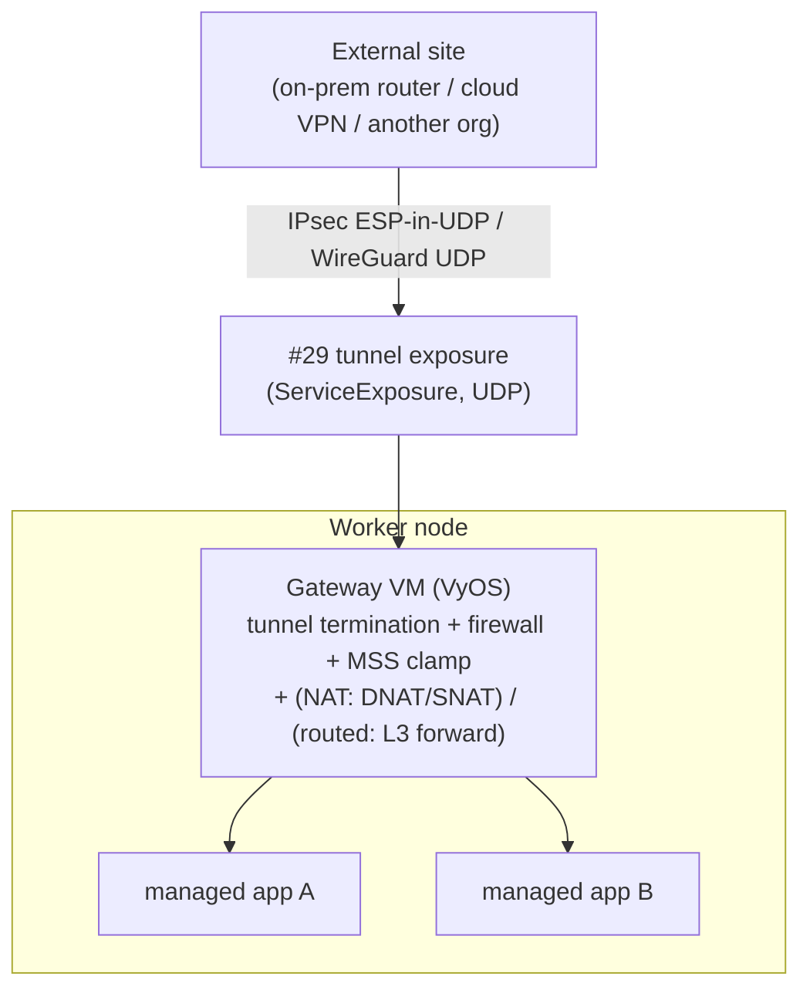

# Tenant-managed site-to-site connectivity via gateway VMs (`site-router` and `site-gateway`)

- **Title:** `Tenant-managed site-to-site connectivity via gateway VMs (site-router and site-gateway)`
- **Author(s):** `@myasnikovdaniil`
- **Date:** `2026-07-08`
- **Status:** Review

## Overview

Cozystack tenants need site-to-site connectivity between their workloads and external networks, in both directions — exposing a tenant-managed application to a remote site (inbound), and letting a tenant-managed application reach a service that lives only behind a tunnel (outbound) — and it must work for any application (databases, message queues, object storage, gRPC, raw UDP), not one special case.

The privileged network dataplane (`NET_ADMIN`, XFRM / a `wireguard` interface, `ip_forward`) is terminated **inside a KubeVirt VM**, not a pod: the guest kernel is isolated by hardware virtualization, so the blast radius is contained by the VM boundary and the platform never grants a tenant a privileged host-cluster pod. The gateway VM is a normal, dual-homed member of the tenant's pod network.

There are two legitimate ways to bridge such a tunnel to the tenant's workloads, with genuinely different trade-offs, and both are wanted in practice — so this proposal ships them as **two co-equal catalog apps over a shared foundation**:

- **`site-router`** — *routed* mode. Plain L3 forwarding between the tunnel and the tenant network; the original client source IP is preserved; whole-subnet reachability and ICMP work. Uses kube-ovn routing (kube-ovn-specific).
- **`site-gateway`** — *NAT* mode. The VM DNAT/SNAT-bridges the tunnel to managed-app `ClusterIP`s; CNI-agnostic and fully contained; per-target host:port reachability; the original source IP is not preserved.

Neither is a fallback for the other — a cluster admin can offer either or both. The design has been prototyped and validated end-to-end (see [Testing](#testing)). (Naming note: these are distinct from the existing `packages/apps/vpn`, which is a client / remote-access VPN — the two apps here are site-to-site network edges.)

## Scope and related proposals

- **[#29 structured external exposure](https://github.com/cozystack/community/pull/29) — blocking dependency.** The tunnel's own external entry point (the UDP listener the remote peer dials) is published through the structured `ServiceExposure` / `ExposureClass` primitives from #29 rather than a bespoke `LoadBalancer` path, and that exposure class **must support UDP** (IKE/NAT-T 4500, WireGuard) — which #29 does not yet provide. This proposal declares #29 (with UDP support) an **explicit blocker for Phase 1**: implementation cannot land until #29 ships. If #29 stalls, the fallback is a bespoke UDP `LoadBalancer` Service on the gateway as a stopgap — explicitly a temporary path to be migrated onto the #29 contract once available, not a parallel long-term mechanism.
- **[#7 ClusterMesh / Kilo](https://github.com/cozystack/community/pull/7).** Complementary and a different niche — a routed WireGuard node-to-node mesh between cooperative Kubernetes clusters. See [Alternatives considered](#alternatives-considered).
- **Deferred here:** a platform-run (non-VM) managed variant; HTTP/L7 ingress (the existing tenant Ingress / Gateway API covers public HTTP); a per-tenant egress IP (future work — the gateway VM is its natural home later).

## Context

Cozystack runs tenant workloads under a hardened networking model:

- **Namespace hardening.** Cozystack applies Pod Security Standards to tenant namespaces. The platform operator only sets `pod-security.kubernetes.io/enforce=privileged` on a namespace when a platform-declared package requests it. A regular tenant cannot schedule a privileged, `NET_ADMIN`, or `hostNetwork` pod — deliberately, because such a pod executes against the node kernel and could manipulate host networking or observe other tenants' traffic.
- **Default pod network vs. custom VPC.** Managed apps (databases and friends) run as ordinary pods on the **default cluster pod network** and are reached via `ClusterIP` Services + CoreDNS. They are not placed on a custom kube-ovn VPC; VPCs are isolated from the default network and the managed-app operators reconcile over the default network — so a managed app cannot simply be "moved onto a VPC."
- **Dual-homed VMs.** KubeVirt VMs are the exception: every VM always has a `default` pod-network NIC (and can carry additional multus interfaces). A VM is therefore a first-class member of the default pod network. This is the primitive the design leans on.

### The problem

A tenant today has no supported way to let a remote site reach a tenant-managed app over a tunnel without exposing it to the public internet (inbound), nor to let a tenant app call a service that is only routable through a tunnel (outbound). The naive approaches all require either a privileged host-cluster pod (a tenant-escape vector — defeats the hardening above) or changes to shared, cluster-wide network infrastructure (cross-tenant collision risk). We want a self-service, tenant-scoped mechanism that generalizes to any protocol and touches neither the host kernel nor the managed apps.

## Goals

- Give tenants **self-service** site-to-site connectivity, both directions, through catalog apps.
- Support **inbound** exposure of any tenant-managed app and **outbound** reach to tunnel-only services, for any L4 protocol, without modifying the target apps.
- Keep the privileged dataplane **contained** in a VM guest; add no privileges to the host cluster and none to managed apps.
- Offer **both** a routed mode (source-IP-preserving, L3) and a NAT mode (contained, CNI-agnostic) as **co-equal, admin-gateable** choices — not one as a fallback of the other.
- Support **both IPsec and WireGuard** as tunnel backends (interop vs. simplicity — see [Design](#design)).

### Non-goals

- **HTTP/L7 ingress.** Public HTTP(S) is served by the existing tenant Ingress / Gateway API.
- **A platform-managed, always-on VPN service.** These are tenant-deployed catalog apps; a platform-run variant is possible future work.
- **A per-tenant egress IP.** Deferred future work; the gateway VM is its natural home later.
- **Routing a remote CIDR onto the shared default-VPC router** — rejected (cross-tenant collisions). Routed mode uses tenant-scoped kube-ovn routes, never the shared router.

## Design

### Two apps over one foundation

Both apps share roughly 80% of their implementation — the VM appliance, the tunnel backend, the #29 exposure of the tunnel endpoint, the day-2 configuration mechanism, secret handling, and packaging. They differ only in what happens to a decrypted packet (L3-forward vs DNAT/SNAT) and in the CNI coupling that entails:

| Axis | `site-gateway` (NAT) | `site-router` (routed) |
|------|----------------------|------------------------|
| Inner path | DNAT + SNAT → managed-app `ClusterIP` | plain L3 forwarding, no NAT |
| Return path | SNAT masquerade | kube-ovn `ovn.kubernetes.io/routes` annotation |
| CNI coupling | none — any CNI | kube-ovn-specific (routes + port_security) |
| Source IP | not preserved (SNAT) | preserved |
| Reachability | per host:port | whole subnet + ICMP |
| Config surface | `exposedServices` / `remoteTargets` (per-target ports) | `remoteCIDRs` / static routes / BGP |
| Security posture | fully contained | port_security scoped to declared remote CIDRs (Phase 1 acceptance) |
| Topology-advertising apps | need per-member advertised addresses | transparent |

Why two apps rather than one `mode:` toggle: the two have divergent values schemas (per-target ports vs CIDRs/BGP), asymmetric controllers (routed needs a privileged CNI-mediation controller; NAT needs none), and different security postures a cluster admin may want to gate independently. Sharing the implementation (a common VyOS-driving controller core + image + base chart) keeps this from becoming duplicated code.

### Shared foundation

**Principle.** Terminate the tunnel in a KubeVirt VM (contained privilege). The VM is dual-homed on the tenant's default pod network and is the sole holder of the tunnel.



**Tunnel backend — IPsec or WireGuard.** VyOS terminates both natively and `tunnel.type` selects the backend. **IPsec is the default** — the remote side of a site-to-site tunnel is dictated by whatever the external site already runs, and much external/enterprise gear only speaks IKEv2/IPsec, so IPsec is the broadest-interop starting point (with the forced-UDP-encapsulation requirement in [Testing](#testing)). **WireGuard is the simpler backend on an overlay CNI** — UDP-native (a single configurable UDP port), so it rides the pod overlay as ordinary UDP with no ESP, no NAT-T, and no forced encapsulation; static keypairs, no IKE, smaller header overhead (see the validated finding in [Testing](#testing)). The default is not a strong statement of preference: the tenant picks the backend their site requires, so IPsec stays the default for interop breadth and WireGuard is a first-class alternative rather than a successor.

**Tunnel entry point.** Published via #29 `ServiceExposure` + `ExposureClass` (UDP), not a bespoke `LoadBalancer` — one shared external-address contract for both apps.

**Day-2 configuration.** cloud-init provisions the VM only at first boot (KubeVirt bakes it into a static disk that is regenerated only on VM restart), so ongoing changes — rotate the peer's keys/PSK, add a target or route — are driven by a **platform controller talking to the guest's own management API**. For VyOS the HTTPS API applies an atomic set/delete batch, so a change touches only the affected config and the running tunnel stays up (each app instance terminates a single peer — see [Values schema](#user-facing-changes) and the multi-peer [open question](#open-questions)). The management-API key is generated at runtime and seeded once via first-boot cloud-init; the API is reachable by the platform only (see [Security](#security)). A first iteration may fall back to "config change = VM restart" if called out explicitly.

**Controller & low-level entities.** Tenant input stays in the catalog-app values (no new CRD); validation is the values schema plus controller-side reconcile checks surfaced as status conditions. A platform controller reconciles the VM + tunnel and pushes rendered config to the guest. The controller is split behind a small backend interface so the neutral VyOS-driving core (render → push → observe → status) is shared, and each app implements only its own materialization and any CNI mediation. The two apps differ sharply here: `site-router` carries a CNI-mediation controller (below); `site-gateway` needs none.

**Image.** A VyOS appliance image (IPsec, WireGuard, native DNAT/SNAT, routing, and firewalling in one network OS), published by the platform as a reproducible, KubeVirt-consumable artifact. See [Image lifecycle](#image-lifecycle) for how it is built and updated.

### Image lifecycle

VyOS has no free LTS channel — only the rolling release is freely buildable — so the appliance image cannot be pinned to a vendor-maintained LTS and must be built and patched by the platform. This is handled the same way Cozystack already builds its other bootable-node artifacts:

- **Build in the monorepo.** The image is built from a pinned VyOS rolling snapshot in-repo, alongside the existing node-image builds (the Talos image build is the live example; the previously shipped Ubuntu image build, now retired, followed the same shape). The build is reproducible and pinned to a specific upstream commit/date rather than tracking `latest`, so a given Cozystack release maps to an exact image.
- **Patch cadence.** Because the base is rolling, CVE and dependency patching happens by re-pinning to a newer VyOS snapshot and rebuilding as part of the normal monorepo release cadence — the same place Talos bumps land. Security-relevant rebuilds can be cut out-of-band on the same pipeline.
- **How a running gateway consumes an update.** The image backs a KubeVirt VM disk, so adopting a new image means booting the VM from the new disk — i.e. a **VM restart, which drops the tunnel** for the reconnect window. This is deliberately decoupled from **day-2 config** changes (peer keys, targets, routes), which are applied live via the guest management API and never require a restart (see the Day-2 paragraph above). Image updates are therefore the *only* routine tunnel-dropping operation; for planned image upgrades KubeVirt live-migration does **not** help (a new disk is a new boot, not a migration), so an image bump is an explicit maintenance action. Making it non-disruptive depends on the active/passive HA path (roll one gateway at a time behind the fronting Service) — see [High availability](#high-availability).

### `site-gateway` — NAT mode

**Inbound (external site → any tenant app).** The remote peer targets a virtual service-exposure address that the gateway owns and maps to an app `ClusterIP`:

1. The remote peer sends tunnel traffic to the gateway's #29-exposed UDP endpoint; the VM decrypts the tunnel.
2. **DNAT**: the virtual destination → the target app's `ClusterIP:port` (one entry per exposed app — the exposure table).
3. **SNAT (masquerade)**: source → the gateway's own pod IP. Mandatory: the cluster has no route back to the remote peer's inner IP, so without SNAT the app's reply leaves via the default route and is black-holed.
4. The VM forwards onto the pod network; the node resolves the `ClusterIP` to a backend pod; the app sees the gateway pod IP as client. Replies retrace the path and are re-encrypted.

**Outbound (any tenant app → remote service over tunnel).** The app talks to a **local Service** whose endpoint is the gateway VM (the only app-side change is the target hostname). The node routes that `ClusterIP` to the gateway on a **per-target-unique listener port** (the local Service still exposes the standard port, mapped to a unique port on the VM), so the VM can disambiguate multiple remote targets that share a destination port; the VM DNATs that unique port to the real remote `IP:port` and SNATs into the tunnel's inner subnet.

**Why it generalizes.** The app only ever sees a `ClusterIP` on its own network and speaks no VPN; DNAT is L4 (TCP/UDP, any port), so it works for databases, queues, object storage, gRPC, and raw UDP. `site-gateway` is CNI-agnostic and fully contained — SNAT keeps every emitted packet on the gateway's own pod IP, so no port-security relaxation is needed.

**Topology-advertising apps.** Protocols where a client bootstraps to one endpoint and is then handed the members' own addresses to connect to directly — Kafka (`advertised.listeners`), MongoDB replica-set/sharded, Redis Cluster, Cassandra/Scylla, Elasticsearch with sniffing — are **not** transparent under plain NAT of the bootstrap endpoint: each member needs its own tunnel-reachable address that the app also advertises. Under `site-gateway` this means explicit per-member mapping (a distinct tunnel-side address:port per member, plus the app configured to advertise it); the managed-app operators already do this kind of thing for public exposure, but #29's `target` is per-named-listener, not per-broker/replica, so #29 does not directly cover per-member addressing today. The transparent path for this class is therefore **`site-router` (routed)** — the members' real addresses are directly reachable, so discovery works as long as members advertise a routable ClusterIP. Folding per-member NAT into a tunnel-backed `ExposureClass` is a possible future unification, not a solved design (see [Open questions](#open-questions)). Single-endpoint protocols (Postgres, MySQL, plain Redis, AMQP, ClickHouse client, HTTP/gRPC) are transparent under NAT and need none of this.

### `site-router` — routed mode

The decrypted packet is forwarded onto the tenant network **without NAT**; the return path is the kube-ovn `ovn.kubernetes.io/routes` namespace annotation (inherited onto pods at creation by the kube-ovn webhook), so the **client source IP is preserved** and whole-subnet reachability + ICMP work. This is the mode for cases where the remote side authorizes by source IP, or needs to reach a whole subnet, or where the app advertises its own topology (members' real addresses are directly reachable).

**CNI-mediation controller.** A tenant cannot annotate its own namespace or touch `port_security`, so the platform controller mediates: validate declared remote CIDRs, set the namespace routes annotation, scope/relax `port_security` on the gateway VM port, and clean everything up on deletion. The **remote-CIDR deny-set** a declared CIDR must not overlap is explicit: the cluster **pod / service / join / node** networks (hijacking in-cluster traffic), **`169.254.0.0/16` link-local incl. the cloud metadata endpoint `169.254.169.254`** (credential/SSRF exposure), the platform **LoadBalancer / egress IP pool**, the **host loopback `127.0.0.0/8`**, and the **default route `0.0.0.0/0`** and any prefix so broad it would blackhole cluster traffic (routed mode advertises specific remote networks, never a default route). Cross-tenant overlap between two tenants' *remote* CIDRs is fine — routes are namespace-scoped. A rejected CIDR does not silently no-op: the controller **surfaces the rejection as a `status` condition on the app instance** (`Reason: InvalidRemoteCIDR`, naming the offending CIDR and the network it collides with) and refuses to program the route, so the tenant sees why in the dashboard rather than getting a half-configured gateway. Because the annotation is applied at pod **creation**, existing tenant workloads gain reachability only after they are rolled; the controller reports the pods whose annotation lags the namespace ("pods pending route") rather than restarting anything.

**Security posture.** Routed mode adjusts `port_security` on the gateway port so the guest's routed (non-pod-IP) source addresses are not dropped. The shipped state is **scoped** `port_security` — only the declared remote CIDRs are added to the port's allowed addresses, a **Phase 1 acceptance criterion**, not a later hardening step. Defense in depth beyond that comes from Cilium's sender-side egress enforcement — the endpoint identity is compiled into the per-endpoint eBPF program, so even a spoofed source cannot widen the reachable set beyond the tenant tree + world. Residual risks are documented in [Security](#security).

**Transport note.** Routed mode carries transparent L3 for TCP/UDP/ICMP/SCTP only — non-standard IP protocols (ESP, GRE, VRRP) still do not cross the pod fabric (same root cause as the ESP finding in [Testing](#testing)). It is kube-ovn-specific and requires the remote CIDR to be disjoint from cluster networks.

## User-facing changes

Two catalog apps appear in the tenant dashboard, sharing the tunnel/peer/resources values and differing only in the bridging block. Sketches (cozyvalues-gen annotated):

```yaml
# site-gateway (NAT)
## @param tunnel.type {string} Backend: "ipsec" (default; broadest interop) or "wireguard" (UDP-native, simpler on an overlay CNI).
tunnel: { type: ipsec }
## @param peer.address {string} Public address of the remote peer / WireGuard endpoint.
peer:
  address: ""
  auth: { secretRef: "" }   # IPsec IKE/PSK-or-cert; WireGuard peer public key + allowedIPs
## @param exposedServices {array} Inbound: {name, listenPort, targetService, port}
exposedServices: []
## @param remoteTargets {array} Outbound: {name, localPort, remoteHost, remotePort}
remoteTargets: []
## @param resources {object} VM sizing (cpu/memory).
resources: { cpu: "1", memory: "1Gi" }
```

```yaml
# site-router (routed)
## @param tunnel.type {string} Backend: "ipsec" (default; broadest interop) or "wireguard" (UDP-native, simpler on an overlay CNI).
tunnel: { type: ipsec }
## @param peer.address {string} Public address of the remote peer / WireGuard endpoint.
peer:
  address: ""
  auth: { secretRef: "" }
## @param remoteCIDRs {array} Remote networks reachable over the tunnel (must be disjoint from cluster networks).
remoteCIDRs: []
## @param staticRoutes {array} Optional extra static routes.
staticRoutes: []
## @param bgp {object} Optional BGP peering with the remote side.
bgp: { enabled: false }
## @param resources {object} VM sizing (cpu/memory).
resources: { cpu: "1", memory: "1Gi" }
```

**One peer per instance.** The schema is deliberately **singular `peer:`**, not `peers: []` — each app instance terminates exactly one site-to-site tunnel. A tenant that needs to reach two external sites deploys two instances; the shared foundation makes an instance cheap (one small VM), instances are independently sized/gated/observable, and a blast radius stays scoped to one tunnel. This avoids the breaking-change trap of shipping singular now and retrofitting a list later. Whether a genuine multi-peer single-instance mode is ever warranted (e.g. hub-and-spoke to many sites behind one VM) is deferred as an explicit [open question](#open-questions) rather than pre-committed in the schema.

A cluster admin can enable/disable `site-router` independently — its kube-ovn coupling and `port_security` relaxation may not be wanted on every cluster. No existing app, CRD, or API changes.

## Upgrade and rollback compatibility

Purely additive and opt-in. No migration; existing clusters, manifests, and APIs are unaffected. The gateway VM image is a new artifact built and published by the platform. Rollback is deletion of the app instance (its `VMInstance`/`VMDisk`, the generated Services, and — for `site-router` — the namespace annotation / port_security scoping the controller cleans up), which removes the gateway entirely; nothing else in the tenant is touched.

## Security

- **Contained privilege (both apps).** The privileged dataplane lives in a VM guest kernel isolated by hardware virtualization; a compromise inside the gateway cannot manipulate the host node's networking or observe other tenants, and the platform never hands a tenant a privileged host-cluster pod.
- **`site-gateway` is fully contained.** SNAT keeps every packet the gateway emits on its own pod IP, so the CNI's port-security never sees a foreign source and needs no relaxation.
- **`site-router` scopes port_security** on the gateway port to the declared remote CIDRs (a Phase 1 acceptance criterion — the port is never shipped fully open). Defense in depth is Cilium's sender-side egress enforcement; residual risks to document: intra-namespace identity spoofing (receiver-side identity resolved from source IP) and spoofed-source egress where SNAT is absent.
- **Managed apps untouched**; a firewall allow-list on the gateway makes exposure explicit; all state is tenant-scoped.
- **Secret handling.** A tenant does not create `Secret` objects directly; as with the existing managed apps (`apps/vpn`, `postgres`, `mariadb`) the app chart templates the `Secret` into the tenant namespace from the app values — autogenerating material when it is not supplied and using `lookup` to keep it stable across reconciles. The design minimizes what must be shipped: for **WireGuard** the tenant's private key is generated in-chart (never entered) and only its public key is surfaced for the remote side, while the peer's public key + endpoint are ordinary non-secret values — so no tenant secret is shipped at all. The one genuinely secret tenant input is the **IPsec PSK** (it must match the remote peer, so it cannot be autogenerated); it rides a values field into the chart-templated `Secret`, with the same plaintext-in-values-at-rest exposure the platform is already addressing for database passwords. The management-API key is generated at runtime, never entered.
- **Management API is platform-only — enforced outside tenant control.** The guest's config API is the controller's only write path, so the guard against a tenant reaching it directly must be one the tenant *cannot* remove. A NetworkPolicy in the tenant's own namespace is therefore **not** sufficient — the tenant could delete it and then push arbitrary VyOS config, bypassing all controller-side CIDR/target validation. The enforcement must live in the platform's control, not the tenant's: a platform-owned cluster-scoped network policy (e.g. a `CiliumClusterwideNetworkPolicy`) that admits only the controller's identity, and/or binding the management API to an interface/address that is not routable from tenant pods. The **API key is generated at runtime and stored in a platform-controller-namespace Secret — never in a tenant-readable Secret** — so even API reachability does not hand the tenant credentials. This is the one area to **re-verify against the existing production implementation** before Phase 1 acceptance: confirm the shipped guard is genuinely tenant-immutable and the key never lands in the tenant namespace.

## Failure and edge cases

- **Missing SNAT → inbound reply black-holed (`site-gateway`).** Without the source-NAT rule the app replies to an unroutable tunnel address and the flow times out. SNAT is mandatory (validated).
- **MTU / double encapsulation.** The overlay already lowers MTU and the tunnel adds overhead; without MSS clamping (and/or a lowered tunnel MTU) large TCP packets black-hole. The gateway sets an **MSS clamp by default**, derived from the detected overlay MTU — clamping is the chosen approach rather than leaving MTU to the tenant.
- **Native ESP dropped pod-to-pod (IPsec).** The CNI drops non-TCP/UDP/ICMP/SCTP IP protocols between pods — native ESP (proto 50) included — so ESP-in-UDP (forced UDP encapsulation) is required unconditionally (validated). In policy-enforced tenant pods the dropper is Cilium's conntrack ("Unknown L4 protocol"); it is not geneve-specific. WireGuard, being UDP-native, is unaffected.
- **DNAT must target stable `ClusterIP`s**, never ephemeral pod IPs (`site-gateway`).
- **Source IP is lost inbound under NAT** (`site-gateway`) — use `site-router` when the remote side needs it.
- **VM image must be bootable and 512-native.** DRBD-backed (4K-sector) StorageClasses cannot boot a 512-native GPT image; the disk must sit on a 512-native StorageClass or use a KubeVirt `blockSize` override (e.g. `blockSize.custom.logical: 512` / `physical: 4096` on the disk spec). The image must ship a real bootloader (validated the hard way — see Testing).
- **A single gateway is a per-tenant SPOF** until HA is added (see [High availability](#high-availability)).

## Testing

Validation comes from two independent sources, so **both modes are backed by evidence**:

- **Routed (`site-router`) — validated in production.** The routed dataplane described here is not speculative: it is the mechanism already running in an existing production Cozystack implementation, deployed for real tenants (and set up by hand for clients before it was productized). The routed mode, its kube-ovn routes annotation, and IPsec termination in a gateway VM are proven in that deployment — which is why Phase 1 leads with it and why it is the primary mode tenants ask for.
- **NAT (`site-gateway`) — prototyped end-to-end.** The NAT paths were **prototyped and validated end-to-end** on a development Cozystack cluster (KubeVirt, Cilium + kube-ovn, LINSTOR), using two gateway VMs — one acting as the tenant gateway, one simulating the external site — with a real tenant-managed Postgres as the inbound target, on the IPsec backend.

The **WireGuard backend** over the overlay is the remaining item to validate before it is offered as a first-class alternative (see [open questions](#open-questions)). The dev-cluster prototype items below all passed:

| # | Item | Result |
|---|------|--------|
| 1 | IKEv2 SA establishes both sides | PASS |
| 2 | Inbound: external site → virtual VIP → DNAT/SNAT → managed Postgres (real server response) | PASS |
| 3 | Outbound: gateway client → tunnel → remote listener | PASS |
| 4 | SNAT-required negative test (removing SNAT black-holes the reply) | PASS |
| 5 | MTU / MSS clamp (tunnel MTU 1320, clamp 1280; multi-MB transfer, no stall) | PASS |

**Key finding — native ESP is dropped by the CNI overlay.** IKE (UDP) negotiated and the SA came up, but the ESP data plane was silently dropped even pod-to-pod (receiver saw zero ESP, 100% loss). Forcing ESP-in-UDP encapsulation on both peers restored bidirectional traffic. On an overlay CNI the IPsec backend must therefore always force UDP encapsulation — and **WireGuard, being UDP-native, sidesteps this entirely**. This makes WireGuard operationally simpler on the overlay, but it does not change the default: IPsec stays the default for interop breadth and the tenant picks the backend their external site requires (see [Design](#design)).

**Non-standard-protocol drop (informs HA).** Independently re-verified with a minimal repro: the CNI drops *all* non-TCP/UDP/ICMP/SCTP IP protocols (proto 112/50/47/4) pod-to-pod, both same-node and cross-node — so it is **not** the geneve tunnel. In policy-enforced tenant pods the dropper is **Cilium's conntrack** (`bpf_lxc.c`, "CT: Unknown L4 protocol"); without a policy it is the OVS datapath. This is the same root cause as the native-ESP drop, and it is why keepalived/VRRP cannot elect over the pod network (see [High availability](#high-availability)). Separately, a kube-ovn `Vip` + `ovn.kubernetes.io/aaps` annotation was validated to share a VIP across two gateway pods with `port_security` kept **on** (the VIP moves on owner change and a bogus source is still dropped — anti-spoofing scoped, not disabled).

Planned automated coverage before implementation lands: helm-unittest for chart rendering across backends and both apps; an e2e that stands up the two-VM topology and asserts the inbound/outbound flows plus the SNAT-required and MSS behaviors.

## High availability

Deferred for the first iteration: a **single gateway VM with KubeVirt live-migration** for planned maintenance (conntrack, tunnel SA, and pod IP preserved — no tunnel drop; requires migratable/replicated storage, see the `blockSize` caveat). Automatic **unplanned-failure** HA is a follow-up; the preferred path is **Service-fronted active/passive** because it is CNI-agnostic (no floating L2 VIP, so no port-security interaction) at the cost of a small leader-election/lease agent and seconds-scale endpoint reconvergence. A kube-ovn shared-VIP via allowed-address-pairs was validated to move a VIP with `port_security` kept on, but keepalived-style election cannot run over the pod network (VRRP/proto-112 is dropped — see [Testing](#testing)), so it would need a side-channel or controller to drive the VIP claim.

## Rollout

- **Phase 1 — `site-router` (routed), IPsec backend** *(blocked on [#29](#scope-and-related-proposals) shipping UDP exposure)*: the routed dataplane plus its CNI-mediation controller (remote-CIDR validation against the full deny-set, routes annotation), with **MSS clamping** and **tunnel-state observability** (SA up/down, rekey, counters) surfaced from the start. **Scoped `port_security` is a Phase 1 acceptance criterion, not a later relaxation** — the gateway port must be scoped to the declared remote CIDRs before Phase 1 is accepted, so the weakest security posture never ships as the released state. This mode is validated in the existing production implementation, which is why it leads. The one thing to resolve *within* this phase is the kube-ovn allowed-address-pairs CIDR support scoped `port_security` needs (see [open questions](#open-questions)); it is a Phase 1 blocker, not a reason to defer scoping.
- **Phase 2 — `site-gateway` (NAT)**: the inbound/outbound DNAT/SNAT machinery (prototype-validated) with forced UDP encapsulation. Fully contained (SNAT), so no `port_security` relaxation at all.
- **Phase 3 — WireGuard backend**: validate the handshake/SA over the overlay and offer it as a **first-class alternative** backend. **The default stays IPsec** — the tenant picks the backend their site requires, so WireGuard is added alongside IPsec, never promoted over it.
- **Phase 4 — the rest**: HA (Service-fronted active/passive), per-tenant egress IP.

Ordering leads with routed because it is the primary requested mode and the one already proven in production; the shared foundation is built once and both apps sit on it. Scoped `port_security` and MSS clamping are in Phase 1 by design so the first release is not the least-secure one.

## Open questions

- **IPsec PSK at rest.** WireGuard ships no tenant secret (its key is autogenerated in-chart); the IPsec PSK is the one tenant-supplied secret — decide whether it stays a values field templated into a `Secret` (like DB passwords today — plaintext in values at rest) or gets a write-only / dashboard-mediated affordance.
- **Tunnel exposure via #29 (blocking).** #29 with **UDP** `ExposureClass` support is a declared Phase 1 blocker (see [Scope](#scope-and-related-proposals)); the open detail is how the tunnel endpoint address interacts with the tenant's LB pool and quotas, and whether the stopgap bespoke UDP `LoadBalancer` is needed if #29 slips.
- **Topology-advertising apps under NAT.** Whether per-member advertised addressing for Kafka / Mongo / Redis-Cluster / Cassandra under `site-gateway` is worth a tunnel-backed `ExposureClass` (needs per-member granularity #29 does not have today) or is simply left to `site-router`.
- **HA mechanism.** Given VRRP does not cross the overlay (see Testing), standardize on Service/endpoint-based failover (needs a controller/lease) vs an AAP shared-VIP with side-channel election.
- **Scoped port_security for `site-router` (Phase 1 blocker).** Scoped `port_security` is a Phase 1 acceptance criterion (see [Rollout](#rollout)), so this must be resolved *within* Phase 1, not deferred: kube-ovn allowed-address-pairs need CIDR support to add the declared remote CIDRs to the port (OVN itself accepts `MAC IP/mask`). Confirm how the existing production implementation scopes the port today and reuse that approach.
- **WireGuard backend.** Validate the handshake/SA over the overlay and confirm identical bridging before offering it as a first-class alternative. This does **not** gate on becoming the default — the default stays IPsec regardless; WireGuard is added alongside it (see [Rollout](#rollout)).
- **Multi-peer per instance.** The schema is singular `peer:` and the current position is **one tunnel per app instance** — a tenant reaching two sites deploys two instances. This needs verification before it is locked in: (a) *does anyone actually need* a single VM terminating many peers, or does per-instance always suffice? The working assumption is per-instance suffices (a new instance is cheap and independently gated/sized/observed), and it avoids a breaking `peer: → peers: []` migration later. (b) *pros/cons* — one hub VM would share the tunnel-drop blast radius and a single throughput envelope across all peers, whereas per-instance isolates them but costs one VM each; hub-and-spoke to many small sites is the only clear case where one VM might win. (c) *how the existing production implementation models this today* — confirm it is single-peer-per-instance and that no deployed tenant relies on multi-peer, so committing to singular is not a regression. If multi-peer is ever needed it would be an additive `peers: []` on a *new* schema version, not a retrofit of this one.
- **Relationship to ClusterMesh (#7).** Whether to present these apps and ClusterMesh as one coordinated "tenant connectivity" story, and where the boundary sits.

## Alternatives considered

- **Give tenants privileged / `NET_ADMIN` host pods.** Rejected — tenant escape; defeats namespace hardening. The whole design exists to avoid this.
- **Route the remote CIDR into the shared default-VPC router.** Rejected — the router is shared cluster-wide; injecting tenant RFC1918 CIDRs causes cross-tenant collisions and leakage. (`site-router` instead uses tenant-scoped kube-ovn namespace routes.)
- **Put managed apps on a custom kube-ovn VPC.** Not viable — VPCs are isolated from the default network and managed-app operators reconcile over the default network; only VMs are dual-homed.
- **Platform-run kube-ovn VPC-NAT-Gateway with the tunnel.** Possible future managed variant, but more platform work and it couples XFRM to the host kernel + OVS. The VM approach contains the privilege more cleanly and ships sooner.
- **A single app with a `mode: routed|nat` toggle.** Rejected — the two modes have divergent values schemas, asymmetric controllers (routed needs a privileged CNI-mediation controller, NAT needs none), and different security postures a cluster admin may want to gate independently. Two apps over a shared implementation express this more cleanly than conditional schema + always-on machinery.
- **Traefik / L7 proxy.** Limited — HTTP-only; not general across L4 protocols.

### ClusterMesh / Kilo (#7), and why two mechanisms

[#7](https://github.com/cozystack/community/pull/7) pursues an overlapping goal (tenant access to services across a boundary) but is a different shape, and neither mechanism subsumes the other:

| Axis | ClusterMesh / Kilo (#7) | This proposal (gateway VMs) |
|------|-------------------------|-----------------------------|
| Remote end | A cooperative Kubernetes cluster running Kilo, reached via a kubeconfig | An arbitrary external site — not Kubernetes, no Kilo, no kubeconfig |
| Tenant workload served | The tenant's managed Kubernetes cluster (guest-VM pods) | Managed apps in the host-cluster tenant namespace |
| Transport | WireGuard node-to-node mesh (`mesh-granularity=cross`) | IPsec or WireGuard site-to-site, one VM |
| Address plane | Routed pod-CIDRs, no NAT; disjoint CIDRs required | `site-router`: routed (source-IP preserved); `site-gateway`: NAT to ClusterIPs (tolerates overlap) |
| Throughput | Full node×node mesh (built for Ceph) | Single gateway — app-level flows |
| Privilege | Kilo `NET_ADMIN` inside guest-cluster VMs → contained | `NET_ADMIN` inside the gateway VM guest → contained |

Kilo cannot terminate a third-party VPN (both ends must run Kilo with a kubeconfig), and a single gateway VM cannot serve the Ceph-scale mesh. They are different layers — a platform storage fabric vs. a tenant-edge VPN concentrator — analogous to a cloud provider shipping both VPC Peering and a VPN Gateway. Both share the principle that matters: no privileged pods in the shared host namespace; privilege is contained in guest-cluster VMs (Kilo) or a dedicated gateway VM (this proposal).
