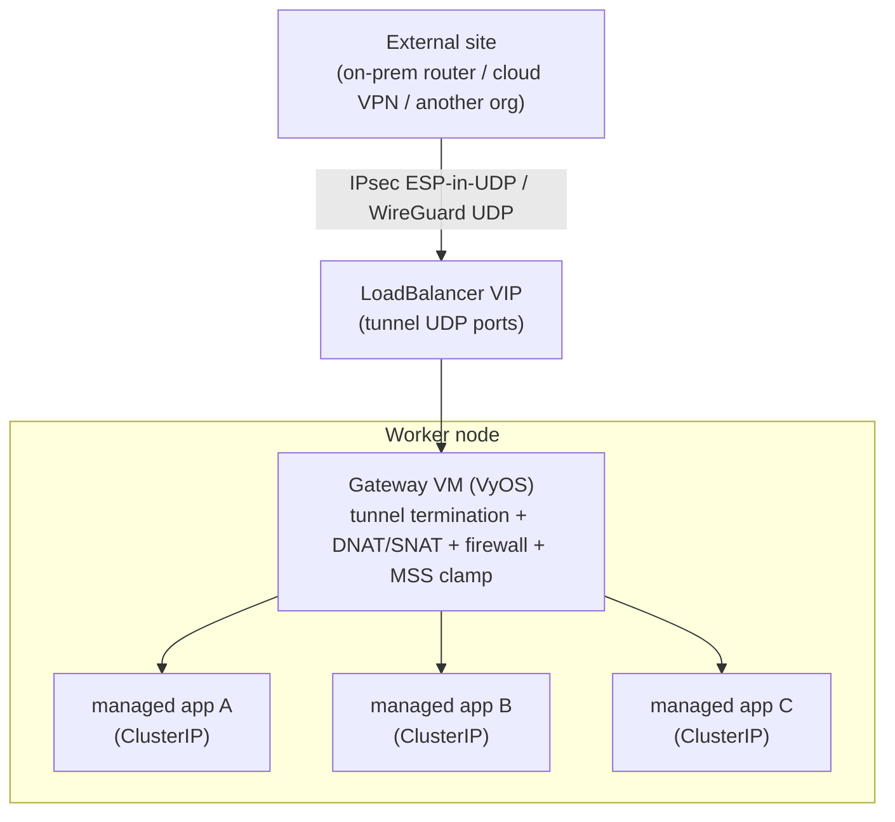

# Tenant-managed external network connectivity via a gateway VM (IPsec / WireGuard)

- **Title:** `Tenant-managed external network connectivity via a gateway VM (IPsec / WireGuard)`
- **Author(s):** `@myasnikovdaniil`
- **Date:** `2026-07-07`
- **Status:** Draft

## Overview

Cozystack tenants need site-to-site VPN connectivity between their workloads and external networks, in both directions: exposing a tenant-managed application to a remote site (inbound), and letting a tenant-managed application reach a service that lives only behind a tunnel (outbound). This must work for any application — databases, message queues, object storage, gRPC, raw UDP — not one special case.

This proposal terminates the tunnel (IPsec or WireGuard) **inside a KubeVirt VM** rather than in a pod. The privileged dataplane (`NET_ADMIN`, XFRM / a `wireguard` interface, `ip_forward`) lives in a guest kernel isolated by hardware virtualization, so its blast radius is contained by the VM boundary — the host node and other tenants are unaffected. The gateway VM is a normal member of the tenant's pod network, so it reaches any tenant `ClusterIP` Service; it performs all address translation (DNAT/SNAT), and the managed applications are never modified and never speak the VPN — they only ever see ordinary `ClusterIP`s on their own network. We propose shipping this as a Cozystack catalog app, provisionally `packages/apps/site-gateway`.

The design has been prototyped and validated end-to-end (see [Testing](#testing)).

## Scope and related proposals

- **Related — [`cross-cluster-tenant-mesh` (ClusterMesh / Kilo)](https://github.com/cozystack/community/pull/7).** That proposal connects cooperative Kubernetes clusters into a routed WireGuard node-to-node mesh for high-throughput cases (its motivating example is a tenant cluster consuming host Ceph). This proposal is complementary and occupies a different niche — an arbitrary external site (not a Kubernetes cluster), NAT-bridged to managed apps that live in the tenant namespace. See [Alternatives considered](#alternatives-considered) for a side-by-side and a "why two mechanisms" discussion. Notably, PR #7 explicitly defers the "tenant ↔ tenant-namespace applications" and "NAT-egress" integration — precisely the space this proposal fills.
- **Deferred here:** a platform-run (non-VM) managed variant; HTTP/L7 ingress (the existing tenant Ingress / Gateway API already covers public HTTP); preservation of the original client source IP inbound.

## Context

Cozystack runs tenant workloads under a hardened networking model:

- **Namespace hardening.** Cozystack applies Pod Security Standards to tenant namespaces. The platform operator only sets `pod-security.kubernetes.io/enforce=privileged` on a namespace when a platform-declared package requests it. A regular tenant cannot schedule a privileged, `NET_ADMIN`, or `hostNetwork` pod — deliberately, because such a pod executes against the node kernel and could manipulate host networking or observe other tenants' traffic.
- **Default pod network vs. custom VPC.** Managed apps (databases and friends) run as ordinary pods on the **default cluster pod network** and are reached via `ClusterIP` Services + CoreDNS. They are not placed on a custom kube-ovn VPC; VPCs are isolated from the default network and the managed-app operators reconcile over the default network — so a managed app cannot simply be "moved onto a VPC."
- **Dual-homed VMs.** KubeVirt VMs are the exception: every VM always has a `default` pod-network NIC (and can carry additional multus interfaces). A VM is therefore a first-class member of the default pod network. This is the primitive the design leans on.

### The problem

A tenant today has no supported way to:

- **Inbound:** let a remote site reach a tenant-managed app (a Postgres instance, an internal API, an object store) over a tunnel, without exposing it to the public internet.
- **Outbound:** let a tenant app call a service (a legacy database, a licensing server, an on-prem API) that is only routable through a tunnel.

The naive approaches all require either a privileged host-cluster pod (a tenant-escape vector — defeats the hardening above) or changes to shared, cluster-wide network infrastructure (cross-tenant collision risk). We want a self-service, tenant-scoped mechanism that generalizes to any protocol and touches neither the host kernel nor the managed apps.

## Goals

- Give tenants **self-service** site-to-site connectivity, both directions, through a catalog app.
- Support **inbound** exposure of any tenant-managed app to a remote site over the tunnel.
- Support **outbound** connections from any tenant app to services reachable only via the tunnel.
- Be **app-agnostic** — work for any L4 protocol (TCP/UDP, any port) without modifying the target apps.
- Keep the privileged dataplane **contained** in a VM guest; add no privileges to the host cluster and none to managed apps.
- Keep all bridging/NAT **tenant-scoped**; make no changes to shared cluster routers.
- Support **both IPsec and WireGuard** as tunnel backends (interop vs. simplicity — see [Design](#design)).

### Non-goals

- **HTTP/L7 ingress.** Public HTTP(S) is served by the existing tenant Ingress / Gateway API; the gateway VM is for site-to-site VPN and non-HTTP protocols.
- **Preserving the original client source IP inbound.** SNAT hides it (see [Failure and edge cases](#failure-and-edge-cases)); source-IP ACLs are out of scope for the first iteration.
- **A platform-managed, always-on VPN service.** This is a tenant-deployed catalog app; a platform-run variant is possible future work.
- **Routing a remote CIDR onto the shared default-VPC router** — explicitly rejected (cross-tenant collisions).

## Design

### Principle

Terminate the tunnel in a KubeVirt VM. The VM guest kernel isolates `NET_ADMIN`/XFRM from the host, so the tenant effectively runs a privileged network appliance without the platform ever granting a privileged pod. The VM is dual-homed on the tenant's default pod network and is the sole holder of the tunnel; it DNAT/SNATs between the tunnel and the tenants' managed-app `ClusterIP`s.

### Topology



Everything privileged lives inside the VM guest. Managed apps only ever see `ClusterIP`s on their own default network.

### Inbound path (external site → any tenant app)

The remote peer targets a virtual "service-exposure" address that the gateway owns and maps to an app `ClusterIP`.

1. Remote peer sends tunnel traffic to the gateway's public VIP (a `LoadBalancer` Service on the tunnel's UDP ports).
2. The VIP delivers to the gateway VM's pod NIC; the VM decrypts the tunnel.
3. **DNAT**: the virtual destination (e.g. `10.200.0.10:5432`) → the target app's `ClusterIP:port`. One entry per exposed app — the exposure table.
4. **SNAT (masquerade)**: source → the gateway's own pod IP. Mandatory: the cluster has no route back to the remote peer's inner IP, so without SNAT the app's reply would leave via the default route and be black-holed.
5. The VM forwards onto the pod network; the node resolves the `ClusterIP` to a backend pod; the app sees the connection with the gateway pod IP as client. Replies retrace the path and are re-encrypted back over the tunnel.

### Outbound path (any tenant app → remote service over tunnel)

The tenant app never routes to the remote address directly; it talks to a **local Service** whose endpoint is the gateway VM.

1. The app connects to a local Service name the chart creates (e.g. `remote-db.<tenant>.svc:port`) — the only app-side change is the target hostname.
2. The node routes the `ClusterIP` to the gateway VM.
3. **DNAT**: the local listener → the real remote `IP:port` behind the tunnel; the VM encrypts and sends it over the tunnel; SNAT into the tunnel's inner subnet lets replies return.

**Rejected alternative — a static route on the shared default-VPC router.** Injecting a tenant's remote RFC1918 CIDR into the cluster-wide default router risks cross-tenant address collisions and leakage. The local-Service approach keeps every remote address strictly inside the tenant's gateway VM.

### Why it generalizes to all apps

- The app only ever sees a `ClusterIP` / Service on its own network; it speaks no VPN and needs no route to the far side.
- DNAT is **L4** (TCP and UDP, any port), not L7 — so it works for databases, queues, object storage, gRPC, and raw UDP, unlike an HTTP-only path.
- The gateway VM is the only privileged component, and it is a contained VM guest.

### Tunnel backend: IPsec or WireGuard

VyOS terminates both natively and the DNAT/SNAT bridging is identical — only the transport differs. `tunnel.type` selects the backend per peer.

- **WireGuard — the simpler default on an overlay CNI.** WireGuard is UDP-native (a single configurable UDP port), so it rides the pod overlay as ordinary UDP: no ESP, no NAT-T, no forced encapsulation. It is simpler (static keypairs, no IKE) and has smaller header overhead. Preferred for tenant↔tenant and tenant↔Cozystack links. (See the validated finding in [Testing](#testing) that makes this concrete.)
- **IPsec — for interop.** Much external/enterprise gear only speaks IKEv2/IPsec; when the remote site is not under the tenant's control this is often the only option. Supported, with the encapsulation requirement described in [Testing](#testing).

### Build options

- **VyOS appliance (recommended).** A single network OS does IPsec, WireGuard, native DNAT/SNAT, and firewalling; no separate proxy needed; configured declaratively via cloud-init.
- **Alpine + libreswan/strongSwan (or wireguard-tools) + haproxy.** A leaner, self-composed image if a network-OS dependency is undesirable; more moving parts.

## User-facing changes

A new catalog app, provisionally **`packages/apps/site-gateway`** (VM-backed), appears in the tenant dashboard. The tenant fills a values form; the platform-authored chart renders the gateway VM, its tunnel + NAT + firewall config, the local Services for outbound targets, and a `LoadBalancer` Service for the tunnel's UDP ports. Sketch of the values schema (cozyvalues-gen annotated):

```yaml
## @param tunnel.type {string} Backend: "wireguard" (default; UDP-native) or "ipsec".
tunnel:
  type: wireguard

## @param peer.address {string} Public address of the remote peer / WireGuard endpoint.
peer:
  address: ""
  ## backend-specific auth: IPsec IKE/PSK-or-cert; WireGuard peer public key + allowedIPs.
  auth:
    secretRef: ""

## @param exposedServices {array} Inbound: {name, listenPort, targetService, port}
exposedServices: []

## @param remoteTargets {array} Outbound: {name, localPort, remoteHost, remotePort}
remoteTargets: []

## @param resources {object} VM sizing (cpu/memory).
resources:
  cpu: "1"
  memory: "1Gi"
```

No existing app, CRD, or API changes.

## Upgrade and rollback compatibility

Purely additive and opt-in. No migration; existing clusters, manifests, and APIs are unaffected. The gateway VM image is a new artifact built and published by the platform. Rollback is deletion of the app instance (its `VMInstance`/`VMDisk` and the generated Services), which removes the gateway entirely; nothing else in the tenant is touched.

## Security

- **Contained privilege.** The privileged dataplane lives in a VM guest kernel isolated by hardware virtualization; a compromise or misconfiguration inside the gateway cannot manipulate the host node's networking or observe other tenants. The platform never hands a tenant a privileged host-cluster pod.
- **Managed apps untouched.** No new privileges or config on the apps; they stay ordinary pods on the default network.
- **Tenant-scoped bridging.** All translation is NAT inside the VM; nothing changes on the shared cluster router, so there is no cross-tenant surface.
- **Firewall allow-list.** The gateway restricts which tunnel-side sources may reach which exposed ports — exposure is explicit, not "the whole tunnel reaches everything."
- **Tenant-supplied secrets.** PSK / certificate / WireGuard key material is provided via a Secret reference and mounted into the guest; the chart must avoid persisting it in plaintext cloud-init user-data at rest (open question).

## Failure and edge cases

- **Missing SNAT → inbound reply black-holed.** Without the source-NAT rule the app replies to an unroutable tunnel address and the flow times out. SNAT is mandatory (validated).
- **MTU / double encapsulation.** The overlay already lowers MTU and the tunnel adds overhead; without MSS clamping (and/or a lowered tunnel MTU) large TCP packets black-hole. The gateway sets an MSS clamp by default.
- **Native ESP dropped by the CNI overlay (IPsec).** On Cilium/kube-ovn, native ESP (IP proto 50) does not traverse the overlay even pod-to-pod; ESP-in-UDP (forced UDP encapsulation) is required unconditionally (validated — see Testing). WireGuard, being UDP-native, is unaffected.
- **DNAT must target stable `ClusterIP`s**, never ephemeral pod IPs.
- **Source IP is lost inbound** (SNAT) — only relevant for apps with source-IP ACLs.
- **VM image must be bootable and 512-native.** DRBD-backed (4K-sector) StorageClasses cannot boot a 512-native GPT image; the disk must sit on a 512-native StorageClass or use a KubeVirt `blockSize` override. The image must ship a real bootloader (validated the hard way — see Testing).
- **Single gateway is a per-tenant SPOF** until HA is added (open question).

## Testing

The design was **prototyped and validated end-to-end** on a development Cozystack cluster (KubeVirt, Cilium + kube-ovn, LINSTOR), using two gateway VMs — one acting as the tenant gateway, one simulating the external site — with a real tenant-managed Postgres as the inbound target. IPsec was validated first; WireGuard is the next backend to validate (open question). All items passed:

| # | Item | Result |
|---|------|--------|
| 1 | IKEv2 SA establishes both sides | PASS |
| 2 | Inbound: external site → virtual VIP → DNAT/SNAT → managed Postgres (real server response) | PASS |
| 3 | Outbound: gateway client → tunnel → remote listener | PASS |
| 4 | SNAT-required negative test (removing SNAT black-holes the reply) | PASS |
| 5 | MTU / MSS clamp (working tunnel MTU 1320, clamp 1280; multi-MB transfer, no stall) | PASS |

**Key finding — native ESP is dropped by the CNI overlay.** IKE (UDP) negotiated and the SA came up, but the ESP data plane was silently dropped even pod-to-pod (receiver saw zero ESP, 100% loss). Forcing ESP-in-UDP encapsulation on both peers restored bidirectional traffic. Consequence: on an overlay CNI the IPsec backend must always force UDP encapsulation — and **WireGuard, being UDP-native, sidesteps this entirely**, which is a strong argument for it as the default backend.

Planned automated coverage before implementation lands: helm-unittest for chart rendering across backends; an e2e that stands up the two-VM topology and asserts the inbound/outbound flows and the SNAT-required and MSS behaviors.

## Rollout

- **Phase 1 — IPsec backend** (prototype validated): ship `site-gateway` with the IPsec backend (forced UDP encapsulation) + the inbound/outbound NAT machinery.
- **Phase 2 — WireGuard backend**: validate WireGuard over the overlay and, if confirmed simpler/robust, make it the default `tunnel.type`.
- **Phase 3 — hardening**: HA (active/standby, shared VIP), tunnel-state observability in the dashboard, MSS/MTU auto-tuning.

## Open questions

- **Secret handling.** Best shape for mounting PSK/cert/WireGuard-key material into the guest without persisting it in plaintext cloud-init at rest.
- **VIP allocation.** One LoadBalancer VIP per gateway vs. sharing; interaction with the tenant's LB address pool and quotas.
- **HA.** Is active/standby (e.g. VRRP + shared VIP) in scope for a later iteration? A single VM is a per-tenant SPOF.
- **Observability.** Surfacing tunnel state (SA up/down, rekey, counters) through existing dashboards.
- **MTU auto-tuning.** Derive the MSS clamp / tunnel MTU from the detected overlay MTU, or require an explicit value.
- **WireGuard backend.** Validate the handshake/SA over the overlay and confirm identical DNAT/SNAT bridging before defaulting to it.
- **Relationship to ClusterMesh (PR #7).** Whether to present this and ClusterMesh as one coordinated "tenant connectivity" story, and where the boundary sits.

## Alternatives considered

- **Give tenants privileged / `NET_ADMIN` host pods.** Rejected — tenant escape; defeats namespace hardening. The whole design exists to avoid this.
- **Route the remote CIDR into the shared default-VPC router.** Rejected — the router is shared cluster-wide; injecting tenant RFC1918 CIDRs causes cross-tenant collisions and leakage.
- **Put managed apps on a custom kube-ovn VPC.** Not viable — VPCs are isolated from the default network and managed-app operators reconcile over the default network; only VMs are dual-homed.
- **Platform-run kube-ovn VPC-NAT-Gateway with the tunnel.** Possible future managed variant, but more platform work and it couples XFRM to the host kernel + OVS. The VM approach contains the privilege more cleanly and ships sooner.
- **Traefik / L7 proxy.** Limited — HTTP-only; not general across L4 protocols.

### ClusterMesh / Kilo (PR #7), and why two mechanisms

[PR #7](https://github.com/cozystack/community/pull/7) pursues an overlapping goal (tenant access to services across a boundary) but is a different shape, and neither mechanism subsumes the other:

| Axis | ClusterMesh / Kilo (PR #7) | This proposal (gateway VM) |
|------|---------------------------|----------------------------|
| Remote end | A cooperative Kubernetes cluster running Kilo, reached via a kubeconfig | An arbitrary external site — not Kubernetes, no Kilo, no kubeconfig |
| Tenant workload served | The tenant's managed Kubernetes cluster (guest-VM pods) | Managed apps in the host-cluster tenant namespace (ClusterIPs) |
| Transport | WireGuard node-to-node mesh (`mesh-granularity=cross`) | IPsec or WireGuard site-to-site, one VM |
| Address plane | Routed pod-CIDRs, no NAT; disjoint CIDRs required | NAT (DNAT/SNAT) to ClusterIPs; tolerates overlap |
| Throughput | Full node×node mesh — direct pod-IP to many backends (built for Ceph) | Single gateway — app-level flows, not Ceph-scale |
| Privilege | Kilo node `NET_ADMIN`, on the tenant side inside guest-cluster VMs → contained | `NET_ADMIN` inside the gateway VM guest → contained |

**Kilo cannot terminate a third-party VPN** (both ends must run Kilo with a kubeconfig), and **a single gateway VM cannot serve the Ceph-scale mesh** (throughput/topology incompatible with funneling). They are different layers: a platform storage fabric vs. a tenant-edge VPN concentrator — analogous to a cloud provider shipping both VPC Peering and a VPN Gateway. Both share the principle that matters here: no privileged pods in the shared host namespace; privilege is contained in guest-cluster VMs (Kilo) or a dedicated gateway VM (this proposal). Recommended framing: lead with the gateway VM as the single tenant-facing primitive (covers external sites, tenant↔tenant, and managed-app exposure), and use ClusterMesh only for the high-throughput cross-cluster storage case.
