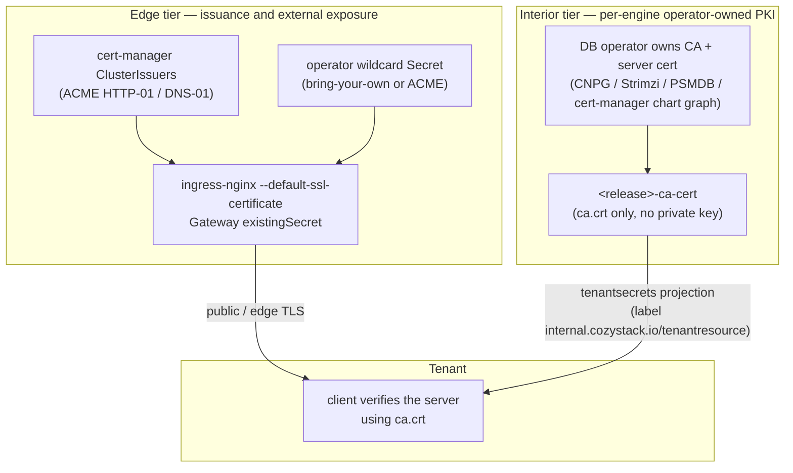

<!-- Place this file at design-proposals/unified-tls-pki/README.md -->
# Unified TLS and PKI model for managed applications

- **Title:** `Unified TLS and PKI model for managed applications`
- **Author(s):** `@lexfrei`
- **Date:** `2026-06-24`
- **Status:** Draft

## Overview

Certificate handling in Cozystack grew out of four uncoordinated mechanisms: per-application issuance inside each chart, per-host ACME on the default ingress path, an opt-in Gateway API path that mints a wildcard via DNS-01, and no supported way to bring an externally-issued wildcard. The epic `cozystack/cozystack#2811` set out to converge them, and the edge of that convergence has largely landed. What has not landed — and what this proposal exists to pin down before it does — is the part that lives *inside* the engines: who owns the PKI for each managed application, and how a tenant receives the trust anchor it needs to verify a TLS connection.

This proposal records a written target design for the whole model, so that the two architectural forks at its center are decided on paper rather than discovered one pull request at a time. The first fork is the issuance abstraction: rather than "cert-manager as the single issuer", the target is **a single operator-facing interface to choose the certificate source, plus a uniform contract for consuming `ca.crt`**. The second fork is mint-versus-consume: rather than forcing every application to stop minting and consume a central certificate, the target is an explicitly **two-tier** model — cert-manager (or a bring-your-own wildcard) at the edge, and operator-owned PKI inside the engines — where what is unified is the *consume contract*, not the certificate authority itself.

## Scope and related proposals

This proposal is the umbrella design for the work tracked by epic `cozystack/cozystack#2811`. It does not re-specify the edge work that has already merged; it states the target the whole model converges on and focuses on the interior contract that is still open.

- **Edge, merged:** `cozystack/cozystack#2988` (ACME wildcard on the default ingress-nginx path), `cozystack/cozystack#2989` (the CA-only trust-anchor helper).
- **Edge, open:** `cozystack/cozystack#2990` (propagate the operator wildcard to per-tenant termination points — the PR implementing issue `cozystack/cozystack#2820`).
- **Workstreams (issues):** `cozystack/cozystack#2812` and `cozystack/cozystack#2400` (closed, edge wildcard); `cozystack/cozystack#2814` (converge per-app TLS and fix the CA / private-key coupling — the first consumer of this contract); `cozystack/cozystack#2815` (external DB exposure via Gateway TLS-passthrough); `cozystack/cozystack#2816` (end-to-end TLS for databases); `cozystack/cozystack#2977` (opt-in east-west encryption). Throughout this document a `cozystack/cozystack#NNNN` reference is an issue unless called out as a PR.
- **Per-app TLS series (open):** `cozystack/cozystack#2729` (redis), `cozystack/cozystack#2692` (mongodb), `cozystack/cozystack#2683` (rabbitmq), `cozystack/cozystack#2682` (opensearch), `cozystack/cozystack#2680` (mariadb). These are the pull requests that should land *after* this contract is accepted, not before.

All repository paths below refer to the `cozystack/cozystack` repository; paths attributed to an open PR (for example the wildcard-secret reconciler in PR `cozystack/cozystack#2990`) are not yet on `main`.

## Context

### Edge today

System ingresses (dashboard, grafana, keycloak, harbor) get a per-host certificate via the cert-manager `cluster-issuer` annotation and ingress-shim. The `letsencrypt-prod`, `letsencrypt-stage`, and `selfsigned-cluster-issuer` ClusterIssuers exist with HTTP-01 and DNS-01 solvers. Gateway API is present but opt-in, and in DNS-01 mode the `TenantGateway` controller renders a per-apex wildcard. With `cozystack/cozystack#2988` an operator can now drop in a wildcard Secret and have the default ingress path serve it via `--default-ssl-certificate`; `cozystack/cozystack#2990` extends that to per-tenant termination points.

### Interior today

The managed engines fall into two classes, verified against the current charts.

The first class **mints** its own chain from a chart-rendered cert-manager graph (self-signed Issuer → CA Certificate → CA Issuer → leaf Certificate). `nats` and `qdrant` do this in `main` (`packages/apps/nats/templates/certmanager.yaml`, `packages/apps/qdrant/templates/certmanager.yaml`); the open per-app pull requests for redis, rabbitmq, mariadb, and opensearch add the same shape. In this class the CA Secret (`<release>-ca`) is a cert-manager CA-certificate Secret and therefore **carries the private key**, and the `ca.crt` is not delivered to tenants at all today.

The second class **consumes** PKI that its operator owns end-to-end. `postgres` (CloudNativePG) renders no cert-manager objects; the operator auto-generates a self-signed CA and signs the server certificate, and the `ca.crt` is present in every `<release>-credentials` Secret (`packages/apps/postgres/templates/db.yaml`). `kafka` (Strimzi) is the same shape and is the reference for the *consume* contract: it exposes `<release>-cluster-ca-cert` and `<release>-clients-ca-cert`, each a CA-certificate-only object with no private key (`packages/apps/kafka/templates/dashboard-resourcemap.yaml`). `mongodb` (Percona PSMDB) is operator-owned, but a tenant-facing `ca.crt` path is still in flight under `cozystack/cozystack#2692`, not in `main`.

One engine is deliberately outside this model. `kubernetes` (Kamaji) owns the control-plane CA, it is not swappable, and the kubeconfig pins that cluster CA — a public edge certificate is meaningless there. It needs no unification and is excluded.

### Platform mechanisms this proposal builds on

- **The CA-only helper.** `cozy-lib.tls.caCertSecret` (`packages/library/cozy-lib/templates/_tls.tpl`, from `cozystack/cozystack#2989`) renders a Secret containing only `ca.crt`. It fails closed if the input PEM contains any private-key header, and it always stamps the label `internal.cozystack.io/tenantresource: "true"`. It is covered by `packages/tests/cozy-lib-tests/tests/tls_cacert_test.yaml`.
- **Why the helper is needed.** The CA+leaf chain is rendered per-app by each chart's own cert-manager graph (for example `packages/apps/nats/templates/certmanager.yaml`), and the resulting CA Secret (`<release>-ca`) carries `ca.key` — so it is not itself a `ca.crt`-only object and cannot be handed to a tenant. The shared library carries no CA-rendering chart; the only TLS helper there is `cozy-lib.tls.caCertSecret` above.
- **The tenant projection.** Secrets carrying the `internal.cozystack.io/tenantresource` label are exposed to tenants as the virtual resource `core.cozystack.io/tenantsecrets` (`pkg/registry/core/tenantsecret/rest.go`; the label constant lives in `pkg/apis/core/v1alpha1/tenantresource_types.go`; the RBAC grant is on the virtual resource, not on raw `core/v1` Secrets — `packages/system/cozystack-basics/templates/clusterroles.yaml`). The projection is **label-filtered, not field-filtered**: the entire Secret `Data` is delivered. This is the security pivot of the whole model — a labelled Secret must contain only safe material.
- **The values channel.** Global values ride a `cozystack-values` Secret under `_cluster.*` keys, injected into every application HelmRelease via `valuesFrom`.

### The problem

The epic's original headline — "consume not mint, cert-manager as the single issuance abstraction" — is not realizable as stated, for two reasons.

First, there is no written contract for the interior. Nothing records, per engine, who owns the PKI and how `ca.crt` reaches the tenant. As a result the per-app TLS pull requests each re-derive the answer, and the answer differs between them.

Second, the cert-manager-minting engines (nats, qdrant, and the four open per-app pull requests) have **no path to consume a `ca.crt` via the helper today**, because of three compounding constraints that are real and verified:

- `valuesFrom` is pinned. `expectedValuesFrom()` (`internal/controller/applicationdefinition_helmreconciler.go:99-107`) hardcodes a single `{Kind: Secret, Name: cozystack-values}` reference, and the reconciler overwrites any drift. An application chart cannot add a sideways `valuesFrom` pointing at its own `<release>-ca`.
- `lookup` cannot drive it. PR `cozystack/cozystack#1787` moved the global-values channel off `lookup` onto `valuesFrom`; `lookup` itself is still available and is used by several charts to read a pre-existing per-release Secret. But it runs at template-render time and is invisible to the Flux digest, so a chart that reads an asynchronously-created Secret via `lookup` does not re-render when that Secret appears — it would need a manual `helm upgrade`.
- The per-release CA is created **asynchronously** by cert-manager, so it does not exist at template-render time at all.

So the helper, by itself, closes the *output* shape (a key-free `ca.crt` Secret) but not the *input* path (where the chart gets that `ca.crt` for an asynchronously-issued, per-release CA). That gap is the substance of this proposal.

## Goals

- Record **two-tier** as the target architecture: edge issuance plus interior operator-owned PKI.
- Define a per-engine **PKI-ownership contract**: for each managed engine, who owns the CA, whether the engine mints or consumes, which Secret carries `ca.crt`, which carries the key, and whether the tenant sees it.
- Define a single **consume contract**: a `ca.crt`-only object, stamped with the tenant-resource label, delivered through the existing projection. Kafka's CA-certificate-only Secret is the reference shape.
- Define a **delivery mechanism** for `ca.crt` on the engines where the chart cannot wire the helper directly.
- Decide **mint-versus-consume explicitly, per engine**, rather than as one global rule.

### Non-goals

- This proposal does **not** force pure-consume on engines that own their PKI; doing so would break CloudNativePG and Strimzi certificate rotation, which are mutually exclusive with an externally-supplied server certificate.
- It does **not** homogenize the certificate authority. CA ownership stays the operator's choice — one corporate CA for everything, per-engine self-signed, or a cert-manager issuer are all legitimate.
- It does **not** make Cozystack a public/WebPKI certificate authority, and it does not issue certificates for a tenant's own external domain.
- It does **not** redesign the edge, which already merged (`cozystack/cozystack#2988`, `cozystack/cozystack#2989`, `cozystack/cozystack#2990`); it only references it and reframes the top-line goal.

## Design

### 1. The two-tier model

The two tiers are independent. The edge tier answers "what certificate does a public client see when it reaches the platform", and is satisfied by an operator-chosen source (ACME HTTP-01, ACME DNS-01 wildcard, or a bring-your-own wildcard). The interior tier answers "what does a client that connects directly to a managed engine need to trust", and is satisfied by the engine's own operator-owned PKI. The only thing that crosses between them is the *shape* of the trust-anchor object a tenant consumes.

### 2. Edge tier (already landed)

The edge is done and is recorded here only to fix the framing. An operator selects the certificate source once; the default ingress path serves a supplied wildcard via `--default-ssl-certificate` (`cozystack/cozystack#2988`), the Gateway path consumes the same Secret via an `existingSecret` mode, and `cozystack/cozystack#2990` propagates it to per-tenant termination points. The reframed top-line goal applies here: this is "a single interface to choose the source", not "a single issuer for everything".

### 3. Interior PKI-ownership contract

The contract is a per-engine table. It is the artifact the per-app pull requests must conform to, and it makes the two-tier reality explicit: the operator owns the CA; the platform unifies only how `ca.crt` is consumed.

| Engine | PKI owner | Mint / consume | CA-bearing Secret today | Key in that Secret? | `ca.crt` delivered to tenant today? |
| --- | --- | --- | --- | --- | --- |
| postgres (CloudNativePG) | operator | consume | `<release>-credentials` | no | yes (in credentials) |
| kafka (Strimzi) | operator | consume | `<release>-cluster-ca-cert`, `<release>-clients-ca-cert` | no | yes — reference shape |
| mongodb (Percona PSMDB) | operator | consume | none in `main` (PR `cozystack/cozystack#2692`) | n/a | no (in flight) |
| nats | chart + cert-manager | mint | `<release>-ca` | yes | no |
| qdrant | chart + cert-manager | mint | `<release>-ca` | yes | no |
| redis, rabbitmq, mariadb, opensearch | chart + cert-manager (open PRs) | mint | in PR branches | yes | varies |
| kubernetes (Kamaji) | Kamaji | internal only | Kamaji-owned, not swappable | n/a | no — out of model |

The takeaway: the operator-owned engines are already close to the target (postgres and kafka deliver `ca.crt` without a key), while the cert-manager-minting engines are the gap — their `<release>-ca` carries the private key and the trust anchor never reaches the tenant.

### 4. The uniform consume contract

Every engine, regardless of who owns its CA, exposes its trust anchor through one canonical object: a Secret named `<release>-ca-cert`, containing only `ca.crt`, stamped with `internal.cozystack.io/tenantresource: "true"`. The platform already has the building block — `cozy-lib.tls.caCertSecret` renders exactly this object and fails closed if the input contains a private key.

This is where the label-filtered projection matters. Because `tenantsecrets` delivers the whole Secret `Data`, the helper's fail-closed guard is not a nicety — it is the boundary that keeps a server or CA private key out of a tenant's hands. Kafka's `<release>-clients-ca-cert` is the shape to match: a CA certificate, no key, readable by the tenant.

### 5. Delivery: closing the cert-manager-engine gap

The contract in §4 fixes the output object. The remaining work is the input path, and it splits by engine class.

For **operator-owned engines** (postgres, kafka, mongodb), the operator already publishes a CA-bearing Secret synchronously enough to consume, and for kafka it is already key-free. The work is to converge each on the canonical `<release>-ca-cert` shape and label — no new controller is required.

For **cert-manager-minting engines** (nats, qdrant, and the four open per-app pull requests), none of the chart-time paths work: `valuesFrom` is pinned, `lookup` cannot trigger a re-render when the CA appears, and the CA is asynchronous (see "The problem"). The proposed mechanism is a small **CA-distribution controller**, modelled on the wildcard-secret reconciler introduced in PR `cozystack/cozystack#2990` (`internal/controller/wildcardsecret/reconciler.go`). That reconciler demonstrates the projection/ownership pattern: it projects copies into the right namespaces, marks every copy it owns with a management label (`cozystack.io/wildcard-secret-copy: "true"`), garbage-collects stale copies, and refuses to touch a foreign Secret that happens to share the name (it catches in-place rotation of its dynamically-named source via a periodic resync rather than a source watch). The CA-distribution controller does the analogous thing one level down on the per-release `<release>-ca` Secret that cert-manager creates asynchronously, projecting a `<release>-ca-cert` object carrying only `ca.crt` with the tenant-resource label. Because `<release>-ca` has a deterministic name, the controller can watch the source directly and project as soon as the CA appears after render; because it writes a Secret the engine and the projection already understand, it needs neither `lookup` nor a custom `valuesFrom`.

### 6. Per-engine application order

`postgres` goes first (under the tracking issue `cozystack/cozystack#2814`): it already carries `ca.crt` in `<release>-credentials`, so it validates the consume contract with the least new machinery. `kafka` and `mongodb` follow with minimal shape adaptation. The cert-manager-minting engines (nats, qdrant, and then rabbitmq, mariadb, opensearch) adopt the CA-distribution controller. `redis` (`cozystack/cozystack#2729`) is a hybrid — it renders a cert-manager chain but its operator fork already publishes a key-free `<release>-ca-cert`, so it may converge by shape adaptation like the operator-owned engines rather than needing the controller (this is part of the controller-scope open question below). `kubernetes` (Kamaji) is explicitly out.

## User-facing changes

A tenant sees one canonical, key-free trust-anchor object per managed application — `<release>-ca-cert`, carrying only `ca.crt` — through the dashboard resource map and the `tenantsecrets` projection, in the same shape across every engine. An operator sees one interface to choose the edge certificate source. There is no new tenant-authored input.

## Upgrade and rollback compatibility

This document changes nothing at runtime; it records a target. The pull requests that implement it are individually backward-compatible: per-app TLS is opt-in (tri-state), external exposure is opt-in, and the CA-distribution controller adds a new object without altering existing Secrets. Reverting any one of them removes the new `<release>-ca-cert` object and the controller that maintains it, leaving the engine's existing PKI untouched.

## Security

The trust boundary is precise: a tenant receives `ca.crt` and never receives `tls.key` or `ca.key`. The label-filtered, full-object nature of the `tenantsecrets` projection makes the helper's fail-closed guard load-bearing — any labelled Secret is delivered in full, so the guard is what prevents a private key from leaking. The CA-distribution controller adds a new trust surface: read access to per-release cert-manager CA Secrets and write access for the key-free copy. It must adopt the same foreign-collision guard as the wildcard reconciler, so it never overwrites a Secret it did not create.

## Failure and edge cases

- The helper's input PEM contains a private-key header → render fails closed; the chart does not deploy a key-bearing Secret.
- The per-release CA Secret does not exist yet → the controller waits for the watch event; it does not error or busy-loop.
- A foreign Secret already occupies the target name → the controller leaves it untouched (management-label guard).
- The CA rotates → the controller re-projects `ca.crt` on the next watch event; no chart re-render is required.

## Testing

- The helper is already covered by `packages/tests/cozy-lib-tests/tests/tls_cacert_test.yaml`, including the fail-closed assertions.
- The CA-distribution controller gets an envtest/Ginkgo suite modelled on `internal/controller/wildcardsecret/reconciler_test.go`: source appears after the consumer, foreign-collision, rotation, and garbage-collection cases.
- Each per-app pull request adds helm-unittest fixtures asserting the `<release>-ca-cert` shape and label, plus an end-to-end check under `hack/e2e-apps/` that a tenant can read `ca.crt` and verify the server.

## Rollout

1. Edge — done (`cozystack/cozystack#2988`, `cozystack/cozystack#2989`, `cozystack/cozystack#2990`).
2. This contract — accepted.
3. CA-distribution controller — implemented and tested.
4. Per-app convergence — postgres first (tracked by `cozystack/cozystack#2814`), then the remaining per-app TLS pull requests onto the contract.

## Open questions

- The exact name and namespace convention for the `<release>-ca-cert` object (per-release in the app namespace is assumed here).
- Whether the CA-distribution controller is scoped to the cert-manager-minting engines or generalized into one projector that also normalizes the operator-owned engines onto the canonical shape.
- How this intersects with per-tenant wildcard propagation (issue `cozystack/cozystack#2820`, implemented by PR `cozystack/cozystack#2990`), which solves a structurally similar cross-namespace replication problem and may share the controller mechanism.

## Alternatives considered

- **Pure-consume (applications stop minting, consume a central cert-manager output).** Rejected: it breaks the rotation lifecycle of CloudNativePG and Strimzi, whose own-CA management is mutually exclusive with an externally-supplied server certificate.
- **`lookup` for the asynchronous CA.** Rejected: `lookup` runs at render time and is invisible to the Flux digest, so the chart would not re-render when the CA appears. (`cozystack/cozystack#1787` already moved the global-values channel off `lookup` onto `valuesFrom` for the same digest reason.)
- **A custom `valuesFrom` pointing at `<release>-ca`.** Rejected: `expectedValuesFrom()` pins every application HelmRelease to the single `cozystack-values` Secret and overwrites drift.
- **A general-purpose cluster-secret replication operator.** Rejected during the edge work (`cozystack/cozystack#2990`) in favour of a purpose-built reconciler with a tight ownership guard.
- **A copy-issuer webhook.** Rejected during the wildcard work (`cozystack/cozystack#2812`) in favour of native references that move only the Secret name, never key material.

---

<!--
Inspired by KubeVirt enhancement proposals
(https://github.com/kubevirt/enhancements) and Kubernetes Enhancement
Proposals (KEPs).
-->
