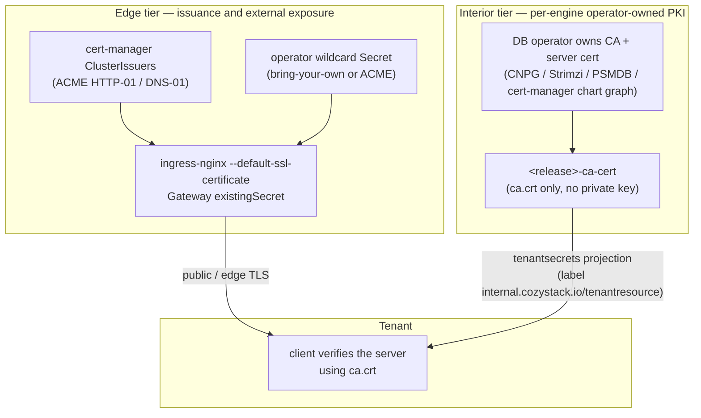

<!-- Place this file at design-proposals/unified-tls-pki/README.md -->
# Unified TLS and PKI model for managed applications

- **Title:** `Unified TLS and PKI model for managed applications`
- **Author(s):** `@lexfrei`
- **Date:** `2026-06-24`
- **Status:** Draft

## Overview

Certificate handling in Cozystack grew out of four uncoordinated mechanisms: per-application issuance inside each chart, per-host ACME on the default ingress path, an opt-in Gateway API path that mints a wildcard via DNS-01, and no supported way to bring an externally-issued wildcard. The epic `cozystack/cozystack#2811` set out to converge them, and the edge of that convergence has largely landed. What has not landed — and what this proposal exists to pin down before it does — is the part that lives *inside* the engines: who owns the PKI for each managed application, and how a tenant receives the trust anchor it needs to verify a TLS connection.

This proposal records a written target design for the whole model, so that the two architectural forks at its center are decided on paper rather than discovered one pull request at a time. The first fork is the issuance abstraction: rather than "cert-manager as the single issuer", the target is **a single operator-facing interface to choose the certificate source, plus a uniform contract for consuming `ca.crt`**. The second fork is mint-versus-consume: rather than forcing every application to stop minting and consume a central certificate, the target is an explicitly **two-tier** model — cert-manager (or a bring-your-own wildcard) at the edge, and operator-owned PKI inside the engines — where what is unified is the *consume contract*, not the certificate authority itself. The second fork is the answer to the open question the epic body still carries as a goal ("should applications stop minting certs entirely and only consume cert-manager output?"): no — two-tier, because forcing pure-consume breaks the engines that rotate their own CA.

## Scope and related proposals

This proposal is the umbrella design for the work tracked by epic `cozystack/cozystack#2811`. It does not re-specify the edge work that has already merged; it states the target the whole model converges on and focuses on the interior contract that is still open.

- **Edge, merged:** `cozystack/cozystack#2988` (ACME wildcard on the default ingress-nginx path), `cozystack/cozystack#2989` (the CA-only trust-anchor helper).
- **Edge, open:** `cozystack/cozystack#2990` (propagate the operator wildcard to per-tenant termination points — the PR implementing issue `cozystack/cozystack#2820`).
- **Workstreams (issues):** `cozystack/cozystack#2812` and `cozystack/cozystack#2400` (closed, edge wildcard); `cozystack/cozystack#2814` (converge per-app TLS and close the trust-anchor delivery gap — the first consumer of this contract); `cozystack/cozystack#2815` (external DB exposure via Gateway TLS-passthrough); `cozystack/cozystack#2816` (end-to-end TLS for databases); `cozystack/cozystack#2977` (opt-in east-west encryption). Throughout this document a `cozystack/cozystack#NNNN` reference is an issue unless called out as a PR.
- **Per-app TLS series (open):** `cozystack/cozystack#2729` (redis), `cozystack/cozystack#2692` (mongodb), `cozystack/cozystack#2683` (rabbitmq), `cozystack/cozystack#2682` (opensearch), `cozystack/cozystack#2680` (mariadb). These are the pull requests that should land *after* this contract is accepted, not before; several currently propose handing tenants a key-bearing Secret, which this contract exists to correct (see Security).

All repository paths below refer to the `cozystack/cozystack` repository; paths attributed to an open PR (for example the wildcard-secret reconciler in PR `cozystack/cozystack#2990`) are not yet on `main`.

## Context

### Edge today

System ingresses (dashboard, grafana, keycloak, harbor) get a per-host certificate via the cert-manager `cluster-issuer` annotation and ingress-shim. The `letsencrypt-prod`, `letsencrypt-stage`, and `selfsigned-cluster-issuer` ClusterIssuers exist with HTTP-01 and DNS-01 solvers. Gateway API is present but opt-in, and in DNS-01 mode the `TenantGateway` controller renders a per-apex wildcard. With `cozystack/cozystack#2988` an operator can now drop in a wildcard Secret and have the default ingress path serve it via `--default-ssl-certificate`; `cozystack/cozystack#2990` extends that to per-tenant termination points.

### Interior today

The managed engines fall into two classes by *who mints*, but — and this is the load-bearing correction — that axis is **not** the axis that decides who needs a delivery mechanism. Verified against the current charts on `main` and the open per-app PRs.

The first class **mints** its own chain from a chart-rendered cert-manager graph (self-signed Issuer → CA Certificate → CA Issuer → leaf Certificate). `nats` and `qdrant` do this in `main` (`packages/apps/nats/templates/certmanager.yaml`, `packages/apps/qdrant/templates/certmanager.yaml`); the open per-app pull requests for redis, rabbitmq, mariadb, and opensearch add the same shape. In this class the CA Secret (`<release>-ca` or `<release>-ca-tls`) is a cert-manager CA-certificate Secret and therefore **carries the private key**, and the `ca.crt` is not delivered to tenants at all today.

The second class **consumes** PKI that its operator owns end-to-end — but, crucially, operator-owned does **not** imply already-converged. Only one engine in it actually delivers a key-free trust anchor today:

- `kafka` (Strimzi) is the **clean** reference: it exposes `<release>-cluster-ca-cert` and `<release>-clients-ca-cert`, each a CA-certificate-only object with no private key (`packages/apps/kafka/templates/dashboard-resourcemap.yaml`). Strimzi can serve a public certificate on its external listener while keeping internal broker mTLS on its own CA (`generateCertificateAuthority: false` + per-listener `brokerCertChainAndKey`).
- `postgres` (CloudNativePG) renders no cert-manager objects; the CNPG operator auto-generates a self-signed CA and signs the server certificate. The CA lives in the operator-created `<release>-ca` Secret, which **carries `ca.key`** and is created **asynchronously**; it is **not** delivered to tenants. The only tenant-facing object is `<release>-credentials` (`packages/apps/postgres/templates/init-script.yaml`), which is a chart-rendered Opaque Secret holding **only `user: password` pairs** — no `ca.crt`, no `tls.key` — surfaced through the dashboard resource map (`packages/apps/postgres/templates/dashboard-resourcemap.yaml`). So postgres is a **trust-anchor delivery gap** (the tenant gets passwords but never `ca.crt`), the same shape as nats/qdrant — *not* a private-key coupling. The comment at `packages/apps/postgres/templates/db.yaml:20-22` claiming `ca.crt` rides in `<release>-credentials` contradicts what the chart actually renders and is a documentation bug.
- `mongodb` (Percona PSMDB) is operator-owned, but the PSMDB operator mints a cert-manager chain and publishes `<release>-ca-cert` as a **key-bearing** cert-manager `isCA` Secret (`tls.crt` + `tls.key` + `ca.crt`). Same gap as the rest, plus a trap: the name `<release>-ca-cert` is key-free for the redis fork and key-bearing for PSMDB — opposite shapes under one name.

One engine is deliberately outside this model. `kubernetes` (Kamaji) owns the control-plane CA, it is not swappable, and the kubeconfig pins that cluster CA — a public edge certificate is meaningless there. It is the lone "private-CA-mandatory" case, needs no unification, and is excluded.

### Platform mechanisms this proposal builds on

- **The CA-only helper.** `cozy-lib.tls.caCertSecret` (`packages/library/cozy-lib/templates/_tls.tpl`, from `cozystack/cozystack#2989`) renders a Secret containing only `ca.crt`. It fails closed if the input PEM contains any private-key header, and it always stamps the label `internal.cozystack.io/tenantresource: "true"`. It is covered by `packages/tests/cozy-lib-tests/tests/tls_cacert_test.yaml`. The merged PR frames the situation it addresses as exactly this — a delivery gap: "the cert-manager apps grant tenants no access to those Secrets at all, so a tenant currently cannot obtain `ca.crt`".
- **Why the helper is needed but not sufficient.** The CA+leaf chain is rendered per-app by each chart's own cert-manager graph (for example `packages/apps/nats/templates/certmanager.yaml`), and the resulting CA Secret carries `ca.key` — so it is not itself a `ca.crt`-only object and cannot be handed to a tenant. The helper fixes the *output shape* (a key-free `ca.crt` Secret) but takes the CA cert as a Helm value, and nothing in the current architecture can feed it that value for an asynchronously-issued, per-release CA (see "The problem").
- **The tenant projection.** Secrets carrying the `internal.cozystack.io/tenantresource` label are exposed to tenants as the virtual resource `core.cozystack.io/tenantsecrets` (`pkg/registry/core/tenantsecret/rest.go`; the label constant lives in `pkg/apis/core/v1alpha1/tenantresource_types.go`; the RBAC grant is on the virtual resource, not on raw `core/v1` Secrets — `packages/system/cozystack-basics/templates/clusterroles.yaml`). The projection is **label-filtered, not field-filtered**: the entire Secret `Data` is delivered (`secretToTenant` copies `sec.Data` whole). This is the security pivot of the whole model — a labelled Secret must contain only safe material.
- **The label's authority is the lineage webhook, not the chart.** The `tenantresource` label is not honoured just because something stamped it. The lineage admission webhook (`internal/lineagecontrollerwebhook/webhook.go`) is its authority: it walks a Secret's `ownerReferences` to the owning application and sets `tenantresource` to `true` or `false` from that application's `spec.secrets` selector on **every** admission. A statically-stamped label therefore does not survive on its own — any Secret meant to be tenant-visible must also match a `spec.secrets.include` entry, or the webhook overwrites the label to `false`. This is why the consume contract below marks the CA object through `spec.secrets` (by label), not by stamping the label alone.
- **The values channel.** Global values ride a `cozystack-values` Secret under `_cluster.*` keys, injected into every application HelmRelease via `valuesFrom`.

### The problem

The epic's original headline — "consume not mint, cert-manager as the single issuance abstraction" — is not realizable as stated, for two reasons.

First, there is no written contract for the interior. Nothing records, per engine, who owns the PKI and how `ca.crt` reaches the tenant. As a result the per-app TLS pull requests each re-derive the answer, and the answer differs between them — to the point that some now propose projecting a key-bearing Secret to tenants (see Security).

Second, most engines have **no path to deliver a key-free `ca.crt` today**. The cert-manager-minting engines (nats, qdrant, and the four open per-app pull requests) cannot consume the helper because of three compounding constraints that are real and verified — and the operator-owned engines whose operator emits a key-bearing CA (postgres/CNPG, mongodb/PSMDB) hit the same wall, because their CA Secret is also key-bearing and (for CNPG) asynchronous:

- `valuesFrom` is pinned. `expectedValuesFrom()` (`internal/controller/applicationdefinition_helmreconciler.go:99-107`) hardcodes a single `{Kind: Secret, Name: cozystack-values}` reference, and the reconciler overwrites any drift. An application chart cannot add a sideways `valuesFrom` pointing at its own `<release>-ca`.
- `lookup` cannot drive it. PR `cozystack/cozystack#1787` moved the global-values channel off `lookup` onto `valuesFrom`; `lookup` itself is still available and is used by several charts to read a pre-existing per-release Secret. But it runs at template-render time and is invisible to the Flux digest, so a chart that reads an asynchronously-created Secret via `lookup` does not re-render when that Secret appears — it would need a manual `helm upgrade`.
- The per-release CA is created **asynchronously** by cert-manager (or by the CNPG/PSMDB operator), so it does not exist at template-render time at all.

So the helper, by itself, closes the *output* shape (a key-free `ca.crt` Secret) but not the *input* path (where the chart gets that `ca.crt` for an asynchronously-issued, per-release CA). That gap is the substance of this proposal.

## Goals

- Record **two-tier** as the target architecture: edge issuance plus interior operator-owned PKI.
- Define a per-engine **PKI-ownership contract**: for each managed engine, who owns the CA, whether the engine mints or consumes, which Secret carries `ca.crt`, which carries the key, whether the operator already self-publishes a key-free CA, and whether the tenant sees it.
- Define a single **consume contract**: a `ca.crt`-only object, stamped with the tenant-resource label, delivered through the existing projection. Kafka's CA-certificate-only Secret is the reference shape.
- Define a **delivery mechanism** for `ca.crt` on the engines whose operator does not already emit a key-free CA object.
- Decide **mint-versus-consume explicitly, per engine**, rather than as one global rule.

### Non-goals

- This proposal does **not** force pure-consume on engines that own their PKI; doing so would break CloudNativePG and Strimzi certificate rotation, which are mutually exclusive with an externally-supplied server certificate.
- It does **not** homogenize the certificate authority. CA ownership stays the operator's choice — one corporate CA for everything, per-engine self-signed, or a cert-manager issuer are all legitimate.
- It does **not** make Cozystack a public/WebPKI certificate authority, and it does not issue certificates for a tenant's own external domain.
- It does **not** redesign the edge, which already merged (`cozystack/cozystack#2988`, `cozystack/cozystack#2989`) or is in flight (`cozystack/cozystack#2990`); it only references it and reframes the top-line goal.

## Design

### 1. The two-tier model

The two tiers are independent. The edge tier answers "what certificate does a public client see when it reaches the platform", and is satisfied by an operator-chosen source (ACME HTTP-01, ACME DNS-01 wildcard, or a bring-your-own wildcard). The interior tier answers "what does a client that connects directly to a managed engine need to trust", and is satisfied by the engine's own operator-owned PKI. The only thing that crosses between them is the *shape* of the trust-anchor object a tenant consumes.

### 2. Edge tier (largely landed)

The edge is largely done and is recorded here only to fix the framing. An operator selects the certificate source once; the default ingress path serves a supplied wildcard via `--default-ssl-certificate` (`cozystack/cozystack#2988`), and the Gateway path consumes the same Secret via an `existingSecret` mode. Propagating that wildcard to per-tenant termination points (`cozystack/cozystack#2990`) is the one open remainder. The reframed top-line goal applies here: this is "a single interface to choose the source", not "a single issuer for everything".

### 3. Interior PKI-ownership contract

The contract is a per-engine table. It is the artifact the per-app pull requests must conform to, and it makes the two-tier reality explicit: the operator owns the CA; the platform unifies only how `ca.crt` is consumed. The decisive column is **"self-publishes a key-free `ca.crt`?"** — that, not "mint vs consume", is what determines whether an engine needs a delivery mechanism.

| Engine | PKI owner | CA-bearing Secret today | Key in that Secret? | Self-publishes key-free `ca.crt`? | `ca.crt` to tenant today? | Operator certificate capability |
| --- | --- | --- | --- | --- | --- | --- |
| kafka (Strimzi) | operator | `<release>-cluster-ca-cert`, `<release>-clients-ca-cert` | no | **yes** | yes — clean reference | `generateCertificateAuthority: false` BYO-CA + per-listener `brokerCertChainAndKey`; public cert on external listener, own-CA mTLS internally |
| redis (forked operator) | operator fork | `<release>-ca-tls` (chart cert-manager) | yes | **yes** → operator emits `<release>-ca-cert` | yes | forked `redis-operator` `spec.tls.caCertSecretName` outputs a key-free `ca.crt`-only Opaque Secret (v1.4.0+) |
| postgres (CloudNativePG) | operator | `<release>-ca` (operator-created, async) | **yes — `ca.key`** | no | no — tenant gets passwords-only `<release>-credentials` (gap) | `serverCASecret` / `serverTLSSecret` BYO; single server cert, no edge/internal split |
| mongodb (Percona PSMDB) | operator | `<release>-ca-cert` (operator-created) | **yes — cert-manager `isCA`** | no | no (gap; name collides with redis, opposite shape) | `spec.tls.issuerConf` BYO issuer; auto-mints a cert-manager chain |
| nats | chart + cert-manager | `<release>-ca` | yes | no | no | — |
| qdrant | chart + cert-manager | `<release>-ca` | yes | no | no | — |
| mariadb (open PR) | chart + cert-manager | `<release>-ca-tls` | yes | no | no | mariadb-operator `serverCertSecretRef` / `serverCASecretRef` / `serverCertIssuerRef` |
| opensearch (open PR) | chart + cert-manager | `<release>-http-ca` | yes | no | no | opster `security.tls.http.secret.name`; transport operator-generated |
| rabbitmq (open PR) | chart + cert-manager | `<release>-ca` | yes | no | no | cluster-operator `spec.tls.secretName` / `caSecretName` |
| clickhouse (Altinity) | — (BYO-cert) | supplied cert mount | n/a | no | no (not in TLS series yet) | mounts a supplied cert; no native issuance |
| kubernetes (Kamaji) | Kamaji | Kamaji-owned, not swappable | n/a | n/a | no — out of model | control-plane CA, kubeconfig-pinned, non-swappable |

The takeaway: only **kafka** (native) and **redis** (forked operator) are at the target today — they self-publish a key-free `ca.crt`. **Every other engine has a key-bearing CA Secret and delivers no `ca.crt` to the tenant** — one uniform delivery gap. The gap does **not** split along mint-versus-consume: postgres and mongodb are operator-owned, yet their CA Secret is key-bearing (and operator-created, hence asynchronous), so they need the same key-free projection as the cert-manager-minting engines. The cert-manager-minting engines additionally never reach the tenant at all.

### 4. The uniform consume contract

Every engine, regardless of who owns its CA, exposes its trust anchor through one canonical object: a Secret named `<release>-ca-cert`, containing only `ca.crt`, stamped with `internal.cozystack.io/tenantresource: "true"`. The platform already has the building block — `cozy-lib.tls.caCertSecret` renders exactly this object and fails closed if the input contains a private key.

This is where the label-filtered projection matters. Because `tenantsecrets` delivers the whole Secret `Data`, the helper's fail-closed guard is not a nicety — it is the boundary that keeps a server or CA private key out of a tenant's hands. Kafka's `<release>-clients-ca-cert` is the shape to match: a CA certificate, no key, readable by the tenant.

### 5. Delivery: one engine-agnostic extraction controller

The contract in §4 fixes the output object. The remaining work is the input path, and it splits on a single question — **does the engine's operator already emit a key-free `ca.crt` object?**

- **Engines that self-publish a key-free CA** need no platform machinery. `kafka` (Strimzi, native) and `redis` (forked operator via `caCertSecretName`) are here: they converge by matching the canonical name and stamping the tenant-resource label. They opt **out** of the controller below simply by not stamping the source label.
- **Every other engine** — nats, qdrant, mariadb, opensearch, rabbitmq (cert-manager chains, chart-rendered, key-bearing CA) and mongodb, postgres (operator-rendered, key-bearing CA, asynchronous) — has a key-bearing CA Secret and no key-free output. None can feed the helper at chart-render time (see "The problem"). These opt **in** via an explicit source label and are served by **one engine-agnostic extraction controller**.

The alternative to one controller is to fork each upstream operator the way redis was forked (adding a `caCertSecretName`-style key-free output). Forking CloudNativePG, PSMDB, mariadb-operator, opster, and the rabbitmq cluster-operator is far more surface to own than a single small controller, and redis's fork was a reaction to a review blocker, not a designed-up-front pattern. So the controller is the target for every non-self-publishing engine.

The controller is deliberately **engine-agnostic**: it does not branch on cert-manager-vs-operator-owned, and it does not key off Secret names. Its contract is three pieces, only the middle of which is new code.

**(a) An explicit source-selection label, engine-agnostic, not a name convention.** The owner of the CA-bearing Secret stamps `internal.cozystack.io/publish-ca-cert: "true"`, with an optional `internal.cozystack.io/publish-ca-cert-key` annotation naming the key to lift (default `ca.crt`). For the cert-manager-minting charts this rides `Certificate.spec.secretTemplate.labels`, so even the asynchronously-created CA Secret carries the marker from the moment cert-manager writes it. The label, not the name, is the contract — which matters because the CA-bearing Secret names are non-uniform (`<release>-ca`, `<release>-ca-tls`, `<release>-http-ca`, `<release>-ca-cert`) and the name `<release>-ca-cert` is overloaded: key-free for the redis fork, key-bearing for PSMDB. A name convention would mis-handle one of them; the label plus a content check does not.

**(b) A small extraction controller.** Its watch/upsert skeleton can follow the wildcard-secret reconciler from PR `cozystack/cozystack#2990` (`internal/controller/wildcardsecret/reconciler.go`), but it carries none of that reconciler's copy-marking or prune logic — lineage provides those (part (c)) — and, being **intra-namespace**, it can do something that reconciler cannot. For each label-selected source Secret it upserts a `type: Opaque` Secret named `<release>-ca-cert` containing **only** `ca.crt`, re-copying on every source change so a CA rotation propagates without a chart re-render. It does four security-load-bearing things and nothing more:

- **Key off the label and the content, never the name.** Select sources by the `publish-ca-cert` label; before writing, verify the lifted value is a CA certificate and carries no `-----BEGIN … PRIVATE KEY-----` header. This is what lets one controller serve a key-free redis source it should ignore and a key-bearing PSMDB source it must strip, both named `<release>-ca-cert`-adjacent, without confusion.
- **Tolerate operator-created, asynchronous sources.** The source may be created by the CNPG or PSMDB operator after the chart renders (not just by cert-manager). The controller waits on the watch event for the labelled source; it does not assume the chart owns the Secret and does not error or busy-loop before the source exists.
- **Sanitize at write time, not just render time.** The `cozy-lib.tls.caCertSecret` helper's fail-closed guard runs at *chart-render* time; this controller writes at *runtime*, so it must itself copy only the single `ca.crt` key (an explicit whitelist) and re-assert the no-private-key check on every write. It never copies the whole `Data`.
- **Owner-ref the projected Secret to the application instance CR**, resolved from the `app.kubernetes.io/instance` label already on the source Secret. This is where intra-namespace beats the `cozystack/cozystack#2990` reconciler, which tracks its replicas by a management label plus a back-reference annotation *because* a cross-namespace replica cannot carry a valid `ownerReference`. Our projection is same-namespace, so a real owner-reference is valid: Kubernetes garbage-collects the `<release>-ca-cert` on app deletion for free, and the controller needs no prune logic of its own. (It does not owner-ref the *source* `<release>-ca`: cert-manager and the DB operators do not own their output Secrets, so a walk from the source would dead-end before the app.)

**(c) Marking stays in `spec.secrets`, by label not by name.** Because `ApplicationDefinition.spec.secrets.include` accepts a label selector (`internal/lineagecontrollerwebhook/matcher.go`), one generic entry — `matchLabels: {internal.cozystack.io/tenant-ca: "true"}`, stamped by the controller on every projected Secret — covers every engine with no per-release `resourceName` templating. The lineage admission webhook then does the rest: on admission it walks the projected Secret's `ownerReferences` to the owning application and authoritatively stamps `internal.cozystack.io/tenantresource` to `true` (and to `false` should the Secret ever stop matching).

What this *reuses* rather than rebuilds: the label selector in `ApplicationDefinition.spec.secrets` (`internal/lineagecontrollerwebhook/matcher.go`), the lineage webhook's owner-reference walk and authoritative `tenantresource` stamping (`internal/lineagecontrollerwebhook/webhook.go`, `pkg/lineage/lineage.go`), the private-key guard in `cozy-lib.tls.caCertSecret` (`packages/library/cozy-lib/templates/_tls.tpl`), and native Kubernetes garbage collection via the owner reference. The irreducibly new work is the extraction step itself — read one key, write a key-free copy, re-copy on rotation — the same job an operator does natively on the engines that already ship a key-free CA object (kafka's `<release>-clients-ca-cert`, the redis fork's `<release>-ca-cert`).

### 6. Per-engine application order

`postgres` goes first (under the tracking issue `cozystack/cozystack#2814`): it is the engine the epic most wants converged, and it exercises the controller against the hardest input — an **operator-created, asynchronous** CA Secret — so validating it there validates the mechanism everywhere. Convergence for postgres means publishing a key-free `<release>-ca-cert` extracted from CNPG's key-bearing `<release>-ca`, while leaving the passwords-only `<release>-credentials` untouched. `kafka` is already at the target and needs only documentation. `redis` (`cozystack/cozystack#2729`) converges by shape adaptation: its forked operator self-publishes a key-free `<release>-ca-cert` via `caCertSecretName`, so it does not stamp the source label and the controller leaves it alone. `mongodb`, then the cert-manager-minting engines (nats, qdrant, and then rabbitmq, mariadb, opensearch) adopt the controller via the source label. `kubernetes` (Kamaji) is explicitly out.

## User-facing changes

A tenant sees one canonical, key-free trust-anchor object per managed application — `<release>-ca-cert`, carrying only `ca.crt` — through the dashboard resource map and the `tenantsecrets` projection, in the same shape across every engine. An operator sees one interface to choose the edge certificate source. There is no new tenant-authored input.

## Upgrade and rollback compatibility

This document changes nothing at runtime; it records a target. The pull requests that implement it are individually backward-compatible in the engine's own PKI: per-app TLS is opt-in (tri-state), external exposure is opt-in, and the extraction controller adds a new object without altering existing Secrets. postgres convergence is purely additive — it publishes a new key-free `<release>-ca-cert` and leaves the passwords-only `<release>-credentials` in place (removing it would drop the tenant's connection passwords). Reverting any implementing PR removes the new `<release>-ca-cert` object and the controller that maintains it, leaving the engine's existing PKI untouched.

## Security

The trust boundary is precise: a tenant receives `ca.crt` and never receives `tls.key` or `ca.key`. The label-filtered, full-object nature of the `tenantsecrets` projection makes this a **preventive invariant** rather than the fix of a live leak: because any labelled Secret is delivered in full, the platform's standing rule must be that no key-bearing Secret is ever labelled tenant-facing — and the way to honour it is to remove the key from the *object* (a separate `ca.crt`-only Secret), not to rely on field filtering at projection time.

No merged engine leaks a private key to a tenant today. The merged charts withhold their key-bearing Secrets, and the tenant-facing objects (postgres `<release>-credentials`, the nats/qdrant credentials Secrets) are passwords-only. The live instance of the risk is not in `main` — it is in the **in-flight per-app PRs**, several of which currently propose labelling a key-bearing Secret to tenants: mariadb (`cozystack/cozystack#2680`) projects the CA private key `<release>-ca-tls`, mongodb (`cozystack/cozystack#2692`) projects the key-bearing `<release>-ca-cert`, and rabbitmq (`cozystack/cozystack#2683`) and opensearch (`cozystack/cozystack#2682`) project the leaf key. This contract exists to stop them landing that way; the consume object and the extraction controller are what let those PRs deliver `ca.crt` without the key.

Two consequences for the controller. First, it writes at runtime, after chart-render, so it cannot lean on the helper's render-time guard alone: it must whitelist the single `ca.crt` key and re-assert the no-private-key check itself on every write. Second, it adds a new trust surface — read access to per-release CA Secrets, write access for the key-free copy — and must never overwrite a Secret it did not create, surfacing any name collision as a Warning Event rather than failing silently.

## Failure and edge cases

- The helper's input PEM contains a private-key header → render fails closed; the chart does not deploy a key-bearing Secret.
- The source `ca.crt` somehow carries a private-key header at runtime → the controller refuses to write the copy (runtime whitelist plus guard); no key-bearing Secret is ever projected.
- The labelled source is a key-free Secret that should be left alone (a self-publishing engine mis-stamped) → the content check sees no private key to strip and the controller still writes only `ca.crt`; no key is ever exposed.
- The per-release CA Secret does not exist yet (operator-created, asynchronous) → the controller waits for the watch event on the labelled source; it does not error or busy-loop.
- A foreign Secret already occupies the target name → the controller leaves it untouched (management-label guard) and emits a Warning Event on the application, so the operator sees the collision.
- The CA rotates → the controller re-copies `ca.crt` on the next source change; no chart re-render is required.
- The application is deleted → the projected `<release>-ca-cert` is garbage-collected by Kubernetes via its owner reference to the application instance; the controller needs no delete path.

## Testing

- The helper is already covered by `packages/tests/cozy-lib-tests/tests/tls_cacert_test.yaml`, including the fail-closed assertions.
- The extraction controller gets an envtest/Ginkgo suite (its skeleton mirrors `internal/controller/wildcardsecret/reconciler_test.go`): a labelled source appearing after the consumer (cert-manager and operator-created), a source whose `ca.crt` is swapped (rotation), a key-free source that must be left byte-for-byte (no spurious rewrite), a key-bearing source that must be stripped to `ca.crt`, a foreign-name collision (asserting the Secret is untouched and a Warning Event is emitted), a source value that smuggles a private-key header (asserting the controller refuses to write), and owner-reference-driven garbage collection on app deletion.
- Each per-app pull request adds helm-unittest fixtures asserting the `<release>-ca-cert` shape and label, plus an end-to-end check under `hack/e2e-apps/` that a tenant can read `ca.crt`, cannot read any object carrying `tls.key`, and can verify the server.

## Rollout

1. Edge — `cozystack/cozystack#2988` and `cozystack/cozystack#2989` merged; per-tenant propagation `cozystack/cozystack#2990` still open.
2. This contract — accepted.
3. Extraction controller — implemented and tested.
4. Per-app convergence — postgres first (tracked by `cozystack/cozystack#2814`), then the remaining per-app TLS pull requests onto the contract.

## Open questions

- **Labelling operator-created sources.** The cert-manager charts stamp the source label via `Certificate.spec.secretTemplate.labels`. Operators that create the CA Secret themselves (CNPG `<release>-ca`, PSMDB `<release>-ca-cert`) may not let the chart label their output. For those, the controller needs either an operator that supports output labels or a small per-engine source-name configuration as a fallback — this is the one place the engine-agnostic label is not yet sufficient, and it should be resolved before postgres/mongodb convergence.
- The exact namespace convention for the `<release>-ca-cert` object (per-release in the app namespace is assumed here) and the final label/annotation names. This proposal uses `internal.cozystack.io/publish-ca-cert` on the source and `internal.cozystack.io/tenant-ca` on the projected copy, matching the `internal.cozystack.io/` convention of the existing `tenantresource` and `managed-by-cozystack` markers.
- How this intersects with per-tenant wildcard propagation (issue `cozystack/cozystack#2820`, implemented by PR `cozystack/cozystack#2990`). That is a *cross-namespace* replication problem; the extraction controller here is *intra-namespace, per-release*, so the two do not share a mechanism — but they should share the management-label and foreign-collision conventions. Note that `clustersecret-operator` is packaged in the repo but is not wired into a default bundle, so it is not an installed primitive this design can assume.

## Alternatives considered

- **Pure-consume (applications stop minting, consume a central cert-manager output).** Rejected: it breaks the rotation lifecycle of CloudNativePG and Strimzi, whose own-CA management is mutually exclusive with an externally-supplied server certificate.
- **`lookup` for the asynchronous CA.** Rejected: `lookup` runs at render time and is invisible to the Flux digest, so the chart would not re-render when the CA appears. (`cozystack/cozystack#1787` already moved the global-values channel off `lookup` onto `valuesFrom` for the same digest reason.)
- **A custom `valuesFrom` pointing at `<release>-ca`.** Rejected: `expectedValuesFrom()` pins every application HelmRelease to the single `cozystack-values` Secret and overwrites drift.
- **Forking each upstream operator (the redis path) to emit a key-free CA.** Rejected as the general mechanism: it works for redis because the fork is small, but applying it to CloudNativePG, PSMDB, mariadb-operator, opster, and the rabbitmq cluster-operator is far more surface to own than one engine-agnostic controller.
- **cert-manager `trust-manager`.** Considered and rejected as the mechanism, recorded as the validating prior art. trust-manager is the canonical "watch a CA source, materialize a key-free copy, never touch `tls.key`" operator and confirms the copy-model is the mainstream choice for trust-anchor distribution. But it does not fit operationally: its `Bundle`/`ClusterBundle` is cluster-scoped and fans out to namespaces by selector (not one object per release); it reads its sources from its own trust namespace, not from an arbitrary per-release tenant namespace; and it targets ConfigMaps first (Secret targets are opt-in). Modelling per-release, intra-namespace extraction on it would mean one cluster-scoped Bundle per database release reading a source it cannot natively see — against the grain. The small intra-namespace controller is a better fit.
- **A name-convention CA-distribution controller** (the controller watches `<release>-ca` because its name is deterministic, and carries its own marking, garbage-collection, and collision guard). Rejected in favour of §5's explicit source label plus lineage reuse: the CA Secret names are non-uniform and `<release>-ca-cert` is overloaded across engines, so a name convention would mis-handle at least one; and the marking/GC it re-implements is already provided by `spec.secrets` and owner references.
- **A field filter on the projection itself (the principled root fix — deferred to its own proposal).** Today `tenantsecrets` delivers the whole Secret `Data`, which is the only reason a key-free *copy* must be materialised at all. A per-key field filter on the projection (or the `spec.secrets` selector) would let a single `ca.crt` key be projected straight out of a key-bearing Secret — no controller, no second object — and would generalise to the operator-owned engines. It is **not** a local change, which is why it is deferred rather than adopted here: the projection is **writable** at the registry level (`pkg/registry/core/tenantsecret/rest.go` implements Create/Update/Patch/Delete), and the write path (`tenantToSecret`) replaces the underlying Secret's `Data` **wholesale** (`out.Data = ts.Data`). A read-side key filter without a matching write-side filter would, the moment any principal with write access used the filtered view, silently drop the keys it could not see. Tenant roles grant only `get/list/watch` today, but that read-only posture lives in a different package (`packages/system/cozystack-basics` clusterroles), so a field filter's safety is entangled with a write path and an RBAC posture defined elsewhere. That makes it a redesign of the tenant-secret API with its own blast-radius analysis — a separate design proposal — not a rider on the TLS rollout. Recorded here as the future simplification the extraction controller could later retire, explicitly **not** a dependency of this proposal.
- **A native `ClusterTrustBundle` (KEP-3257).** Considered, recorded as the direction Kubernetes itself is taking for trust anchors (cluster-scoped, world-readable, public-only by construction — the API server rejects PEM with a private key — with central rotation). It does not fit this use case: it is consumed through the pod-mount `clusterTrustBundle` volume projection, whereas a Cozystack tenant reads `<release>-ca-cert` as a named Secret object through the dashboard and `tenantsecrets`. Different consumer model; a copy object is what an object-by-name consumer needs.
- **A general-purpose cluster-secret replication operator / a copy-issuer webhook.** Rejected during the edge work (`cozystack/cozystack#2990`, `cozystack/cozystack#2812`) in favour of native references and a purpose-built reconciler with a tight ownership guard that move only the Secret name, never key material.

---

<!--
Inspired by KubeVirt enhancement proposals
(https://github.com/kubevirt/enhancements) and Kubernetes Enhancement
Proposals (KEPs).
-->
