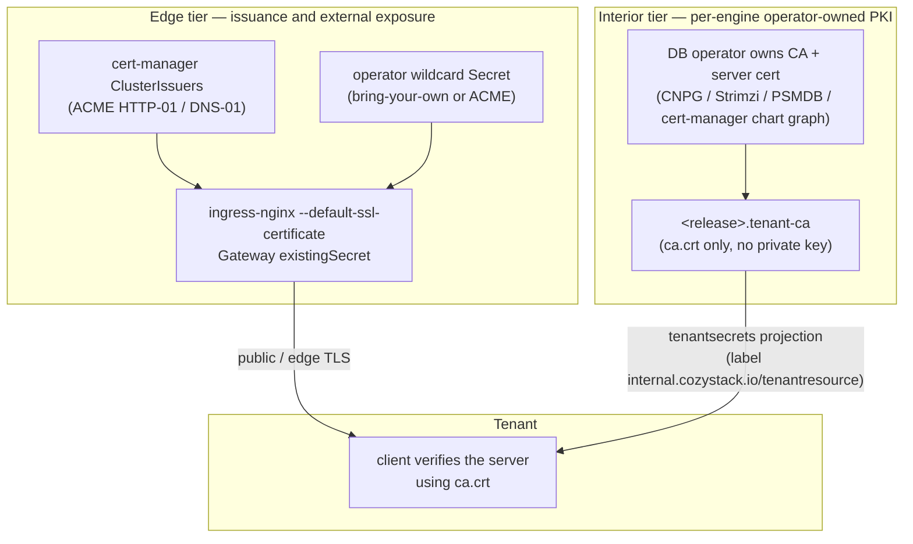

# Unified TLS and PKI model for managed applications

- **Title:** `Unified TLS and PKI model for managed applications`
- **Author(s):** `@lexfrei`
- **Date:** `2026-06-24`; revised `2026-09-03` (the §5 delivery mechanism, revised after the API-owner review in `cozystack/cozystack#3299`)
- **Status:** Accepted

## Overview

Certificate handling in Cozystack grew out of four uncoordinated mechanisms: per-application issuance inside each chart, per-host ACME on the default ingress path, an opt-in Gateway API path that mints a wildcard via DNS-01, and no supported way to bring an externally-issued wildcard. The epic `cozystack/cozystack#2811` set out to converge them, and the edge of that convergence has landed. What this proposal exists to pin down is the part that lives *inside* the engines: who owns the PKI for each managed application, and how a tenant receives the trust anchor it needs to verify a TLS connection.

This proposal records a written target design for the whole model, so that the two architectural forks at its center are decided on paper rather than discovered one pull request at a time. The first fork is the issuance abstraction: rather than "cert-manager as the single issuer", the target is **a single operator-facing interface to choose the certificate source, plus a uniform contract for consuming `ca.crt`**. The second fork is mint-versus-consume: rather than forcing every application to stop minting and consume a central certificate, the target is an explicitly **two-tier** model — cert-manager (or a bring-your-own wildcard) at the edge, and operator-owned PKI inside the engines — where what is unified is the *consume contract*, not the certificate authority itself. The second fork is the answer to the open question the epic body still carries as a goal ("should applications stop minting certs entirely and only consume cert-manager output?"): no — two-tier, because forcing pure-consume breaks the engines that rotate their own CA.

## Scope and related proposals

This proposal is the umbrella design for the work tracked by epic `cozystack/cozystack#2811`. It does not re-specify the edge work; it states the target the whole model converges on and focuses on the interior contract, where the per-engine work sits.

- **Edge (PRs):** `cozystack/cozystack#2988` (ACME wildcard on the default ingress-nginx path), `cozystack/cozystack#2989` (the CA-only trust-anchor helper), and `cozystack/cozystack#2990` (propagate the operator wildcard to per-tenant termination points — the PR implementing issue `cozystack/cozystack#2820`).
- **Workstreams (issues):** `cozystack/cozystack#2812` and `cozystack/cozystack#2400` (closed, edge wildcard); `cozystack/cozystack#2814` (converge per-app TLS and close the trust-anchor delivery gap — the first consumer of this contract); `cozystack/cozystack#2815` (external DB exposure via Gateway TLS-passthrough); `cozystack/cozystack#2816` (end-to-end TLS for databases); `cozystack/cozystack#2977` (opt-in east-west encryption). Throughout this document a `cozystack/cozystack#NNNN` reference is an issue unless called out as a PR.
- **Per-engine TLS series (PRs):** `cozystack/cozystack#2729` (redis), `cozystack/cozystack#2692` (mongodb), `cozystack/cozystack#2683` (rabbitmq), `cozystack/cozystack#2682` (opensearch), `cozystack/cozystack#2680` (mariadb). Each carries one engine onto this contract, and each is meant to land against it rather than ahead of it — the failure mode they exist to avoid is handing a tenant a key-bearing Secret (see Security). Which of them have landed is tracked in `cozystack/cozystack#2814`, not here.
- **Related (consumers of this contract):** `design-proposals/external-database-exposure` — the sibling proposal under the same epic; its end-to-end TLS story has external clients validate against the `<release>.tenant-ca` object defined here. `design-proposals/structured-external-exposure` (community pull request #29) — the structured `expose` model whose "external implies TLS" rule likewise points clients at this trust anchor. Both consume this proposal's output and define no PKI of their own.

All repository paths below refer to the `cozystack/cozystack` repository. A path belonging to an engine's TLS series is cited from that series' branch and named with it; everything else is cited from the platform. This document states the contract, not the state of a branch — [`design-proposals/README.md`](../README.md) is explicit that the codebase is the final source of truth for what the system does.

## Decisions

- [0002. mongodb sources the trust anchor from its leaf Secret, not from the operator's CA Secret](./decisions/0002-mongodb-sources-the-trust-anchor-from-the-leaf-secret.md) — the three properties that beat the obvious source.
- [0001. The trust anchor is declared by a namespaced `TenantProjection` and published as `<release>.tenant-ca`](./decisions/0001-the-trust-anchor-is-declared-by-a-namespaced-sentinel.md) — why the source-selection label was set aside, and why both `<release>-ca-cert` and `<release>-tenant-ca` were rejected as the canonical name.

## Context

### The edge

System ingresses (dashboard, grafana, keycloak, harbor) get a per-host certificate via the cert-manager `cluster-issuer` annotation and ingress-shim. The `letsencrypt-prod`, `letsencrypt-stage`, and `selfsigned-cluster-issuer` ClusterIssuers exist with HTTP-01 and DNS-01 solvers. Gateway API is present but opt-in, and in DNS-01 mode the `TenantGateway` controller renders a per-apex wildcard. With `cozystack/cozystack#2988` an operator can now drop in a wildcard Secret and have the default ingress path serve it via `--default-ssl-certificate`; `cozystack/cozystack#2990` extends that to per-tenant termination points.

### The interior

The managed engines fall into two classes by *who mints*, but — and this is the load-bearing correction — that axis is **not** the axis that decides who needs a delivery mechanism. Verified against the charts and against each engine's TLS series.

The first class **mints** its own chain from a chart-rendered cert-manager graph (self-signed Issuer → CA Certificate → CA Issuer → leaf Certificate). `nats` and `qdrant` do this (`packages/apps/nats/templates/certmanager.yaml`, `packages/apps/qdrant/templates/certmanager.yaml`), and the series for redis, rabbitmq, mariadb, and opensearch adds the same shape. In this class the CA Secret is a cert-manager CA-certificate Secret and therefore **carries the private key**, and it is not an object a tenant may be handed. Its name is not uniform, and the whole set is worth reading once, because §4 builds a rule on the separator: `<release>-ca` for nats, qdrant and rabbitmq, `<release>-ca-tls` for mariadb, `<release>.ca-tls` for redis, and `<release>-http-ca` for opensearch.

The second class **consumes** PKI that its operator owns end-to-end — but, crucially, operator-owned does **not** imply already-converged. Only one engine in it publishes a key-free trust anchor under its own name:

- `kafka` (Strimzi) is the **clean** reference: it exposes `<release>-cluster-ca-cert` and `<release>-clients-ca-cert`, each a CA-certificate-only object with no private key (`packages/apps/kafka/templates/dashboard-resourcemap.yaml`). Strimzi can serve a public certificate on its external listener while keeping internal broker mTLS on its own CA (`generateCertificateAuthority: false` + per-listener `brokerCertChainAndKey`).
- `postgres` (CloudNativePG) renders no cert-manager objects; the CNPG operator auto-generates a self-signed CA and signs the server certificate. The CA lives in the operator-created `<release>-ca` Secret, which **carries `ca.key`** and is created **asynchronously**; it is **not** delivered to tenants. The only tenant-facing object is `<release>-credentials` (`packages/apps/postgres/templates/init-script.yaml`), which is a chart-rendered Opaque Secret holding **only `user: password` pairs** — no `ca.crt`, no `tls.key` — surfaced through the dashboard resource map (`packages/apps/postgres/templates/dashboard-resourcemap.yaml`). So postgres carries a **trust-anchor delivery gap** — the tenant gets passwords, and nothing in the engine hands it `ca.crt` — the same shape as nats/qdrant — *not* a private-key coupling. The comment at `packages/apps/postgres/templates/db.yaml:20-22` claiming `ca.crt` rides in `<release>-credentials` contradicts what the chart actually renders and is a documentation bug.
- `mongodb` (Percona PSMDB) is operator-owned, but the PSMDB operator mints a cert-manager chain **at runtime** and publishes `<release>-ca-cert` as a **key-bearing** cert-manager `isCA` Secret (`tls.crt` + `tls.key` + `ca.crt`). The chart names the leaf Secret in `spec.secrets.ssl` and pins the operator's `tls.mode`, but renders no cert-manager objects of its own: the whole PKI is operator-created after deploy, which is exactly why it needs the same asynchronous-source treatment as CNPG. Same gap as the rest, plus a trap for anyone matching CA Secrets by name: PSMDB's key-bearing `<release>-ca-cert` and the key-free `<release>.ca-cert` the patched redis operator publishes are one separator apart and hold opposite shapes.

And one engine is the proof of the whole framing rather than a mere exclusion. `kubernetes` (Kamaji) is the **fourth independent PKI owner** — alongside cert-manager chart graphs, CNPG, and Strimzi — and the one that is fundamentally non-swappable: Kamaji owns the control-plane CA, the kubeconfig it hands out *pins* that CA, and every client authenticates against it by construction, so a public edge certificate is not just unnecessary there but meaningless. Kamaji is the strongest single argument for "unify the interface, not the CA": any design that homogenized the certificate authority would break it outright, whereas the consume contract below (a key-free trust anchor, delivered uniformly) is something even Kamaji already satisfies in spirit — the kubeconfig *is* its trust-anchor delivery. It needs no unification work and is excluded from the rollout, but it belongs in the enumeration as the boundary case that fixes the model's shape.

### Platform mechanisms this proposal builds on

- **The CA-only helper.** `cozy-lib.tls.caCertSecret` (`packages/library/cozy-lib/templates/_tls.tpl`, from `cozystack/cozystack#2989`) renders a Secret containing only `ca.crt`. It fails closed if the input PEM contains any private-key header, and it stamps two labels: `internal.cozystack.io/tenant-ca`, the selector §5(g) names, so a helper-rendered anchor converges with a projected one, and `internal.cozystack.io/tenantresource`, which is rendered for shape and which the lineage webhook recomputes on admission anyway. It is covered by `packages/tests/cozy-lib-tests/tests/tls_cacert_test.yaml`. That PR frames the situation it addresses as exactly this — a delivery gap: "the cert-manager apps grant tenants no access to those Secrets at all, so a tenant currently cannot obtain `ca.crt`".
- **Why the helper is needed but not sufficient.** The CA+leaf chain is rendered per-app by each chart's own cert-manager graph (for example `packages/apps/nats/templates/certmanager.yaml`), and the resulting CA Secret carries `ca.key` — so it is not itself a `ca.crt`-only object and cannot be handed to a tenant. The helper fixes the *output shape* (a key-free `ca.crt` Secret) but takes the CA cert as a Helm value, and nothing in the current architecture can feed it that value for an asynchronously-issued, per-release CA (see "The problem").
- **The tenant projection.** Secrets carrying the `internal.cozystack.io/tenantresource` label are exposed to tenants as the virtual resource `core.cozystack.io/tenantsecrets` (`pkg/registry/core/tenantsecret/rest.go`; the label constant lives in `pkg/apis/core/v1alpha1/tenantresource_types.go`; the RBAC grant is on the virtual resource, not on raw `core/v1` Secrets — `packages/system/cozystack-basics/templates/clusterroles.yaml`). The projection is **label-filtered, not field-filtered**: the entire Secret `Data` is delivered (`secretToTenant` copies `sec.Data` whole). This is the security pivot of the whole model — a labeled Secret must contain only safe material.
- **The label's authority is the lineage webhook, not the chart.** The `tenantresource` label is not honored just because something stamped it. The lineage admission webhook (`internal/lineagecontrollerwebhook/webhook.go`) is its authority: it walks a Secret's `ownerReferences` to the owning application and sets `tenantresource` to `true` or `false` from that application's `spec.secrets` selector on **every** admission. A statically-stamped label therefore does not survive on its own — any Secret meant to be tenant-visible must also match a `spec.secrets.include` entry, or the webhook overwrites the label to `false`. This is why the consume contract below marks the CA object through `spec.secrets` (by label), not by stamping the label alone.
- **The values channel.** Global values ride a `cozystack-values` Secret under `_cluster.*` keys, injected into every application HelmRelease via `valuesFrom`.

### The problem

The epic's original headline — "consume not mint, cert-manager as the single issuance abstraction" — is not realizable as stated, for two reasons.

First, there is no written contract for the interior. Nothing records, per engine, who owns the PKI and how `ca.crt` reaches the tenant. As a result each engine's TLS series re-derives the answer, and the answers differ — to the point of projecting a key-bearing Secret to tenants (see Security).

Second, most engines have **no path of their own to deliver a key-free `ca.crt`**. The cert-manager-minting engines (nats, qdrant, and the four engines whose series adds the same chain) cannot consume the helper because of three compounding constraints that are real and verified — and the operator-owned engines whose operator emits a key-bearing CA (postgres/CNPG, mongodb/PSMDB) hit the same wall, because their CA Secret is also key-bearing and (for CNPG) asynchronous:

- `valuesFrom` is pinned. `expectedValuesFrom()` (`internal/controller/applicationdefinition_helmreconciler.go:99-107`) hardcodes a single `{Kind: Secret, Name: cozystack-values}` reference, and the reconciler overwrites any drift. An application chart cannot add a sideways `valuesFrom` pointing at its own `<release>-ca`.
- `lookup` cannot drive it. PR `cozystack/cozystack#1787` moved the global-values channel off `lookup` onto `valuesFrom`; `lookup` itself is still available and is used by several charts to read a pre-existing per-release Secret. But it runs at template-render time and is invisible to the Flux digest, so a chart that reads an asynchronously-created Secret via `lookup` does not re-render when that Secret appears — it would need a manual `helm upgrade`.
- The per-release CA is created **asynchronously** by cert-manager (or by the CNPG/PSMDB operator), so it does not exist at template-render time at all.

So the helper, by itself, closes the *output* shape (a key-free `ca.crt` Secret) but not the *input* path (where the chart gets that `ca.crt` for an asynchronously-issued, per-release CA). That gap is the substance of this proposal.

## Goals

- Record **two-tier** as the target architecture: edge issuance plus interior operator-owned PKI.
- Define a per-engine **PKI-ownership contract**: for each managed engine, who owns the CA, whether the engine mints or consumes, which Secret carries `ca.crt`, which carries the key, whether the operator already self-publishes a key-free CA, and whether the tenant sees it.
- Define a single **consume contract**: a `ca.crt`-only object, stamped with the tenant-resource label, delivered through the existing projection. Kafka's CA-certificate-only Secret is the reference shape.
- Define a **delivery mechanism** for `ca.crt` on the engines whose operator does not already emit a key-free CA object.
- Decide **mint-versus-consume explicitly, per engine**, rather than as one global rule.

### Non-goals

- This proposal does **not** force pure-consume on engines that own their PKI; doing so would break CloudNativePG and Strimzi certificate rotation, which are mutually exclusive with an externally-supplied server certificate.
- It does **not** homogenize the certificate authority. CA ownership stays the operator's choice — one corporate CA for everything, per-engine self-signed, or a cert-manager issuer are all legitimate.
- It does **not** make Cozystack a public/WebPKI certificate authority, and it does not issue certificates for a tenant's own external domain.
- It does **not** redesign the edge (`cozystack/cozystack#2988`, `cozystack/cozystack#2989`, `cozystack/cozystack#2990`); it only references it and reframes the top-line goal.

## Design

### 1. The two-tier model


```mermaid
flowchart TB
  subgraph edge["Edge tier — issuance and external exposure"]
    CM["cert-manager ClusterIssuers<br/>(ACME HTTP-01 / DNS-01)"]
    WC["operator wildcard Secret<br/>(bring-your-own or ACME)"]
    ING["ingress-nginx --default-ssl-certificate<br/>Gateway existingSecret"]
    CM --> ING
    WC --> ING
  end
  subgraph interior["Interior tier — per-engine operator-owned PKI"]
    OP["DB operator owns CA + server cert<br/>(CNPG / Strimzi / PSMDB / cert-manager chart graph)"]
    CACERT["&lt;release&gt;.tenant-ca<br/>(ca.crt only, no private key)"]
    OP --> CACERT
  end
  subgraph tenant["Tenant"]
    T["client verifies the server<br/>using ca.crt"]
  end
  ING -->|"public / edge TLS"| T
  CACERT -->|"tenantsecrets projection<br/>(label internal.cozystack.io/tenantresource)"| T
```

The two tiers are independent. The edge tier answers "what certificate does a public client see when it reaches the platform", and is satisfied by an operator-chosen source (ACME HTTP-01, ACME DNS-01 wildcard, or a bring-your-own wildcard). The interior tier answers "what does a client that connects directly to a managed engine need to trust", and is satisfied by the engine's own operator-owned PKI. The only thing that crosses between them is the *shape* of the trust-anchor object a tenant consumes.

### 2. Edge tier

The edge is recorded here only to fix the framing. An operator selects the certificate source once; the default ingress path serves a supplied wildcard via `--default-ssl-certificate` (`cozystack/cozystack#2988`), and the Gateway path consumes the same Secret via an `existingSecret` mode. Propagating that wildcard to per-tenant termination points is `cozystack/cozystack#2990`. The reframed top-line goal applies here: this is "a single interface to choose the source", not "a single issuer for everything".

### 3. Interior PKI-ownership contract

The contract is a per-engine table. It is the artifact the per-app pull requests must conform to, and it makes the two-tier reality explicit: the operator owns the CA; the platform unifies only how `ca.crt` is consumed. The decisive column is **"self-publishes a key-free `ca.crt`?"** — that, not "mint vs consume", is what determines whether an engine needs a delivery mechanism at all. Filling in the last column takes one more question, the one §5 asks: whether the chart's sentinel names that key-free object, or the key-bearing one beside it. The table is deliberately free of merge state: it records who owns each engine's CA, whether that object carries a key, and what the controller must therefore do, all of which outlive any particular branch. Which engines have already converged is tracked in `cozystack/cozystack#2814`.

| Engine | PKI owner | CA-bearing Secret | Key in that Secret? | Self-publishes key-free `ca.crt`? | Delivery under this contract | Operator certificate capability |
| --- | --- | --- | --- | --- | --- | --- |
| kafka (Strimzi) | operator | `<release>-cluster-ca-cert`, `<release>-clients-ca-cert` | no | **yes** | straight copy — the sentinel names the key-free CA object and there is nothing to strip | `generateCertificateAuthority: false` BYO-CA + per-listener `brokerCertChainAndKey`; public cert on external listener, own-CA mTLS internally |
| redis | chart + cert-manager (`cozystack/cozystack#2729`) | `<release>.ca-tls` | yes | the patched operator writes a key-free `<release>.ca-cert`, which nothing on the platform reads | strip — the sentinel names the chart's key-bearing CA, because it exists as soon as the certificate is issued | stock freshworks-oss `redis-operator` v3.3.5 has no TLS support; `cozystack/cozystack#2729` carries it downstream over v3.3.5 in two halves that have to move together — the operator binary (`packages/system/redis-operator/images/redis-operator/patches/tls.diff`, cut from freshworks-oss/redis-operator#85 commit 2ad2ed8d1) and the CRD schema carrying `spec.tls` and its `x-kubernetes-validations` rule (`packages/system/redis-operator/patches/crd-tls.diff`, alongside `rbac-tls.diff`), without which the field is pruned on admission and the patched binary waits for something it never sees — together giving `spec.tls` including `caCertSecretName` |
| postgres (CloudNativePG) | operator | `<release>-ca` (operator-created, asynchronous) | **yes — `ca.key`** | no | strip — alongside the unchanged passwords-only `<release>-credentials` | `serverCASecret` / `serverTLSSecret` BYO; single server cert, no edge/internal split |
| mongodb (Percona PSMDB) | operator | `<release>-ca-cert` (operator-created at runtime), with `ca.crt` carried on the leaf `<release>-ssl` as well | **yes — cert-manager `isCA`** | no | strip — and the sentinel names the leaf `<release>-ssl`, not the CA Secret (§6) | `spec.tls.issuerConf` BYO issuer; auto-mints a cert-manager chain |
| nats | chart + cert-manager | `<release>-ca` | yes | no | strip | — |
| qdrant | chart + cert-manager | `<release>-ca` | yes | no | strip | — |
| mariadb | operator, with an optional chart cert-manager chain under `cozystack/cozystack#2680` | `<release>-ca-tls` on the cert-manager path | yes | **yes** — the operator maintains a key-free `<release>-ca-bundle` under either issuer | straight copy — the sentinel names that bundle, so there is nothing to strip | mariadb-operator `serverCertSecretRef` / `serverCASecretRef` / `serverCertIssuerRef` |
| opensearch | chart + cert-manager (`cozystack/cozystack#2682`), over the transport TLS opster generates for itself | `<release>-http-ca` | yes | no | strip | opster `security.tls.http.secret.name`; transport operator-generated |
| rabbitmq | chart + cert-manager (`cozystack/cozystack#2683`) | `<release>-ca` | yes | no | strip | cluster-operator `spec.tls.secretName` / `caSecretName` |
| clickhouse (Altinity) | — (BYO-cert) | supplied cert mount | n/a | no | out of the series — nothing is issued in-cluster to project from | mounts a supplied cert; no native issuance |
| kubernetes (Kamaji) | Kamaji | Kamaji-owned, not swappable | n/a | n/a | out of model — the kubeconfig is its trust-anchor delivery | control-plane CA, kubeconfig-pinned, non-swappable |

The takeaway: **kafka and mariadb** are the two engines the contract answers with a straight copy — their operator publishes a key-free `ca.crt` under its own name *and* their sentinel names that object, rather than the key-bearing one beside it. Neither publishes it at the canonical `<release>.tenant-ca`, so the controller still has to write it there (§5). **Every other engine gives the controller a key-bearing Secret to source from**, one uniform delivery gap, whether that CA comes from a chart-rendered cert-manager graph (nats, qdrant, redis, rabbitmq, opensearch) or from the engine's own operator (postgres, mongodb). The gap does **not** split along mint-versus-consume: postgres and mongodb are operator-owned, yet their CA Secret is key-bearing and operator-created, hence asynchronous, so they need the same key-free projection as the cert-manager-minting engines, which additionally never reach the tenant at all. **redis and mariadb together** show that the split is about which object the platform reads rather than which one exists. Both have an operator that publishes a key-free CA, and their charts decide differently: mariadb's sentinel names the operator's `<release>-ca-bundle`, because it exists under either issuer and carries the previous CA alongside the new one across a rollover, while redis's names the key-bearing cert-manager CA, because that Secret exists as soon as the certificate is issued rather than only after the operator has reconciled — so redis strips and its operator's key-free output goes unread. Kamaji anchors the other end of the table: a PKI owner so absolute that the only sane unification is the one this contract chooses — leave the CA alone, unify how trust reaches the client. So the contract is one sentence for every engine but Kamaji: converge by declaring a `TenantProjection` sentinel naming the Secret that carries your `ca.crt`, and let the controller publish `<release>.tenant-ca` from it. Which engines have done so is tracked in `cozystack/cozystack#2814`, and is deliberately not recorded here.

### 4. The uniform consume contract

Every engine, regardless of who owns its CA, exposes its trust anchor through one canonical object: a Secret named `<release>.tenant-ca`, containing only `ca.crt`, stamped with `internal.cozystack.io/tenant-ca: "true"` and made tenant-visible through the lineage webhook's `tenantresource` verdict.

The name took three revisions, and the reason is worth recording because it is the same mistake twice. `<release>-ca-cert` was rejected because Percona PSMDB already creates a Secret of that exact name and puts a private key in it — a collision across **engines**. Its replacement `<release>-tenant-ca` was justified as "claimed by no operator this platform ships", and that was false: it collides across **releases**. For an application `foo` the projection is `postgres-foo-tenant-ca`; for a sibling application `foo-tenant`, CloudNativePG's own CA is `postgres-foo-tenant` + `-ca` — the same string. Both names are legal and several Postgres instances in one namespace is the normal model. Nor is it merely a guard problem: if the projection lands first, CNPG rejects the key-free Secret (`missing ca.key secret data`) and the sibling's PKI never completes, so the sibling application never comes up — silently, blaming a Secret its owner never created. That would be a regression rather than a limitation: the name was unclaimed before this contract existed, so both applications worked, and no guard could refuse it, because the controller that wrote first was legitimate. Only the first of the three was ever published in a proposal; `<release>-tenant-ca` lived entirely inside this document's revision history. No release ever wrote either of them: the extraction controller carried the `.tenant-ca` suffix in the revision that merged.

The canonical name is therefore `<release>.tenant-ca`, and the dot is what does the work. Two of its three legs are machine-enforced, and both are worth naming because they are the reason the dot is available at all. Application names are validated as DNS-1035 labels (`k8svalidation.IsDNS1035Label`, `pkg/apis/apps/validation/validation.go`), so a dot is structurally impossible inside one. A release prefix is pinned to `^[a-z0-9-]*$` on `ApplicationDefinitionRelease` (`api/v1alpha1/applicationdefinitions_types.go`), which excludes the dot by construction. Secret names are DNS-1123 subdomains, where a dot is legal — so `<release>.tenant-ca` is a name the platform can write and no `<prefix><application>` can spell.

The third leg is an assumption rather than a constraint, and it is the one to be honest about: **`<prefix><application><suffix>` is dot-free exactly when the suffix is**, and nothing validates a suffix. Suffixes are picked by chart authors and by upstream operators, and dotted ones are already in use here — under `cozystack/cozystack#2729` the redis chart names its CA Secret `<release>.ca-tls` and its leaf `<release>.tls`, and the operator that series patches writes `<release>.ca-cert`. So the argument is conditional, and calling it a proof over every suffix an operator may add in future would be the survey mistake in different clothing. What is actually true is narrower: no suffix in use spells `.tenant-ca`, and that is a claim about a set this platform keeps growing.

What makes the name safe is that the residue is guarded rather than argued away. A Secret already occupying `<release>.tenant-ca` that this controller did not create is never overwritten and never adopted — §5(f) — so a future suffix that did collide surfaces as a refusal, with a Warning Event on the colliding Secret and a `Ready=False` condition on the sentinel naming it. That is the difference from the two names before it, and it is a difference in failure direction rather than in confidence: `<release>-tenant-ca` had no refusal available at all: a sibling application whose own CA the projection pre-empted would have stopped coming up, silently, and no guard could have refused the write, because the writer that got there first was legitimate. This one fails *closed* in the direction the controller controls: a stranger already at the canonical name is refused, loudly. The other direction is not symmetric and should not be claimed as such — if the projection is written first and some future operator suffix then wants that same name, what happens is that operator's behaviour, not this controller's, and CNPG's rejection of a key-free Secret is what that looks like. What has changed is the probability, not the shape: `<release>-tenant-ca` collided with an operator the platform already ships, and `.tenant-ca` collides only with a dotted suffix nobody has written. The platform already has the building block — `cozy-lib.tls.caCertSecret` renders exactly this object and fails closed if the input contains a private key.

The same reasoning applies one level down, to the source Secrets a chart renders, and the contract should say so rather than leave the next per-engine author to rediscover it. Two per-release Secrets collide across releases exactly when one of their suffixes is a tail of the other: if the suffix set holds both `-x` and `-y-x`, then release `foo`'s `-y-x` object and release `foo-y`'s `-x` object are the same string, and both release names are legal. The set to check is every per-release Secret suffix that lands in the namespace, the ones an operator writes included, not only the ones the chart renders.

**A chart separates a per-release Secret suffix with a dot when, and only when, that pair exists in its set.** The check belongs to the chart author, over the whole set, and this document deliberately does not publish a verdict per engine: an enumeration that misses one operator-written name produces exactly the false clearance this section is warning about. Three worked pairs, because they are documented in the charts themselves. Under `cozystack/cozystack#2729` the redis set holds `-ca-tls` and `-tls`, so hyphenated, release `foo`'s CA Secret and release `foo-ca`'s leaf Secret would both be `redis-foo-ca-tls`; it uses `<release>.ca-tls` and `<release>.tls` for that reason and records it in a comment on the Certificate. Under `cozystack/cozystack#2680` the mariadb chart's cert-manager path renders that same pair and keeps the hyphen. And opensearch is the case that shows why the operator's names count: opster writes its own transport CA at `<clusterName>-ca` unconditionally, `cozystack/cozystack#2682` names the chart's CA `-http-ca` to keep the two apart within one release, and across releases they meet anyway — application `foo`'s chart CA and application `foo-http`'s operator CA are both `opensearch-foo-http-ca`. So the dot is neither a platform-wide convention nor a redis-local taste: it is what this contract asks of new work wherever the mechanism above finds the pair, and applying it anywhere else buys nothing. Two of the three sets above hold the pair and keep the hyphen, so the rule states what they have to converge on, not what they do.

This is where the label-filtered projection matters. Because `tenantsecrets` delivers the whole Secret `Data`, the helper's fail-closed guard is not a nicety — it is the boundary that keeps a server or CA private key out of a tenant's hands. Kafka's `<release>-cluster-ca-cert` is the shape to match: a CA certificate, no key, readable by the tenant.

### 5. Delivery: a declared sentinel and one engine-agnostic controller

The contract in §4 fixes the output object; this section fixes the input path — how the key-free `<release>.tenant-ca` gets written for an engine whose operator does not already emit it under that name. Everything in this section is **internal**: no tenant and no consumer observes any of it. A tenant still reads exactly the object §4 defines — `<release>.tenant-ca`, containing only `ca.crt` — and nothing here changes what that object is, how it is labelled, or how it is consumed. The delivery mechanism lives entirely below the line §4 draws.

The input path splits on a single question — **does the engine's operator already emit a key-free `ca.crt` object?** — and the platform's standing preference (source from a key-free object where one exists; strip only when forced to) follows from it:

- **Engines whose operator already publishes a key-free CA under its own name, and whose sentinel is to source from it.** `kafka` (Strimzi) lands its CA key-free under `<release>-cluster-ca-cert` — the CA that signs the broker certificates, which is what a client verifies the endpoint against; the sibling `<release>-clients-ca-cert` signs user certificates for client authentication and is the wrong direction of trust — and converges by naming that object; `mariadb` has the operator's `<release>-ca-bundle`, which exists under either issuer and spans a CA rollover, and converges by naming it (`cozystack/cozystack#2680`). Neither is at the canonical `<release>.tenant-ca`, so the controller copies it across through a declared projection — a straight copy with nothing to strip. Publishing a key-free CA is not by itself enough to put an engine here: `redis` is not, despite appearances, because although the operator patch its series carries does publish a key-free `<release>.ca-cert`, the chart's sentinel names the key-bearing cert-manager CA instead, so nothing reads it and redis belongs with the engines below.
- **Every other engine** — nats, qdrant, redis, opensearch, rabbitmq (cert-manager chains, chart-rendered, key-bearing CA) and mongodb, postgres (operator-rendered, key-bearing CA, asynchronous) — has a key-bearing CA Secret and no key-free output the platform reads. None can feed the helper at chart-render time (see "The problem"). The sentinel names whichever Secret carries a correct and stable `ca.crt` — usually the engine's CA Secret, and for mongodb the leaf `<release>-ssl` instead, for the reasons in [decision 0002](./decisions/0002-mongodb-sources-the-trust-anchor-from-the-leaf-secret.md) — and the controller strips everything but that key.

The alternative to one controller is to change each upstream operator so it emits a key-free CA of its own, the way redis's open pull request adds `caCertSecretName` to the operator it patches. Carrying an equivalent change for CloudNativePG, PSMDB, mariadb-operator, opster, and the rabbitmq cluster-operator is far more surface to own than a single small controller — and redis is the cautionary case rather than the model, because the key-free output its patch adds goes unread: the chart projects from the CA cert-manager writes, which exists as soon as the certificate is issued rather than only after the operator has reconciled. So the controller is the target for every non-self-publishing engine.

The mechanism is two pieces: a **declaration** the chart renders, and a small **controller** that reconciles it. An earlier revision of this proposal delivered the input path with a *label* on the CA Secret — the owner stamped `publish-ca-cert` and the controller selected sources by that label. An API-owner review of the implementation (`cozystack/cozystack#3299`) found that this emulates object semantics with a label: the thing being declared is "project this Secret's `ca.crt` as a trust anchor", a first-class intent that deserves a first-class object with a name, a status, and its own admission rules — not a boolean smuggled onto someone else's Secret. The mechanism below is that object.

**(a) The owner declares the projection with a namespaced sentinel.** The app chart renders a small namespaced custom resource — `TenantProjection`, group `internal.cozystack.io` — that names the source Secret explicitly instead of stamping a label on it:

```yaml
apiVersion: internal.cozystack.io/v1alpha1
kind: TenantProjection
metadata:
  name: <release>-ca
spec:
  projections:
    - type: CACert
      sourceSecretName: <release>-ca   # the engine's CA-bearing Secret
      sourceKey: ca.crt                # key to lift (defaults to ca.crt)
```

The API is settled: `TenantProjection` in group `internal.cozystack.io`, version `v1alpha1`, short name `tproj`, namespaced, with `spec.projections[].type` admitting exactly one value, `CACert` (`api/internalapi/v1alpha1/tenantprojection_types.go`; CRD at `packages/system/cozystack-controller/definitions/internal.cozystack.io_tenantprojections.yaml`). The projected Secret lands in the sentinel's own namespace, one per release, alongside the application. The sentinel's own name is free-form — the shipped postgres chart calls it `<release>-ca` after the source it names (`packages/apps/postgres/templates/tenant-projection.yaml`) — because the controller never parses it: it derives the release from the `helm.toolkit.fluxcd.io/name` label Flux stamps on every rendered object (`internal/controller/cacert/reconciler.go`), and a sentinel that reaches the cluster without that label publishes nothing and reports `Ready=False, Reason=NoRelease`.

The sentinel is a **declaration**, not a copy of the data: the chart renders it at template time, so it exists in the Flux digest and is reconciled like any other chart object, even though the source Secret it names is created asynchronously by cert-manager or the DB operator long after render. Naming the source explicitly — rather than relying on a name convention or a label the operator must be coaxed into stamping — is what keeps the mechanism engine-agnostic: the CA-bearing Secret names are non-uniform (`<release>-ca`, `<release>-ca-tls`, `<release>.ca-tls`, `<release>-http-ca`, `<release>-ca-cert`) and two of them differ only in a separator — PSMDB's `<release>-ca-cert` is key-bearing while the `<release>.ca-cert` the patched redis operator writes is key-free, and the declaration accommodates all of them because the chart author who knows the source name simply writes it down. It also dissolves the label design's release-attribution problem: cert-manager runs with `enableCertificateOwnerRef: false`, so a cert-manager-issued Secret carries no ownerReference back to its application and the label leg had to add a separate `-release` label to say which release it belonged to; the sentinel is itself a chart object in the release's namespace, attributed to its release the same way every chart object is (see (c)), so no such marker is needed.

**(b) A small extraction controller reconciles the sentinel.** The controller watches `TenantProjection` objects (not Secret labels), the source Secrets they name, the projections it owns, and the `ApplicationDefinition`s whose `spec.secrets` decide tenant visibility — that last watch is what makes the re-admission in (f) happen when the selectors change rather than at the next resync. For each `CACert` projection it upserts a `type: Opaque` Secret named `<release>.tenant-ca` containing **only** `ca.crt`, re-copying on every source change so a CA rotation propagates without a chart re-render. Its watch/upsert shape follows the wildcard-secret reconciler (`internal/controller/wildcardsecret/reconciler.go`). It marks its own copies with `internal.cozystack.io/ca-cert-copy` (part (g)) and keeps one narrow removal path, described in part (c); the bulk of the prune logic is unnecessary here because ownership and lineage provide it. It does four security-load-bearing things and nothing more:

- **Read the source the sentinel names, and check its content.** Read only the Secret named in `sourceSecretName`, lift only `sourceKey`, and before writing decode it in a `pem.Decode` loop and parse every block with `x509.ParseCertificate`. The check is **all-or-nothing, and not a filter**: the whole value is refused on the first block whose type is not `CERTIFICATE`, on the first `x509.ParseCertificate` failure, and on any trailing bytes that are not a PEM block. Nothing is published in any of those cases — the sentinel reports `Ready=False, Reason=SourceRejected` and a Warning Event lands on the source Secret. What is written on success is rebuilt from the parsed certificate DER rather than copied from the input, so a human-readable preamble, or key material tucked between blocks, cannot ride along. That verifies the lifted value is a certificate, not that it is specifically a CA certificate. The sentinel says *which* Secret; the content check says *whether to strip* — which is what lets one controller straight-copy a key-free kafka source and strip a key-bearing PSMDB source without confusing the two, even though the key-free and key-bearing shapes turn up under names one separator apart.
- **Tolerate operator-created, asynchronous sources.** The named source may be created by the CNPG or PSMDB operator (or by cert-manager) after the chart renders. The controller waits on the watch event for that source; it does not assume the chart owns the Secret and does not error or busy-loop before the source exists. The sentinel exists from render time, so there is always a durable declaration to reconcile against — and to carry status (part (e)) — while the source is still missing.
- **Sanitize at write time, not just render time.** The `cozy-lib.tls.caCertSecret` helper's fail-closed guard runs at *chart-render* time; this controller writes at *runtime*, so it must itself copy only the single `ca.crt` key (an explicit whitelist) and re-assert the no-private-key check on every write. It never copies the whole `Data`.
- **Owner-ref the projected Secret to the sentinel.** The projection takes an `ownerReference` to the `TenantProjection` that declared it — not to the application-instance CR, and not to the `HelmRelease` directly. The application-instance CR cannot be referenced: the `apps.cozystack.io` kinds are virtual — served by the aggregated apiserver, with a tenant application *stored* as a `HelmRelease` whose `spec.values` is the application spec verbatim — so there is no application object in etcd and no UID to point at. The sentinel, by contrast, is a real chart-rendered object in the same namespace, so a real owner-reference is valid and garbage collection is native (part (c)). `blockOwnerDeletion` stays false: a trust anchor must never delay the teardown of the application it belongs to. (The projection does not owner-ref the *source* CA Secret: cert-manager and the DB operators do not own their output Secrets, so a walk from the source would dead-end before reaching the app.)

**(c) Attribution, lineage, and garbage collection: the sentinel is a plain chart object.** The sentinel itself carries **no** `ownerReferences`. Flux stamps every object it renders with the `helm.toolkit.fluxcd.io/name` label naming the release, and that label — not an owner-reference — is how the sentinel is attributed to its release, exactly as for any chart-rendered object. So the lineage walk resolves the chain **Secret → sentinel → HelmRelease → application** with no change to the webhook: the projected Secret owner-refs the sentinel, the sentinel's release label names the `HelmRelease`, and the `HelmRelease` backs the application. Garbage collection is native for the case that matters: deleting the application deletes the `HelmRelease`, Flux prunes the chart's objects including the sentinel, and Kubernetes then garbage-collects the projection the sentinel owns. One case native collection cannot reach, and for which the controller keeps a removal path: a sentinel that goes on existing while its `CACert` entry is gone owns a projection nothing will collect, and it would serve a stale trust anchor indefinitely — so the controller withdraws that projection, and only one it owns. Marking the projection tenant-visible is unchanged from §4 — the controller stamps `internal.cozystack.io/tenant-ca: "true"` on it, one generic `ApplicationDefinition.spec.secrets.include` entry (`matchLabels: {internal.cozystack.io/tenant-ca: "true"}`) matches it by label (`internal/lineagecontrollerwebhook/matcher.go`), and the lineage webhook then walks the projection's owner chain and authoritatively stamps `internal.cozystack.io/tenantresource` to `true` (and to `false` should the Secret ever stop matching).

**(d) Admission: RBAC is the control, not a ValidatingAdmissionPolicy.** No tenant role grants any verb on `internal.cozystack.io`, so a tenant cannot create, update, or delete a `TenantProjection` to aim the controller at a Secret of its choosing — the only way a sentinel enters the cluster is by being rendered into a release. The extraction controller holds `get`/`list`/`watch` on `tenantprojections` and `get`/`update`/`patch` on `tenantprojections/status` — enough to read a declaration and write the `Ready` condition part (e) needs, and nothing beyond it (`packages/system/cozystack-controller/templates/rbac.yaml`). It never creates or deletes a sentinel, since that stays the chart's (helm-controller's) job.

**(e) A broken declaration is observable.** The sentinel carries `status.conditions`, and the controller sets `Ready`. When a declaration cannot be satisfied — the named source Secret does not exist, or an upstream bump renames the CA Secret out from under `sourceSecretName` — the controller records `Ready=False, Reason=SourceNotFound` on the sentinel. This is a concrete advantage over the label design, which had no object to carry status: there, a source that never appeared could only make the controller requeue silently, invisible until someone noticed the trust anchor was missing. With the sentinel the failure is a queryable condition on a named object — alertable, and pointing at the exact broken release.

**(f) Revocation is part of the mechanism, and the canonical name is guarded.** The `tenantresource` verdict in (c) has to be able to go back to `false`, and that does not happen for free. Each projection records a digest of the owning `ApplicationDefinition`'s `spec.secrets` in `internal.cozystack.io/ca-cert-selectors`, and the digest is part of the drift check, so a change to those selectors forces exactly one write; that write also drops the `internal.cozystack.io/managed-by-cozystack` marker, which is what hands the projection back to the lineage webhook — the webhook's `objectSelector` skips any object already carrying the marker, so forcing a write without dropping it would leave the verdict frozen at whatever the selectors said on create. Both halves together are what lets a definition that stops selecting the anchor actually take the tenant's read access away, instead of leaving it reading a trust anchor the platform withdrew. The canonical name carries its own guards, and they are two distinct refusals. A Secret at `<release>.tenant-ca` that this controller did not create is never overwritten and never adopted: adoption keys on the projection's **owner reference** back to a `TenantProjection` of the sentinel's name, not on any label — a label is something any writer in the namespace can forge or strip, and keying adoption on one would let an actor who strips it make the controller disown its own object and keep serving whatever bytes that actor wrote. A stranger at the name is refused as `Ready=False, Reason=ProjectionCollision`, with a Warning Event on the colliding Secret. Separately, when the sentinel's own declared source *is* the canonical name and carries private key material, the answer is `Ready=False, Reason=CanonicalNameOccupied` and a Warning Event on that Secret. There is a third outcome that is neither refusal: when the declared source sits at the canonical name and is key-free, it already *is* the trust anchor, so the controller writes nothing and reports `Ready=True, Reason=Projected` — and if that Secret departs from the shape the name promises, it emits a `CACertCanonicalNameContract` Warning Event rather than silently implying it checked out. It is the only path on which the object a tenant reads at that name is not one the controller wrote. A release whose anchor is declared more than once publishes nothing — `MultipleCACertProjections` when a single sentinel declares two `CACert` entries, `ReleaseContested` when two sentinels in one namespace claim the same release. All of these live in `internal/controller/cacert/reconciler.go`.

**(g) Which label is written by whom.** Five labels appear below; four are stamped on the projection and the last is Flux's, on the sentinel. Two of them have names close enough to be used interchangeably by mistake, and that mistake is a live bug in one specific direction: the lineage webhook is registered with `objectSelector` `managed-by-cozystack` `DoesNotExist`, so a projection created already carrying that marker never reaches the webhook — it is admitted, the webhook simply skips it — and therefore never receives a `tenantresource` verdict, and no tenant ever reads the trust anchor. The controller's own marker is the other name, and it is not what adoption keys on either — see (f).

| Label | Written by | What it means |
| --- | --- | --- |
| `internal.cozystack.io/tenant-ca` | the extraction controller | this Secret is a trust anchor; it is the single engine-agnostic selector an `ApplicationDefinition.spec.secrets.include` entry matches |
| `internal.cozystack.io/ca-cert-copy` | the extraction controller | this projection was controller-created. It is part of the drift check, and it is **not** what adoption keys on — that is the owner reference (see (f)) |
| `internal.cozystack.io/tenantresource` | the lineage admission webhook | the authoritative verdict on whether a tenant may read the Secret, recomputed from the owning application's `spec.secrets` on every admission |
| `internal.cozystack.io/managed-by-cozystack` | the lineage admission webhook | the webhook's own re-admission marker. The controller never writes it; it only deletes it, on a selectors-digest change, to hand the projection back for a fresh verdict (see (f)) |
| `helm.toolkit.fluxcd.io/name` | Flux | the release the sentinel belongs to, and the string the canonical projection name is built from |

The controller also writes two annotations on the projection: `internal.cozystack.io/ca-cert-source`, recording the `<namespace>/<name>` it read, and `internal.cozystack.io/ca-cert-selectors`, the selectors digest (f) turns into a re-admission.

What this *reuses* rather than rebuilds: Flux's release-name label and its native pruning (for attribution and garbage collection), the lineage webhook's owner-reference walk and authoritative `tenantresource` stamping (`internal/lineagecontrollerwebhook/webhook.go`, `pkg/lineage/lineage.go`), the label selector in `ApplicationDefinition.spec.secrets` (`internal/lineagecontrollerwebhook/matcher.go`), and the private-key guard in `cozy-lib.tls.caCertSecret` (`packages/library/cozy-lib/templates/_tls.tpl`). The irreducibly new work is the `TenantProjection` sentinel and the extraction step that reconciles it — read one key from the named source, write a key-free copy, re-copy on rotation, report readiness — the same job an operator does natively on the engines that already ship a key-free CA object (kafka's `<release>-cluster-ca-cert`). Kafka still declares a sentinel, because its CA lands under an engine-specific name rather than the canonical one; for it and for mariadb the extraction step is a straight copy, with nothing to strip.

### 6. Per-engine application order

`postgres` goes first (under the tracking issue `cozystack/cozystack#2814`): it is the engine the epic most wants to see converged, and it exercises the controller against the hardest input — an **operator-created, asynchronous** CA Secret — so validating it there validates the mechanism everywhere. Convergence for postgres means publishing a key-free `<release>.tenant-ca` extracted from CNPG's key-bearing `<release>-ca`, while leaving the passwords-only `<release>-credentials` untouched. `kafka` already publishes a key-free `ca.crt` under its own name, so it converges by declaring a `TenantProjection` sentinel that names `<release>-cluster-ca-cert` as the source — a straight copy with nothing to strip. `redis` (`cozystack/cozystack#2729`) is a stripping case rather than a straight copy: its chart mints a cert-manager chain and declares a sentinel naming the key-bearing `<release>.ca-tls` that chain produces, so the controller lifts `ca.crt` and drops the key, and the key-free `<release>.ca-cert` the patched operator also publishes goes unread. `nats` and `qdrant` converge the same way, over the `<release>-ca` their own cert-manager graph renders. `mongodb` is the case where the sentinel names no CA Secret at all: it names the **leaf** Secret `<release>-ssl` with `sourceKey: ca.crt`, for the three reasons in [decision 0002](./decisions/0002-mongodb-sources-the-trust-anchor-from-the-leaf-secret.md): it is the name the chart itself sets in `spec.secrets.ssl`, it is what the operator's self-signed fallback writes when cert-manager is absent, and during a CA rotation the operator merges the old and the new CA into its `ca.crt`. PSMDB's `<release>-ca-cert` has none of those three properties. `mariadb` is the other straight copy: like kafka it names a key-free object its operator already maintains, `<release>-ca-bundle`. `rabbitmq` and `opensearch` converge by declaring a sentinel over the key-bearing CA their chart's cert-manager chain produces. `kubernetes` (Kamaji) is explicitly out. This is the intended order, not a progress report; `cozystack/cozystack#2814` tracks how far it has got.

## User-facing changes

A tenant sees one canonical, key-free trust-anchor object per managed application — `<release>.tenant-ca`, carrying only `ca.crt` — through the dashboard resource map and the `tenantsecrets` projection, in the same shape across every engine. An operator sees one interface to choose the edge certificate source. There is no new tenant-authored input.

## Upgrade and rollback compatibility

This document changes nothing at runtime; it records a target. The pull requests that implement it are individually backward-compatible in the engine's own PKI: per-app TLS is opt-in (tri-state), external exposure is opt-in, and the extraction controller adds a new object without altering existing Secrets. postgres convergence is purely additive — it publishes a new key-free `<release>.tenant-ca` and leaves the passwords-only `<release>-credentials` in place (removing it would drop the tenant's connection passwords). Reverting any implementing PR removes the new `<release>.tenant-ca` object and the controller that maintains it, leaving the engine's existing PKI untouched.

## Security

The trust boundary is precise: a tenant receives `ca.crt` and never receives `tls.key` or `ca.key`. The label-filtered, full-object nature of the `tenantsecrets` projection makes this a **preventive invariant** rather than the fix of a live leak: because any labeled Secret is delivered in full, the platform's standing rule must be that no key-bearing Secret is ever labeled tenant-facing — and the way to honor it is to remove the key from the *object* (a separate `ca.crt`-only Secret), not to rely on field filtering at projection time.

No engine leaks a private key to a tenant: the charts withhold their key-bearing Secrets, and the tenant-facing objects (postgres `<release>-credentials`, the nats/qdrant credentials Secrets) are passwords-only. The risk is structural rather than historical, and it is why this contract is written down. Every engine's TLS series puts a key-bearing CA Secret in the tenant's own namespace, and the shortest path from there to "the tenant needs `ca.crt`" is to label that Secret — at which point the projection delivers it whole, private key included, because the projection is label-filtered and not field-filtered. So the rule this contract imposes on the series is: **a chart never labels a key-bearing Secret tenant-facing; it declares a `TenantProjection` over that Secret instead**, and the controller publishes the key-free anchor. The consume object and the extraction controller exist so that no per-engine pull request has to reach for the shortcut.

Two consequences for the controller. First, it writes at runtime, after chart-render, so it cannot lean on the helper's render-time guard alone: it must whitelist the single `ca.crt` key and re-assert the no-private-key check itself on every write. Second, it adds a new trust surface — read access to per-release CA Secrets, write access for the key-free copy — and must never overwrite a Secret it did not create, surfacing any name collision as a Warning Event rather than failing silently. The declaration that drives it is itself locked down: no tenant role grants any verb on `internal.cozystack.io`, so a tenant cannot forge a `TenantProjection` aiming the controller at a Secret of their choosing — RBAC alone is the control, with no admission policy narrowing the writer further.

## Failure and edge cases

- The helper's input PEM contains a private-key header → render fails closed; the chart does not deploy a key-bearing Secret.
- The source `ca.crt` carries a block that does not parse as an `x509.Certificate`, a block of some other PEM type, or trailing bytes after the last block → the whole value is refused, nothing is published, and the sentinel reports `Ready=False, Reason=SourceRejected` with a Warning Event on the source. A partly valid value is never partly projected.
- The sentinel names a key-free source that should be left alone (a self-publishing engine) → the content check sees no private key to strip and the controller still writes only `ca.crt`; no key is ever exposed.
- The named source Secret does not exist yet (operator-created, asynchronous) → the controller waits for the watch event on that source and records `Ready=False, Reason=SourceNotFound` on the sentinel meanwhile; it does not error or busy-loop.
- An upstream bump renames the CA Secret out from under `sourceSecretName` → the source never reappears under the declared name, and the sentinel surfaces `Ready=False, Reason=SourceNotFound` — a queryable, alertable condition rather than a silent requeue.
- A foreign Secret already occupies the target name → the controller leaves it untouched, because the Secret carries no owner reference back to the sentinel, and emits a Warning Event on that Secret so the operator sees the collision.
- The CA rotates → the controller re-copies `ca.crt` on the next source change; no chart re-render is required.
- The application is deleted → Flux prunes the sentinel with the rest of the chart's objects, and Kubernetes garbage-collects the projected `<release>.tenant-ca` via its owner reference to the sentinel.
- The sentinel survives but stops declaring its `CACert` entry → nothing is pruned and nothing is collected, so the controller withdraws the projection it published rather than leave a stale trust anchor behind; a foreign Secret at that name, or another sentinel's projection, is left untouched.

The sentinel's `Ready` condition carries exactly these reasons, and they are the whole set an operator can meet:

- `Projected` — every declared projection is published.
- `NoRelease` — the sentinel reached the cluster without Flux's `helm.toolkit.fluxcd.io/name` label, so no release, and therefore no canonical name, can be derived from it.
- `SourceInvalid` — the entry declares an empty `sourceSecretName`. The CRD pins a minimum length, so this is only reachable for an object admitted by an older CRD.
- `SourceNotFound` — the named source Secret does not exist yet.
- `SourceNotReady` — the source exists but does not carry the named key, or carries it empty; operators routinely create the Secret before populating it.
- `SourceRejected` — the lifted value carries private key material, or fails the certificate gate.
- `ProjectionCollision` — a Secret this controller did not create occupies the canonical name.
- `ProjectionTerminating` — the previous projection is still being garbage-collected, so writing to it would land and then be thrown away.
- `CanonicalNameOccupied` — the declared source is itself at the canonical name and carries private key material.
- `MultipleCACertProjections` — one sentinel declares more than one `CACert` entry.
- `ReleaseContested` — two sentinels in one namespace claim the same release.
- `UnsupportedProjectionType` — the entry's type is not `CACert`. Unreachable while the CRD enum admits only that value, and kept as the explicit answer if the enum is widened before the code that handles a new type lands.

## Testing

- The helper is already covered by `packages/tests/cozy-lib-tests/tests/tls_cacert_test.yaml`, including the fail-closed assertions.
- The extraction controller's suite is plain Go, one `func Test…` per case over a fake client in `internal/controller/cacert/reconciler_test.go`, the same shape as `internal/controller/wildcardsecret/reconciler_test.go`, with no envtest and no Ginkgo in either. It covers the source that has not appeared yet and the source that exists without the key; both refusals of the content gate, including a value that is certificate armour around something else and a valid certificate followed by trailing bytes; the foreign Secret at the canonical name and the forged-marker variant of it; two sentinels contesting one release, and two `CACert` entries in one sentinel; the stale-owner re-home after an application is deleted and recreated under the same name; and the selectors-digest write that hands the projection back to the lineage webhook.
- Two properties are out of that suite's reach by construction, because a fake client runs neither a garbage collector nor an admission chain: the webhook's `tenantresource` verdict, and owner-reference-driven collection of the projection. The verdict is asserted in the live end-to-end fixtures (`hack/e2e-chainsaw/postgres`, `hack/e2e-chainsaw/mongodb`), which is the only place it can be — they read the anchor back through `core.cozystack.io/tenantsecrets` and assert the key-bearing source is not served that way. Collection is asserted nowhere: the fixtures let chainsaw tear the application down during cleanup, so no step deletes it and then checks that `<release>.tenant-ca` is gone. Rotation is asserted in half. The re-copy branch is driven by the tamper-heal case, where an existing projection holding foreign bytes is rewritten from the source on a single reconcile; what no case does is mutate a source between two reconciles, so the watch-to-write path a real rotation actually takes is never exercised end to end.
- Each per-engine pull request adds helm-unittest fixtures asserting the chart renders the `TenantProjection` sentinel with the right `sourceSecretName` (`packages/apps/*/tests/tenant_projection_test.yaml`), and asserting the projected `<release>.tenant-ca` shape and label, plus an end-to-end check that a tenant can read `ca.crt`, cannot read any object carrying `tls.key`, and can verify the server.
- No dedicated admission fixture is needed: RBAC is the control, and no tenant-facing ClusterRole grants any verb on `internal.cozystack.io`, so a tenant cannot write a `TenantProjection` by any path.

## Rollout

1. Edge — the wildcard on the default ingress path, the CA-only helper, and per-tenant propagation (`cozystack/cozystack#2988`, `cozystack/cozystack#2989`, `cozystack/cozystack#2990`).
2. This contract.
3. The `TenantProjection` CRD and the extraction controller that reconciles it.
4. Per-engine convergence, in the order §6 gives, tracked by `cozystack/cozystack#2814`.

## Open questions

- How this intersects with per-tenant wildcard propagation (issue `cozystack/cozystack#2820`, implemented by PR `cozystack/cozystack#2990`). That is a *cross-namespace* replication problem; the extraction controller here is *intra-namespace, per-release*, so the two do not share a mechanism — but they should share the management-label and foreign-collision conventions. Note that `clustersecret-operator` is packaged in the repo but is not wired into a default bundle, so it is not an installed primitive this design can assume.

## Alternatives considered

- **Pure-consume (applications stop minting, consume a central cert-manager output).** Rejected: it breaks the rotation lifecycle of CloudNativePG and Strimzi, whose own-CA management is mutually exclusive with an externally-supplied server certificate.
- **`lookup` for the asynchronous CA.** Rejected: `lookup` runs at render time and is invisible to the Flux digest, so the chart would not re-render when the CA appears. (`cozystack/cozystack#1787` already moved the global-values channel off `lookup` onto `valuesFrom` for the same digest reason.)
- **A custom `valuesFrom` pointing at `<release>-ca`.** Rejected: `expectedValuesFrom()` pins every application HelmRelease to the single `cozystack-values` Secret and overwrites drift.
- **Changing each upstream operator to emit a key-free CA.** Rejected as the general mechanism, and retired even for the engine that pioneered it. Redis was going to carry a forked operator; its pull request now carries a downstream patch over freshworks-oss `redis-operator` v3.3.5 instead, and the key-free Secret that patch produces goes unread, because the chart projects from the CA cert-manager writes. Carrying an equivalent change for CloudNativePG, PSMDB, mariadb-operator, opster, and the rabbitmq cluster-operator would be far more surface to own than one engine-agnostic controller.
- **cert-manager `trust-manager`.** Considered and rejected as the mechanism, recorded as the validating prior art. trust-manager is the canonical "watch a CA source, materialize a key-free copy, never touch `tls.key`" operator and confirms the copy-model is the mainstream choice for trust-anchor distribution. But it does not fit operationally: its `Bundle`/`ClusterBundle` is cluster-scoped and fans out to namespaces by selector (not one object per release); it reads its sources from its own trust namespace, not from an arbitrary per-release tenant namespace; and it targets ConfigMaps first (Secret targets are opt-in). Modelling per-release, intra-namespace extraction on it would mean one cluster-scoped Bundle per database release reading a source it cannot natively see — against the grain. The small intra-namespace controller is a better fit.
- **External Secrets Operator (kubernetes provider).** The closest prior art of the copy-model options, and mechanically sound end-to-end: a `SecretStore` with `provider.kubernetes` plus a per-release `ExternalSecret` selecting a single key (`data[].remoteRef.property: ca.crt`, not `dataFrom`) materializes exactly the key-free `<release>.tenant-ca` object. Selecting one property is a structural no-private-key whitelist, `target.template` stamps the marker label, `refreshInterval` tolerates the operator-created asynchronous source, and the chart renders a *declaration* of the projection rather than its data — sidestepping the async/render-time wall the same way the controller does. The lineage chain resolves too: ESO owner-refs its output Secret to the `ExternalSecret`, itself a chart-rendered object, so the ownership walk reaches the owning application the way it does for any chart object, and garbage collection follows. Not adopted as the mechanism for one operational reason and two costs: ESO is packaged but **opt-in** — `cozystack.external-secrets-operator` renders only when listed in `bundles.enabledPackages`, which defaults to empty (`packages/core/platform/values.yaml`) — so the platform's trust-anchor contract would hinge on a component an operator may not run, and adopting it means first promoting ESO to a required, always-on platform dependency; each consuming namespace needs a `SecretStore` plus a ServiceAccount with read access to source Secrets (a per-namespace privileged-read fan-out the intra-namespace controller does not add); and refresh is poll-based (`refreshInterval`) where the controller is watch-driven, so rotation propagation is bounded by the polling period. If ESO later graduates to a default platform component, it is the natural retirement path for the extraction controller — recorded with the same status as the field-filter below.
- **A source-selection label on the CA Secret (the earlier design of this proposal, superseded).** The owner stamped `internal.cozystack.io/publish-ca-cert` on its CA Secret and the controller selected sources by that label. It was adopted first, then replaced by the declared `TenantProjection` sentinel of §5 after an API-owner review (`cozystack/cozystack#3299`) found it emulates object semantics: a label carries no name, no status, and no admission surface of its own, so a broken declaration could only requeue silently, and the release a cert-manager Secret belonged to had to be supplied by a second `-release` label because the Secret carried no ownerReference. The declared sentinel is the chosen mechanism — a first-class namespaced object with `status.conditions`, RBAC-restricted writes, and a source named **by name** rather than by label. Declaring the source by name also closes this proposal's former open question "Labelling operator-created CA sources": CNPG and PSMDB need not label their operator-created output at all, because the chart names that Secret in the sentinel's `sourceSecretName`. The implementation briefly carried a second discovery leg alongside the label — a `spec.caCert` field on the cluster-scoped, per-kind `ApplicationDefinition` — with the mirror-image flaw: a cluster-scoped object standing in for a per-namespace, per-release fact. Both legs collapse into the single namespaced sentinel.
- **A name-convention CA-distribution controller** (the controller watches `<release>-ca` because its name is deterministic, and carries its own marking, garbage-collection, and collision guard). Rejected in favor of §5's declared sentinel plus lineage reuse: the CA Secret names are non-uniform and two of them differ only in a separator (`<release>-ca-cert` key-bearing, `<release>.ca-cert` key-free), so a name convention would mis-handle at least one; the sentinel names the source explicitly instead, and the marking/GC it re-implements is already provided by `spec.secrets` and owner references.
- **A field filter on the projection itself (the principled root fix — deferred to its own proposal).** `tenantsecrets` delivers the whole Secret `Data`, which is the only reason a key-free *copy* must be materialized at all. A per-key field filter on the projection (or the `spec.secrets` selector) would let a single `ca.crt` key be projected straight out of a key-bearing Secret — no controller, no second object — and would generalize to the operator-owned engines. It is **not** a local change, which is why it is deferred rather than adopted here: the projection is **writable** at the registry level (`pkg/registry/core/tenantsecret/rest.go` implements Create/Update/Patch/Delete), and the write path (`tenantToSecret`) replaces the underlying Secret's `Data` **wholesale** (`out.Data = ts.Data`). A read-side key filter without a matching write-side filter would, the moment any principal with write access used the filtered view, silently drop the keys it could not see. Tenant roles grant only `get/list/watch` today, but that read-only posture lives in a different package (`packages/system/cozystack-basics` clusterroles), so a field filter's safety is entangled with a write path and an RBAC posture defined elsewhere. That makes it a redesign of the tenant-secret API with its own blast-radius analysis — a separate design proposal — not a rider on the TLS rollout. Recorded here as the future simplification the extraction controller could later retire, explicitly **not** a dependency of this proposal.
- **A native `ClusterTrustBundle` (KEP-3257).** Considered, recorded as the direction Kubernetes itself is taking for trust anchors (cluster-scoped, world-readable, public-only by construction — the API server rejects PEM with a private key — with central rotation). It does not fit this use case: it is consumed through the pod-mount `clusterTrustBundle` volume projection, whereas a Cozystack tenant reads `<release>.tenant-ca` as a named Secret object through the dashboard and `tenantsecrets`. Different consumer model; a copy object is what an object-by-name consumer needs.
- **A general-purpose cluster-secret replication operator / a copy-issuer webhook.** Rejected during the edge work (`cozystack/cozystack#2990`, `cozystack/cozystack#2812`) in favor of native references and a purpose-built reconciler with a tight ownership guard that move only the Secret name, never key material.

---

<!--
Inspired by KubeVirt enhancement proposals
(https://github.com/kubevirt/enhancements) and Kubernetes Enhancement
Proposals (KEPs).
-->
