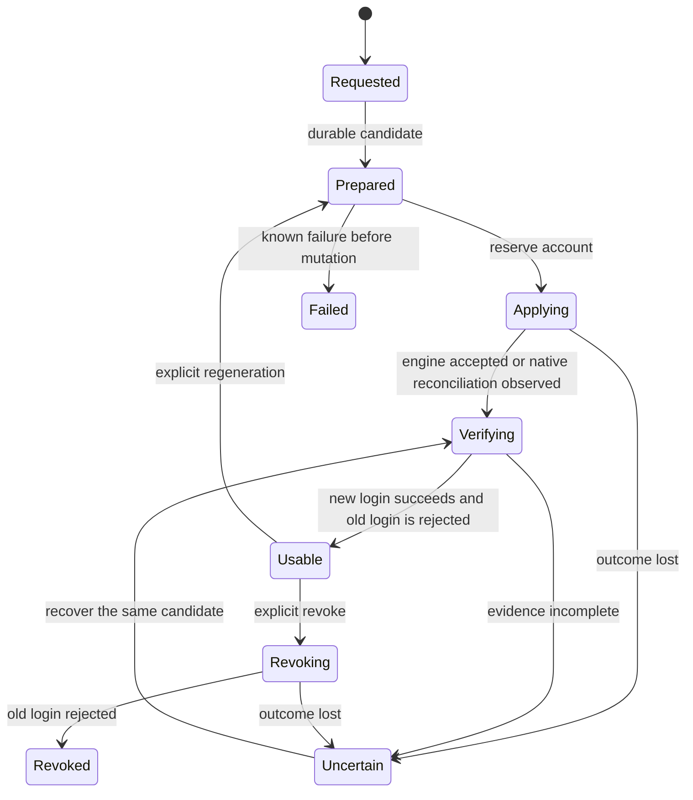

# User secrets API and managed credential lifecycle

- **Title:** `User secrets API and managed credential lifecycle`
- **Author(s):** `@myasnikovdaniil`
- **Date:** `2026-09-08`
- **Status:** Draft

## Overview

A deployment whose security policy requires generated managed-service passwords, one-time disclosure, role-based access, and attributable audit needs those properties in the API. Today a generated password is readable as many times as anyone likes, through four independent routes, and hiding the reveal button in the dashboard changes none of them. This proposal adds metadata-only credential discovery, an explicit one-time collection operation, a private path for secrets the tenant brings in, and regeneration whose completion is verified against the engine.

The platform keeps protected material for service operation and for delivery to authorized workloads. One-time disclosure bounds what tenant-facing interfaces hand out; it does not claim the platform cannot recover a password or that a recipient forgets it. Phase 1 delivers the generated-credential API with an initial set of adapters, proposed as PostgreSQL and MariaDB user passwords, COSI-issued bucket keys, and delivery into the tenant's own managed Kubernetes cluster. Phase 2 adds private tenant-supplied inputs, with site-to-site VPN as the proposed first consumer. The application grouping is open for reviewer alternatives. The mechanism-level specification lives in [details.md](./details.md); this document is the contract to review.

## Scope and related proposals

**Supersedes [cozystack/community#72](https://github.com/cozystack/community/pull/72).** Ownership of `<release>-credentials` and rotation mechanics cannot be decided in two proposals, so this one takes credential ownership, rotation execution, bootstrap, privileged maintenance, and ownership migration. It builds on @scooby87's analysis and on the failure cases collected in [the original discussion](https://github.com/cozystack/community/issues/71). When this proposal enters review, its author asks the maintainers to link it from #72 and close that pull request as superseded, keeping its discussion.

- [SecretRef](https://github.com/cozystack/community/pull/37) keeps the application reference syntax and per-engine conversion. This proposal supplies what it lacks: the private write path, supplier visibility, use authorization, ownership, and the disclosure contract. Its indefinite inline compatibility cannot apply under the strict policy defined here.
- [PostgreSQL/MariaDB password cleanup](https://github.com/cozystack/cozystack/pull/4078) remains the dependency for removing inline password fields. Removing SQL literals does not remove chart-rendered Secrets from release history; that change belongs here.
- [API v1](https://github.com/cozystack/community/pull/73) must carry the reference and removed-field changes in its schema transition, so an older client cannot silently drop a reference and trigger generation.
- [Unified TLS/PKI](../unified-tls-pki/README.md) keeps certificate issuance and trust management. This proposal classifies public trust and private key material and restricts disclosure; Kubernetes application and identity maintainers keep responsibility for certificate-bearing kubeconfigs and service-account tokens.
- [Tenant site connectivity](../tenant-site-connectivity/README.md) consumes private peer credentials. [ComputePlane](../compute-plane/README.md) is a future consumer of cross-cluster delivery.
- Vault, External Secrets Operator, and external issuers may later supply material or receive authorized exports. The initial implementation stores and delivers locally, but it represents external authority and rejects conflicting writers so that later integration does not change credential identity or weaken disclosure.

## Decisions

<!-- Left empty in the initial PR, per ../README.md#decision-records. Records live under ./decisions/, numbered from 0001, and are linked here newest first once an implementation choice is settled or changes. -->

## Context

Baseline: [cozystack at 67b4e23ca](https://github.com/cozystack/cozystack/commit/67b4e23ca23cb15083bc3c14985bb2e326112be4). Pending proposals and pull requests above are dependencies, not shipped behavior.

- Applications are virtual views of HelmReleases; their spec becomes Helm values and is returned unredacted, so an inline password is readable by anyone who can read the application. There is no application UID to owner-reference.
- The `tenantsecrets` projection returns whole Secret `data`. The registry implements create, update, and delete, but no tenant role has those verbs, and a write stamps the outward-projection marker, so enabling writes as they are would publish private inputs.
- Every application chart grants `get/list/watch` on its raw credentials Secret by name to `use`-tier groups, the tenant ServiceAccount, and the ServiceAccounts of every ancestor tenant. Removing the projection alone leaves this route open, and the reverse.
- Chart-rendered Secrets stay in Helm release history for `MaxHistory` revisions, so a chart-side regeneration cannot retire the old bytes. `lookup` plus random generation is render-time behavior, not an observed dependency.
- The dashboard list already transfers Secret data before the reveal button is pressed.
- Cozystack configures no audit pipeline. Talos ships a default node-local Metadata-level kube-apiserver audit log ([default policy](https://github.com/siderolabs/talos/blob/main/pkg/machinery/config/types/k8s/audit_policy.go)); nothing collects it, and other distributions have none.

### The problem

A viewer learns an inline password from application discovery. A user denied a second dashboard reveal fetches the same Secret through the raw grant. A private input written through the existing registry becomes a projected output. An audit record saying that a backend read a Secret cannot say which person asked or whether the replacement became usable.

Rotation also has to handle disagreement between engine state and published state. For example, a database can accept password B while the platform still advertises A if the executor fails before recording completion. This is a failure scenario the design must handle, not a claim that this sequence has been reproduced in the current implementation. The controller must persist B as a candidate before applying it, suspend collection during the change, and publish B as active only after checking new and old authentication. Recovery verifies the same saved candidate instead of generating another password. [Generation and activation](#generation-and-activation) defines that sequence.

These are separate failures. A successful rotation invalidates the old password even while historical bytes remain recoverable; erasing history and terminating sessions are further operations, not the same one.

## Goals

- Discover an authorized account, its endpoint, database, public trust, capabilities, and lifecycle state without transferring protected material.
- Privately create, find, replace, authorize, and delete an externally determined secret, and consume it in a real service without a plaintext field in the service spec.
- Generate and regenerate per account, preserve grants, and establish that the new credential works and the old one is rejected before reporting completion.
- Permit at most one tenant-facing collection of each generated version, across concurrent clients, retries, backend delegation, and component restarts.
- Deliver credentials repeatedly only to approved destinations, with an explicit custody boundary and observable delivery state.
- Export attributable, secret-free audit evidence and offer subscriptions to service operation history.
- Preserve authentication through supported upgrades, prevent stale operations from restoring revoked material, and gate restore readiness on destination authentication.
- Report supported operations per service through API capabilities, backed by adapter acceptance tests; reject unsupported operations before mutating an engine.

### Non-goals

The first release does not provide an enterprise vault, arbitrary secret sharing, scheduled rotation, dynamic database leases, delivery to VM guests or to other tenants' clusters or to external stores, automatic restarts of arbitrary workloads, universal zero-downtime replacement, or automatic session termination. Grants and ACLs stay engine-specific, but regeneration must preserve them.

It does not erase recipients' copies, clean every historical backup, protect runtime plaintext from host and control-plane administrators, or rotate every system identity. None of that permits protected bytes in new logs, broadly readable specs, or tenant-facing projections. Unsupported classes stay visible in the coverage table and are excluded from any compliance claim.

Encryption at rest for etcd resources and snapshots, storage encryption, and encryption-key management are outside this proposal. They are independent infrastructure controls, such as Kubernetes [encryption at rest](https://kubernetes.io/docs/tasks/administer-cluster/encrypt-data/), and do not change this API's contract. Internal Secrets being described as protected means access and disclosure are restricted; it does not mean this API encrypts their stored bytes or verifies the installation's encryption configuration.

## Design

### Proposed choices

These are the choices proposed for review, not claims of approval or of completed implementation. Reviewers are asked to approve the behavioral contract, the invariants, and the existence and purpose of the public surfaces. API names, wire shapes, HTTP mappings, numeric limits, and storage topology are provisional defaults, collected in [details.md](./details.md#operating-limits); changing them must preserve the failure semantics defined here.

| Question | Proposed answer | Why |
|---|---|---|
| Ownership | A credential controller owns platform-generated bytes outside Helm. Native issuers keep ownership of their outputs; the controller owns lifecycle records and required delivery copies. | A template cannot keep rendered bytes out of its stored manifest. [Storage](./details.md#identity-storage-and-writers), [handoff](./details.md#ownership-handoff). |
| One-time disclosure | One collection entitlement per generated account version, shared across all authorized recipients, exercisable within a policy-defined window after activation (default 24 hours). Discovery never contains protected fields. | Delayed collection is how creation-time disclosure completes for asynchronous issuers and headless creation; the window is a policy default, not a hidden timer. |
| Lost or concurrent collection | Consume durably before sending bytes. One concurrent winner; a lost response after consumption requires regeneration. No replay, no acknowledgment window. | The API can allow at most one response attempt containing the credential; it cannot prove that a person received it after a connection failure. |
| Read paths | Remove protected material from application representations, the legacy projection, raw dashboard grants, and future Helm renders. Classify and restrict historical copies separately. | Every effective route must obey the policy. [Security](#security). |
| Rights and hierarchy | Separate discovery, supply, use, collection, regeneration, and delegation. Declaring an application's accounts carries the authority to request their initial generation and to bind them to destinations the same identity manages; collection is a separate grant. No implicit ancestor credential authority. Organization policy caps all grants. | Provisioning must keep working for administrators and GitOps automation without handing them the bytes. [Authorization](#authorization). |
| Audit | Durable lifecycle evidence plus Metadata-level API audit; structured events exported through ordinary log collectors; authorized service-history subscriptions. Sensitive operations fail closed only when local durable evidence cannot be recorded; export lag alerts but does not block. | API access records alone cannot prove engine activation or name the user behind a backend; a remote SIEM outage must not stop containment or running workloads. |
| Coverage | Phase 1: generated-credential API, proposed PostgreSQL/MariaDB and COSI adapters, and delivery into the tenant's managed Kubernetes cluster. Phase 2: private inputs, initially for site-to-site VPN. Later application groups remain proposals for review. | Each included adapter must prove its own authentication and disclosure guarantees; reviewers may propose a different application grouping. |
| Compatibility | Strict is the default for new installations for every converted adapter; unconverted services remain installable in reported `Legacy` mode unless the deployment sets `strictOnly`. Existing installations get a finite migration window per converted adapter, then explicit regeneration before strict attestation. | Previously exposed bytes cannot become undisclosed by changing a label; a deadline cannot precede the adapter it depends on. [Compatibility](#upgrade-and-rollback-compatibility). |

### Model

Five public surfaces in `core.cozystack.io`, served by the aggregated API server: `Credential` (metadata and lifecycle state of one engine account), `CredentialOperation` (an immutable request with safe outcomes), a new write-only version of `TenantSecret` (tenant-supplied inputs, phase 2), `CredentialBinding` (an approved delivery relationship), and `CredentialEvent` (durable, authorized history). These are API abstractions over persistent internal storage, not direct tenant access to the storage objects. The aggregated server implements authorization, filtered representations, and operations such as `collect`; aggregation itself does not imply transient storage.

The internal `CredentialRecord` and, in phase 2, `CredentialInputRecord` are Kubernetes custom resources defined by CRDs and persisted through kube-apiserver in etcd. They have real UIDs and live in a platform namespace, bound to the tenant namespace UID, the HelmRelease UID, and a server-assigned account incarnation, because virtual applications cannot be owner-referenced. Records hold state and an audit outbox and never hold material or material-derived fingerprints. Separate protected Kubernetes Secrets persist immutable candidate and version bundles. This state survives API-server and controller restarts. A Secret that disappears while its record survives is `MaterialMissing`, never evidence of a fresh install. Where an operator needs a fixed Secret name, the controller maintains a private adapter Secret in that layout; `<release>-credentials` may stay as such a destination after handoff but is no longer the public identity of anything.

Each kind of material has exactly one byte writer: the controller for generated passwords, the native issuer for COSI keys, the supplier for inputs, the existing operator or a designated internal controller for maintenance identities such as the CNPG superuser and MariaDB root, and the existing projection controllers for public CA and endpoints. The controller is a trusted component with fleet-wide material access; per-namespace RoleBindings on one identity do not partition its compromise, and the design says so instead of claiming isolation.

Discovery is metadata only:

```yaml
apiVersion: core.cozystack.io/v1alpha2
kind: Credential
metadata:
  name: cr-7c39
  namespace: tenant-example
spec:
  application: {kind: Postgres, name: orders}
  account: app
  credentialClass: password
  source: Generated
status:
  phase: Usable
  activeVersion: cv-91ae
  collection: Available
  connection: {host: orders-rw.tenant-example.svc, port: 5432, username: app, database: orders, trustRef: orders.tenant-ca}
  capabilities: {collect: true, regenerate: true, revoke: true, deliverLocal: true, terminateSessions: false}
```

| Interface | Semantics |
|---|---|
| `GET/LIST/WATCH credentials` | Filtered metadata and public connection data. Never consumes collection. |
| `POST credentialoperations` | `Generate`, `Regenerate`, `Revoke`, or another supported lifecycle request. Returns an operation, never bytes. |
| `POST credentials/{name}/collect` | Explicit collection with credential UID, expected version, and request ID. Returns the bundle only on the winning attempt. |
| `POST/PUT/PATCH/DELETE tenantsecrets` | Private input management with metadata-only responses, including on write. No readback. |
| `POST/PUT/DELETE credentialbindings` | Register or remove an approved source-to-destination delivery. No bytes in request or response. |
| `GET/LIST/WATCH credentialevents` | Durable, authorized service history with a resumable cursor. No protected fields. |

Operations are immutable, idempotent on a client request ID, and require an expected-version precondition. Declaring accounts on application creation is admitted as one batch generation request, recorded with the initiating identity; editing unrelated options, dry-run, rendering, and GitOps reapply never generate. There is no counter in application values that triggers rotation. Wire details and error mapping are in [details.md](./details.md#public-api-and-request-semantics).

### One-time collection

The entitlement is one protected response attempt per generated version of one account, shared across recipients and every client. A key pair or a password plus its derived connection file is one bundle, and collection needs authority for the whole bundle; insufficient authority is denied without consuming anything. Creation and regeneration return metadata immediately; once activation is verified the version becomes collectible for the policy window, default 24 hours, because issuers such as COSI complete asynchronously and headless creation has no browser waiting. Expiry leaves the credential usable by its workloads and uncollectible by people; the way back is an authorized regeneration.

The handler authorizes, preloads the bundle without returning it, then flips the version's entitlement from `Available` to `Consumed` with a conditional update that writes the `CollectionCommitted` event in the same object update, and sends bytes only if that write succeeded. Two callers produce one winner. A crash before commitment leaves the entitlement available; a crash, proxy failure, or closed tab after commitment spends it, and the audit records the release commitment without claiming receipt. Even a client acknowledgment can be lost: replay after that loss could disclose the same version twice. Copy and download reuse the buffer already in the client's view; nothing refetches. Transport and client rules are in [details.md](./details.md#one-time-collection).

### Private inputs

Phase 2 adds the new `TenantSecret` version as a supplier-owned metadata object with a write-only `data` request shape: `POST` and `PUT` accept material and return metadata, every read omits it, replacement is whole-bundle under UID and resource-version preconditions. The server replaces today's automatic outward marker with its own private classification, honored by lineage admission even when an `ApplicationDefinition` selector matches, and excludes private objects from the legacy projection in every served version. Supply, registration, and old-version filtering ship before any write RBAC is enabled. Phase 1 still closes repeatable read paths for its generated credentials; postponing private input writes does not postpone that protection.

Application references keep the syntax from [#37](https://github.com/cozystack/community/pull/37). Authorization resolves the name to the registered input UID and binds its declared keys and purpose to the consuming application; a missing input stays pending and never binds to an unrelated supplier's later object. The supplier can find, replace, share for an approved purpose, and retire the input without reading it back; deleting a consumer leaves shared input intact. Strict policy requires generation for locally managed service passwords and admits externally determined secrets as private inputs: peer PSKs, BGP MD5, replication logins, external S3 keys, SMTP, OIDC confidential configuration, third-party tokens. It does not admit importing a chosen password as a local account or switching a managed account to supplied mode. The proposed first live input case is a site-to-site VPN peer credential, with local adoption and peer authentication reported separately. External PostgreSQL replication authentication is a later consumer example, not an initial acceptance dependency. Details in [details.md](./details.md#private-input-supply-and-secretref).

### Authorization

Kubernetes RBAC is additive, so the aggregated API checks both the verb and a server-controlled account or input grant under the effective policy. Policy is a ceiling: platform restrictions apply first, ancestors may tighten, children cannot loosen.

The table combines existing tenant roles, automation identities, and scoped grants; it does not introduce a new role for every row. For example, an account grant can let an operator regenerate `orders/app` without collecting it, a supplier grant can let a network engineer replace one peer PSK without reading it back, and a workload can consume a delivered Secret without permission to call `collect`.

| Effective authority | Metadata and public connection data | Supply own input | Authorize delivery | Collect | Generate, regenerate, revoke | Delegate | History |
|---|---|---|---|---|---|---|---|
| `view` | Authorized apps | No | No | No | No | No | Sanitized outcomes |
| `use` | Authorized apps | No by default | No by default | No by default | No by default | No | Sanitized outcomes |
| Local `admin` / `super-admin` | Local apps | Yes | Within approved destinations | Tenant-facing accounts | Supported tenant accounts | Local grants; may tighten policy | Detailed local events |
| Tenant automation identity (tenant ServiceAccount, GitOps) | Local apps | Yes, write-only | From its applications to destinations it manages | No | Initial generation for accounts it declares; regenerate and revoke on local apps | No | Detailed local events |
| Explicit account grant | Named account | Separate supplier grant | Named source and destination | If granted | Each operation separately | No | Granted scope |
| Supplier grant | Own input and its dependencies | Yes, write-only | Declared consumers if granted | No | Replace own input only | No | Own input events |
| Workload identity | Binding metadata | No | No | No | No | No | Delivery acknowledgment |
| Parent administrator | Provisioning metadata permitted by hierarchy | No implicit child right | No implicit child right | No implicit child right | No implicit child right | Tighten child policy only | Provisioning outcomes; child detail requires delegation |

No tenant tier includes internal database root, maintenance superuser, system backup, CA private-key, or platform identity material. Administrative access to a managed Kubernetes cluster owned by the tenant is a separate tenant-facing credential class, described under [Engines](#engines). Support access in a child is time-limited, explicitly delegated, audited, and still cannot reopen a spent entitlement. An external API consumer acting through a backend forwards the validated end-user identity through restricted impersonation or an audience-bound delegation token. Both actors are recorded, and the upstream commitment spends the entitlement even if the backend-to-client hop fails. Revocation of a grant stops new admission immediately and ends admitted response attempts and watches within a stated bound. Delegation transport and bounds are in [details.md](./details.md#authorization-and-delegation).

### Delivery

Tenants cannot run pods in their own namespace; their workloads live in managed Kubernetes clusters and VMs. `CredentialBinding` ties a source record, account fields, and a destination handle to one purpose, and creating it needs source-use authority plus edit authority on the destination. The first adapter delivers into a namespace of a managed Kubernetes cluster owned by the same tenant, writing a fixed-layout Secret through the admin kubeconfig the platform already holds for remote Flux apply, so no new trust path appears. Consumption by another managed application in the same namespace through its SecretRef is the second form where the consumer adapter exists. Delivery follows the active version, records `deliveredVersion`, and records `adoptedVersion` only when a consumer can be verified; otherwise adoption is `Unknown`. Regeneration completion describes source authentication, not consumer adoption. A person who can change a consuming image, exec into its process, or administer its VM is trusted with its runtime material, and the design says so rather than calling that delivery secret from them. Custody rules are in [details.md](./details.md#workload-delivery-and-custody).

### Generation and activation

Passwords come from the operating system CSPRNG with unbiased selection, at least 32 alphanumeric characters for the first database adapters; issuer-generated keys follow the pinned issuer's documented policy. Version identifiers are random and unrelated to material.



The controller reserves the account, persists the candidate once, applies it, and verifies with a fresh authenticated connection that the new credential works and the old one is rejected against the same account and endpoint; a timeout is not rejection. Only after verification does one conditional update publish the new version, retire the old collection right, open the new entitlement, and append the completion event. For a single-password engine there is an interval after engine acceptance during which the old credential no longer works and the new one is not yet collectible; the account reports `Applying`, `Verifying`, or `Uncertain` during it instead of advertising a usable old value. If acceptance happens but the outcome is lost, the same candidate is retried; the controller never generates a third value or reasserts an older baseline. Mutations are serialized per account and per engine instance, and a Job TTL or an expired Lease is not proof that an old SQL session cannot still execute. Fencing, timing targets, and recovery are in [details.md](./details.md#generation-activation-and-regeneration).

### Engines

**PostgreSQL.** A short-lived applier Job becomes the only writer of managed-user passwords, for fresh bootstrap and for the backup controller's restore path alike; the init path keeps role existence and grants but no longer sets passwords or re-asserts `LOGIN`, so a standalone revoke is `ALTER ROLE ... NOLOGIN` that survives an unchanged chart reapply.

**MariaDB.** The native `User.passwordSecretKeyRef` path stays and the operator remains the sole password applier; the controller writes the private input Secret and verifies independently. Revoke locks the account (`ALTER USER ... ACCOUNT LOCK`) under the internal root, an attribute the operator does not reconcile, so reapply and operator restart leave it locked; verified against the pinned operator before the capability is enabled. The bootstrap root credential exists before the database resource is released to the operator. Maintenance root and the CNPG superuser stay internal and unrotated in the first wave.

**Bucket (COSI).** The issuer creates the pair and the platform records it. Regeneration requests a replacement with the same rights, validates it with a permitted storage operation, requests revocation of the previous issuance, and proves its rejection; if the pinned driver cannot do that, the row is unavailable for strict collection.

**Managed Kubernetes.** The owning tenant retains administrative access to its cluster. An OIDC exec-only kubeconfig contains public connection instructions and remains repeatedly available to authorized users. An admin kubeconfig containing a private key or token belongs to the tenant-facing credential lifecycle: one collection per generated version, regeneration, and verified loss of access with the old credential. This adapter can ship after phase 1. Issuing a new client certificate alone does not invalidate the old one; replacement and revocation need an explicit mechanism before strict support is enabled. This proposal does not require OIDC or reject `oidc.mode: None`. Existing admin access remains explicitly `Legacy` until its adapter and migration are ready, or the installation declines that unsupported class under `strictOnly`; converting database credentials does not remove cluster ownership rights. Platform delivery access must remain usable through tenant credential replacement. The mechanism and its evidence are open in [details.md](./details.md#engine-execution-and-bootstrap).

### Coverage

The proposed phase 1 rows are PostgreSQL and MariaDB managed users, COSI bucket key pairs, and delivery into a namespace of the tenant's managed Kubernetes cluster. Phase 2 introduces write-only tenant-supplied secrets, with site-to-site VPN as its proposed first consumer, and proposes converting RabbitMQ, MongoDB, Redis/Valkey, and ClickHouse users. Kafka users and topic rights are proposed for phase 3, since the current chart has no user or SASL surface at all. NATS, OpenSearch, Qdrant, managed VPN service accounts, Harbor, and Grafana follow per adapter once nested values, derived URIs, internal users, and real rotation are covered. These application groups are an initial proposal: reviewers are invited to suggest a different distribution based on priorities and adapter dependencies.

Public CA, endpoints, and the OIDC exec-only kubeconfig stay repeatable public projections. Tenant-facing admin kubeconfigs and access tokens require one-time collection and verified regeneration/revocation through their own adapter, which is not a phase 1 requirement. Platform-internal tokens remain internal. TLS and CA private keys, Talos secrets, system backup credentials, and restic decryption keys stay internal with their current owners, and password rotation must never erase a decryption key a backup still needs. VM cloud-init and SSH private input are deferred while userData round-trips through the application spec.

An absent adapter reports its capabilities as false and rejects mutation before staging material; each phase is complete only when all rows agreed for that phase pass. Out-of-tree catalogs declare their credential classes, exposed fields, writer, issuer, and supported operations in an adapter descriptor the platform administrator approves; a chart label cannot authorize disclosure. The per-row evidence table and conformance rules are in [details.md](./details.md#coverage-and-conformance).

### Audit

Every lifecycle transition writes a durable event into the record's transactional outbox in the same update as the state change; an exporter copies entries to an append-only journal, and the public `credentialevents` API filters that journal by authorization. The event catalog is closed (supply, generation, discovery, collection, delivery, regeneration stages, revocation, deletion, policy change, import, restore) with accepted, completed, denied, failed, and uncertain outcomes. Every issuance, collection, regeneration, revocation, and delivery is recorded. Events carry initiator and executor, tenant, application and account UIDs, version, operation, action, outcome, and reason code, and exclude bodies, hashes, tokens, connection strings, and free text. The exporter writes newline-delimited JSON to a log stream an ordinary collector ships to the SIEM with a persistent cursor and replay from the journal; a notification bridge sends structured, secret-free summaries to configured destinations, and `WATCH credentialevents` gives authorized subscribers a resumable feed of `RegenerateAccepted`, `ActivationVerified`, `RegenerateCompleted`, and per-account failures under one correlation ID.

Sampling means retaining only some event occurrences; it never means recording secret contents. Sampling or aggregation of repetitive discovery traffic is an optional optimization for review, not required controller logic. An external collector or journal may apply it to a downstream analytical view while preserving the complete required lifecycle audit trail. The initial controller and authoritative journal need no sampling mechanism.

Export lag alerts and never blocks by itself. Admission fails closed with `503 AuditUnavailable` only when the local journal cannot accept a write or its buffer reaches the reserved threshold; in that case supply and collection are refused first while revocation and delivery to bound destinations keep a reserved share. Once an engine mutation has started, recording its outcome takes priority over new work. Schema, retention, and thresholds are in [details.md](./details.md#audit-service-history-and-export).

## User-facing changes

The service credentials tab lists accounts and public connection data, shows generation progress, then a **Collect credential** action with a warning that a lost response means regeneration, then **Regenerate** for those allowed to. It never fetches bytes to render a masked list. CLI and external API consumers follow the same create, poll, collect sequence, and regeneration reports per-account progress that distinguishes engine activation from consumer adoption. A viewer gets connection metadata and sanitized history with no generation, collection, or delivery route. In phase 2, private inputs appear in their supplier's inventory with dependencies and validation status, with replace and retire actions and no readback.

A tenant provisioning through GitOps with its ServiceAccount keeps working without a human: declaring accounts requests generation, a binding delivers them into a namespace of the tenant's cluster, and only human collection needs an administrator or an account grant. OIDC exec-only kubeconfigs remain repeatedly downloadable; once the admin credential adapter is supported, an authorized owner collects its kubeconfig once and saves it, or requests regeneration after losing it. Old clients get metadata or a clear unsupported error on converted protected routes, never compatibility plaintext. Terraform providers move from password outputs to credential references and bindings.

## Upgrade and rollback compatibility

Existing-installation handoff has two ordered migration stages, A (prepare) and B (handoff); these are separate from the feature phases in [Rollout](#rollout) and apply per converted adapter. In A the API, records, audit pipeline, admission guards, and migrated clients are installed; charts stay the sole writers and pin existing credential Secrets with `helm.sh/resource-policy: keep`, and a checkpoint verifies the stored Helm revision carries it. In B charts stop rendering material-bearing Secrets, the coordinator confirms the Secret was orphaned rather than pruned and that Helm released `managedFields` ownership, and only then the controller adopts the bytes without changing a password. Generated bundles then leave `ApplicationDefinition` exposure and per-release raw roles, imported versions are marked `PreviouslyExposed` with collection unavailable, and an authorized regeneration creates the first strict version. A direct pre-A to B upgrade is rejected, and an unexpected deletion fails the migration with preserved material rather than triggering generation.

Strict is the default for new installations for every converted adapter; unconverted services install as reported `Legacy` unless the deployment sets `strictOnly`. Existing installations stay `Legacy` through A and B, and the deadline is per adapter: the minor release after the one that ships a service's adapter blocks upgrades for tenants still holding legacy credentials in that service. Future strict material never enters Helm history; existing revisions, etcd snapshots, Terraform state, and recipient copies are historical custody, restricted and replaced by regeneration before a strict claim.

Restore runs into an isolated destination with fresh generated material. PostgreSQL restore sets destination passwords through the normal applier and verifies before publishing, including with the source cluster unavailable; MariaDB logical restore imports data without privilege tables, and physical restore is rejected until an adapter proves isolation. One-time and revocation guarantees survive restarts and supported upgrades but not restoration of an old control-plane snapshot, which is an explicit offline recovery procedure. The transition matrix, handoff checks, deletion, and restore rules are in [details.md](./details.md#upgrade-and-rollback-compatibility).

## Security

| Exposure path | Closure in strict mode | Evidence |
|---|---|---|
| Application spec and derived representations | Confidential fields rejected or removed in every version, including nested Helm values, restore serialization, errors, NOTES, and connection strings; public endpoints and CA stay readable. | Every write and read path exercised with synthetic protected values. |
| TenantSecret projection | Generated, mixed, internal, and private-input material excluded in every served version; no selector, ownerless label, added key, or write response exposes bytes. | Registry and admission integration tests, old-version requests, orphan supply, catalog upgrades. |
| Raw per-release Secret grants | Protected `resourceNames` and equivalent grants removed for tenant and ancestor groups and ServiceAccounts; workload and privileged-template access restricted. | Effective-principal tests against raw reads, mount and exec routes, copied labels, name reuse, parent and sibling identities. |
| Helm release history and retained artifacts | Generation and writes outside render; only references rendered; legacy history restricted and exposed credentials replaced. | Real retained revisions through A and B, artifact scans, separate new and old authentication tests. |

Not every credential traverses all four paths today; they are exposure classes across the catalog, and closing them needs the API, charts, roles, admission, clients, and operators together. The trust boundary is stated rather than wished away: the credential controller, native issuers, nodes, cluster administrators, and whoever controls a consuming workload are inside it; tenants, their other members, and their ancestors are outside. Supplier input is never a general credential oracle, because source use is checked before a privileged component contacts an endpoint and destinations are bound to UIDs and purposes. Details in [details.md](./details.md#security).

## Failure and edge cases

The rules that shape the design, with the full table in [details.md](./details.md#failure-and-edge-cases):

- A missing or invalid input never produces a substitute value; bootstrap blocks and recovers when the input arrives.
- A denied or guessed collection changes nothing and does not confirm existence; two concurrent collectors produce one winner and no replay.
- A crash after engine acceptance keeps the same candidate, blocks collection until verified, and never produces a third value.
- A batch reports per account; an expired Lease or deleted Job is not database fencing; a DBA's direct change is drift, reconciled only under a recorded operation.
- A disappearing Secret is `MaterialMissing`, never a fresh install; a reused name is a new incarnation with new grants; an unsupported restore or skipped handoff is rejected before mutation.
- Export lag alerts; admission fails closed only when local evidence cannot be recorded, with containment and bound delivery reserved.

## Testing

An acceptance plan, not executed evidence. Phase 1 API-level suites run against a real API server, admission, RBAC, clients, and a collector: foreign-secret isolation, one-time accounting under real storage concurrency, schema and artifact scans, roles and delegation including forged initiators, GitOps and Terraform convergence without payload state, and audit export into a test sink on each supported distribution. Live suites use pinned engines for every generated-credential adapter agreed for the phase: collect once, deny every repeat route, regenerate, prove the new credential works and the old is rejected, then repeat through an external backend with delegated user identity and through headless creation. They also cover bootstrap dependencies, recovery after lost outcomes, and delivery into a managed cluster. Phase 2 adds private `TenantSecret` write tests and live authentication with a site-to-site peer, including delayed input and replacement. Each later adapter has the same evidence obligation; no operator condition or successful Secret write substitutes for protocol authentication and old-credential rejection. Upgrade and restore suites run real A and B upgrades with active clients, rollback rejections, PostgreSQL and MariaDB logical restore with an unavailable source, and the whole-platform recovery barrier. The full matrix is in [details.md](./details.md#testing). Feature acceptance is the cross-product of enabled adapters, credential classes, roles, clients, the four exposure paths, and failure modes; passing PostgreSQL alone certifies nothing else.

## Rollout

1. **Proposal review.** API owners `@lllamnyp` and `@kvaps` review the proposed choices, scope, and authorization boundary; engine, storage, backup, client, and security maintainers review their evidence obligations.
2. **Phase 1: generated-credential API and initial adapters.** Persistent records, generation and verified regeneration/revocation, one-time collection, delivery bindings, policy, metadata clients, journal and export, admission guards, and closure of all effective repeatable read paths for converted credentials. Proposed adapters are PostgreSQL, MariaDB, the pinned COSI driver, and delivery into tenant-owned clusters, with their live suites and supported restore paths. Strict becomes the default for fresh conforming installs; existing installations use migration stages A and B before explicit strict activation. This phase does not enable the new private-input write API.
3. **Phase 2: tenant-provided secrets and additional adapters.** The write-only `TenantSecret` version, input records, supplier grants, private references, and filtering in every served version, enabled only after privacy tests pass. The proposed first consumer is site-to-site VPN; external PostgreSQL replication is a later candidate. RabbitMQ, MongoDB, Redis/Valkey, and ClickHouse are proposed for this phase, each with its own adapter and live acceptance.
4. **Migration deadline per adapter.** The minor release following an adapter's release blocks upgrades with unfinished legacy credentials in that service; services without an adapter stay reported as `Legacy`. This rule applies independently of the feature phase.
5. **Further coverage.** Kafka users and ACLs are proposed for phase 3. Tenant-facing admin kubeconfigs and tokens follow once replacement and revocation are proven, without a phase 1 dependency. Additional services, external stores, VM and remote delivery each close their listed dependencies first.

The application distribution across phases is a proposal, not a final commitment; reviewers are invited to suggest alternatives. Proposal acceptance settles the contract and agreed scope; feature acceptance needs evidence for every row included in that scope. Changes to settled guarantees or scope revise this proposal and get a decision record.

## Open questions

The contract is proposed for review. Application phasing and the following implementation choices or evidence remain open, with the relevant maintainers owning each dependency.

- MariaDB missing-input, native reconcile, and `ACCOUNT LOCK` behavior against the pinned operator; failure blocks that first-wave row.
- COSI replacement and revocation support in the pinned driver; absence blocks completion of the first wave.
- Application distribution across phases: the listed groups are an initial proposal, and reviewers should propose different groupings where priorities or dependencies warrant them.
- PostgreSQL restore maintenance authority with the source unavailable; the proposed phase 2 VPN consumer's private configuration, peer authentication, and replacement evidence.
- Tenant admin kubeconfig issuance, regeneration, and loss of old-credential access, including continuity of platform delivery credentials; the Kubernetes/identity adapter must prove this before strict support, in a phase agreed with reviewers.
- External API consumers' delegated identity transport, tested against effective principals before enabling delegated collection.
- Whether discovery-event sampling or aggregation is useful and where it belongs. An external collector or journal can handle analytical sampling; controller-side sampling is optional and must preserve required lifecycle evidence.
- Runtime capability isolation and audit capacity per supported distribution before strict activation there.
- Exact A and B release numbers; B does not ship without a successful pinned handoff test.

## Alternatives considered

**Keep generation in Helm or in a template helper.** Rendered material still enters release history and `lookup` is still not a dependency.

**Return values only from create and regenerate, or allow replay until acknowledgment.** Inline results do not fit delayed issuers or unattended creation; replay releases the same bytes more than once. Consumption before response gives a precise loss behavior at the cost of regeneration after an uncertain response.

**Hide the dashboard button and keep raw reads for ServiceAccounts.** The same principal uses another client; bindings, policy, and a stated trust boundary are enforceable, client type is not.

**Enable the existing TenantSecret write verbs unchanged.** They stamp the outward marker and return data; a separate input API is viable but leaves two tenant secret surfaces.

**SQL Jobs for every engine.** Removing MariaDB's native reference creates a bootstrap gap and two writers, as [#71](https://github.com/cozystack/community/issues/71) worked through; Jobs are used only where an engine has no observable path.

**Keep repeatable reads as the permanent default, or require Vault.** The first leaves the problem unsolved; the second does not remove delivering bytes to password-consuming engines. The longer list, including the rejected audit and root-rotation variants, is in [details.md](./details.md#alternatives-considered).
