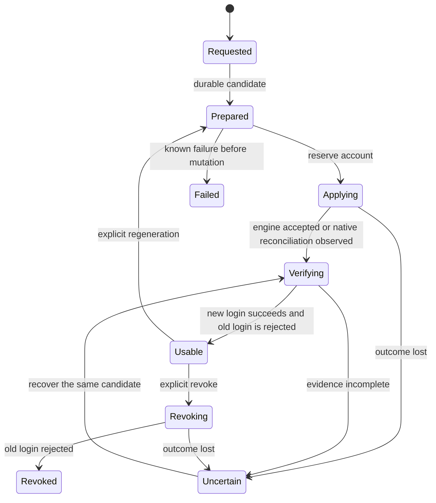

# User secrets API: detailed specification

This file backs [README.md](./README.md), which carries the proposal itself: the problem, the proposed choices, the authorization model, coverage, compatibility, and the acceptance plan. Read that first. What follows is the mechanism-level specification the README links to. Everything here is under the same review; numbers and names are proposed defaults unless the README says otherwise.

### Identity, storage, and writers

Add a versioned API in `core.cozystack.io`, served by the aggregated API server. Public `Credential` resources contain metadata and lifecycle state; public `CredentialOperation` resources contain immutable requests and safe outcomes. Private input management is a new `TenantSecret` version introduced in feature phase 2. The shapes below describe the target API across phases and use `v1alpha2` to distinguish the changed TenantSecret contract; this is a proposed API version, not an existing endpoint. The public API provides authorized abstractions over persistent internal objects; aggregation does not make their state ephemeral.

Persist an internal `CredentialRecord` CR per account and, in phase 2, a `CredentialInputRecord` per supplier input. These are CRD-backed Kubernetes objects stored by kube-apiserver in etcd, with durable state across aggregated-server and controller restarts. They live in a platform-controlled namespace, have real UIDs, and are inaccessible through tenant raw APIs. Bind a record to the tenant namespace UID, backing HelmRelease UID, and a server-assigned account incarnation. Do not owner-reference a virtual application. Removing and later re-adding an engine username creates a new account incarnation; cosmetic display-name changes do not. Kubernetes names are derived from opaque IDs, never lossy username normalization.

The credential record holds policy revision, active and candidate version IDs, operation ordering, collection state, and a bounded transactional audit outbox. It contains no material or material-derived fingerprints. Protected Secrets store immutable candidate/version bundles, linked to record UID and random version ID. Canonical generated versions live with the platform records; native adapter copies and SecretRef inputs live in the consumer's tenant namespace. Cross-namespace relationships use explicit UID mappings and controller finalization, never invalid cross-namespace owner references. The controller creates a candidate once before any engine mutation; recovery reuses it. Losing material while its record survives is `MaterialMissing`, not evidence of a fresh install.

For an operator that requires a stable Secret name, the controller maintains a private adapter Secret with the exact required layout. Existing `<release>-credentials` names may remain internal compatibility destinations after handoff; they are not the public credential identity. Their `data` has one writer. New grants target an account record and explicit fields, never all keys of that bundle. Maintenance credentials are separated from tenant-user records and eventually from legacy mixed bundles.

| Material | Byte writer | Engine authority | Deletion authority |
|---|---|---|---|
| Generated PostgreSQL/MariaDB user password | Credential controller | PostgreSQL applier / MariaDB operator | Account lifecycle controller after verified account removal |
| COSI-issued access/secret pair | Native issuer; controller may maintain an immutable snapshot and delivery copy | COSI driver and storage issuer | Issuer revokes; controller removes its own copies |
| Supplier input | Supplier through the private write API, or one explicitly registered external source | External peer/issuer | Supplier; deleting a consumer does not delete input |
| CNPG superuser, MariaDB maintenance root, system backup credentials | Existing operator or designated internal controller, declared per adapter | Respective engine maintainer | Separate internal lifecycle, never generic tenant deletion |
| Public CA and endpoint data | Existing projection/controller | PKI or service controller | Respective resource lifecycle |

The credential controller is a trusted component with fleet-wide material access. Per-namespace RoleBindings for one ServiceAccount do not partition its compromise scope. The initial design accepts that trust, uses a dedicated identity instead of extending a general controller, and limits each applier's material and target. Tenant-isolated controller instances are a possible later deployment option, not a security property claimed for the shared instance.

### Public API and request semantics

Discovery responses have no `data`, `stringData`, password hashes, secret-bearing URIs, or backing Secret locations. An example response is:

```yaml
apiVersion: core.cozystack.io/v1alpha2
kind: Credential
metadata:
  name: cr-7c39
  namespace: tenant-example
  uid: 784acc20-efec-49e0-8952-a3b305b6f741
spec:
  application: {kind: Postgres, name: orders}
  account: app
  credentialClass: password
  source: Generated
status:
  phase: Usable
  activeVersion: cv-91ae
  collection: Available
  connection:
    host: orders-rw.tenant-example.svc
    port: 5432
    username: app
    database: orders
    trustRef: orders.tenant-ca
  capabilities:
    collect: true
    regenerate: true
    revoke: true
    deliverLocal: true
    terminateSessions: false
```

The controller supplies application and account identity; callers cannot retarget an existing credential. Capability fields report the intersection of adapter support, current lifecycle state, policy, and caller authorization. Endpoints, usernames, database names, and public CA are non-secret within authorized application discovery. Input names, dependency relationships, and detailed failures are visible only to their supplier or explicitly authorized operators.

| Interface | Semantics |
|---|---|
| `GET/LIST/WATCH credentials` | Filtered metadata and public connection data. Never consumes collection. |
| `POST credentialoperations` | Submit `Generate`, `Regenerate`, `Revoke`, or a supported lifecycle request. Returns an operation, never generated bytes. |
| `GET/LIST/WATCH credentialoperations` | Authorized request and per-account outcomes. A batch snapshots account UIDs at acceptance. |
| `POST credentials/{name}/collect` | Explicit collection with credential UID, expected version, and request ID. Returns the authorized bundle only on the winning attempt. RBAC resource `credentials/collect`, verb `create`. |
| `POST/PUT/PATCH/DELETE tenantsecrets` | Private input management with filtered metadata responses, including on write. No input readback. |
| `POST/PUT/DELETE credentialbindings` | Register or remove an approved source-to-workload delivery relationship. No bytes in request or response. |
| `GET/LIST/WATCH credentialevents` | Durable, authorized service history and resumable subscription. No protected fields. |

An immutable operation carries `action`, target credential UID, expected active version, admission epoch, and a client-generated request ID. The server binds idempotency to tenant UID, authenticated initiator, request ID, and a canonical request digest. Reuse with different parameters returns `409 Conflict`; exact replay returns metadata for the same operation. Operation names and creation are reserved in storage before work starts. A durable record entry prevents replay from reissuing material after the public operation is compacted; once detailed results expire, replay returns `410 Gone` rather than executing again. For example:

```yaml
apiVersion: core.cozystack.io/v1alpha2
kind: CredentialOperation
metadata:
  name: rotate-orders-app-20260908
  namespace: tenant-example
spec:
  action: Regenerate
  credentialRef:
    name: cr-7c39
    uid: 784acc20-efec-49e0-8952-a3b305b6f741
  expectedActiveVersion: cv-91ae
  admissionEpoch: ae-64fa
  requestID: 45d2fa1c-b3c0-4d75-a9dc-c13718cf54c4
```

Application creation declares accounts and causes one initial generation request per new incarnation, admitted as a single batch operation covering every declared account. The authority to create or edit that application's account declarations is the authority to request their initial generation: the server records the initiating identity as requester and evaluates it against policy. That grant does not carry collection of the resulting bytes, regeneration of an existing account, or use of any credential the application does not declare. Editing unrelated options, schema validation, dry-run, Helm rendering, and GitOps reapply do not generate new versions. Mutations require expected-version preconditions. No mutable counter in app values acts as a rotation trigger.

Use `403` for a known resource on which an operation is forbidden, and an indistinguishable `404` for absent or undiscoverable targets. An available but not usable version returns `409 CredentialNotUsable`; spent or expired collection returns `410 CollectionUnavailable`; unsupported operations return `422 UnsupportedOperation`; overload returns `429` with `Retry-After`; unavailable policy or durable audit returns `503`. Errors contain codes and safe field paths, never supplied field contents.

### One-time collection

The entitlement is **one protected response attempt per generated version of one account**, shared across recipients and every API/client representation. An access-key pair or a password plus derived connection file is one coherent bundle. The adapter declares its complete collectible field set; collection requires authority for that entire set. Insufficient authority returns denial without consuming it. Splitting fields, adding a role, logging in from another client, or adding a recipient cannot mint another entitlement.

Initial creation and regeneration return metadata immediately. Once activation is verified, a new version becomes collectible for the policy-defined collection window, proposed default 24 hours; the window exists because issuers such as COSI complete asynchronously and headless creation has no browser waiting, and it is a product policy rather than an implementation timeout. Creation, polling, and workload delivery do not consume this entitlement. Expiry leaves the active credential usable by its workloads but unavailable for collection; a recipient who missed the window must request an authorized regeneration. An administrator cannot reopen an expired or spent version.

The collection handler:

1. Authenticates the initiator and executor, checks account-scoped collection authority and effective policy, and reads the exact immutable active version. It preloads the authorized bundle without returning any bytes.
2. Uses a conditional update of the credential record to change that version's entitlement from `Available` to `Consumed`, recording the request ID and a `CollectionCommitted` outbox event in the **same object update**. It checks that the account is still usable and no mutating operation has reserved it. A conflict requires a fresh read and authorization check.
3. Only the handler whose conditional write returned success may send the preloaded bytes. A timeout with an ambiguous write result sends no material, even if a later read finds its request ID. Retries can retrieve operation metadata, never replay the payload.

Kubernetes [resource-version preconditions](https://kubernetes.io/docs/reference/using-api/api-concepts/#resource-versions) provide the conditional write primitive. Collection state and its outbox entry must not be separate writes. There is no claim of a transaction with HTTP delivery or the engine.

Two callers produce one winner and one unavailable response. A crash before commitment leaves the entitlement available. A crash, proxy failure, closed tab, or lost response after commitment spends it. Audit reports release commitment and transport outcome where known; it never claims that a person saw the bytes. A client acknowledgment can also be lost after receipt, so replaying an unacknowledged value could disclose it twice. The guarantee is at most one response attempt containing material, not guaranteed human receipt. Failure or denial before commitment does not spend another user's entitlement or trigger regeneration.

Collection uses `Cache-Control: no-store`, no redirects, no query-string credentials, and no payload logging, tracing, or proxy retry. The dashboard keeps the returned value only in the active view's memory and clears it when the view closes. Copy/download actions may reuse that already received buffer; they never fetch the value again. Downloads and URIs requested from the server are collection operations over the same entitlement. Refresh cannot recover the buffer. A lost response requires a new operation with a new expected version; the UI must explain the resulting impact on connected applications.

### Private input supply and SecretRef

In phase 2, implement the new TenantSecret version as a supplier-owned metadata object with a write-only `data`/`stringData` request shape. POST accepts material and returns metadata; GET/LIST/WATCH and every write response omit it. PUT replaces the declared bundle atomically in its backing Secret with UID/resource-version preconditions. PATCH of metadata uses the actual stored metadata as its base. Data replacement is whole-bundle: ambiguous partial updates or server-side apply ownership of write-only bytes are rejected with a safe error. GitOps manages input metadata and references; a dedicated provisioning step supplies bytes without a last-applied annotation. Phase 1 does not enable these writes, but already closes repeatable projection and raw-read routes for its converted generated credentials.

The input record reserves the name, UID, supplier, type, declared keys, and allowed purpose before material is stored. Audit records acceptance before the Secret write and completion afterwards; interrupted writes are reconciled by operation ID. Generated outputs cannot be overwritten through this interface. Users cannot set internal markers, owner references, exposure classification, or adapter destinations. Limit names and freeform metadata as well as values; the API never mirrors submitted material into labels, annotations, errors, or operation history.

Replace the current automatic `tenantresource=true` stamping with server-owned private classification. Private objects are excluded from the legacy projection in **every served version**, including watch events and write responses. The new registry locates them through supplier records rather than relying on the old outward label. Lineage admission must honor this protected classification even if an ApplicationDefinition selector matches; chart labels cannot override it. Supply, metadata registration, and old-version filtering ship before any write RBAC is enabled.

Application references keep the [SecretRef proposal's](https://github.com/cozystack/community/pull/37) syntax. At authorization, resolve the name to the registered input UID and bind its declared keys and purpose to the consuming application UID. A missing named input can remain pending; it must not automatically bind to an unrelated supplier's later object. Resolution waits for an explicit supplier grant for that consumer. Recreating the same name requires a new grant.

The supplier can discover, replace, share for an approved purpose, and retire the input without reading its bytes back. Deleting a consumer leaves shared input intact. Deleting an in-use input requires an explicit retirement request naming its affected bindings; it stops future deliveries and reports that external authentication and existing copies may survive. It does not claim issuer-side revocation.

Strict policy requires generation for **locally managed service passwords**. It permits externally determined PSKs, BGP MD5, replication credentials, S3 keys, SMTP credentials, OIDC confidential configuration, and external API tokens as private inputs for declared adapters. It does not permit importing a chosen password as a generated local account or switching an existing managed account to supplied mode. Such migration requires a later policy extension; no inline compatibility exception is introduced here.

The proposed first live input case in phase 2 is a site-to-site VPN peer credential, such as an externally determined PSK. The supplier provides the required bundle, while the connection declares the peer endpoint, identity, and other public configuration separately. The consumer adapter builds private runtime configuration and verifies a fresh authenticated exchange with the intended peer. Discovery reports local adoption and peer authentication separately. Replacing the local input cannot claim that an independently managed peer has revoked its old credential; the adapter reports that outcome only with protocol-specific evidence, otherwise it remains unknown. Existing tunnels are not evidence of new authentication. Missing, empty, malformed, unauthorized, or remotely rejected input produces distinct safe conditions without generating a substitute. The exact protocol and consumer are review choices shared with the tenant site connectivity proposal.

An external PostgreSQL logical subscription is a later consumer example, not an initial acceptance dependency. Its supplier provides a coherent username/password bundle, with endpoint, database, and trust data declared separately. A restricted applier constructs connection configuration at runtime; any credential retained in the engine catalog is part of declared runtime custody and must be inaccessible to ordinary tenant discovery. SMTP, external physical replication, and VM bootstrap likewise require their own consumer adapters; a generic reference alone does not claim those integrations work.

### Authorization and delegation

Kubernetes [RBAC grants are additive](https://kubernetes.io/docs/reference/access-authn-authz/rbac/). The aggregated API therefore checks both the Kubernetes verb and a server-controlled account/input grant under the effective policy. Remove existing wildcard grants that would unintentionally authorize new sensitive subresources. Policy is a ceiling, not another additive role: platform restrictions apply first, ancestors may tighten them, and children cannot weaken them.

The rows below combine tenant roles, identity types, and scoped grants rather than defining a new role for each row. An account grant can permit regeneration of `orders/app` without collection; a supplier grant can permit replacement of one peer PSK without readback; a workload identity consumes a bound destination copy without authority over the source lifecycle. Supplier grants and input management become available with phase 2.

| Effective authority | Metadata / public connection data | Supply and manage owned input | Authorize delivery | Collect | Generate / regenerate / revoke | Delegate rights / policy | History |
|---|---|---|---|---|---|---|---|
| `view` | Authorized apps only | No | No | No | No | No | Sanitized app outcomes |
| `use` | Authorized apps | No by default | No by default | No by default | No by default | No | Sanitized app outcomes |
| Local `admin` / `super-admin` | Local tenant apps | Yes | Yes, within approved destinations | Yes, tenant-facing accounts only | Yes, supported tenant accounts | Local grants; may tighten policy | Detailed local tenant events |
| Explicit account grant | Named account only | Separate supplier grant | Named source and destination only | Only if granted | Each operation separately granted | No implicit delegation | Granted account scope |
| Supplier grant | Own input and authorized dependencies | Yes, write-only | Declared consumers if granted | No generated-material right | Replace external input only | No implicit delegation | Own input events |
| Tenant automation identity (the tenant ServiceAccount used by GitOps) | Local tenant apps | Yes, write-only | Yes, from its applications to destinations it manages | No | Initial generation for accounts it declares; regenerate and revoke on local apps | No | Detailed local events, no payload |
| Workload identity | Required binding metadata | No | No | No | No | No | Delivery acknowledgment only |
| Parent administrator | Provisioning metadata permitted by hierarchy | No implicit child right | No implicit child right | No implicit child right | No implicit child right | Tighten child policy; no self-grant of child credentials | Provisioning outcomes; detailed child history requires delegation |

Local tenant administrators are trusted to delegate local account access. Users with account-management authority but without collection authority may request regeneration without acquiring any right to the previous or new payload. No tenant tier includes internal database root, maintenance superuser, system backup, CA private-key, or platform identity material. Tenant administrative access to a managed Kubernetes cluster it owns is a separate tenant-facing class, subject to the Kubernetes adapter's collection and replacement contract. A support grant must be time-limited, explicitly delegated in the child scope, and audited; it still cannot reopen a spent entitlement. A fully privileged platform administrator remains outside the tenant confidentiality boundary.

External API consumers map their own roles onto these scoped authorities; client role names are not part of the Cozystack API contract. Combined grants are evaluated together; selecting a read-only screen cannot subtract authority independently held elsewhere. Policy can impose a subject-level disclosure prohibition that caps all those grants.

An external API consumer's backend forwards a validated end-user identity through restricted impersonation or an audience-bound delegation token. It cannot present an arbitrary `initiator` field. The API checks the intersection of the initiator's rights, the backend's delegation scope, and policy; it records both actors. A shared backend identity cannot substitute unrestricted tenant-wide credential authority for that delegated scope. The upstream collection commitment spends the entitlement, including when the backend-to-client hop fails; the backend cannot cache or retry the value for later requests.

Sensitive requests authorize against current policy and membership; unavailable policy fails closed. Successful grant removal prevents new admission immediately and ends already admitted response attempts within five seconds. Watches and event subscriptions reauthorize within five seconds. The same bound stops new workload delivery, not use of already mounted material. Token validity alone cannot preserve a revoked grant. A tenant transfer invalidates old subject grants, pending collection authorization, and destination bindings; it does not clear collection history. Restoring confidentiality from an old administrator's copied password requires regeneration.

### Workload delivery and custody

`CredentialBinding` is a metadata-only object tying source record UID, account fields, destination identity, application UID, and a controller-issued destination handle to one allowed purpose. Creating it requires both source-use authority and edit authority on the destination. Tenants cannot run pods in their own namespace; their workloads live in managed Kubernetes clusters and VMs. The first delivery adapter therefore targets a namespace in a managed Kubernetes cluster owned by the same tenant: the platform already holds that cluster's admin kubeconfig for remote Flux apply, and the adapter writes a fixed-layout Secret into the bound namespace through that existing channel, so no new trust path is introduced. The destination identity is the Kubernetes application UID plus the target namespace, and the binding requires edit authority on that Kubernetes application. Consumption by another managed application in the same tenant namespace through its SecretRef is the second supported form where the consumer adapter exists. Other tenants' clusters, arbitrary webhooks, VM guests, and external stores return unsupported until their adapters and policies ship.

Delivery follows the active version; version pinning is not supported initially. The controller updates a private destination Secret and records `deliveredVersion`. An adapter that verifies a fresh connection records `adoptedVersion`; one that cannot observe reload reports `AdoptionUnknown`. File refresh, environment rollout, and connection-pool reuse are separate states. Regeneration completion describes source authentication, not universal consumer adoption. Removing a binding stops new copies within five seconds and removes controller-owned destinations when reachable, while reporting copies or sessions that cannot be withdrawn.

The policy does not expose a generic repeatable `GET` for ServiceAccounts. Kubelets and approved adapters read runtime Secrets using infrastructure authority. A person able to change a consuming image, exec into its process, read its memory, or administer its VM is also trusted with its runtime material. Kubernetes documents that [workload creation can expose mounted Secrets](https://kubernetes.io/docs/concepts/configuration/secret/#information-security-for-secrets). A label or ServiceAccount name cannot distinguish such a person from a machine.

Before strict activation, admission must restrict references to protected Secrets, privileged ServiceAccounts, maintenance Jobs, and their pod templates to platform controllers and registered bindings. Tenant-controlled workload/VM schemas must not offer an alternate mount, exec, debug, token, or log route into maintenance material. Destination modification revokes the binding until reauthorized. If an installation cannot enforce those boundaries, it cannot claim strict secrecy from actors with those capabilities.

GitOps and Terraform create, refresh, and import metadata and bindings. Neither polling nor import collects. The strict Terraform provider exposes credential references and safe connection metadata, not password attributes or outputs; payload-bearing state is unsupported in this profile. Users who collected a value elsewhere may retain it, but the platform cannot then claim control of that copy. Future external-store export is separately authorized workload delivery with declared retention, destination identity, deletion, and conflict policy.

### Generation, activation, and regeneration

Generate passwords with the operating system CSPRNG using unbiased selection: at least 32 alphanumeric characters for the initial database adapters, giving more than 128 bits of entropy. Adapters may require a different alphabet or length only with an equally strong, engine-compatible policy. Issuer-generated keys use the pinned issuer's documented policy and acceptance evidence. No deterministic fallback, render-time generation, or reuse of a shared default is permitted. Version identifiers are random and unrelated to material.

The per-account state machine separates stored material from usable authentication:



Reserve an account by conditional record update before permitting an engine mutation. Reservation suspends collection and new deliveries from that account; existing workload copies continue to exist. Write accepted audit evidence before dispatch. Persist the candidate and its immutable operation/version association before applying it. An engine verifier uses the candidate for a **new** authenticated connection and tests the previous credential against the same intended account and endpoint. For initial issuance there is no previous version: verify the intended account and reject unintended empty/default authentication instead. A generic timeout or network failure is not old-password rejection. Check account identity and grants/ACLs as well as authentication.

Only after verification does a conditional update publish the new active version, retire the old collection right, open the new entitlement, and append the completion event together. Updating adapter Secrets and delivery copies is not atomic with this update; each has its own reported version. For a single-password engine there is a period after engine acceptance when the old material no longer works and the new version is not yet collectible. During that interval the account reports `Applying`, `Verifying`, or `Uncertain`, rather than advertising an assuredly usable old credential.

If engine acceptance occurs but its response or publication is lost, keep both the candidate and the previous version under protected runtime custody. Retry verification first. If the candidate works and the old value is rejected, finish publication. If the old value still works and the candidate does not, retry the same candidate under the original operation. If neither works, connectivity is ambiguous, privileges changed, or both work on a nominally single-password adapter, report `Uncertain` and invoke its recovery procedure. Do not generate a third value or restore an older baseline automatically.

Serialize mutations per account, and serialize any shared maintenance operation per engine instance. A second request while one is in flight returns a conflict with the authorized operation reference; batch requests report accepted and conflicting accounts separately. Controller leader election is only an optimization. PostgreSQL appliers also hold a session-scoped database advisory lock, verify the account incarnation and operation reservation before mutation, and keep mutation on that session. No later operation starts until the previous executor is observed stopped and its engine outcome resolved. A Job TTL, expired Kubernetes Lease, or controller restart is not proof that an old SQL session cannot still execute. An unreachable executor leaves the account blocked rather than permitting a stale writer race.

Native-operator adapters have one desired password source and do not overlap candidate versions. They must prove that stale reconciles cannot reapply a retired candidate before enabling the capability. Deleting an account first prevents new operations, then drains or fences its executor, removes the engine account, verifies rejection, and finally removes runtime copies. Name reuse cannot bypass the account incarnation check.

Initial healthy-system targets are: begin reconciliation within 30 seconds, verify and publish a database replacement within five minutes, and keep the engine-accepted-to-published interval below 30 seconds. A mutation unresolved after five minutes is `Uncertain` with an alert and continues bounded recovery of the same candidate; the deadline does not justify rollback. These are proposed release acceptance thresholds, not measured performance or guarantees during partitions. Routine rotation does not end existing sessions. Revocation completes only when new authentication is rejected; an unavailable engine has no finite revocation guarantee and must be reported as such.

### Engine execution and bootstrap

**PostgreSQL.** Use a short-lived applier Job with an approved image and fixed target, building on the existing runtime init-job path. The credential applier becomes the only writer of managed-user passwords; remove password mutation from the old init path in the same guarded chart transition. The init path keeps role existence and grants; login state and passwords belong to the applier, so the init script no longer re-asserts `LOGIN` on every run and a standalone revoke is `ALTER ROLE ... NOLOGIN` that survives an unchanged chart reapply. The same applier serves fresh bootstrap and the backup controller's restore path, which today re-runs the init job to re-apply passwords; after the transition the restore driver requests a controller operation instead of invoking a second password writer. Coordinate role creation and password setting in one database transaction so no login-capable empty/default role is exposed. Preserve the chart's grant intent, but prevent a second reconciler from assigning passwords. The Job mounts the specific candidate and CNPG-owned maintenance credential; it receives no general Secret-read API permission. Disable token automount unless a narrowly scoped result-reporting API requires it. Results carry only operation ID, account UID, phase, and safe diagnostics; Job exit status alone is insufficient evidence.

The applier must not place passwords in Job arguments, environment specifications, ConfigMaps, SQL scripts rendered by Helm, or logs. Construct SQL at runtime with correct identifier/value handling; disable shell tracing and command echo. Pin and test database logging/audit settings for this maintenance path so failed SQL and parameter diagnostics do not persist supplied passwords. A driver or server that cannot suppress material-bearing diagnostics blocks strict support rather than receiving a logging exception.

**MariaDB.** Retain the native `User.passwordSecretKeyRef` path: the controller writes its private input Secret, and the operator is the sole user-password applier. Do not render a `User` without its password reference to make room for another writer. Independent authentication and grant checks establish completion; an operator condition alone does not. Standalone revoke neither deletes the `User` (the application still declares it) nor competes with the operator's password reconciliation: a bounded maintenance action under the internal root locks the account (`ALTER USER ... ACCOUNT LOCK`) and the credential record marks the version `Revoked`. Lock state is an attribute the operator's `User` reconciliation does not manage, so an unchanged application reapply or an operator restart re-asserts existence, password, and grants but leaves the lock in place; this must be verified against the pinned operator before the capability is enabled. Regeneration unlocks the account together with the verified new password. Pin and test this adapter against the chosen operator version before enabling it.

The controller generates a private MariaDB bootstrap root credential before the database custom resource is released to the operator. A platform admission dependency gate validates the prepared credential record, source UID, required keys, and ownership; it blocks creation of the database/User resource while required input is absent or invalid. This gate must observe records independently of app `Ready` and of a Secret rendered by that same chart, avoiding a bootstrap cycle. The pinned operator must fail securely if a dependency disappears after admission. Test direct network authentication during delayed bootstrap and user recreation; a `NotReady` condition is not an authentication barrier.

MariaDB maintenance root and the CNPG superuser are internal, never collectible or covered by tenant batch regeneration. Their rotation is deliberately deferred to engine-maintainer work with an interruption-safe maintenance authority handoff. The initial design avoids rotating the credential used to recover an in-flight operation. Existing mixed MariaDB bundles are made wholly private during migration; separation into a maintenance Secret must preserve the root reference and be independently verified.

**Bucket/COSI.** The issuer creates a coherent access/secret pair; the platform records the issuer identity and output UID rather than becoming a competing writer. Regeneration requests replacement for the same logical bucket-user rights, validates the new pair with a permitted storage operation, requests revocation of the previous issuance, and proves its rejection. An issuer-provided receipt may supplement but not replace an authentication check where such a check is supported. No dual-key overlap is assumed. If the pinned COSI driver cannot request and verify replacement/revocation, that row remains unavailable for strict collection: one-time key display without recovery is not the first-wave bundle deliverable.

**Managed Kubernetes.** Preserve the owning tenant's administrative access. An OIDC exec-only kubeconfig remains a repeatable public projection within authorized discovery because it contains no token or private key; rendering it again does not rotate the user's identity. This proposal does not require an OIDC mode or add a render-time rejection of `oidc.mode: None`.

An admin kubeconfig containing a client private key or token is a tenant-facing credential bundle: one collection per generated version, regeneration after loss or expiry of collection, and verified loss of access with the old credential before replacement completes. The Kubernetes/identity adapter can follow after phase 1. Until it is implemented and migrated, existing admin access remains explicitly `Legacy` and is excluded from strict claims; `strictOnly` installations may decline that unsupported class rather than create a cluster whose owner has no access. An unrelated database adapter's migration must not remove the owner's Kubernetes access.

The replacement mechanism remains open. Kubernetes [client-certificate authentication](https://kubernetes.io/docs/reference/access-authn-authz/authentication/) does not provide individual certificate revocation; a new Kamaji issuance or deletion of the stored kubeconfig alone does not invalidate the old certificate. The adapter must choose and test an authority that can retire the old access, whether through a revocable identity or an explicitly scoped trust transition, without claiming that reissue is revocation. A successful new administrator request and verified denial with the old credential must cover the intended cluster and authority; distinguish authentication rejection from withdrawal of authorization in the reported evidence. Existing sessions are separate. Tenant-facing credentials and the platform's delivery/maintenance access have distinct lifecycle requirements: the adapter must preserve remote Flux apply and bound delivery when tenant credentials are replaced. No particular token, CA-rotation, or identity mechanism is approved by this proposal.

For later native-operator adapters, prefer their reference/reconciliation paths when they supply secure bootstrap and observable replacement. Use an applier only where the operator cannot provide those properties. No generic SQL abstraction is imposed on non-SQL services.

### Coverage and conformance

The table describes proposed feature phases, not existing capabilities or a final application grouping. Reviewers are invited to redistribute applications according to priorities and adapter dependencies; phase 1 delivers the generated-credential API with initial adapters, and phase 2 adds private tenant-supplied inputs. Every enabled row meets the common rights and audit contract and the collection/delivery semantics applicable to its material class. An absent adapter reports its capabilities as false and rejects a mutation before staging live material. A phase is complete only when all rows agreed for that phase pass; changes to settled scope require a proposal revision. Migration stages A and B below are separate from these feature phases.

| Service/account | Proposed phase and generation authority | Replacement / revocation evidence | Disruption and remaining dependency |
|---|---|---|---|
| PostgreSQL managed users | 1; platform CSPRNG, SQL applier | Fresh login with new password; explicit old-login rejection; roles/grants unchanged; disable login for standalone revoke | Single active password; existing sessions continue. Database adapter owns runtime SQL, restore, and fencing evidence. |
| MariaDB managed users | 1; platform CSPRNG, native operator applies | Fresh new/old login tests and unchanged grants; operator account disable/removal for revoke | Single active password; operator behavior for missing input, user recreation, stale reconciliation, and revoke must pass. |
| Bucket users, S3 key pairs | 1; COSI/storage issuer | Authorized storage action with new pair; prior issuance revoked and rejected; bucket permissions unchanged | Overlap and replacement latency are issuer-specific. Storage maintainer supplies a pinned conforming driver. |
| Site-to-site VPN peer credential | 2; supplier/external peer | Write-only supply, private consumer configuration, fresh authenticated exchange with the intended peer; local replacement and observed peer-side rejection reported separately | Local replacement cannot revoke material at an independently managed peer. Network/reference adapter must specify protocol, private runtime custody, and verification; a live existing tunnel is not new-authentication evidence. |
| External PostgreSQL logical-subscription login | Later consumer candidate; supplier/external publisher | Private bundle accepted, consumer configured, remote authentication verified; source change and remote rejection visible separately | Not an initial acceptance dependency. Local adoption does not revoke the publisher's old credential. Database/reference adapter owns private runtime configuration. |
| Delivery into a namespace of the tenant's managed Kubernetes cluster | 1; platform-held admin kubeconfig channel already used for remote Flux apply | Destination Secret written with `deliveredVersion`; `adoptedVersion` only when the consumer reports it, otherwise `AdoptionUnknown` | Same-tenant clusters only; the binding requires edit authority on that Kubernetes application. VM guests, other tenants, and external stores stay unsupported. |
| RabbitMQ users | 2; platform plus native operator | New/old protocol authentication and preserved permissions; user removal/disable for revoke | Requires fixed `username`/`password` layout, safe operator reconciliation, and removal of secret-derived annotations. |
| MongoDB users | 2; platform plus native operator; operator `databaseAdmin` separately classified | New/old authentication and role preservation; coherent URI output | MongoDB maintainer verifies async output, privileged audience, and live rotation. Keyfiles/encryption/system users stay internal. |
| Redis/Valkey authentication | 2; platform and operator | New/old AUTH behavior across supported topology | One shared identity; no invented per-user revocation. Redis maintainer verifies reload/restart and client disruption. |
| ClickHouse users | 2; platform and engine adapter | New/old authentication, unchanged grants, secret-free public representations | ClickHouse maintainer must remove broadly visible verifier material and establish a supported activation path. Internal backup accounts remain separate. |
| Kafka users and topic rights | 3; new Strimzi user/ACL integration | New/old protocol authentication plus positive/negative topic ACL tests | Current chart has no user/SASL surface. Kafka maintainer must first implement that feature; generic password storage is insufficient. |
| NATS, OpenSearch, Qdrant, managed VPN service accounts, Harbor, Grafana | Later, per adapter | Explicit capability and audience per account; URI/config/hash/key variants treated as protected | Separate from phase 2's supplied site-to-site peer credentials. No strict claim until nested values, derived material, internal users, and actual rotation/revocation are covered. Qdrant's two privilege levels do not prove same-identity overlap. |
| Public CA, endpoints, OIDC exec-only kubeconfig | Existing public projections, preserved | Repeatable public discovery; no collection entitlement | PKI and application maintainers ensure outputs contain no token, private key, or embedded password. |
| Tenant-facing managed Kubernetes admin kubeconfig and access tokens | After phase 1; exact phase and issuer mechanism open for review | One collection per generated version; fresh admin access with the replacement; verified loss of old access before completion, with authentication and authorization outcomes distinguished | Tenant retains cluster administration. Certificate reissue alone does not revoke an old certificate. Existing access remains Legacy until adapter and migration are ready, subject to strictOnly policy. Preserve the platform's separate delivery/maintenance lifecycle; internal platform tokens remain internal. |
| TLS private keys, CA keys, Talos/bootstrap secrets, system backup credentials | Internal; issuance outside this API | No generic tenant collection or regeneration | PKI, node-lifecycle, and backup maintainers retain their respective recovery and rotation responsibilities. Public TLS certificates are classified by content, not hidden merely because they share a Secret. |
| Backup S3 inputs and restic decryption keys | Preserve supported private references; broader conversion follows | External source replacement observed; decryption keys retained for backups that still need them | Backup maintainers own inline cleanup and logical/physical restore support. Password rotation must not erase backup decryption authority. |
| VM cloud-init, SSH private input, system modules not yet inventoried | Deferred; public SSH keys remain ordinary configuration | No confidential VM delivery claim while userData round-trips through app spec | VM/system maintainers provide concrete consumer, classification, and update semantics before enabling an adapter. |

Existing confidential OIDC configuration uses its reference path; strict admission rejects secret-bearing inline configuration. External physical replication, peer PSK/BGP MD5, SMTP, and third-party tokens are allowed input classes but need declared consumers. Legacy FoundationDB or MariaDB backup fields with inline credentials cannot be exempted from strict schema checks just because the feature is deprecated. Applications without a conforming conversion remain legacy or unavailable in a strict installation.

Out-of-tree catalogs declare credential classes, exact exposed fields, engine account mapping, byte writer, issuer, supported operations, required runtime copies, and accepted operator versions. The platform administrator approves this adapter descriptor; a chart's selector or label cannot authorize new disclosure. An upgrade that adds an internal key to an existing bundle does not add it to grants or response serialization. Unknown fields/classes fail closed. Conformance includes engine evidence, not only a rendered manifest test.

### Audit, service history, and export

The API server and controllers produce a closed event catalog: input supply/replacement/retirement; generation request/issuance; discovery; collection; delivery/adoption; regeneration request/activation/completion; revocation; deletion; policy/grant change; import; and restore. Each has accepted, completed, denied, failed, or uncertain outcomes as applicable. Unsupported import/restore paths emit denial without material mutation. Watch opening/closing and authorization changes are audited. Every issuance, collection, regeneration, revocation, and material delivery is recorded in the authoritative audit trail.

Sampling retains only a subset of event occurrences; it never enables secret payload logging. Sampling repetitive discovery events or summarizing unchanged metadata frames is an optional optimization for review. The initial controller has no required sampling logic. An external collector or journal may sample a downstream analytical view, provided the required lifecycle trail remains complete and replayable. Whether to reduce discovery writes at the source, and the resulting evidence and load tradeoff, remains open rather than an implementation prerequisite.

Lifecycle transitions use the record's transactional outbox. Exporters copy each entry to an append-only internal `CredentialEvent` journal and mark the outbox entry drained only after durable journal acknowledgment. A deterministic event ID makes that copy idempotent. The public event API filters this journal through tenant/account authorization; tenant callers cannot edit or remove evidence. API denials and discovery requests that do not mutate a record use the same durable journal directly. A separate audit identity may write events but cannot read credential material. Authentication failures before the aggregated handler remain covered by front-door API audit.

```json
{
  "schemaVersion": "1",
  "eventId": "ce-f482",
  "time": "2026-09-08T10:00:00Z",
  "initiator": {"subject": "user:example"},
  "executor": {"subject": "serviceaccount:api-consumer"},
  "tenantUID": "tenant-uid",
  "applicationUID": "release-uid",
  "accountUID": "account-uid",
  "credentialVersion": "cv-91ae",
  "operationId": "op-c651",
  "action": "Regenerate",
  "outcome": "Completed",
  "reasonCode": "AuthenticationVerified"
}
```

The schema uses allowlisted fields and enumerated reasons. It excludes request/response bodies, Secret data, passwords and hashes, tokens, connection strings, arbitrary engine output, and caller-authored notification text. Audit log policy uses Metadata level for sensitive APIs and raw Secret routes on every supported distribution. Reverse proxies, operators, appliers, engine diagnostics, API-consumer telemetry, collectors, and alert templates must satisfy the same no-payload rule. A custom lifecycle journal supplements API audit rather than replacing evidence of raw access.

An exporter writes journal entries as newline-delimited JSON to a dedicated durable log stream consumed by the platform's ordinary log collector. The collector maintains a persistent cursor and disk buffer and forwards over authenticated TLS to the configured SIEM sink. Retain the journal for at least 90 days and enough local export buffering for 24 hours at the configured event rate. Emit stable IDs for at-least-once delivery; consumers deduplicate them. Journal replay repairs collector restarts or lost cursors. The deployment must size storage, configure retention/residency, and pass a real sink test before claiming audit export.

Normal export and alert delivery must occur within 60 seconds; alert at five minutes of export lag. Export lag by itself never blocks admission: the local journal is the evidence of record and the collector replays it. Admission fails closed with `503 AuditUnavailable` only when the local durable journal cannot accept a write, or when its buffer reaches the reserved capacity threshold; in the capacity case disclosure-class operations (supply and collection) are refused first, while revocation and delivery to already bound destinations keep a reserved share so containment and running workloads do not depend on the SIEM. Once an engine mutation has started, verification and recording its outcome take priority using reserved outbox/journal capacity; do not abandon it because export stopped. If outcome storage itself fails, retain candidates, stop further mutation, and report uncertainty until durable evidence is recovered. Revoke follows the same durable admission rule. Emergency platform-admin intervention is a separately audited operational procedure and cannot be reported as fully audited API success during a journal outage.

Service history distinguishes `RegenerateAccepted`, `ActivationVerified`, `RegenerateCompleted`, and per-account failure/uncertainty under one correlation ID. `WATCH credentialevents` accepts a resume cursor and filters account/service scope at the server. A notification bridge consumes that stream and sends only structured summaries to administrator-configured destinations. Subscription creation requires history access plus permission on the configured destination; it cannot create arbitrary outbound URLs. Revoked subscribers lose new events within five seconds. Expired cursors return `410` with a resynchronization path through retained history; history beyond retention is explicitly unavailable. Duplicate delivery, gaps, and out-of-order arrival across accounts remain visible through event IDs and per-account sequence numbers.

### Operating limits

Everything in this section is a proposed default, not part of the contract; changing a number must preserve the failure semantics above. Initial defaults are 64 KiB decoded material per input/version bundle, 32 declared fields per bundle, 100 accounts per application, and 1,000 credential/input records per tenant. Allow six sensitive operation admissions per minute per tenant with a burst of ten, where an application's initial generation counts as one admission for all of its declared accounts and a batch regeneration counts as one; mutations still execute one per account, and at most 100 appliers run fleet-wide. Queue admission is bounded and returns `429` before accepting work it cannot retain. Metadata discovery has a separate budget, so denied collection does not exhaust an account's sole entitlement or prevent health reads.

Reserve outbox capacity for the maximum terminal/recovery events before dispatching each operation. Cap an individual record at 64 pending outbox entries; draining preserves journal retention and must never drop an event to make room. Bound idempotency history with a server-maintained admission epoch: retired epochs reject unknown request IDs instead of treating them as new intent. Operation responses expose the epoch; clients obtain the current one for a genuinely new request. Rotation of the admission epoch changes neither credential versions nor collection state.

Appliers use a five-minute execution deadline, no uncoordinated Job retry, and removal of finished pods within ten minutes after outcome capture. Deadline expiry initiates fencing and verification, not automatic supersession. Unresolved candidates are retained until recovery settles; completed superseded runtime versions are removed within one hour once old-login rejection and required delivery bookkeeping are durable. Authentication material retained for unresolved recovery is visible as a retention exception to operators, never through tenant readback. Backup decryption keys follow their own backup-retention policy.

## User-facing changes

The service credentials tab lists accounts and public connection data. A new account shows generation progress and then **Collect credential**, with a warning that a lost response requires regeneration and may disrupt consumers. After collection or expiry it shows **Regenerate**, subject to separate authority. It never fetches bytes to render a masked list. Copying public endpoints remains repeatable; copying a password uses only the value already held in the current collection view.

CLI and external API consumers follow the same create → poll metadata → explicit collect sequence. A regeneration request reports per-account progress, and a user can distinguish engine activation from consumer adoption. A viewer receives connection metadata and sanitized history without a generation, collection, or delivery route. In phase 2, private inputs appear in their supplier's inventory with dependencies and safe validation status, plus replace and retire actions; there is no Eye button for readback.

A tenant that provisions applications through GitOps with its tenant ServiceAccount keeps working without a human in the loop: declaring accounts requests their generation, and a binding delivers them into a namespace of the tenant's Kubernetes cluster; only human collection needs an administrator or an explicit account grant. OIDC exec-only kubeconfigs remain repeatedly available. Once the tenant admin credential adapter ships, the owner collects its kubeconfig once and saves it; loss requires authorized regeneration, without removing the owner's administrative rights.

Old clients receive metadata or a clear unsupported/deprecated error for converted protected routes, never compatibility plaintext. Terraform providers migrate from password outputs to credential references and bindings. Operators get documented recovery commands and version-specific adapter diagnostics without needing unrelated root credentials in their terminal output.

## Upgrade and rollback compatibility

### Ownership handoff

Use two ordered migration stages, **A (prepare)** and **B (handoff)**, for each converted adapter. These stages are separate from the feature phases in the README: phase 1's generated adapters can migrate without phase 2's private-input API. Exact platform release numbers are assigned when implementations are ready; the supported transition is fixed here. The upgrade coordinator inventories the installed chart/operator versions, release history, actual Secret UIDs, field managers, raw grants, projection selectors, and runtime consumers. A missing Secret does not classify an installation as new: freshness requires a newly registered application incarnation with no migration or restore lineage.

1. In A, install the API, records, audit pipeline, admission guards, and migrated clients. Existing charts remain sole writers and add `helm.sh/resource-policy: keep` to the existing credential resources. Snapshot their UIDs, field ownership, consumer references, and active authentication into a migration record. No controller password write or regeneration is enabled for these legacy accounts.
2. Verify the **stored successful Helm revision**, not just the live annotation, contains the keep policy. Suspend unrelated release changes during the per-app handoff and require this checkpoint before B. A direct pre-A → B upgrade is rejected before changing the chart.
3. In B, charts stop rendering material-bearing Secrets and all other protected payloads. Keep the existing Secret UID/name and runtime references while verifying the successful Helm upgrade did not prune it. Inspect actual `managedFields` and release membership. Do not assume removing a template automatically releases SSA ownership. Only after Helm no longer renders or manages those bytes may the migration controller perform a narrowly scoped, recorded ownership transfer; unexpected writers or membership block it.
4. The controller adopts the preserved bytes and establishes private account records and required immutable snapshots. It becomes the sole writer of retained compatibility destinations. Native issuer outputs remain issuer-owned. Handoff itself does not change a password. Verify live authentication and consumer continuity before marking adoption complete.
5. Remove generated/mixed bundles from ApplicationDefinition exposure and per-release raw roles, including ancestor groups and ServiceAccounts. Restrict historical access, migrate clients and bindings, and verify the four paths below. Imported versions are marked `PreviouslyExposed` with collection unavailable. An explicitly authorized regeneration creates the first strict version; only verified replacement permits strict attestation.

`keep` is a prerequisite to a tested transition, not proof of safety. Acceptance must exercise pruning, uninstall, field transfer, release retry, interrupted handoff, and the pinned helm-controller behavior. An unexpected deletion leaves migration failed with preserved recovery material; it must never be answered with unrequested generation.

### Policy transition and supported versions

New installations enable strict behavior for every converted adapter. Services without a converted adapter remain installable and are reported per application as `Legacy`, which excludes them from any compliance attestation; a deployment whose policy cannot tolerate that sets the platform option `strictOnly`, which makes unconverted secret-bearing services unavailable rather than legacy. Existing installations remain in explicitly reported `Legacy` mode through A and B. The migration deadline is per adapter: the minor release after the one that ships a service's adapter blocks upgrades for tenants that still hold legacy credentials in that service. It never blocks on services that have no adapter yet, does not silently keep repeatable reads forever, and does not silently rotate production accounts. Operators may remain on an older release while completing the work, with its ordinary support limits.

Strict enablement requires closed schemas and sanitized stored objects across all served API versions. Reject secret-bearing legacy/unknown fields on create/update/patch/import/restore without echoing their contents. Migrate existing HelmRelease values and examples before exposing them through strict discovery; an inert field plus a warning is insufficient if the bytes remain readable. References must survive round-trip on every supported client. Preserve established backup/OIDC reference syntax, converting unsupported inline paths before claiming support.

Future strict material must never enter Helm history. Existing manifests, etcd snapshots, Terraform state, and recipient copies are historical custody: restrict them to approved administrators, inventory retention, and require regeneration before a strict credential claim. Do not silently edit stored Helm history as the handoff mechanism. Removing old revisions is a separate administrator-controlled cleanup subject to recovery requirements. Erasure of every historical copy is not a guarantee of this API.

| Transition | Supported result |
|---|---|
| Pre-A → A | Preserve values and authentication; prepare migration and audit. Legacy exposure remains explicitly reported. |
| A → B with checkpoint | Preserve Secret identity and authentication; guarded writer handoff, then explicit strict activation. |
| Pre-A → B or missing checkpoint | Reject before chart mutation. |
| A → previous release before handoff | Supported only while original writer, references, and schemas remain intact; remove preparation state through a verified migration rollback. |
| B/strict → chart or API without credential protocol support | Reject. A legacy chart may regenerate or republish material and is not a rollback target. |
| B/strict → earlier compatible controller | Only if its declared protocol version understands active records, policy, and ordering. Never reassert a pre-rotation baseline. |

### Restore, deletion, and import

Data restore runs into an isolated destination incarnation with fresh generated managed-user material and no inherited collection grant. Withhold tenant-facing endpoints and enforce a network barrier on the destination while historical authentication is present; the source service remains unaffected. PostgreSQL restore must establish usable destination CNPG maintenance authority, then set destination account passwords and privileges through the normal applier and verify authentication before publishing the destination. It must not serialize source user passwords into the target app spec. This path is a first-wave acceptance requirement, including an unavailable source cluster.

MariaDB **logical** restore bootstraps destination maintenance credentials first, imports application data without restoring privilege tables, and reconciles destination users. Verify the actual dump/import behavior for the supported backup implementation. MariaDB **physical** restore and foreign datadir import are initially unsupported: they may restore historical maintenance authority, which cannot be inferred from the source's current Secret. Reject them before starting a destination, unless a later adapter supplies explicit historical recovery authority and proves its isolation. External backup access and decryption material enter through private inputs; they do not authorize disclosure of source credentials.

Deleting an app drains/fences pending executors, revokes or removes platform-managed engine accounts, and then removes its controller-owned material. Issuer outages leave visible finalization failures. An operator may deliberately orphan a service through a separate administrative procedure, which records outstanding accounts and copies rather than calling them revoked. Shared supplier inputs and audit history survive app deletion. Namespace deletion cannot erase the platform-side lifecycle records before this cleanup is resolved. Existing-account import under strict policy preserves data and grants but requires replacement with generated material; retaining a chosen password is unsupported.

The one-time and revocation guarantees survive ordinary restarts and supported upgrades preserving the credential records. They do **not** automatically survive restoration of an old control-plane snapshot, which cannot contain later consumption or revocation decisions. Whole-platform recovery is an explicit offline procedure: isolate engines and tenant API access, invalidate collection for all restored versions, establish a fresh recovery epoch, and regenerate managed credentials before reopening strict service. Unsupported issuer/engine recovery blocks that account. Reconcile source identity, policy, and subscription grants before delivery resumes. The procedure must run before serving restored records; an independently restored old snapshot brought online without this barrier is outside the guarantee. Strong automatic anti-rollback against an unannounced storage rollback would require a durable authority outside that backup domain and is deferred.

## Security

### Closing all four read paths

| Exposure path | Required closure in strict mode | Evidence |
|---|---|---|
| Application spec and derived representations | Reject/remove confidential fields in all versions, including nested Helm values, restore serialization, structured config, errors, NOTES, and secret-bearing connection strings. Public endpoints and CA remain readable. | Inspect create/update/patch/import and every GET/LIST/WATCH response with synthetic protected values. |
| TenantSecret projection | Generated, mixed, internal, and private-input material is excluded in every served version. New discovery serializes an explicit public field set. No selector, ownerless label, added bundle key, or write response enables exposure. | Registry/admission integration tests, old-version requests, list/watch selectors, orphan supply, and catalog-upgrade tests. |
| Raw per-release Secret grants | Remove protected `resourceNames` and effective equivalent grants for tenant/ancestor groups and ServiceAccounts. Restrict workload and privileged-template access. Public trust uses a key-free object. | Effective-principal tests against raw GET/LIST/WATCH, mount/exec/debug routes, copied labels, name reuse, and parent/sibling identities. |
| Helm release history and other retained artifacts | Generate/write outside render; render only references; prohibit new protected values in nested releases, config objects, Jobs, annotations, and NOTES. Restrict retained legacy history and replace historically exposed credentials. | Real retained Helm revisions through A/B, artifact scans, and separate new/old authentication tests. |

These are exposure classes across the catalog; not every credential currently traverses all four. Closing them requires coordination between the API, charts, roles, admission, clients, and operators. A private marker alone cannot deny raw Kubernetes reads; the matching grants must be removed. In particular, `resourceNames` can constrain named reads, and name-filtered list/watch requests can still reveal data. It cannot safely constrain create by name; adapter destination creation needs server-side ownership checks, not a claim of name-only RBAC isolation.

### Trust and material boundaries

Encryption at rest for etcd resources and snapshots, storage encryption, backup encryption, and encryption-key management are independent installation controls outside this API. This proposal neither implements nor verifies them as part of strict activation. Deployments may use Kubernetes [encryption at rest](https://kubernetes.io/docs/tasks/administer-cluster/encrypt-data/) and separate storage or backup controls without changing the public credential contract. Calling an internal Secret protected describes restricted access and disclosure, not an assertion that its stored bytes are encrypted. Live Secrets, engine authentication catalogs/verifiers, mounted copies, and recovery backups remain within the declared runtime and storage custody boundary. The central credential controller, native issuer/operator, hosting nodes, cluster administrators, and authorized workload operators form that boundary. Namespace-scoping a shared identity does not reduce that identity's total authority.

Supplier input is never a general-purpose credential oracle. Source use is checked before a privileged component contacts an endpoint, and destinations are bound to UIDs and approved purposes. Engine adapters use fixed service targets or explicitly authorized external destinations with trust validation; arbitrary caller URLs cannot receive maintenance credentials. Tenants cannot change an applier image, command, mounts, execution identity, or result status. A stale or forged result cannot advance the account without matching operation/target identity and verifier evidence.

Classify bearer kubeconfigs, private keys, password hashes, key-derived annotations, encoded values, QR codes, and embedded URIs as protected. A public CA certificate is repeatably readable only after being separated from its private key. A regenerated password does not invalidate an already open session, erase backup copies, or revoke an external token at its issuer. Audit evidence is append-only for tenant/API actors, but this design does not promise tamper resistance against a compromised control-plane administrator.

## Failure and edge cases

| Failure | Required behavior |
|---|---|
| Required input arrives late or loses a key | Pending/invalid dependency; block unsafe bootstrap; watch the registered input and recover when valid. Never generate a substitute. |
| Supply write is interrupted | Reconcile reserved input/operation identity against the backing Secret; metadata reports pending or uncertain, without echoing material. |
| Unauthorized collection or guessed input | No bytes, use grant, entitlement change, or regeneration; safe denied audit without confirming undiscoverable existence. |
| Two tabs, two API replicas, or delegated backend retries collect | One conditional commitment; other attempts fail. No payload replay, including an ambiguous successful commit. |
| Engine accepts candidate and controller crashes | Retain candidate, block collection/delivery while uncertain, verify the same version, and publish only with authentication evidence. |
| One account fails in a batch | Report per-account completion/failure/uncertainty; no whole-app success while an account is unresolved. New accounts are outside the accepted snapshot. |
| Old executor survives a timeout | Block later mutation until fenced and resolved; do not equate Lease expiry or Job deletion with database fencing. |
| DBA changes a managed password or grants directly | Report drift. Platform owns declared managed accounts and reconciles only under a recorded recovery operation; do not advertise old material as usable. Unmanaged accounts are not adopted by name. |
| Input/source is replaced or externally revoked | Report source version and local adoption separately from remote validity. Replacement cannot claim revocation at an uncontrolled issuer. |
| Workload offline or environment still has old bytes | Source replacement may complete; delivery/adoption remains stale or unknown. Existing sessions and recipient copies are explicit residuals. |
| Journal or SIEM unavailable | Apply the durable-admission and lag rules above; recover in-flight mutation without silent unaudited completion. |
| Credential Secret disappears | `MaterialMissing`; use protected recovery or a separately authorized replacement, never fresh-install fallback. |
| App/account/input name is reused | New incarnation and new explicit grants; reject stale operations and delivery bindings. |
| Unsupported restore or skipped handoff | Reject before engine/chart mutation. Preserve existing credentials and report the missing prerequisite. |
| Protected schema rejected | Return a safe code/path; no obsolete password, URL, or structured payload in validation errors or admission warnings. |
| Tenant admin kubeconfig adapter cannot retire old access | No strict replacement or collection capability is claimed; preserve existing Legacy admin access, subject to strictOnly admission policy, until a supported adapter and migration exist. Do not require OIDC or remove ownership rights as a substitute for credential lifecycle support. |

## Testing

This is a design acceptance plan. No live engine, migration, browser, or SIEM test is claimed as executed by this proposal. API-only tests may require a real API server, admission, RBAC, client, and collector; mocks do not replace those boundaries. Live tests use pinned engines/operators and actual authentication. Each phase runs the suites applicable to its agreed adapters and public surfaces: private-input writes and supplied-peer consumption start in phase 2, while generated-credential isolation, internal bootstrap dependencies, and delivery are phase 1 obligations. Existing private backup/OIDC reference paths do not depend on enabling the new input API.

| Suite | Layer and assertions |
|---|---|
| Private TenantSecret writes | Extend [registry write tests](https://github.com/cozystack/cozystack/blob/67b4e23ca23cb15083bc3c14985bb2e326112be4/pkg/registry/core/tenantsecret/rest_write_test.go) and real API integration: permitted/denied POST/PUT/PATCH/DELETE; correct PATCH old-object handling; private write responses; caller marker removal; ownerless admission/controller behavior; supplier discovery; shared-input retirement; old-version denial. A successful write must not expose data to another tenant reader. |
| Foreign-secret isolation | API/RBAC/admission: guessed names, forged labels, manipulated selectors, added bundle keys, mixed root/user material, sibling/ancestor references, raw/projected reads, privileged templates, and destination substitution. Assert neither disclosure nor unauthorized use. |
| One-time API accounting | Real storage concurrency across replicas; failure before commitment, ambiguous write response, crash after commitment, transport loss, expiry, role changes, and client retry. Assert at most one byte-bearing response attempt and no implicit regeneration. |
| One-time live flow | For each generated service agreed for the phase: create through UI/API, obtain a usable bundle once, deny repeat through every effective route, regenerate, prove new authentication and old rejection, then allow only the new version. Repeat through an external backend with delegated user identity and through headless creation. |
| Schema and artifacts | API create/update/patch/import/restore, discovery, examples, NOTES, rendered/retained Helm revisions, nested values, SQL/config, Jobs, annotations, and URLs. Scan synthetic raw, encoded, hashed, and derived material; check legacy retention separately. |
| Roles and delegation | Tenant view/use/admin authorities and combined grants, scoped account/supplier grants, local/ancestor administrators, ServiceAccounts, external consumers' delegated identities, forged initiator claims, revoked membership, subscriptions, and tenant transfer. Check actual direct and delegated authority and the five-second bound. |
| Private external authentication | Phase 2: a live site-to-site peer with private supply, delayed/malformed input, fresh peer authentication, replacement, and secret-free public config/diagnostics. Distinguish local adoption from peer-side revocation; unsupported or unobserved remote rejection stays unknown. Later consumers, including PostgreSQL logical subscriptions, add their own protocol and runtime-custody tests. |
| Generation and bootstrap | CSPRNG implementation/configuration, complete coherent bundles, no default reuse; delayed/missing/empty inputs during fresh startup and recreated MariaDB users. Attempt real unauthorized/empty authentication before readiness. Statistical uniqueness alone is not entropy evidence. |
| Activation and recovery | Live engine acceptance followed by lost response or publication, individual batch failures, unavailable engine, stale executor, DBA drift, delete during apply, and maintenance-authority loss. Prove preserved grants, correct uncertainty, fencing, and bounded healthy-system publication. |
| Delivery and automation | Local file/environment consumers, process reload and existing pools; destination recreation/modification, revoked bindings, restarts; GitOps reapply/dry-run and Terraform create/refresh/import with no payload state or collection fallback. Verify delivery versus adoption reporting. |
| Tenant Kubernetes access | When its adapter ships: repeatable secret-free OIDC kubeconfig discovery; authorized one-time admin bundle collection; replacement with preserved cluster-admin authority; verified loss of old access; continued platform delivery/maintenance access. Reissuing a certificate without retiring old access must not pass. Migration preserves owner access, and no new OIDC-mode requirement is introduced. |
| Audit and subscription | Real collector to test SIEM sink on Talos and each non-Talos distribution claiming support: catalog coverage, actors, correlation, sanitization, lag, restart/replay, duplicates, overflow, outage admission, reserved recovery capacity, subscriber revocation, and resynchronization. |
| Leak diagnostics | Inject unique synthetic material into valid and malformed supply, failed engine authentication, SQL failures, collection, proxies, external backend retries, and regeneration. Scan API/engine/operator/applier logs, Events, status, traces, history, alerts, and exported sink records. |
| Upgrade and rollback | Actual A/B upgrades with active clients: preserved Secret UID and authentication, retained keep revision, real SSA ownership, pruning/uninstall, interruption/retry, old clients, direct skipped release, and incompatible rollback. No competing writer or unrequested generation. |
| Restore and lifecycle | PostgreSQL and MariaDB logical restore into isolated destinations, unavailable source, foreign backup/decryption inputs, physical-restore rejection, shared-input deletion, naming collisions, old operation replay, whole-platform recovery barrier, and no resurrected collection rights. |
| Catalog and scale | External adapter registration, version mismatch, unauthorized new fields, bundle expansion, unsupported operations, proposed object/rate/concurrency limits, outbox pressure, and recovery load. Enable each capability only with its corresponding evidence. |

Feature acceptance is the cross-product of enabled adapters, credential classes, roles, direct/delegated clients, four exposure paths, and relevant failure modes. Passing PostgreSQL alone cannot certify COSI, Kafka, or Kubernetes bearer credentials. The initial release must retain explicit unsupported/deferred rows in its capability report.

## Alternatives considered

**Keep generation in Helm, or centralize it in a template helper.** Rendered material still enters release history and `lookup` is still not a dependency; a helper fixes formatting, not the exposure.

**Return values only from create and regenerate, or allow replay until acknowledgment.** Inline results do not fit delayed issuers or unattended creation; replay or per-person entitlement releases the same bytes more than once. Separate collection with consumption before response gives a precise loss behavior at the cost of regeneration after an uncertain response.

**Keep raw reads for ServiceAccounts and hide the dashboard button.** The same principal uses another client, and whoever controls a workload holds its runtime authority; bindings, policy, and a stated trust boundary are enforceable, client type is not.

**Enable the existing TenantSecret write verbs unchanged.** They stamp the outward marker and return data, so a private supplier workflow needs a versioned serialization and classification first. A separate input API is viable but leaves two tenant secret surfaces to explain.

**A subresource on the virtual application with no durable records.** It cannot provide stable account incarnation, consumption state, ordering, or recovery on its own; durable records give credentials an identity independent of virtual application UIDs and chart naming.

**SQL Jobs for every engine, including MariaDB users without password references.** Removing the native reference creates a bootstrap gap and two writers, as [#71](https://github.com/cozystack/community/issues/71) worked through. MariaDB keeps its native writer; Jobs are used where an engine has no observable path.

**Rotate maintenance root in the same tenant operation.** That changes the authority needed to recover the operation itself; internal accounts are withheld until an engine-specific handoff proves recovery at every interruption point.

**Only API audit, Kubernetes Events, or best-effort logs.** None gives a durable consumption record, engine outcomes, or a recoverable export; the journal costs storage and can refuse work when local evidence is lost, and that tradeoff is stated.

**Inherit parent and `use`-tier collection, keep repeatable reads as the permanent default.** It preserves convenience and leaves the core problem unsolved; separate grants and a finite migration make the breaking change visible.

**Require Vault or KMS, or promise that no component can recover plaintext.** External custody may improve a deployment's boundary but does not remove delivering bytes to password-consuming engines; the local baseline trusts runtime storage and platform operators and leaves external adapters open.

**Treat a database-only implementation as proof for every credential class.** Password tests do not establish operator-issued bundles, private external inputs, or delivery. The proposed phases exercise those paths separately; reviewers may change the application grouping, but each included class still needs its own acceptance evidence.
