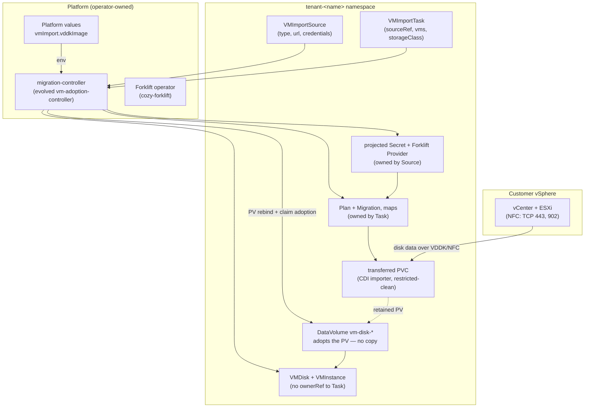

# VM import: tenant self-service migration of VMware virtual machines into Cozystack

- **Title:** `VM import: tenant self-service migration of VMware virtual machines into Cozystack`
- **Author(s):** `@kvaps`
- **Date:** `2026-08-21`
- **Status:** Draft

## Overview

Cozystack gains a first-class path for migrating virtual machines from VMware vSphere (and, later, other providers) into KubeVirt-backed Cozystack tenants, built on the Konveyor Forklift engine that PR [#1982](https://github.com/cozystack/cozystack/pull/1982) already vendors. The tenant-facing API is a pair of CRDs in a new **`forklift.cozystack.io`** group, split along the two lifecycles involved: a **`VMImportSource`** registers a long-lived *connection* to a source provider — type, endpoint, credentials, with steady-state readiness — and a **`VMImportTask`** expresses the *one-shot operation* — reference a source, name the VMs, get `VMDisk`s and `VMInstance`s. A controller in the Cozystack core repository reconciles both, drives Forklift underneath, and hands each transferred volume into its `VMDisk` without a second copy. Deleting a completed `VMImportTask` removes the migration machinery and leaves the imported disks and instances untouched, because they were never owned by it.

This is the shape of Cozystack's own Backup API (`backups.cozystack.io`: `BackupJob`/`RestoreJob` reconciled by `internal/backupcontroller`), applied to migration — not a Helm chart in the tenant catalog. An earlier revision of this proposal put a `VMImport` connection app in the catalog and an import source on `VMDisk`; the Alternatives section records why that shape lost once the Backup precedent was weighed. No part of the tenant API names a container image, a Secret the tenant cannot create, or a namespace other than the tenant's own. The proprietary VDDK image is never shipped by Cozystack: it is an optional platform-level configuration value the operator sets, delivered to the migration controller, and no image field ever appears on the tenant API.

The integration lands in the Cozystack core repository, opt-in via `bundles.enabledPackages` as the branch already arranges, and the implementation is pushed directly into PR #1982, restructuring it in place.

## Scope and related proposals

- **PR [#1982](https://github.com/cozystack/cozystack/pull/1982)** is the implementation base and the implementation vehicle: `packages/system/forklift-operator` (Konveyor Forklift v2.11.5) and `packages/system/forklift` (the operand CR) stay; `packages/apps/vm-import` is removed; `packages/system/vm-adoption-controller` evolves into the `migration-controller` described here. This proposal reshapes the PR's tenant API and keeps its engine.
- **PR [#3002](https://github.com/cozystack/cozystack/pull/3002)** (`vm-instance` `firmware` field) is a **merge-order dependency**, and the implementation branch is now stacked directly on it. The controller reads the bootloader from the Forklift-built `VirtualMachine` it already parses and writes it through as `spec.firmware`, carrying Secure Boot when the source has it; a source that reports no firmware leaves the field unset so the instance profile's own default stands. Without #3002 beneath it the field exists nowhere in the vm-instance schema, and a UEFI guest imports "successfully" as a BIOS machine that never boots — confirmed on a live cluster, where the value survived on the `VMInstance` and was then ignored by the older chart the platform was running. #3002 must land first.
- **Issue [#3924](https://github.com/cozystack/cozystack/issues/3924)** (cross-namespace clone lifecycle: three copies of every disk) is subsumed by Design §5 — the copy-free handoff removes the intermediate copies entirely.
- **Deferred to follow-up work:** warm (CBT-based) migration — explicitly deferred by decision, the API reserves nothing for it and gains it additively; providers beyond vSphere (the `VMImportSource.type` shape anticipates them); vCenter discovery (inventory-backed VM listing in the dashboard); network placement UX (LAN/VPC/public IP for imported VMs, deferred on the design call); per-datastore storage mapping (v1 places every disk of a Task on one class, §5); guest conversion is in scope but on its own track (§4, Rollout Phase 2).

## Context

Forklift provides CRDs (`Provider`, `Plan`, `Migration`, `NetworkMap`, `StorageMap`) that migrate VMs from vSphere and other providers into KubeVirt PVCs. It has no web interface and no Kubernetes-level VM discovery: the user supplies vSphere managed-object reference IDs (`vm-123`). Its operand runs an authenticated inventory REST service, which matters for future discovery but is not tenant-consumable today. Forklift's output for a migrated VM is a KubeVirt `VirtualMachine` over CDI-populated PVCs — not a Cozystack `VMInstance` over `VMDisk`s — so a bridge from Forklift's output to Cozystack's managed objects is required in any design; the only question is what drives it.

Four existing Cozystack mechanisms carry this design:

- **The Backup API is the in-tree precedent for a tenant-facing, one-shot, controller-reconciled operation.** `BackupJob`/`RestoreJob` (`api/backups/v1alpha1/`) have terminal phases (`Pending/Running/Succeeded/Failed`), are reconciled by a dedicated controller shipped as its own system package (`packages/system/backup-controller`: CRDs in `definitions/`, Deployment, RBAC), and are fully usable by tenants. Every property a migration task needs already exists there and is listed below where used.
- **Tenant RBAC is extensible by the package that owns the API.** `cozy:tenant:*` roles in `packages/system/cozystack-basics/templates/clusterroles.yaml` are aggregation roles: any package may ship ClusterRoles labelled `rbac.cozystack.io/aggregate-to-tenant-<level>` and they are folded in. The backup package does exactly this (`packages/system/backup-controller/templates/tenant-clusterroles.yaml`): `cozy:backups:view` grants read on everything including `backupclasses`, `cozy:backups:admin` grants write on `plans`/`backupjobs`/`restorejobs` and deliberately not on `backupclasses`. Adding a new API group for tenants requires **no change to platform policy** — the grant travels with the package.
- **The dashboard renders CRD-backed sections natively.** The console's Backups sidebar section (`sidebar-sections.tsx`) lists Plans, Backup Jobs, Backups and Restore Jobs; its create pages generate the form from the CRD's OpenAPI schema (`useCRDSchema` + `SchemaForm`), and dynamic dropdowns are driven by `options.cozystack.io/source.*` annotations stamped on the CRD via kubebuilder markers (e.g. `api/backups/v1alpha1/restorejob_types.go:82`), resolved by the option providers registered in `pkg/registry/core/option/providers.go`. A new CRD pair gets list/create/detail pages and pickers by the same route; no `x-cozystack-options` in a Helm values schema is involved.
- **Controller-side credential materialization exists and has a hardening pattern.** `internal/backupcontroller/credentials_projector.go` projects credentials into the Secret shape a downstream system expects, marks the projected Secret with a `managed-by` label, and refuses to overwrite any pre-existing Secret that lacks that label — so the projector can never clobber a tenant's own object. `VMImportSource` reuses this pattern for the Forklift Provider Secret.

The branch also established an inversion that drives §4, though not with the conclusion it drew. The **virt-v2v conversion path** cannot run under the PSS profile a tenant namespace gets, and it also pays a cross-namespace clone that doubles migration time (≈5m46s for 16 GiB, of which ≈2m52s is the clone). The **raw-copy path** (`skipGuestConversion`, needs VDDK) writes straight into the target namespace and measures ≈2m55s for the same disk. So the proprietary VDDK image is not a licensing footnote: it is what makes tenant self-service structurally possible. Where the branch's documentation goes wrong is the remedy — it concludes that conversion needs `seccompProfile: Unconfined` and therefore a privileged namespace. §4 shows the requirement is four syscalls behind a `Localhost` profile, that such profiles are accepted by `baseline` and `restricted` alike, and that no privileged namespace is needed anywhere in this design.

### The problem

Hidora has a customer ready to leave VMware now and "a lot of requests and a lot of demand" behind them. Their requirement, stated on the 2026-08-20 design call: *the tenant owner does it himself* — enters his own vCenter endpoint and credentials, names his VMs, and gets Cozystack objects, with no platform administrator in the loop. Today that is impossible three times over: the PR's tenant API asks for container images (`vddkInitImage`, `virtV2vImage`) that Cozystack never lets a tenant name; it asks for a pre-existing Secret (`sourceSecretName`) that no tenant access level can create (`core.cozystack.io/tenantsecrets` is `get,list,watch` only); and its default transfer path runs a privileged pod a tenant namespace forbids. Timofei's review blocks on exactly these points, and on the raw-PVC gap: imports leaving disks with no Cozystack representation, which is what pushed three system-internal knobs (`VMDisk.source.pvc`, `VMInstance.disks[].dvName`, `VMInstance.fullnameOverride`) onto the tenant API.

The review also asked the structural question this revision answers differently than the last one: is a VMware import a tenant *application* at all? It is not — it is an operation with a beginning and an end, and Cozystack already has an API family shaped for exactly that.

## Goals

- A tenant imports VMs from their own vCenter with no administrator action beyond one-time platform configuration: create a `VMImportSource`, create a `VMImportTask`, get running-ready `VMInstance`s over managed `VMDisk`s.
- Every imported disk is a real, managed `VMDisk` — resizable, clonable, backup-eligible, visible in the existing `vmdisk` picker — with no raw Forklift PVCs left behind; every imported VM is a real `VMInstance`.
- Deleting a `VMImportTask` — completed, failed, or in flight — never deletes or degrades an already-imported disk or instance, and never touches the source VM in vSphere. Deleting a `VMImportSource` deregisters the connection and nothing else.
- No tenant-reachable field names a container image, a Secret the tenant cannot create, or a namespace other than the tenant's own; validation failures (unreachable vCenter, bad credentials, missing VM) surface on `status.conditions` before anything is created, not as render errors or mid-transfer failures.
- The VDDK image is an operator-set platform value; when unset, vSphere sources report `Ready=False` with a reason naming the missing configuration — unavailable, not broken.
- No part of the import path requires a privileged namespace, a privileged pod, or `seccompProfile: Unconfined`; guest conversion, when enabled, costs four syscalls through a `Localhost` profile, paired with a policy that stops anything else referencing it.
- Tenants get access through the standard aggregation mechanism, and the dashboard gets a Migration section built exactly like the Backups section.
- An operator-driven demonstration of a real vSphere migration is possible on a stock Cozystack build by 23 September 2026.

### Non-goals

- No vCenter browsing in v1 — no folder tree, no server-side search, no live query from the form. A Source's machines are offered as a flat picker built from a list the controller publishes (§6), and the managed-object reference can still be typed in by hand.
- No warm/CBT migration — deferred by decision; the API gains it additively later.
- No network placement design (LAN vs VPC vs public IP for imported VMs) — deferred by agreement on the call.
- No providers beyond vSphere in v1 — `VMImportSource.type` leaves room for them.
- No general tenant secret-management subsystem; credentials ride the `VMImportSource` spec (§2).
- Cozystack never ships, hosts, or mirrors the proprietary VDDK image.

## Design

### 1. Two CRDs, split by lifecycle: `VMImportSource` and `VMImportTask`

The API group is `forklift.cozystack.io/v1alpha1`, named for the engine whose contract it exposes. `migration.cozystack.io` was the first choice and is not available in practice: Cozystack already has migrations — the platform's own schema migrations, driven by the top-level `migrations` value and the numbered scripts under `packages/core/platform/images/migrations/`, which stamp an annotation literally named `migration.cozystack.io` on tenant resources. Same word, unrelated mechanism, both operator-facing. The implementation already had to dodge that collision once, shipping the platform key as `vmImport.vddkImage` rather than `migration.vddkImage`; an API group is near-permanent where a values key is cheap to change, so it deserves the same care.

Naming it for the engine is honest rather than merely available. This controller ships no provider client, mirrors Forklift's verdicts verbatim so a tenant reads Forklift's own words, and delegates validation, inventory and transfer wholesale — the observable contract is Forklift-shaped by design. It forecloses nothing: oVirt, OpenStack and OVA are Forklift providers too and arrive through the same engine. The Backup API's engine-neutral `backups.cozystack.io` earns its name through a strategy abstraction that keeps Velero behind an engine-agnostic contract; this API deliberately has no such layer. Should Cozystack ever swap the engine, that is a semantic break deserving a new group regardless — and `v1alpha1` makes now the cheapest moment this rename will ever have.

Types live in `api/migration/v1alpha1/`, the controller in `internal/migrationcontroller/` with its own binary under `cmd/`, and the deliverable package is `packages/system/migration-controller` (CRDs, Deployment, RBAC, tenant ClusterRoles), enabled by the same opt-in group as the Forklift packages it drives. Those keep the `migration-controller` name: the collision is over the operator-facing API group, and renaming the Go packages and chart is a separate mechanical change with no user-visible effect. This mirrors `packages/system/backup-controller` field for field.

**`VMImportSource` is the connection.** Long-lived, reusable across tasks:

```yaml
apiVersion: forklift.cozystack.io/v1alpha1
kind: VMImportSource
metadata:
  name: vcenter-prod
  namespace: tenant-foo
spec:
  type: vsphere                    # only value in v1; others follow under the same shape
  url: https://vcenter.example.com/sdk
  credentials:
    username: migration@vsphere.local   # the SSO domain is required; a bare name reads as a wrong password
    password: "..."
    caCert: |                           # or insecureSkipVerify: true; a SHA-1 thumbprint does not work here
      -----BEGIN CERTIFICATE-----
  hosts:                                # optional, see below
  - id: host-10
    address: 10.0.30.29
    credentials:
      username: root
      password: "..."
      insecureSkipVerify: true
status:
  conditions:
  - type: Ready                    # connection tested, inventory reachable, VDDK configured
    status: "True"
```

`hosts` exists because disk data does not travel through vCenter. VDDK opens its connection straight to the ESXi host holding the VM, at the address vCenter advertises for it, and that address is frequently unusable: a management network the workers are not on, or one that collides with the cluster's own Service CIDR, where the packet is swallowed by service routing and never leaves. On the first cluster this ran against, vCenter advertised `10.98.11.130` while the cluster's Service CIDR was `10.98.0.0/16`, and every transfer failed after validation had passed with an NBD error naming neither the address nor the reason. An entry redirects one host. Each carries its own credentials because the ESXi host authenticates that connection itself rather than honouring the vCenter session — Forklift requires `user` and `password` and connection-tests them before any Plan referencing the host will run (`pkg/controller/host/validation.go`). These are host-level credentials and arrive the same way the provider's own do, for the same reason: a tenant cannot create a Secret.

The controller validates before anything is created — it connects to the endpoint, and "unreachable" or "bad credentials" appears as a condition on the object, not as a chart render failure and not as a transfer that dies five minutes in. It then projects the credentials into the Secret shape Forklift's `Provider` expects (the `credentials_projector.go` pattern, including the managed-by guard against clobbering pre-existing Secrets) and creates the Forklift `Provider` in the same namespace with an ownerReference on the Source. The tenant never sees the Provider — no tenant role grants anything on `forklift.konveyor.io` — and deleting the Source garbage-collects it and the projected Secret.

**`VMImportTask` is the operation.** One-shot, terminal phases, the `BackupJob` lifecycle:

```yaml
apiVersion: forklift.cozystack.io/v1alpha1
kind: VMImportTask
metadata:
  name: import-web-tier
  namespace: tenant-foo
spec:
  sourceRef:
    name: vcenter-prod             # same namespace only
  vms:
  - id: vm-1234                    # managed-object reference ID in the source inventory
    name: web-01                   # name of the VMInstance to create
    instanceType: u1.large         # optional; defaults derived from the source VM's CPU/memory
    instanceProfile: ubuntu        # optional
  storageClass: replicated         # optional; class for every disk of the Task, validated
                                   #   for Immediate binding (§5); omitted = cluster default
status:
  phase: Succeeded                 # Pending | Validating | Transferring | Creating | Succeeded | Failed
  vms:
  - id: vm-1234
    phase: Succeeded
    progress: 100
    vmInstance: web-01
    disks: ["web-01-disk-0"]
  conditions: [...]
```

There is no `tenantNamespace` and no `destinationNamespace` anywhere: the destination of an import is the namespace the Task lives in, full stop. The cross-namespace coercion logic the review flagged has nothing left to coerce.

**Deletion semantics fall out of ownership, not policy.** Everything the controller builds to run the migration — the Forklift `NetworkMap`, `StorageMap`, `Plan`, `Migration` — carries an ownerReference on the Task; the outputs — `VMDisk`, `VMInstance` — deliberately carry none. Deleting the Task garbage-collects the scaffolding and cancels an in-flight migration; completed outputs are ordinary tenant objects with independent lives. In the previous catalog-app shape this same requirement needed `helm.sh/resource-policy: keep` — objects intentionally orphaned from their own release — which is precisely the class of buried subtlety the review objected to.



### 2. Credentials ride the Source spec; the controller materializes the Secret

Tenants cannot create Kubernetes Secrets (`core.cozystack.io/tenantsecrets` is read-only at every access level), so a `credentialsSecretRef` field would be unsatisfiable for the self-service audience — the exact defect the review found in `sourceSecretName`. Instead the tenant enters `username`/`password`/`thumbprint` in the `VMImportSource` form and the controller writes the Secret, guarded by the projector's managed-by label so it can never overwrite an object it does not own. The at-rest exposure class is the same one every managed database already accepts (`postgres` takes `users[].password` through values and materializes `<release>-credentials`): the credential is readable by tenant members who can read the Source object, in the tenant's own namespace. No new RBAC, no new subsystem, one form.

The rejected routes are recorded in Alternatives: granting tenants write on `tenantsecrets` (one RBAC grant away, but a platform-wide policy change deserving its own proposal) and a per-tenant credential-holding SPA (a whole application to build before any migration works).

### 3. The VDDK image is platform configuration delivered to the controller

The operator who owns a VDDK build sets one key, and nothing else changes anywhere:

- **Where set:** `vmImport.vddkImage` in `packages/core/platform/values.yaml`, forwarded by the iaas bundle into the controller's chart values. The value is a plain image reference — a non-sensitive string. Named `vmImport`, not `migration`, for the collision described in §1: two adjacent platform keys differing by one letter is a configuration mistake waiting to happen.
- **How delivered:** the platform passes it to the `migration-controller` Deployment as configuration; the controller stamps it into `Provider.spec.settings.vddkInitImage` on every vSphere Provider it creates. It never rides the `_cluster` values channel and never appears in any tenant-visible schema, because no chart needs it — the earlier revision's `_cluster` plumbing is superseded.
- **When unset:** a `vsphere` `VMImportSource` reports `Ready=False, reason=VDDKNotConfigured`, with a message pointing at the platform documentation; Tasks referencing it stay `Pending` with a condition naming the unready Source. The same policy as before — the VMware path is *absent*, not broken — but observable on status where a controller can keep it current, instead of frozen into a render error. Forklift can technically transfer without VDDK (nbdkit-curl over vCenter HTTPS), but upstream documents it only as "significantly" slower and it fails on vSAN-backed disks, so VDDK remains the configuration that makes the tenant path work, not an optimisation.

### 4. Raw-copy needs no privilege at all; conversion needs a narrow seccomp profile, not a privileged namespace

**The tenant path is raw-copy, and it is verified clean — for `restricted`, not merely `baseline`, and now verified live, not only in source.** No Forklift pod moves the bytes: with `skipGuestConversion`, Forklift emits a CDI DataVolume with a VDDK source, and the transfer is performed by **CDI's own importer pod** in the target namespace. That pod is built by `makeImporterPodSpec`, which ends in `SetRestrictedSecurityContext` — `drop: ALL`, `allowPrivilegeEscalation: false`, `runAsNonRoot: true`, `runAsUser: 107`, `seccompProfile: RuntimeDefault` on the pod *and* every container, including the `vddk-side-car` init container. Volumes are PVC, emptyDir, configMap and secret only; no host namespaces, no hostPath, no added capabilities. On 2026-08-20 this was confirmed empirically on a Cozystack v1.6.2 cluster: a CDI import into a namespace enforcing `pod-security.kubernetes.io/enforce=restricted` was admitted with no PodSecurity denial and no warning event, the live pod's securityContext matched the source-derived prediction exactly, and the import ran to `Succeeded`. This is deliberate upstream behaviour, not luck: Forklift issue #173 was filed against exactly this and fixed in PR #225. VDDK's reach to ESXi on TCP 443/902 is ordinary client egress, already permitted by the tenant's own `allow-external-communication` policy; PSS does not speak to egress at all.

One pod worth naming: whenever a VDDK image is configured, Forklift runs a `vddk-validator-<plan>` Job in the target namespace purely to `file` one library inside the ~2 GB virt-v2v image. It is equally PSS-clean, but it is a real pod in the tenant's namespace and counts against quota, so it belongs in the docs.

**The conversion path does not need a privileged namespace either — it needs a `Localhost` seccomp profile, which `baseline` and `restricted` both accept** (`pod-security-admission/policy/check_seccompProfile_restricted.go:39` lists `RuntimeDefault` and `Localhost` as the allowed values). The blocker is narrower than "virt-v2v is privileged" and narrower than a capability: libguestfs starts `passt` for the appliance's network, and `passt` sandboxes itself into fresh namespaces unconditionally — `isolation.c:340` calls `unshare(CLONE_NEWUSER)`, then `:402` unshares IPC/NS/UTS, `:406,:410` mount, `:424` `pivot_root`, `:435` `umount2`. containerd's default profile permits `unshare`, `mount`, `umount2` only under `CAP_SYS_ADMIN` and omits `pivot_root` entirely, and the conversion pod drops all capabilities. **The delta over `RuntimeDefault` is therefore four syscalls — `unshare`, `mount`, `umount2`, `pivot_root` — and `CAP_SYS_ADMIN` is not among the requirements**, because passt makes those calls inside the user namespace it just created; only the filter, which is not namespace-aware, stands in the way. A Forklift maintainer states the same root cause in PR #1445. Forklift already contains the mechanism, keyed on the wrong thing: the conversion pod selects `Localhost` with `profiles/unshare.json` when it detects OpenShift and falls back to `RuntimeDefault` otherwise — on current `main` in `pkg/controller/conversion/builder.go:141-148` and `:322-329`. `OPENSHIFT` autodetects false on any non-OpenShift cluster, so on Cozystack the `Localhost` branch is simply never taken. Upstream issue #4491 is open on exactly this, with reporters on RKE2/Harvester and on Talos.

Cozystack closes this in two pieces that fit existing mechanisms:

- **Node side:** ship a narrow `unshare.json` through Talos `machine.seccompProfiles`, which lands it in `/var/lib/kubelet/seccomp/profiles` — exactly the path `localhostProfile: profiles/unshare.json` resolves against. The profile permits the four syscalls above and nothing else beyond the runtime default, so filtering stays on.
- **Forklift side:** generalise the existing branch so the profile name can be set independently of OpenShift detection, defaulting to today's behaviour. **This patch exists and passes tests**: a `VIRT_V2V_SECCOMP_PROFILE` setting in the `VIRT_V2V_*` family (const, struct field and loader in `pkg/settings/migration.go`; a shared helper replacing the two duplicated blocks in `builder.go`; the env var in the operator's controller deployment template; a `virt_v2v_seccomp_profile` field on the ForkliftController CRD), built against `main` with unit tests covering the precedence chain — setting → OpenShift → `RuntimeDefault`. Opening it upstream is part of Phase 2; if upstream declines, a label-scoped mutating webhook on `forklift.app=virt-v2v` pods setting `Localhost` (never `Unconfined`) is the fallback, shipped in the `forklift` package.

With that, conversion runs inside the tenant namespace under `baseline`, and the privileged `cozy-forklift` conversion namespace and the cross-namespace clone that follows from it become unnecessary — which is why this design does not adopt them. Until the seccomp piece lands, conversion is simply **unavailable** rather than admin-only. What that costs the guest is sharper than "no conversion", and live testing corrected an earlier reading of it: a guest without virtio drivers does not fail the import at all — the transfer succeeds, the disk is intact, and the machine then does not boot, which is the worst of both. An AlmaLinux 9.2 guest migrated out of vSphere stalled in its initramfs waiting for a root device that never appeared, because its initramfs carries `vmw_pvscsi` and no virtio. This is the default outcome for any guest whose initramfs was built under VMware, not an edge case, so v1 does not leave it to the tenant to discover: **while conversion is skipped, imported disks are placed on the SATA bus** (§5), whose controller is inbox in every distribution's initramfs and in Windows. Conversion in Phase 2 is then a performance and tidiness improvement rather than the difference between a machine that boots and one that does not. `skipGuestConversion`, `virtV2vImage`, `xfsCompatibility` do not exist on the tenant API at all — raw-copy is the only v1 mode, and conversion arrives later as an additive `spec` field, not a mode switch the tenant must understand.

### 5. Fulfillment: one Plan per source VM, copy-free handoff, outputs created directly

For each Task the controller renders the Forklift objects itself — both maps always present, fixing the branch's render-a-Plan-the-API-server-rejects gap — one `Plan` and `Migration` per source VM, raw-copy mode, target namespace fixed to the Task's namespace — and mirrors `Migration.status` into per-VM `progress` on the Task.

Every rendered Plan sets **`targetPowerState: off`** on its VM entry, and this is normative rather than a default worth relying on. Left unset, Forklift matches the target's run strategy to the *source's* pre-migration power state (`determineRunStrategy`, `pkg/controller/plan/kubevirt.go:3649` at v2.11.5): a cold migration of a running machine records `RestorePowerState: On` and creates the target with `RunStrategy: Always`, so it boots the moment the transfer completes. Every VM in a production cutover is running when it is migrated, so this is the primary case, not an edge: the guest would come up before any handoff could run, putting a duplicate of a live production machine on the network and starting it on the very volume step 1 below is about to re-point. The `runStrategy: Halted` the created `VMInstance` carries protects the tenant-facing object one layer up; this protects the scaffolding.

Storage is one field: every disk of the Task gets `spec.storageClass`, falling back to the cluster default StorageClass when unset, validated for `Immediate` binding either way (§Failure). The controller builds the Forklift `StorageMap` itself — it enumerates the datastores of the named VMs through inventory and maps them all to that one class, purely to satisfy Plan validation. **The mechanism is normative: an authenticated query against Forklift's inventory REST service** (the operand runs with `feature_auth_required: true`) for the named VMs' network and datastore refs, from which both maps are written. This is a real HTTP client with a bearer token, and the design owns that rather than implying the Kubernetes objects suffice — they do not. The tempting shortcut, learning the topology from the Plan's own `VMNetworksNotMapped`/`VMStorageNotMapped` validation conditions, cannot work: those conditions carry the *VM* references in `items`, not the offending network or datastore IDs. At v2.11.5 `pkg/controller/plan/validation.go:940,960` appends `ref.String()` of the VM, rendered as `id:vm-1234 name:'web-01'` (`pkg/apis/forklift/v1beta1/ref/ref.go:29`), and the IDs a map entry needs appear on no Forklift custom resource at all. Map resolution is an exact-ID lookup with no wildcard to fall back on (`pkg/controller/plan/adapter/vsphere/validator.go:80,116`), so a map built from parsed condition text resolves to nothing and the Task waits in `Validating` forever. Staying inside the "no second vSphere client" boundary means not talking to vCenter — it does not mean refusing to talk to Forklift, whose view of vCenter this still is. A tenant-facing per-datastore `storageMap` was considered and deliberately cut from v1: the common case is "put everything on replicated", one field with the standard picker, and splitting one VM's disks across classes by *source datastore* is a projection of the old infrastructure onto the new one — if the need turns out to be real, the field joins the spec additively (and an in-list default entry — an item without `source`, or a `"*"` wildcard — stays rejected as magic the schema cannot express cleanly). The class also lands in `spec.storageClass` of the output `VMDisk`, so the object says where the data actually is. The `NetworkMap` has no tenant-facing field at all in v1, deliberately: it shapes the interfaces of the Forklift-created KubeVirt VM, which this design discards unstarted — the final network configuration belongs to the `VMInstance` the controller creates, and a `VMInstance` today attaches to the pod network only. The controller therefore auto-generates the map (every source network → `pod`) purely to satisfy Plan validation. When the deferred network-placement design lands (LAN/VPC/public IP), a `networkMap` field joins the Task spec additively, with destinations that actually exist — an empty choice in a form is worse than no field. The annotation protocol the branch invented (`vm-import.cozystack.io/*` stamped on Plans by a chart, read back by a controller) disappears: it existed only because Helm cannot talk to a controller any other way, and both ends of the conversation are now the same program.

When a Migration succeeds, the controller discards the Forklift-created KubeVirt `VirtualMachine` (never started) and hands each produced volume into a `VMDisk` **without a copy**. The sequence is the one upstream CDI tests end-to-end in `tests/static-volume_test.go:84-155`, and it was verified live on 2026-08-20: the DataVolume reported `Succeeded`, **no importer pod was ever created**, the PVC stayed bound to the same PV throughout, and the data survived byte-identically (MBR signature and checksum checked from the adopted block device).

1. **Re-point the PV atomically**, reusing the routine the backup controller already implements for exactly this move — `RestoreJobReconciler.renamePVC` (`internal/backupcontroller/velerostrategy_controller.go`): patch the PV to `persistentVolumeReclaimPolicy: Retain`, create the replacement PVC pre-bound through `spec.volumeName`, delete the old PVC, rewrite `pv.spec.claimRef` to the new PVC including its UID.
2. Stamp `cdi.kubevirt.io/storage.populatedFor: vm-disk-<name>` on the replacement PVC, create the DataVolume of the same name with Helm ownership metadata (`app.kubernetes.io/managed-by: Helm`, `meta.helm.sh/release-name/-namespace`), then create the `VMDisk`: its chart's lookup-freeze (`dv.yaml:1,14-16` copies an existing DV's spec back verbatim) adopts the controller-created DataVolume on first render and preserves it forever. No `source.pvc` field, no schema change to vm-disk at all.
3. Create the `VMInstance` over the produced VMDisks, carrying `instanceType`/`instanceProfile` from the Task (or derived from the source VM), `firmware` from the source VM's inventory record (#3002), and each disk on a bus the guest can actually read.

**The bus is a decision, not a default left to the chart.** A raw copy preserves the guest exactly, drivers included, so an imported machine has whatever VMware gave it and nothing else — on virtio it does not boot (§4). Imported disks therefore get `bus: sata`. The q35 machine type KubeVirt renders exposes six AHCI ports, so a source VM with more disks than that puts the remainder on virtio: only the boot disk has to be reachable from the initramfs, and once Linux has mounted its root it loads `virtio_blk` like any other module, while a Windows guest sees those disks appear after virtio-win is installed. A data disk that is missing until a driver is installed is recoverable; an import that cannot boot is the failure this avoids. The tenant can move any disk to virtio afterwards by editing the `VMInstance`, which is the right place for that choice once the guest can make it — and when conversion lands, converted VMs get virtio from the start, because virt-v2v installs precisely the drivers this works around.

`populatedFor` is the deliberate choice, and it is not a novel bet: it is the same primitive Cozystack's Velero VM-restore path already depends on in production, where `kubevirt-velero-plugin` writes the annotation at backup time and it is what admits the recreated DataVolume after Velero strips ownerReferences. CDI reads it as pure data — a string compare against `dv.Name` with no provenance check — evaluated *before* claim adoption in both the validating webhook and `pvcRequiresWork`, so it needs **neither the `DataVolumeClaimAdoption` feature gate nor any annotation on the DataVolume**; Cozystack's CDI CR stays untouched.

Live testing added two constraints the source reading did not surface, both now part of the controller's contract:

- **`volumeMode` and `accessModes` must be copied from the PV onto the handoff PVC.** The retained PV is `Block` on this CSI class; a PVC omitting `volumeMode` defaults to `Filesystem`, and because pre-binding through `volumeName` bypasses the volumeMode match check, the PVC **binds anyway** and fails only later at mount time. Copy, never assume.
- **The owning DataVolume must be deleted before its PVC is re-pointed.** Deleting a PVC out from under a live DataVolume makes CDI recreate the PVC and provision a second PV, re-running the import — precisely the duplicate copy this design removes.

The remaining constraints from source analysis all held up live: PVC name must equal the DataVolume name and the annotation value must equal that same name; `spec.dataSourceRef` stays unset; binding is verified directly (a DataVolume can report `Succeeded` while its PVC is `ClaimPending`); and the PV stays on `Retain` permanently — CDI takes a *controller* ownerRef on the adopted PVC, so deleting the DataVolume garbage-collects the PVC and the data survives only because of the reclaim policy. That policy is part of the contract, not an implementation detail.

The end state is byte-identical to any other VMDisk: resize via the existing hook, clone via `source.disk`, backups, pickers. This closes the raw-PVC gap named in review as the minimal standard, and it retires all three system-internal knobs (§7). If outputs of the requested names already exist and do not carry this Task's marker, that VM fails with a condition naming the collision while its siblings continue — the controller never overwrites tenant objects (§Failure).

### 6. Dashboard: a Migration section built exactly like Backups

The console gains a **Migration** sidebar section with two items — Import Sources and Import Tasks — built the way the Backups section is built (`sidebar-sections.tsx`): list pages over the CRDs, create pages generating their form from the CRD schema via `useCRDSchema` + `SchemaForm`, detail pages showing `status` (per-VM phase and progress for Tasks, conditions for Sources). Dynamic dropdowns come from kubebuilder annotations on the CRDs resolved by option providers: `options.cozystack.io/source.sourceRef.name=vmimportsource` on the Task (one new provider in `pkg/registry/core/option/providers.go`, listing `VMImportSource` objects in the caller's namespace — a Kubernetes-API-backed list, exactly what the picker mechanism can serve), plus the existing `instancetype`/`preference`/`storageclass` sources for the remaining fields. The section is shown only when the `forklift.cozystack.io` group is present, respecting the opt-in.

**The VM field is a picker too, which an earlier draft of this design said was impossible.** That reading was right about the constraint and wrong about the conclusion: option providers can only read Kubernetes objects, so the aggregated API cannot call Forklift's inventory — and it should not learn to, because that would put a source's credentials in a second component. But nothing requires the API to be the one that reads it. The controller already holds an inventory client, so it publishes each Source's machine list, and the provider reads it back as an ordinary object. The list goes in a ConfigMap owned by the Source rather than onto its status: thousands of entries rewritten on every refresh would wake everything watching the Source, while an ownerReference still deletes the list with it. It is sorted by name and capped, with the cap recorded in an annotation so a picker missing an entry has a visible reason.

Two general capabilities fall out of this, and both are deliberately not import-specific. **An option source may take an argument**, addressed as `<source>.<argument>` — a source's machines mean nothing until a source is chosen, and the Option API previously had no way to say so. Such sources are absent from `List`, since without the argument they describe nothing. **An option source named in a CRD annotation may reference a sibling field**, as in `options.cozystack.io/source.vms.id=vmimportvm.{sourceRef.name}`, resolved against the form the widget is rendered in; while that field is empty the dropdown says so rather than claiming the source has no machines. Any dropdown narrowed by an earlier choice can use both.

The picker shows the machine name and the reference together — `web-01 (vm-52)` — and writes the reference. Both are needed: the reference is all a saved Task displays afterwards, and two machines can share a name in different folders. Copying the ID out of the vSphere client URL or `govc ls -i` still works and remains in the docs, because a Source that has not published yet, or one whose inventory is briefly unreachable, leaves the dropdown empty rather than blocking the form.

### 7. Consequences for the existing surface

- **`packages/apps/vm-import` is deleted**, together with its values schema, its `_cluster.vddk-image` plumbing in `packages/core/platform/templates/apps.yaml`, and its render-time tests: credentials, images, namespaces and maps all move behind the CRDs. The catalog question from review ("is this an application?") is answered by removal.
- **`vm-adoption-controller` becomes `migration-controller`**: same repository, same evolution path, but reconciling `VMImportSource`/`VMImportTask` instead of watching annotated Forklift Plans. Its cross-tenant guards key on the Task's own namespace — the controller only ever creates Forklift objects in, and outputs into, the namespace of the Task it reconciles, so the `tenant-` prefix heuristics and the spoofable `plan` labels the review flagged have nothing left to guard.
- **`VMDisk.source.pvc`, `VMInstance.disks[].dvName`, `VMInstance.fullnameOverride` come off the tenant API**: the controller creates DataVolumes directly (with Helm ownership metadata, preserved by the lookup-freeze) instead of routing through tenant-schema fields.
- **`firmware` (#3002) is a stated merge-order dependency**, as before.
- **RBAC ships with the package**: `cozy:migration:view` (`aggregate-to-tenant-view`: both CRDs, `get/list/watch`) and `cozy:migration:admin` (`aggregate-to-tenant-admin`: both CRDs, `create/update/patch/delete`). No admin-only class object exists in the group — the only platform-scoped setting is the VDDK image, which is platform values, not a CRD.
- **Licensing and packaging:** upstream `kubev2v/forklift` is Apache-2.0, so vendoring the operator in core is fine; no proprietary artifact is referenced anywhere in the tree. One packaging reality found while validating on a live cluster: upstream publishes only rolling tags, so digest pins rot — 14 of the 16 pinned digests were already unpullable. The pins are re-pinned in the PR, and mirroring the images into Cozystack's registry (as other core packages do) is the durable fix. A second one: the `forklift` package needs a pre-delete hook that removes the `ForkliftController` operand before the operator goes, or uninstall deadlocks on the operand's finalizer.

## User-facing changes

Tenants get two new objects, shown in §1, with dashboard pages per §6. There is no catalog entry: migration is an operation in the sidebar, not an application in the marketplace — the same placement decision the Backup API made.

Operators see one new platform key (`vmImport.vddkImage`), the opt-in package toggles (`forklift-operator`, `forklift`, `migration-controller`), and no privileged namespaces.

## Upgrade and rollback compatibility

- Everything is opt-in via `bundles.enabledPackages`; clusters that never enable it are untouched. No existing chart's schema changes — `vm-disk` and `vm-instance` are consumed as they are.
- Rollback: disabling the packages removes the controller and CRDs (Sources and Tasks are lost — they are machinery, not data); imported disks and instances are ordinary VMDisks/VMInstances and survive removal. The `vmImport.vddkImage` key is inert when nothing reads it.
- Nothing here is irreversible: transfers never mutate the source vSphere environment.
- The `forklift.cozystack.io` group starts at `v1alpha1` with the standard expectations that alpha carries; the Task's `spec` is deliberately minimal so conversion, warm migration and new providers arrive additively.

## Security

- **New tenant-supplied input:** a provider URL and credentials on the `VMImportSource` spec — the same at-rest exposure class as `postgres` passwords in values (readable by tenant members who can read the object, materialized into a Secret in the tenant's own namespace by the controller, never by the tenant). The projected Secret carries a managed-by label and the projector refuses to overwrite unlabelled Secrets.
- **New egress:** transfer pods in the tenant namespace connect to the customer's vCenter/ESXi (TCP 443, 902), governed by the existing tenant egress policy; no new ingress. The Source's `url` is a tenant-controlled destination that the controller connects to for validation (`TestConnection`) — a mild SSRF surface, bounded by the controller doing nothing with the response beyond a status condition, and one reason per-host transfer overrides stay off the tenant API in v1.
- **Privilege containment:** nothing in the tenant path is privileged. The CDI importer pod and the `vddk-validator` Job both satisfy `restricted` — verified in source against Forklift v2.11.5 / CDI v1.64.0 and live against a running cluster (§4). Conversion, when it arrives, gains four syscalls (`unshare`, `mount`, `umount2`, `pivot_root`) through a `Localhost` profile — never `Unconfined`, never a privileged namespace, no added capability.
- **The seccomp profile is a cluster-wide grant, and that is the real cost of enabling conversion.** A node-level profile is addressable by *any* pod that names it in `localhostProfile`, and PSA `baseline`/`restricted` will admit that pod — so installing `profiles/unshare.json` hands every tenant an opt-in to `unshare` + `mount` + `pivot_root`, which together with a raised `user.max_user_namespaces` is a well-trodden local-privilege-escalation surface (the CVE-2022-0185 class). Enabling conversion therefore ships **two** policies, not one: the rule that sets the profile on `forklift.app=virt-v2v` pods, and a **validating** rule that rejects any other pod referencing that profile. On OpenShift this containment comes free from SCCs; on Kubernetes it is ours to write, and conversion should not be enabled without it. This is also the strongest argument for keeping conversion out of the first cut: the raw-copy tenant path needs no node profile at all.
- **Where "baseline" actually comes from, and where it does not.** Cozystack tenant namespaces carry **no** `pod-security.kubernetes.io/*` labels; the enforcement is the Talos apiserver's default `PodSecurityConfiguration` (`enforce: baseline`, `warn`/`audit: restricted`). On a kubeadm/k3s/RKE2 install without that configuration a tenant namespace enforces nothing. This design therefore does not rely on PSA as a containment boundary for anything — it relies on the workloads being clean.
- **Credential placement:** Forklift copies the provider credentials into a Secret in the Plan's target namespace — which is the tenant's own namespace holding the tenant's own credential. An admin importing on a tenant's behalf must use a credential scoped to that tenant's VMs, because it lands readable in the tenant's namespace; the docs say so.
- **Cross-tenant boundaries:** the controller creates everything in the namespace of the object it reconciles, acts only on Forklift objects it owns (ownerReferences), and no tenant role grants access to `forklift.konveyor.io` — the spoofed-plan-label pattern the branch defended against structurally cannot occur.
- **RBAC surface:** the new grants are namespaced CRUD on the two CRDs via the standard aggregation labels, the same shape and scope as `cozy:backups:*`.

## Failure and edge cases

- `vsphere` Source with `vmImport.vddkImage` unset → `Ready=False, reason=VDDKNotConfigured`; Tasks referencing it stay `Pending` with a condition naming the Source.
- Source with a wrong URL or credentials → `Ready=False` with the connection error; nothing is created.
- Task referencing a missing or unready Source → `Pending`, condition names it; the Task proceeds if the Source later becomes Ready.
- Task naming a VM ID absent from the inventory → per-VM `Failed` at validation, before any transfer; other VMs in the Task proceed.
- Output name collision (a `VMDisk`/`VMInstance` of the target name already exists) → per-VM `Failed` naming the collision; the controller never overwrites tenant objects.
- **Telling its own outputs from a tenant's is a mechanism, not an assumption.** The two promises above and below — never overwrite, and resume idempotently — are in tension, and nothing distinguishes "my earlier output" from "a tenant object of the same name" without a marker. Both wrong guesses are destructive: adopting a tenant's disk attaches stale data to the instance while the freshly transferred claim, still owned by the scaffolding VM, is garbage-collected the moment that VM is deleted; refusing its own output terminally fails an import that in fact succeeded. So every created `VMDisk`, `VMInstance` and handoff PVC is stamped with the Task's **UID** and the source VM ID, and collision is defined as *exists without my marker*. Labels, not owner references, so the outputs-outlive-the-task property in §1 is untouched; the UID rather than the name, because names are reused.
- Task deleted mid-transfer → owned Plans/Migrations are garbage-collected, Forklift cancels the migration, partial volumes are cleaned up; already-completed outputs stay. **The cleanup needs a finalizer on the Task**, which is not in tension with the outputs-outlive-the-task rule in §1: what that rule forbids is an ownerReference from an output back to the Task, and this is the opposite direction — the Task holds itself open long enough to delete the transfer volumes it is abandoning. Without it, deleting a Task mid-transfer leaves an orphaned DataVolume that nothing owns and nothing will collect, still occupying the storage class quota. Finished outputs are matched by their marker and deliberately left alone.
- Source deleted while Tasks reference it → in-flight Tasks fail visibly; completed outputs unaffected; the Task keeps its terminal status for the record.
- Controller restarts mid-transfer → Sources, Tasks, Plans and Migrations are the durable state; reconciliation resumes from status, and the handoff is idempotent (claim adoption of an already-bound PV is a no-op).
- Guest without virtio drivers → transfer succeeds and the disk is intact, which is exactly why this is dangerous: the import reports success and the machine then does not boot. Imported disks are placed on SATA for this reason (§5), which covers every guest whose initramfs or inbox driver set came from VMware. Confirmed live on AlmaLinux 9.2, which stalled in its initramfs on virtio and booted on SATA without touching the guest.
- `storageClass` naming a `WaitForFirstConsumer`-only class → **the import deadlocks** upstream (nothing consumes the PVC during population); the controller validates binding mode up front and fails the Task naming the class, rather than hanging. `replicated` (Immediate) qualifies; the default `local` does not.
- `storageClass` omitted → the controller falls back to the cluster default StorageClass, subject to the same binding-mode validation. On a stock Cozystack install the default class is `local`, which is `WaitForFirstConsumer`, so a Task naming no class fails at `Validating` with a message naming the class, its binding mode, and the remedy — setting `storageClass: replicated`, one field with the standard picker in the dashboard form.
- Guest with static network configuration inside the OS → imports as-is (raw copy never modifies the guest); the VM boots on the pod network with a new address while the guest may still hold its old LAN settings. The remedy in v1 is in-guest reconfiguration; the deferred network-placement design is the structural answer. Documented, because it is the first thing a real migration hits.
- VDDK image configured → a `vddk-validator` Job appears in the tenant namespace and pulls a ~2 GB image; documented, counted in quota expectations.
- CDI upgraded and stops applying `SetRestrictedSecurityContext` to the importer pod → the tenant path silently loses its PSS guarantee; asserted in e2e rather than trusted (§Testing), because CDI is a floating dependency in this repo.
- Uninstalling the Forklift packages → the pre-delete hook removes the `ForkliftController` operand first; without it the operand's finalizer deadlocks CRD deletion (observed live).

## Testing

- **Unit (controller):** Source validation and condition transitions; credential projection including the managed-by guard; Plan/map generation from a Task (both maps always rendered); handoff idempotency, including the two live-found constraints — `volumeMode`/`accessModes` copied from the PV, owning DataVolume deleted before re-pointing; output-collision refusal; cancellation on Task deletion.
- **Integration (kind + CDI):** end-to-end handoff — a populated PVC is rebound into a `vm-disk-*` DataVolume that reports Succeeded, stays bound to the same PV, and is attachable by vm-instance.
- **Security (e2e):** a tenant cannot reference a Source in another namespace; no tenant-visible schema carries an image field; and — the assertion that protects the whole tenant premise — an import into a namespace labelled `pod-security.kubernetes.io/enforce=restricted` produces **no** PodSecurity denial or warning event, with the importer and `vddk-validator` pods' `securityContext` captured in test output so a CDI or Forklift bump that regresses it fails here rather than in production.
- **E2E (real vCenter, Hidora iCube lab):** import a multi-disk VM into a tenant via a Source + Task, boot the created VMInstance, resize one disk afterwards, delete the Task and verify the outputs survive. Phase 2 adds: a virtio-less guest converts with the `Localhost` profile in place and fails cleanly without it.

## Rollout

Implementation goes directly into PR #1982, restructuring it in place; the Forklift packages and the controller lineage are already there.

1. **Phase 1 — the CRD pair, raw-copy path (target 23 September 2026).** `forklift.cozystack.io` types, the `migration-controller` package (evolved from `vm-adoption-controller`), tenant RBAC aggregation, the copy-free handoff, the dashboard Migration section, and removal of `packages/apps/vm-import`. Raw-copy is the only path offered, which is also the only path verified clean, so nothing here depends on the seccomp work. #3002 lands first. This serves the 1 October demonstration: Hidora drives their lab through the same CRDs their SPA will front.
2. **Phase 2 — guest conversion, on its own track.** Open the `VIRT_V2V_SECCOMP_PROFILE` patch upstream (already built and tested, §4); ship the narrow `unshare.json` through Talos `machine.seccompProfiles` and the validating policy that fences off who may reference it; add the conversion option to the Task spec additively. If upstream declines, the label-scoped mutating webhook (always `Localhost`, never `Unconfined`) substitutes for the knob. This phase can slip without affecting anything shipped.
3. **Phase 3 — breadth.** Warm migration (deferred by decision until here), further providers under `VMImportSource.type`, inventory-backed VM discovery for the dashboard, and the network placement design deferred from the call.

## Open questions

- **Does the storage backend make a fallback clone cheap?** The handoff needs no clone, but capacity planning should treat any fallback copy as a full copy until measured: Cozystack pins `cloneStrategyOverride: csi-clone`, and whether LINSTOR/ZFS materializes bytes or does copy-on-write is unestablished.
- **Contents of the `unshare.json` profile.** We want the narrowest profile that lets `passt` create its sandbox, ideally the same content Red Hat ships on OpenShift rather than one we invent. Recommended default: runtime default plus the four named syscalls, validated by running a conversion with the profile applied before shipping it in Talos machine config.
- **Deriving instance type from the source VM.** When `instanceType` is omitted, the controller maps source CPU/memory to the nearest instance type or to explicit resources. Recommended default: explicit resources (exact match, no surprise rounding), with `instanceType` as the tenant's opt-in to the catalog sizes.
- **Task retention.** Completed Tasks accumulate as records. Recommended default: keep them (they are the audit trail of where a VM came from) and revisit TTL-based cleanup only if it becomes a real problem — `BackupJob` has the same property today.

## Alternatives considered

- **A `VMImport` catalog app plus a `vmware` source on `VMDisk` — the previous revision of this proposal.** Rejected on four structural grounds once the Backup API precedent was properly weighed (the earlier revision wrongly held that no tenant-facing one-shot precedent existed — `BackupJob`/`RestoreJob` are exactly that, with RBAC, dashboard and controller patterns included). First, delete semantics: `apps.cozystack.io` is a projection over HelmReleases, so "outputs survive deletion" requires `helm.sh/resource-policy: keep` — objects deliberately orphaned from their own release. Second, lifecycle mismatch: Flux reconciles a HelmRelease toward a steady state forever, while a completed migration is terminal — drift-correcting a finished import means nothing. Third, the output shape (how many disks, what sizes, what firmware) is known only after Forklift inspects the source VM, and a chart is a pure function of values. Fourth, validation: a chart can only `fail` at render, while a controller writes "unreachable / not found" onto status before creating anything. The chart-to-controller annotation protocol (`vm-import.cozystack.io/*` on Plans) existed only to bridge these gaps and dies with them.
- **`VMImport` as a one-shot *catalog app*.** The same objection from the other side: the catalog has no job-shaped app, `WorkloadMonitor` tracks long-running workloads only, and the dashboard has no rendering for "finished". The Backup API solved this by not being a catalog app — this design follows it.
- **Granting tenants write on `tenantsecrets` for credentials.** The registry implements the full verb set, so it is one RBAC grant away — but the grant is a platform-wide policy change with consequences far beyond this feature, deserving its own proposal, and it still leaves worse UX than one form.
- **A per-tenant SPA holding credentials outside the Kubernetes API.** Strongest isolation story and a plausible future front-end, but an entire application to build, authenticate and maintain before any migration works — and Hidora is building their own UI over the CRDs anyway, so the CRD is the product surface either way.
- **Bypassing Forklift with CDI's native `vddk` DataVolume source.** CDI can pull a vSphere disk directly, but it needs the datastore-path `backingFile`, the VM UUID and the host thumbprint per disk (worse discovery than a MOR ID), loses Forklift's inventory resolution and multi-disk correlation, and forecloses warm migration and conversion. Forklift stays the engine; CDI remains the substrate it drives.
- **A picker that lists vCenter VMs.** Structurally impossible: option providers execute in the browser under the tenant's own Kubernetes identity and can only list Kubernetes objects. Discovery goes through Forklift's authenticated inventory service in a later phase, never through the picker mechanism.
- **A privileged conversion namespace plus a mutating webhook stamping `seccompProfile: Unconfined` (the branch documentation's proposal).** Rejected on the merits: it removes syscall filtering wholesale from a pod that processes untrusted guest disk images when the actual requirement is four syscalls; it relies on a namespace boundary that is illusory on any non-Talos install; it forces the disk into the wrong namespace and pays a full second copy to move it; and it leaves Cozystack maintaining a webhook indefinitely. A `Localhost` profile is accepted by `baseline` and `restricted` alike, so the same goal is reached without any of that.
- **Hosting the integration in an external apps repository.** Floated on the call as POC insurance against the deadline; decided against — the integration is Apache-2.0 clean end to end, belongs with the vm-disk/vm-instance APIs it extends and the backup APIs it is shaped like, and the licensing wall is fully answered by the operator-supplied platform value.

---

<!-- Inspired by KubeVirt enhancement proposals and Kubernetes Enhancement Proposals (KEPs). -->
