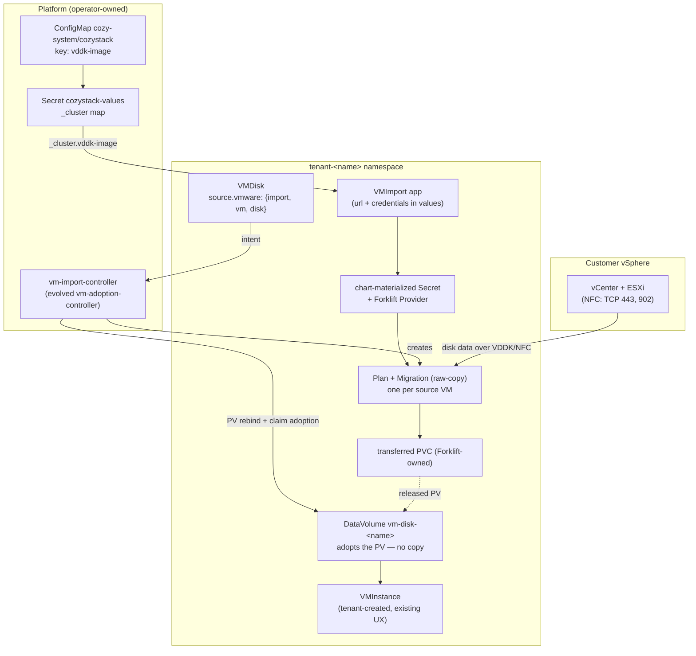

# VM import: tenant self-service migration of VMware virtual machines into Cozystack

- **Title:** `VM import: tenant self-service migration of VMware virtual machines into Cozystack`
- **Author(s):** `@kvaps`
- **Date:** `2026-08-20`
- **Status:** Draft

## Overview

Cozystack gains a first-class path for migrating virtual machines from VMware vSphere (and, later, other providers) into KubeVirt-backed Cozystack tenants, built on the Konveyor Forklift engine that PR [#1982](https://github.com/cozystack/cozystack/pull/1982) already vendors. The tenant-facing API is deliberately small and splits along the two lifecycles involved: a **`VMImport`** catalog app registers a *connection* to a source provider (endpoint plus credentials, long-lived, steady-state readiness), and a new **`vmware` source on `VMDisk`** expresses the *one-shot import intent* per disk — pick a registered connection, name a VM, get a disk. A cluster-side controller (the evolved `vm-adoption-controller`) fulfills those intents through Forklift Plans and hands the transferred volume into the VMDisk without an extra copy. The proprietary VDDK image is never shipped by Cozystack: it is an optional platform-level configuration value the operator sets, delivered to charts over the existing `_cluster` values channel, and no image field ever appears on the tenant API.

The integration lands in the Cozystack core repository, opt-in via `bundles.enabledPackages` as the branch already arranges (`packages/core/platform/templates/bundles/iaas.yaml:172-181`). Rollout is phased against a hard external date: an operator-driven raw-copy path (essentially the reviewed PR, off the tenant catalog) merges first so Hidora's 1 October customer demonstration is served, and the tenant self-service API ships second, in its settled shape, so we never publish a tenant surface we intend to break. Guest conversion is a third, independent phase, because it is the only part that needs a node-level seccomp profile and the policy to fence it off.

## Scope and related proposals

- **PR [#1982](https://github.com/cozystack/cozystack/pull/1982)** (branch `pr1982-review`) is the implementation base: `packages/system/forklift-operator` (Konveyor Forklift v2.11.5, `packages/system/forklift-operator/Makefile:22`), `packages/system/forklift` (the operand CR), `packages/apps/vm-import`, and `packages/system/vm-adoption-controller`. This proposal reshapes its tenant API and keeps its engine.
- **PR [#3002](https://github.com/cozystack/cozystack/pull/3002)** (`vm-instance` `firmware` field) is a **merge-order dependency**: the adoption controller writes `spec.firmware` onto adopted VMInstances, but the field exists nowhere in the vm-instance schema on main, so structural pruning drops it and UEFI guests silently adopt as BIOS. #3002 must land before any phase that adopts whole VMs.
- **Issue [#3924](https://github.com/cozystack/cozystack/issues/3924)** (cross-namespace clone lifecycle: three copies of every disk, source VM left running) is subsumed by Design §5 — the copy-free handoff removes the intermediate copies on the tenant path.
- **Deferred to follow-up proposals:** VM-level tenant convenience (import a whole VM, instance included) beyond the operator-driven path; network mapping UX (LAN/VPC/public IP placement, explicitly deferred on the design call); warm (CBT-based) migration; providers beyond vSphere (Proxmox, oVirt, OVA — the API shape anticipates them); vCenter discovery UI; any general tenant secret-management subsystem.

## Context

Forklift provides CRDs (`Provider`, `Plan`, `Migration`, `NetworkMap`, `StorageMap`) that migrate VMs from vSphere and other providers into KubeVirt PVCs. It has no web interface and no Kubernetes-level VM discovery: the user supplies vSphere managed-object reference IDs (`vm-123`). Its operand does run an authenticated inventory REST service (`feature_auth_required: "true"` in `packages/system/forklift/templates/`), which matters for future discovery but is not tenant-consumable today.

Three existing Cozystack mechanisms carry most of this design:

- **`VMDisk` is already "an object whose creation triggers a terminating import that something else finishes".** Its `source` struct (`packages/apps/vm-disk/values.yaml:20-28`) has four named sources plus blank on main (the review branch adds a fifth, `pvc`, slated for removal — Design §7); the `upload` source opens a transfer completed out-of-band by `virtctl` through `cdi-uploadproxy` (`templates/dv.yaml:6-8`, `NOTES.txt`). The rendered DataVolume spec is frozen after first render (`templates/dv.yaml:1,14-16` copies an existing DV's spec back verbatim), so every source is inherently one-shot — exactly the semantics an import needs. Sources are additive: no `oneOf` in the schema, only a render-time guard (`dv.yaml:19-21`).
- **Platform configuration reaches every app through the `_cluster` channel.** `packages/core/platform/templates/apps.yaml` renders the `cozystack-values` Secret whose `_cluster:` map is injected into all app values, reading operator-set keys from the `cozystack` ConfigMap in `cozy-system` with chart-value fallback (`root-host`, `apps.yaml:5-9,22`); `packages/apps/vm-instance/templates/_helpers.tpl:100` consuming `_cluster.scheduling` is the consumption precedent, and the wildcard-certificate block (`apps.yaml:26-48`) is the house convention for documenting what may ride the channel.
- **Node-level seccomp profiles are a declared platform property.** Talos `machine.seccompProfiles` writes a profile to `/var/lib/seccomp/profiles`, bind-mounted at `/var/lib/kubelet/seccomp/profiles`, which is exactly what a pod's `seccompProfile: {type: Localhost, localhostProfile: profiles/<name>.json}` resolves against. This is the mechanism §4 uses instead of a privileged namespace. (The platform also has `privileged: true` on a PackageSource component, which stamps `pod-security.kubernetes.io/enforce: privileged` on its namespace — `internal/operator/package_reconciler.go:824`, used by `sources/kubevirt.yaml:26` — but this design deliberately does not need it.)

The branch also established an inversion that drives §4, though not with the conclusion it drew. The **virt-v2v conversion path** cannot run under the PSS profile a tenant namespace gets, and it also pays a cross-namespace clone that doubles migration time (≈5m46s for 16 GiB, of which ≈2m52s is the clone). The **raw-copy path** (`skipGuestConversion`, needs VDDK) writes straight into the tenant namespace (`packages/apps/vm-import/templates/plan.yaml:54-64`) and measures ≈2m55s for the same disk. So the proprietary VDDK image is not a licensing footnote: it is what makes tenant self-service structurally possible. Where the branch's documentation goes wrong is the remedy — it concludes that conversion needs `seccompProfile: Unconfined` and therefore a privileged namespace (`MIGRATION_GUIDE.md:165-178, 349`). §4 shows the requirement is four syscalls behind a `Localhost` profile, that such profiles are accepted by `baseline` and `restricted` alike, and that no privileged namespace is needed anywhere in this design.

### The problem

Hidora has a customer ready to leave VMware now and "a lot of requests and a lot of demand" behind them. Their requirement, stated on the 2026-08-20 design call: *the tenant owner does it himself* — enters his own vCenter endpoint and credentials, names his VMs, and gets Cozystack disks, with no platform administrator in the loop. Today that is impossible three times over: the PR's tenant API asks for container images (`vddkInitImage`, `virtV2vImage` — `packages/apps/vm-import/values.yaml:11,21`) that Cozystack never lets a tenant name; it asks for a Secret (`sourceSecretName`, `values.yaml:8`) that no tenant access level can create (`core.cozystack.io/tenantsecrets` is `get,list,watch` only — `packages/system/cozystack-basics/templates/clusterroles.yaml:47-50,188-192`); and its default transfer path runs a privileged pod a tenant namespace forbids. Timofei's review blocks on exactly these points, and on the raw-PVC gap: same-namespace imports leave disks with no Cozystack representation (`wrapDisksAsVMDisks` early-returns — `packages/system/vm-adoption-controller/images/controller/main.go:701-704`), which is what pushed three system-internal knobs (`VMDisk.source.pvc`, `VMInstance.disks[].dvName`, `VMInstance.fullnameOverride`) onto the tenant API.

## Goals

- A tenant imports a disk from their own vCenter with no administrator action beyond one-time platform configuration: create a `VMImport` connection, create a `VMDisk` with a `vmware` source, attach it to a `VMInstance`.
- Every imported disk is a real, managed `VMDisk` — resizable, clonable, backup-eligible, visible in the existing `vmdisk` picker — with no raw Forklift PVCs left behind.
- No tenant-reachable field names a container image, a Secret the tenant cannot create, or a namespace other than the tenant's own.
- The VDDK image is an operator-set platform value; when unset, the tenant-facing VMware path is absent and says so at order time, not mid-transfer.
- Deleting the import machinery (connection app, or the whole feature) never deletes or degrades an already-imported disk, and never touches the source VM in vSphere.
- No part of the import path requires a privileged namespace, a privileged pod, or `seccompProfile: Unconfined`; guest conversion, when enabled, costs four syscalls through a `Localhost` profile, paired with a policy that stops anything else referencing it.
- An operator-driven demonstration of a real vSphere migration is possible on a stock Cozystack build by 23 September 2026.

### Non-goals

- No VM discovery UI or vCenter browsing in v1 — the tenant supplies the managed-object reference ID (§6).
- No network placement design (LAN vs VPC vs public IP for imported VMs) — deferred by agreement on the call.
- No warm/CBT migration, no providers beyond vSphere, and no tenant-facing whole-VM import in v1 — the API shape leaves room for all three.
- No general tenant secret-management subsystem; credentials travel through app values (§2).
- Cozystack never ships, hosts, or mirrors the proprietary VDDK image.

## Design

### 1. Two objects, split by lifecycle: a `VMImport` connection and a `VMDisk` source

The unresolved fork from the design call — extend `VMDisk.source`, or let a `VMImport` object create VMDisks — dissolves once the two lifecycles are separated. **`VMImport` becomes a long-lived connection registration**: a tenant catalog app whose values carry the provider type, endpoint URL, and credentials, and whose chart materializes the credentials Secret and the Forklift `Provider` pair in the tenant namespace (as `packages/apps/vm-import/templates/provider.yaml` already does, minus the tenant-supplied Secret name and image). A connection has natural steady-state readiness — the Forklift Provider's `ConnectionTested`/`Ready` conditions — so it needs no completion semantics, and the catalog has no one-shot-app precedent to invent them with: no chart in `packages/apps/*` or `packages/extra/*` is job-shaped, and `WorkloadMonitor` cannot observe a Job finishing.

**The import operation itself becomes a fifth `VMDisk` source.** `source.vmware: {import, vm, disk}` names a registered connection, a vSphere VM ID, and a disk index. This inherits, rather than invents, every property an import needs: creation-triggers-transfer (like every source), completion by an external agent (like `upload`), one-shot immutability (the DataVolume spec freeze, `dv.yaml:14-16`), additive schema (no `oneOf` to restructure), and the tenant's normal disk lifecycle for the artifact. The `import` field gets a picker via a new `vmimport` option provider — a Go registry entry in `pkg/registry/core/option/providers.go:56-71`, listing VMImport apps in the caller's namespace, which is exactly the kind of Kubernetes-API-backed list pickers can serve (§6 explains why a vCenter-backed list is not).

This answers Andrei's lifecycle question head-on. **Deleting a `VMImport`** deregisters the connection: the Provider and Secret go away, in-flight transfers referencing it fail visibly on the affected VMDisks, and completed disks are untouched because they were never owned by the connection — they are ordinary VMDisks. **Deleting a `VMDisk`** deletes that disk, as always; the source VM in vSphere is never modified, powered off, or deleted by the platform (v1 is cold migration; the tenant powers the source VM off themselves for consistency). There is no object whose deletion poses a riddle.



### 2. Credentials travel through values, the postgres way

The tenant enters `url`, `credentials.user`, `credentials.password`, `credentials.thumbprint` in the `VMImport` form; the chart materializes the Secret itself, exactly as `postgres` accepts `users[].password` (`packages/apps/postgres/values.yaml:148`) and writes `<release>-credentials` from `templates/init-script.yaml`. This is the established trade-off for tenant credentials in Cozystack — values live in the HelmRelease and are visible to tenant members who can read the app, the same exposure class every managed database already accepts. No new RBAC, no new subsystem, one form.

The two rejected routes are recorded in Alternatives: granting tenants write on `core.cozystack.io/tenantsecrets` (the registry already implements the full verb set — `pkg/registry/core/tenantsecret/rest.go:150-159,219,334,382` — so it is one RBAC grant away, but that grant is a platform-wide policy change deserving its own proposal, and it would still leave the tenant juggling two objects), and Timofei's per-tenant SPA (correct long-term instinct about not widening the raw API, but a whole web application to build, secure, and maintain — and Hidora is building their own UI over the CRD anyway, so the CRD-first contract serves both).

### 3. The VDDK image is platform configuration on the `_cluster` channel

The operator who owns a VDDK build sets one key, and nothing else changes anywhere:

- **Where set:** ConfigMap `cozystack` in `cozy-system`, key `vddk-image` (the `root-host` precedent, `apps.yaml:5-9`), with a chart-value fallback `migration.vddkImage` in `packages/core/platform/values.yaml` for declarative installs. The value is a plain image reference (e.g. `registry.example.com/vddk:8.0.3`) — a non-sensitive string, the same class of payload as `wildcard-secret-name`, and documented inline the same way (`apps.yaml:26-48` convention).
- **How delivered:** `apps.yaml` writes it into the `_cluster:` map; the `vm-import` chart reads `index .Values._cluster "vddk-image"` (the `_helpers.tpl:100` consumption pattern) and stamps it into `Provider.spec.settings.vddkInitImage`. The tenant API carries no image field in any configuration.
- **When unset:** creating a `vsphere`-type `VMImport` fails at render with an explicit message — "VMware import requires the platform administrator to configure `vddk-image`; see docs" — surfaced immediately in the HelmRelease status and the dashboard at order time, before any transfer starts. Conversion-based import (Phase 3) does not need VDDK — Forklift blocks only warm and raw-copy migrations when the image is absent, and falls back to nbdkit-curl over vCenter HTTPS — but it is slower by an amount upstream documents only as "significantly", fails outright on vSAN-backed disks, and cannot do warm migration; so VDDK remains the configuration that makes the tenant path work, not an optimisation. Future non-VMware providers never need it. Render-time failure is chosen over hiding the catalog entry because catalog visibility is not currently conditional on platform values; making it so is an open question.

### 4. Raw-copy needs no privilege at all; conversion needs a narrow seccomp profile, not a privileged namespace

**The tenant path is raw-copy, and it is verified clean — for `restricted`, not merely `baseline`.** Contrary to the assumption this design started from, no Forklift pod moves the bytes: with `skipGuestConversion: true`, `ShouldUseV2vForTransfer` is false and Forklift emits a CDI DataVolume with a VDDK source, so the transfer is performed by **CDI's own importer pod** in the target namespace. That pod is built by `makeImporterPodSpec`, which ends in `SetRestrictedSecurityContext` — `drop: ALL`, `allowPrivilegeEscalation: false`, `runAsNonRoot: true`, `runAsUser: 107`, `seccompProfile: RuntimeDefault` on the pod *and* on every container, including the `vddk-side-car` init container that stages the VDDK library into an `emptyDir`. Volumes are PVC, emptyDir, configMap and secret only; no host namespaces, no hostPath, no added capabilities, no host ports. Every `baseline` control passes, and so does every additional `restricted` control. This is deliberate upstream behaviour, not luck: Forklift issue #173 ("Conversion pod fails in restricted namespaces") was filed against exactly this and fixed in PR #225, and the denial quoted there names `vddk-side-car` explicitly. VDDK's reach to ESXi on TCP 443/902 is ordinary client egress, already permitted by the tenant's own `allow-external-communication` policy (`packages/apps/tenant/templates/networkpolicy.yaml:17-29`); PSS does not speak to egress at all.

One pod the earlier draft of this design missed: whenever a VDDK image is configured, Forklift runs a `vddk-validator-<plan>` Job **in the target namespace** purely to `file` one library inside the ~2 GB virt-v2v image. It is equally PSS-clean, but it is a real pod in the tenant's namespace and it counts against the tenant's quota, so it belongs in the picture and in the docs.

**The conversion path does not need a privileged namespace either — it needs a `Localhost` seccomp profile, which `baseline` and `restricted` both accept** (`pod-security-admission/policy/check_seccompProfile_restricted.go:39` lists `RuntimeDefault` and `Localhost` as the allowed values). The blocker is narrower than "virt-v2v is privileged" and narrower than a capability: libguestfs starts `passt` for the appliance's network, and `passt` sandboxes itself into fresh namespaces unconditionally — `isolation.c:340` calls `unshare(CLONE_NEWUSER)` (the exact string in issue #4491), then `:402` unshares IPC/NS/UTS, `:406,:410` mount, `:424` `pivot_root`, `:435` `umount2`. containerd's default profile permits `unshare`, `mount`, `umount2` only under `CAP_SYS_ADMIN` and omits `pivot_root` entirely, and the conversion pod drops all capabilities. **The delta over `RuntimeDefault` is therefore four syscalls — `unshare`, `mount`, `umount2`, `pivot_root` — and `CAP_SYS_ADMIN` is not among the requirements**, because passt makes those calls inside the user namespace it just created; only the filter, which is not namespace-aware, stands in the way. A Forklift maintainer states the same root cause in PR #1445. `passt` cannot be told to skip this (`--netns-only` is fatal outside pasta mode), and it appears nowhere in Forklift's tree — it comes from the image — so this cannot be switched off from Forklift's Go code. What *can* change is the profile, and Forklift already contains the mechanism — it is simply keyed on the wrong thing. The conversion pod selects `Localhost` with `profiles/unshare.json` when `settings.Settings.OpenShift` is true and falls back to `RuntimeDefault` otherwise: at `pkg/controller/plan/kubevirt.go:2306-2317` in v2.11.5, and on current `main` in `pkg/controller/conversion/builder.go:141-148` and `:322-329`, where a refactor moved it into the conversion controller and duplicated it across the conversion and deep-inspection pods. `OPENSHIFT` is autodetected false on any non-OpenShift cluster, so on Cozystack the `Localhost` branch is simply never taken. Upstream has no path for this today: issue #4491 is open, with reporters on RKE2/Harvester and on Talos v1.11.5 hitting the same `passt … Couldn't create user namespace: Operation not permitted`, after PR #1943 traded a working profile for a pod that merely starts on Kubernetes.

Cozystack can close this properly, in two pieces that fit existing mechanisms:

- **Node side:** ship a narrow `unshare.json` through Talos `machine.seccompProfiles`, which lands it in `/var/lib/kubelet/seccomp/profiles` — exactly the path `localhostProfile: profiles/unshare.json` resolves against. The profile permits `unshare`/`clone(CLONE_NEWUSER)` and nothing else beyond the runtime default, so syscall filtering stays on. This is a node prerequisite, not a Forklift artifact; Forklift never shipped the profile.
- **Forklift side:** generalise the existing branch so the profile name can be set independently of OpenShift detection, defaulting to today's behaviour so no current user is affected. This is deliberately the smallest possible ask — not new behaviour, but the behaviour Forklift already implements for OpenShift, made reachable. It follows the project's own convention for tunables exactly, joining the `VIRT_V2V_*` family: a const, struct field and loader in `pkg/settings/migration.go`, a shared helper replacing the two duplicated blocks in `pkg/controller/conversion/builder.go`, an env var in `operator/roles/forkliftcontroller/templates/controller/deployment-controller.yml.j2`, and a `virt_v2v_seccomp_profile` field in the ForkliftController CRD beside `virt_v2v_container_limits_cpu`. A patch in that shape builds clean against `main` and is a net simplification of `builder.go`; Cozystack would then set the value in `packages/system/forklift/templates/forklift-cr.yaml`. If upstream declines, a label-scoped mutating webhook on `forklift.app=virt-v2v` pods setting `Localhost` (never `Unconfined`) is the fallback, shipped in the `forklift` package.

With that, conversion runs inside the tenant namespace under `baseline` and the tenant/admin split, the privileged `cozy-forklift` namespace, and the cross-namespace clone that follows from it all become unnecessary — which is why this design does not adopt them. Until the seccomp piece lands, conversion is simply **unavailable** rather than admin-only: a guest without virtio drivers fails the raw-copy import with an explicit message, and the operator's remedy is to install drivers in the guest or wait for the profile. `skipGuestConversion`, `virtV2vImage`, `xfsCompatibility`, `tenantNamespace` and `networkMap[].destinationNamespace` still leave the tenant API, because none of them is a decision a tenant should be making.

### 5. Fulfillment: one Plan per source VM, copy-free handoff into the VMDisk

Forklift's unit of migration is the VM, not the disk, so the controller bridges the granularity gap. For `source.vmware`, the vm-disk chart renders **no DataVolume initially** (a one-line guard alongside `dv.yaml:19-21`); the controller — `vm-adoption-controller` evolved into a fulfillment controller — watches vmware-sourced VMDisks, groups them by `(import, vm)`, and creates **one Forklift Plan and Migration per source VM** in the tenant namespace, raw-copy mode, target namespace fixed to the release namespace. The Plan always renders both maps (pod-network NetworkMap, StorageMap built from each VMDisk's own `storageClass` field), fixing the branch's render-a-Plan-the-API-server-rejects gap where `Plan.spec.map` is required but conditionally rendered.

When the Migration succeeds, the controller discards the Forklift-created VirtualMachine (never started) and hands each produced volume to its VMDisk **without a copy**. The sequence is the one upstream CDI already tests end-to-end in `tests/static-volume_test.go:84-155` (it asserts MD5 equality of the disk image afterwards), and it needs no cluster-wide CDI change:

1. **Re-point the PV atomically**, reusing the routine the backup controller already implements for exactly this move — `RestoreJobReconciler.renamePVC` (`internal/backupcontroller/velerostrategy_controller.go:1235-1320`): patch the PV to `persistentVolumeReclaimPolicy: Retain`, create the replacement PVC pre-bound through `spec.volumeName`, delete the old PVC, then rewrite `pv.spec.claimRef` to the new PVC *including its UID*. Its own comment states the property that matters — "This is atomic — no window where the PV is Available for other PVCs to grab" — which is strictly better than the clear-`claimRef.uid`-and-wait-for-`Available` sequence CDI's own e2e test uses, and it removes a race rather than introducing one.
2. Stamp `cdi.kubevirt.io/storage.populatedFor: vm-disk-<name>` on that replacement PVC, and create the DataVolume of the same name.

`populatedFor` is the deliberate choice, and it is not a novel bet: it is the same primitive Cozystack's VM restore path already depends on in production. There, `kubevirt-velero-plugin` (`packages/system/velero/values.yaml:14`) writes the annotation into the backup for every PVC owned by a `Succeeded` DataVolume, and it is what admits the DataVolume the VMDisk release later recreates — Velero strips `ownerReferences` on restore, so nothing else could. CDI reads the annotation as pure data: `ClaimIsPopulatedForDataVolume` is a string compare against `dv.Name` with no provenance check and no requirement that CDI ever saw the PVC before, which is precisely why a controller may synthesize it for a brand-new PVC. It is evaluated *before* claim adoption in both the validating webhook and `pvcRequiresWork`, so it needs **neither the `DataVolumeClaimAdoption` feature gate nor any annotation on the DataVolume** — Cozystack's CDI CR (`packages/system/kubevirt-cdi/templates/cdi-cr.yaml:11-13`) stays untouched, which matters because that template is re-downloaded wholesale by `make update` with no `patches/` directory, making any gate added there fragile by construction.

Four constraints come with it, all cheap and all mandatory. The **PVC name must equal the DataVolume name**, and the annotation's **value must equal that same name** — the webhook looks the PVC up by `dv.GetName()`. Leave **`spec.dataSourceRef` unset**, so the populator controllers ignore the PVC outright and the standalone import controller does too. Bind the PVC before creating the DataVolume, and **verify binding directly**: `updateStatus` marks a DataVolume `Succeeded` even while its PVC is still `ClaimPending`, so `dv.status.phase` is not a binding signal. And keep the PV on `Retain` permanently — CDI takes a *controller* ownerRef on the adopted PVC, so deleting the DataVolume garbage-collects the PVC, and the data survives only because of the reclaim policy; that policy is part of the contract, not an implementation detail. Writing CDI's completion annotations (`storage.pod.phase: Succeeded`) instead of `populatedFor` is not an alternative — neither the webhook nor `pvcRequiresWork` reads them, so such a DataVolume is rejected at admission.

The controller also stamps Helm ownership metadata (`app.kubernetes.io/managed-by: Helm`, `meta.helm.sh/release-name`, `meta.helm.sh/release-namespace`) on the objects it creates, because the VMDisk release must adopt them rather than collide with them.

From then on the chart's lookup-freeze (`dv.yaml:1,14-16`) preserves the controller-created spec on every subsequent render — the existing mechanism that makes externally-materialized DataVolumes first-class (the branch's `adopt-vm.sh` already relies on it). The end state is byte-identical to any other VMDisk: resize via the existing hook, clone via `source.disk`, backups, pickers. This closes the raw-PVC gap Timofei named as the minimal standard, and it retires all three system-internal knobs (§7).

Progress and failure surface on objects the tenant can already see: the Plan/Migration CRs in their namespace (the chart's `dashboard-resourcemap.yaml` mechanism exposes related resources read-only in the UI), and events on the VMDisk's HelmRelease.

### 6. Discovery: the tenant supplies the VM ID in v1, honestly

Forklift's CRD surface offers no VM listing, and a dashboard picker cannot provide one: pickers execute in the browser under the tenant's own Kubernetes identity (`providers.go:56-71`; RBAC rationale in `packages/system/cozystack-basics/templates/dashboard-role.yaml:16-23`), so they can list Kubernetes objects the tenant can read, never query a vCenter. In v1 the tenant copies the managed-object reference ID (`vm-123`) from the vSphere client (it appears in the VM's URL) or via `govc ls -i`; the docs show both. The honest future path is Forklift's authenticated inventory service — a later phase can proxy a Provider-scoped VM list through it into the dashboard or into Hidora's own SPA — but that is an authenticated cross-system proxy, not a picker entry, and it is out of scope here.

### 7. Consequences for the existing surface

- **`VMDisk.source.pvc`, `VMInstance.disks[].dvName`, `VMInstance.fullnameOverride` come off the tenant API** once §5 lands: the fulfillment controller creates DataVolumes directly (with Helm ownership metadata, preserved by the lookup-freeze) instead of routing through tenant-schema fields, adopted VMs reference real VMDisks, and the documented API and the rendered one stop diverging (`fullnameOverride` exists only via `packages/apps/vm-instance/Makefile:13`'s post-generation `yq`).
- **Cross-tenant guards gain a real anchor, and the prefix stops being the only one.** The controller keys its namespace checks on the `tenant.cozystack.io/<name>` labels the tenant chart stamps (`packages/apps/tenant/templates/namespace.yaml:78,82`) rather than on `main.go:505-506`'s bare `tenant-` prefix constant. Two honest caveats: that label block is itself gated on `hasPrefix "tenant-" .Release.Namespace` (`namespace.yaml:76`), so labels do not *escape* the prefix convention — what they add is that only the platform's own tenant chart writes them, and that they encode the full parent chain, so a nested tenant's ancestry is checkable instead of inferred from string splitting. Render-time prefix checks remain as defense-in-depth. More structurally, the fulfillment model shrinks the spoofing surface `validateVMBelongsToPlan` (`main.go:394`) defends: the controller acts only on Plans it created and owns (ownerReferences), not on any VM in the cluster carrying a `plan` label.
- **`firmware` (#3002) is a stated merge-order dependency** for every phase that adopts whole VMs (Phase 1 included, since its adoption controller writes it); the stale `warm` advertisement in the generated ApplicationDefinition (`packages/system/vm-import-rd/cozyrds/vm-import.yaml:11,30`) is cleared by re-running `make generate`.
- **Licensing and packaging:** upstream `kubev2v/forklift` is Apache-2.0, so vendoring the operator in core is fine; its 16 images are digest-pinned by the package Makefile like any core package, and no proprietary artifact is referenced anywhere in the tree — the VDDK reference exists only as an operator-supplied runtime value.

## User-facing changes

The `VMImport` connection app (tenant catalog, IaaS category, from Phase 2):

```yaml
##
## @section Source provider
##

## @enum {string} ProviderType - Type of the source provider.
## @value vsphere
## @param {ProviderType} type - Source provider type. Only `vsphere` in v1; other Forklift providers follow under the same shape.
type: vsphere

## @param {string} url - URL of the source provider API endpoint (e.g. `https://vcenter.example.com/sdk`).
url: ""

## @typedef {struct} Credentials - Provider credentials. The chart materializes them into a Secret; the tenant never creates a Kubernetes Secret.
## @field {string} user - Username (e.g. `migration@vsphere.local`).
## @field {string} password - Password.
## @field {string} [thumbprint] - SHA-1 thumbprint of the vCenter TLS certificate. Empty skips verification.

## @param {Credentials} credentials - Credentials used to access the source provider.
credentials: {}

## @typedef {struct} TransferHost - Per-ESXi-host transfer-network override, for hosts unreachable on the address vCenter advertises.
## @field {string} id - Managed object reference ID of the ESXi host (e.g. `host-10`).
## @field {string} ipAddress - Host address the cluster should use for disk transfer.
## @field {Credentials} credentials - ESXi host credentials.

## @param {[]TransferHost} transferHosts - Optional per-host disk-transfer overrides.
transferHosts: []
```

The `VMDisk` source addition (additive; `# … (illustrative)` — full struct in `packages/apps/vm-disk/values.yaml`):

```yaml
## @typedef {struct} SourceVMware - Import a disk from a VMware VM through a registered VMImport connection.
## @field {string} import - Name of the VMImport connection to use.
## @x-cozystack-options {source: vmimport}
## @field {string} vm - Managed object reference ID of the source VM (e.g. `vm-123`).
## @field {int} [disk] - Index of the disk on the source VM. Defaults to 0.

## @field {*SourceVMware} [vmware] - Import a disk from a VMware VM.   # added to the Source struct
```

Operators see one new platform key (`vddk-image` in the `cozystack` ConfigMap / `migration.vddkImage` chart value), one privileged system namespace (`cozy-forklift`), and the existing opt-in package toggles. Dashboard: VMImport renders as a normal app form; vmware-sourced VMDisks show transfer progress through the related Plan/Migration resources; imported disks appear in the standard `vmdisk` picker.

## Upgrade and rollback compatibility

- Everything is opt-in via `bundles.enabledPackages` (`iaas.yaml:172-181`); clusters that never enable it are untouched, including the `vm-disk` chart change, which is a pure schema addition plus a render guard for the new key.
- Phase 1 ships no tenant API (the app is off the catalog), so the Phase 2 reshape breaks no tenant; the admin-values change between phases is a release-notes item for operators only.
- Rollback: disabling the packages removes the machinery; imported disks are ordinary VMDisks/DataVolumes and survive removal. The `vddk-image` key is inert when nothing reads it.
- Nothing here is irreversible: transfers never mutate the source vSphere environment.

## Security

- **New tenant-supplied input:** a provider URL and credentials in app values — the same at-rest exposure class as `postgres` passwords (HelmRelease values plus a chart-materialized Secret in the tenant's own namespace). No tenant-reachable field names a container image, a foreign namespace, or a pre-existing Secret.
- **New egress:** transfer pods in the tenant namespace connect to the customer's vCenter/ESXi (TCP 443, 902), governed by the existing tenant egress policy; no new ingress.
- **Privilege containment:** nothing in the tenant path is privileged. The CDI importer pod and the `vddk-validator` Job both satisfy `restricted`, verified against Forklift v2.11.5 and CDI v1.64.0 (§4). Conversion, when it is enabled later, gains four syscalls (`unshare`, `mount`, `umount2`, `pivot_root`) through a `Localhost` profile — never `Unconfined`, never a privileged namespace, no added capability, and filtering stays on for everything else.
- **The seccomp profile is a cluster-wide grant, and that is the real cost of enabling conversion.** A node-level profile is addressable by *any* pod that names it in `localhostProfile`, and PSA `baseline`/`restricted` will admit that pod — so installing `profiles/unshare.json` hands every tenant an opt-in to `unshare` + `mount` + `pivot_root`, which together with a raised `user.max_user_namespaces` is a well-trodden local-privilege-escalation surface (the CVE-2022-0185 class). Enabling conversion therefore ships **two** policies, not one: the mutating rule that sets the profile on `forklift.app=virt-v2v` pods, and a **validating** rule that rejects any other pod referencing that profile. On OpenShift this containment comes free from SCCs; on Kubernetes it is ours to write, and conversion should not be enabled without it. This is also the strongest argument for keeping conversion out of the first cut: the raw-copy tenant path needs no node profile at all.
- **Where "baseline" actually comes from, and where it does not.** Cozystack tenant namespaces carry **no** `pod-security.kubernetes.io/*` labels (`packages/apps/tenant/templates/namespace.yaml:79-99`); the enforcement is the Talos apiserver's default `PodSecurityConfiguration` (`enforce: baseline`, `warn`/`audit: restricted`), which `packages/core/installer/templates/cozy-system-labels.yaml:19-21` already relies on. On a kubeadm/k3s/RKE2 install without that configuration a tenant namespace enforces **nothing**. That cuts both ways and is worth stating plainly: the import path's cleanliness holds everywhere, but any argument of the form "a tenant namespace would refuse a privileged pod" holds only on Talos. This design therefore does not rely on PSA as a containment boundary for anything — it relies on the workloads being clean.
- **Credential placement:** Forklift copies the provider credentials into a Secret in the Plan's target namespace. On the tenant path that is the tenant's own namespace holding the tenant's own credential, which is fine. It also means an admin-directed import must never carry a platform-wide vCenter credential, because it would land readable in the tenant's namespace — one more reason the tenant supplies its own connection (§2).
- **Outbound reach from tenant values:** `sourceUrl` and, if it is ever exposed, a per-host transfer address are tenant-controlled destinations that a cluster-privileged controller connects to (`TestConnection`, TLS verification). That is a mild SSRF surface out of `cozy-forklift`; it argues for keeping per-host overrides off the tenant API in v1, which this design does.
- **Cross-tenant boundaries:** guards key on `tenant.cozystack.io/*` namespace labels rather than a name prefix, and the fulfillment controller acts only on Plans it owns, closing the spoofed-plan-label pattern its own docstring warns about (`main.go:394`).
- **Licensing:** Cozystack ships only Apache-2.0 Forklift components; the proprietary VDDK image exists solely as an operator-supplied reference.

## Failure and edge cases

- `vsphere` VMImport ordered with `vddk-image` unset → render fails with a message naming the missing platform configuration; surfaced at order time in HelmRelease status and dashboard.
- `VMDisk` with `source.vmware` naming a missing or unready VMImport → no transfer starts; the disk stays pending with an event naming the connection.
- Two VMDisks referencing the same VM, different disk indexes → one Plan, one transfer, both disks fulfilled.
- `source.vmware.disk` names an index the VM does not have → fulfillment fails before transfer with an event naming the VM's actual disk count.
- VMDisk `storage` smaller than the source disk → fulfillment fails early with the actual size; equal or larger → PV handed over, normal resize applies afterwards.
- VMImport deleted mid-transfer → the Plan fails; affected VMDisks stay unfulfilled with a visible error; completed disks unaffected.
- VMDisk deleted mid-transfer → remaining disks of the same VM complete; the orphaned volume is cleaned up by the controller.
- More than one key under `source` → existing render-time guard fails the release (`dv.yaml:19-21`).
- Guest without virtio drivers imported via raw-copy → transfer succeeds, disk is intact, guest may not boot; documented, with driver installation in the source guest as the v1 remedy and conversion (Phase 3) as the structural one.
- `storageMap[].storageClass` omitted, cluster default is `WaitForFirstConsumer` → **the import deadlocks**, because the binding-consumer pod Forklift would otherwise create is gated behind copy-offload and nothing else consumes the PVC. The chart therefore requires an `Immediate`-binding class: `replicated` qualifies, the default `local` does not. Render fails naming the class and the binding mode rather than hanging.
- VDDK image configured → a `vddk-validator` Job appears in the tenant namespace and pulls a ~2 GB image to inspect one library; documented, and counted in the namespace's quota expectations.
- CDI upgraded and stops applying `SetRestrictedSecurityContext` to the importer pod → the tenant path silently loses its PSS guarantee. CDI is a floating dependency in this repo (`packages/system/kubevirt-cdi/Makefile` resolves `releases/latest` at update time), so this is asserted in tests rather than trusted (§Testing).
- Editing `source.vmware` after completion → no effect; the DataVolume spec is frozen, consistent with every other source.
- Controller restarts mid-transfer → Plans and Migrations are the durable state; reconciliation resumes from their status, and the handoff is idempotent (claim adoption of an already-bound PV is a no-op).

## Testing

- **Unit (controller):** grouping of VMDisk intents into one Plan per `(import, vm)`; PV rebind and claim-adoption handoff idempotency; label-based tenancy checks; discard of the Forklift-created VirtualMachine; failure propagation to VMDisk events.
- **Chart (helm-unittest):** `vsphere` VMImport fails render without `_cluster.vddk-image` and renders Provider + materialized Secret with it; Plan always carries both maps; vm-disk renders no DataVolume for an unfulfilled `vmware` source and freezes a controller-created one; no tenant-schema path reaches an image field.
- **Integration (kind + CDI):** end-to-end handoff — a populated PVC is rebound into a `vm-disk-*` DataVolume that reports Succeeded and is attachable by vm-instance.
- **Security (e2e):** a tenant cannot direct an import at another tenant's namespace or network; the VDDK value is absent from every tenant-visible schema; and — the assertion that protects the whole tenant premise — an import into a namespace labelled `pod-security.kubernetes.io/enforce=restricted` and `warn=restricted` produces **no** PodSecurity denial or warning event, with the importer pod's and `vddk-validator` pod's `securityContext` captured in the test output so a CDI or Forklift bump that regresses it fails here rather than in production.
- **E2E (real vCenter, Hidora iCube lab):** import a multi-disk VM raw-copy into a tenant, boot a VMInstance on the imported disks, resize one disk afterwards. Phase 3 adds: a virtio-less guest converts and adopts with the `Localhost` profile in place, and fails cleanly without it.

## Rollout

1. **Phase 1 — operator-driven raw-copy import in core (target 23 September 2026).** Merge the reviewed branch behind the existing opt-in packages with the minimum deltas: `vm-import` stays off the tenant catalog for now (its ApplicationDefinition is not registered — an operator drives it by HelmRelease), credentials move into values, the VDDK image moves to `_cluster.vddk-image`, `make generate` clears the stale `warm`, and #3002 lands first. Raw-copy is the only path offered, which is also the only path verified clean (§4), so nothing here depends on the seccomp work. This serves the 1 October demonstration — driven by Hidora as the operator of their own lab, whose SPA fronts the CRD either way — without freezing an interim tenant API. The schedule and the design pull against each other exactly here, and this is the deliberate resolution: what ships fast is operator-scoped, so nothing tenant-facing has to be broken later.
2. **Phase 2 — tenant self-service disk import.** The `VMImport` connection app enters the tenant catalog; `VMDisk.source.vmware` plus the `vmimport` picker provider land; the controller is reworked into the fulfillment model (§5) with the copy-free handoff, closing #3924's copy waste on the tenant path; `source.pvc`, `dvName`, and `fullnameOverride` come off the tenant APIs; guards move to namespace labels.
3. **Phase 3 — guest conversion, on its own track.** Ship the narrow `unshare.json` through Talos `machine.seccompProfiles`, the validating policy that fences off who may reference it, and the mutating rule that applies it to `forklift.app=virt-v2v` pods; conversion then runs inside the tenant namespace under `baseline`. Nothing here waits on upstream: because mutating admission runs before the `PodSecurity` validating plugin, and Forklift only ever creates conversion pods rather than reconciling their spec, the webhook route works against Forklift as it ships today. The upstream knob (§4) replaces the mutating half with configuration once it lands, and Red Hat's own Konflux ships the same Kyverno shape for the same profile, so the pattern is not novel. This phase is deliberately independent of Phases 1 and 2 and can slip without affecting anything already shipped.
4. **Phase 4 — convenience and breadth.** Whole-VM tenant convenience (instance auto-creation over imported disks), warm migration, further providers under the same `VMImport.type` shape, inventory-backed discovery for the dashboard, and the network placement design deferred from the call.

## Open questions

- **Does the storage backend make the fallback clone cheap?** The handoff itself needs no clone (§5), but if it ever falls back to `source.pvc`, Cozystack pins `cloneStrategyOverride: csi-clone` (`packages/system/kubevirt-cdi/templates/cdi-cr.yaml:6`), delegating the copy to `linstor.csi.linbit.com`. Whether LINSTOR/ZFS materializes the bytes or performs a copy-on-write clone is unestablished; at the Kubernetes level a second PV of full size is always provisioned. Recommended default: treat the fallback as a full copy in capacity planning until measured on a real cluster.
- **Surfacing Provider health on the app.** The Forklift Provider's `ConnectionTested` condition is the real readiness of a VMImport. Recommended default: expose it read-only via the existing `dashboard-resourcemap` mechanism in v1 and revisit first-class status aggregation later.
- **Catalog gating on platform values.** Should a `vsphere` VMImport be hidden from the catalog when `vddk-image` is unset, instead of failing at render? No such conditional-visibility mechanism exists today; recommended default: render-time failure in v1.
- **Upstream seccomp knob.** Whether Forklift takes a setting that selects the conversion pod's seccomp profile independently of OpenShift autodetection. The situation favours trying: the `Localhost`/`unshare.json` branch already exists on `main` and only needs a second way to reach it, issue #4491 is open with reporters on RKE2/Harvester and Talos, and the change joins the existing `VIRT_V2V_*` settings family. Recommended default: open the upstream PR against `main` with the default preserving current behaviour, and hold the interim webhook in reserve rather than shipping it first. Conversion is Phase 3 either way, so nothing earlier waits on the answer.
- **Contents of the `unshare.json` profile.** We want the narrowest profile that lets `passt` create a user namespace, and ideally the same content Red Hat uses on OpenShift rather than one we invent. Recommended default: derive it from the runtime default plus `unshare` and `clone` with `CLONE_NEWUSER`, and validate by running a conversion with the profile applied before shipping it in Talos machine config.
- **Naming.** `VMImport` for a connection object reads slightly operational; `MigrationSource` was considered. Recommended default: keep `VMImport` — it matches the call, the PR, and "register my VMware import" reads naturally.

## Alternatives considered

- **`VMImport` as a one-shot operation that creates VMDisks (Timofei's shape on the call).** Right semantics — an import *is* an expression of intent, not a deployment — but the catalog has no job-shaped app to inherit from: no completion-oriented readiness convention exists (`WorkloadMonitor` tracks long-running workloads only), the dashboard has no rendering for "finished", and the delete-the-import question has no good answer (owned disks die with the operation; unowned disks make the object decorative after completion). The chosen design keeps the intent semantics but hosts them on `VMDisk`, which already is a creation-triggers-terminating-import object.
- **Provider settings on the tenant configuration object plus a "create from forklift" flow (Andrei's early idea, set aside on the call itself).** Avoids a new app but bloats the tenant object with provider-specific fields that are hard to evolve, caps tenants at implicit connection cardinality, and couples an optional integration to the platform's most central API. The API-stability concern underneath it is honored differently: by not shipping any tenant API in Phase 1.
- **Whole-VM import as the tenant API now (the PR's `vm-import` app as a catalog entry).** This is the shape under review, and its blocking findings are structural: image fields, an unsatisfiable Secret field, silently-coerced namespace fields, and a default path a tenant namespace forbids. Rather than patching each field, the tenant surface is rebuilt at disk granularity where every field is tenant-satisfiable; whole-VM convenience returns in Phase 3 on top of proven primitives.
- **Granting tenants write on `tenantsecrets` for credentials.** The machinery exists and is one RBAC grant away (`rest.go:150-159`), but the grant is a platform-wide policy change with consequences far beyond this feature, deserving its own proposal, and it still leaves worse UX than one form (create Secret, then reference it by name — the pattern Timofei's review flags as admin-dependent today).
- **A per-tenant SPA holding credentials outside the Kubernetes API (Timofei's second idea).** Strongest isolation story and a plausible future front-end, but it is an entire web application to build, authenticate, and maintain before any migration works, and it inverts the actual consumer relationship: Hidora is building their own UI over the CRD, so the CRD is the product surface either way. Nothing in the chosen design precludes adding such an app later as a client of the same objects.
- **Bypassing Forklift with CDI's native `vddk` DataVolume source.** CDI can pull a vSphere disk directly, which would delete the Plan machinery for the raw-copy path — but it needs the datastore-path `backingFile`, the VM UUID, and the host thumbprint per disk (worse discovery than a MOR ID), loses Forklift's inventory resolution and multi-disk correlation, and forecloses warm migration and conversion. Forklift stays the engine; CDI remains the substrate it drives.
- **A picker that lists vCenter VMs.** Structurally impossible: option providers execute in the browser under the tenant's own Kubernetes identity (`providers.go:56-71`, `dashboard-role.yaml:16-23`) and can only list Kubernetes objects. Discovery goes through Forklift's authenticated inventory service in a later phase, or through the operator's own UI, never through the picker mechanism.
- **A privileged conversion namespace plus a mutating webhook stamping `seccompProfile: Unconfined` (what the branch's documentation proposes).** This was the assumed shape when the design started and it is rejected on the merits, not on taste. It removes syscall filtering wholesale from a pod that processes untrusted guest disk images, when the actual requirement is a single syscall; it needs a privileged namespace whose protective value is illusory on any non-Talos install, since Cozystack tenant namespaces carry no PSA labels of their own; it forces the disk into the wrong namespace and then pays a full second copy to move it; and it leaves Cozystack maintaining a webhook indefinitely. A `Localhost` profile is accepted by `baseline` and `restricted` alike, so the same goal is reached without any of that. The webhook survives only as an interim that sets `Localhost`, never `Unconfined`.
- **Hosting the integration in an external apps repository.** Floated on the call as POC insurance against the deadline; decided against — the integration is Apache-2.0 clean end to end, belongs with the vm-disk/vm-instance APIs it extends, and the licensing wall is fully answered by the operator-supplied platform value, so external hosting would buy schedule at the cost of split ownership of a core API's evolution.

---

<!-- Inspired by KubeVirt enhancement proposals and Kubernetes Enhancement Proposals (KEPs). -->
