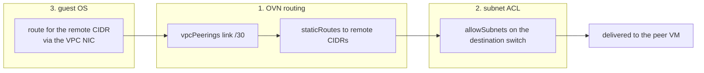

# Make VPC peering work end to end: interconnect addressing, peer-scoped isolation, and guest routes

- **Title:** `Make VPC peering work end to end: interconnect addressing, peer-scoped isolation, and guest routes`
- **Author(s):** `@mattia-eleuteri`
- **Date:** `2026-08-05`
- **Status:** Draft

## Overview

`VirtualPrivateCloud.spec.peers` shipped in v1.2.0 ([cozystack/cozystack#2152](https://github.com/cozystack/cozystack/pull/2152)) and the API reads like a finished feature: declare a peer on both sides and the two private networks interconnect. In practice, declaring peers today produces **no working connectivity at all**, and it leaves both `Vpc` objects in a permanent kube-ovn reconcile-error loop.

This proposal is the result of taking the feature to production for the first time and instrumenting every layer. Peering is not one mechanism, it is **three independent layers that must all be correct**: OVN routing, subnet ACLs, and routes inside the guest. The chart gets the first one wrong by a single missing netmask, does not address the second at all, and the third is not addressed anywhere in Cozystack. Each layer fails silently and in a way that points the operator at the wrong layer.

The proposal fixes the routing bug, makes isolation derive from the declared peering instead of being left to the operator, specifies guest route delivery through the mechanism kube-ovn already uses for its own components, and adds the status surface that would have made all three failures self-evident. Every claim below was measured on a production cluster (chart `virtualprivatecloud@0.0.0+037aa74375c7`, kube-ovn v1.15.10, KubeVirt v1.8.2); commands and outputs are quoted inline.

## Scope and related proposals

- **[`tenant-site-connectivity`](../tenant-site-connectivity/README.md) (Accepted)** — complementary and a different niche. That proposal connects a tenant to **external** sites through gateway VMs; this one interconnects **two VPCs inside the same cluster**. It also states the constraint this proposal inherits: managed apps live on the default pod network and cannot be moved onto a VPC, and VMs are dual-homed. That dual-homing is exactly what makes layer 3 below hard.
- **[#35 PublicIP / PublicIPClaim](https://github.com/cozystack/community/pull/35)** — related to the deferred egress item below. Routing tenant internet egress through a tenant-owned firewall VM needs a stable egress identity; that work belongs there, not here.
- **Deferred, deliberately out of scope here:**
  - **Internet egress through a tenant firewall VM in a peered hub.** Not deferred as unknown: §7 specifies the exact working recipe, measured with `ovn-trace`, and isolates the two things missing upstream (a way to express *transit*, and the [virtual router](https://cozystack.io/docs/v1.6/networking/virtual-router/) UX extended into VPCs). What this proposal does **not** do is commit to an implementation for either, since both are decisions about the isolation model.
  - **More than two VPCs in one peering topology.** kube-ovn documents two-VPC interconnection only; this proposal makes that limit explicit and enforced rather than silently exceeded.
  - **Cross-cluster VPC interconnect.** Different problem (OVN-IC), different proposal.

## Context

A `VirtualPrivateCloud` renders, from `packages/apps/vpc/templates/vpc.yaml`, one kube-ovn `Vpc`, one `Subnet` plus one `NetworkAttachmentDefinition` per declared subnet, and a discovery `ConfigMap`. The application is registered by `packages/system/virtualprivatecloud-rd/cozyrds/virtualprivatecloud.yaml`, whose `release.prefix` is `virtualprivatecloud-`, so a VPC named `hub` in namespace `tenant-acme` becomes release `virtualprivatecloud-hub` and VPC id `vpc-` + first 6 hex of `sha256("tenant-acme/virtualprivatecloud-hub")`.

The API surface is three lists:

```yaml
apiVersion: apps.cozystack.io/v1alpha1
kind: VirtualPrivateCloud
metadata:
  name: hub
  namespace: tenant-acme
spec:
  subnets:
    - name: snet-hub-ext-01
      cidr: 10.0.0.0/27
    - name: snet-hub-int-01
      cidr: 10.0.0.32/27
  peers:
    - tenantNamespace: tenant-acme
      vpcName: spoke01
  routes:
    - cidr: 10.1.0.0/27
      nextHopIP: 169.254.27.225
```

`peers` renders `Vpc.spec.vpcPeerings`, `routes` renders `Vpc.spec.staticRoutes`, and each subnet is rendered `private: true` with no `allowSubnets`:

```yaml
# packages/apps/vpc/templates/vpc.yaml (subnet block, abridged)
spec:
  vpc: {{ $vpcId }}
  cidrBlock: {{ .cidr }}
  provider: "{{ $subnetId }}.{{ $.Release.Namespace }}.ovn"
  enableLb: false
  private: true
```

The interconnect address for each side is derived deterministically from the sorted VPC-id pair:

```gotemplate
{{- $sorted := list $vpcId $remoteVpcId | sortAlpha }}
{{- $pairHash := sha256sum (join "/" $sorted) }}
{{- $byte0 := int (include "cozy-lib.strings.hexToInt" (substr 0 2 $pairHash)) }}
{{- $byte1 := int (include "cozy-lib.strings.hexToInt" (substr 2 4 $pairHash)) }}
{{- $oct3 := int (add (mod $byte0 254) 1) }}
{{- $base4 := int (mul (mod $byte1 64) 4) }}
{{- if eq $vpcId (index $sorted 0) }}
    - remoteVpc: {{ $remoteVpcId }}
      localConnectIP: {{ printf "169.254.%d.%d" $oct3 (int (add $base4 1)) }}
{{- else }}
    - remoteVpc: {{ $remoteVpcId }}
      localConnectIP: {{ printf "169.254.%d.%d" $oct3 (int (add $base4 2)) }}
{{- end }}
```

Three layers have to line up for a packet to cross:



Layer 1 is what `peers` and `routes` express. Layer 2 is not expressible in the API at all. Layer 3 is not addressed anywhere in Cozystack, and is the one nobody expects because in every public cloud a VPC is internally routable by definition.

### The problem

In the operator's voice, in the order the failures actually arrive:

> I declared the peer on both VPCs. The `VirtualPrivateCloud` objects both report `Ready=True`. Nothing pings. And now `kube-ovn-controller` is logging `error syncing add/update vpc "vpc-2cfb24": CIDRInvalid, requeuing` twice a minute for both of my VPCs, so I am afraid I have broken more than peering.

> Someone told me to put the interconnect IP in CIDR form. I patched the `Vpc` objects by hand and OVN finally created the peer router port and the static routes. `ovn-nbctl lr-route-list` looks perfect. It still does not ping.

> The ACLs on my subnets only allow traffic whose source is inside the subnet itself. So peering routes the packet all the way to the destination switch, which then drops it. There is no field in `VirtualPrivateCloud` to open that. I patched the `Subnet` objects directly, which is unmanaged state that no one will remember.

> Now two VMs in **the same VPC**, in two different subnets, still cannot reach each other. That has nothing to do with peering. Apparently a VPC is not internally routable here.

> Finally: even with routing and ACLs correct, my VM has no route for the remote CIDR, because its default route is on the pod NIC. So I add routes by hand inside every guest, and they are gone the next time the VM is rebuilt.

Each of these is a separate layer failing, each one looks like the previous one is still broken, and none of them is visible on the CR.

## Goals

- Declaring `peers` on both sides yields **working L3 connectivity between the peered VPCs' subnets**, with no manual patching of kube-ovn objects.
- A malformed or unsatisfiable peering **never leaves `Vpc` objects in a reconcile-error loop**; the error is reported on the `VirtualPrivateCloud` status instead.
- Subnet isolation opens to **exactly the peered CIDRs**, derived from the declaration, and to nothing else.
- **Subnets of the same VPC are mutually reachable**, which is what "VPC" means to a user.
- Guests receive the routes they need **without cloud-init, without per-VM manual routes, and without a broad aggregate route**, and the routes survive a VM rebuild.
- Interconnect link addresses are **guaranteed conflict-free**, not probabilistically unique.
- One-sided declaration, CIDR overlap, and link conflicts are **visible on the CR status** with actionable reasons.

### Non-goals

- Peering more than two VPCs in one topology (kube-ovn limitation; this proposal enforces the limit rather than lifting it).
- Internet egress through a peered firewall VM (deferred; needs the isolation-model decision and #35).
- Changing how managed apps are networked; they stay on the default pod network.
- Cross-cluster interconnect.

## Design

### 1. `localConnectIP` must carry a netmask

kube-ovn documents the field as "the IP address **and CIDR** of the interconnection endpoint", with `169.254.0.1/30` in the reference YAML. The chart renders a bare address, and kube-ovn rejects the whole `Vpc`:

```
I0805 12:58:55.033793 vpc.go:275] handle add/update vpc vpc-2cfb24
E0805 12:58:55.034043 net.go:265] invalid CIDR address: 169.254.27.225
E0805 12:58:55.034067 vpc.go:318] invalid cidr 169.254.27.225
E0805 12:58:55.034124 controller.go:1554] "Unhandled Error" err="error syncing
  add/update vpc \"vpc-2cfb24\": CIDRInvalid, requeuing"
```

The severity is larger than a broken feature: the failure aborts the **entire** `handleAddOrUpdateVpc` sync for that VPC, so from the moment a peer is declared, no other change to that VPC is applied either. The requeue loop persists indefinitely.

The allocation scheme already reserves a four-address block (`base4` is a multiple of 4 and the two endpoints are `+1` and `+2`), so the mask is unambiguous:

```gotemplate
-      localConnectIP: {{ printf "169.254.%d.%d" $oct3 (int (add $base4 1)) }}
+      localConnectIP: {{ printf "169.254.%d.%d/30" $oct3 (int (add $base4 1)) }}
```

Verified: with `/30` on both sides, kube-ovn immediately creates the peer router port and installs the routes.

```
$ ovn-nbctl lrp-list vpc-52d844
fcb79315-... (vpc-52d844-vpc-2cfb24)

$ ovn-nbctl lr-route-list vpc-52d844
              10.1.0.0/27            169.254.27.225 dst-ip
             10.1.0.32/27            169.254.27.225 dst-ip
```

This is a two-character fix and it is the whole reason the feature has never worked. It should ship on its own, ahead of everything else in this proposal.

### 2. Interconnect addresses must be allocated, not hashed

`oct3` takes 254 values and `base4` takes 64, so the scheme addresses **16 256 distinct /30 blocks** inside `169.254.0.0/16`. The block is chosen by hashing the VPC-id pair, with no conflict check. Two unrelated peerings in the same cluster can therefore be assigned the same /30, which puts four logical router ports on one link subnet and breaks both peerings, silently and non-deterministically.

By the birthday bound, `P(collision) ≈ 1 − exp(−N(N−1) / (2 × 16 256))` for `N` peerings in a cluster:

| Peerings in a cluster | Collision probability |
| --- | --- |
| 20 | 1.2 % |
| 50 | 7.3 % |
| 100 | 26 % |
| 200 | 71 % |

A multi-tenant platform reaches those numbers. The hash bought stability across reconciliations, which is a real requirement, but determinism and conflict-freedom are not the same property, and only the second one is load-bearing.

Proposed: the interconnect block becomes **allocated state, recorded on the CR**, and the hash becomes the initial *preference* rather than the answer.

- `cozystack-api` (or a small controller) owns a cluster-scoped allocation of `/30`s from a configurable range, defaulting to `169.254.0.0/16`.
- On first reconcile of a peering it tries the hashed block, and on conflict walks to the next free one.
- The chosen block is written to `VirtualPrivateCloud.status.peers[].connectCIDR` and to the discovery `ConfigMap`, so both sides and the operator can read it, and it is stable forever after.
- The reserved range is documented and admission rejects a `subnets[].cidr` that overlaps it.

Stability across reconciliations is preserved because the value is read from status, not recomputed. This also removes the fragile coupling described next.

### 3. Derive the peer's identity instead of recomputing its hash

The template reconstructs the remote VPC id by re-implementing the release-name convention with a **hardcoded prefix string**:

```gotemplate
{{- $remoteRelease := printf "virtualprivatecloud-%s" .vpcName }}
{{- $remoteVpcId := printf "vpc-%s" (printf "%s/%s" .tenantNamespace $remoteRelease | sha256sum | trunc 6) }}
```

This is correct today only because `release.prefix` in the `ApplicationDefinition` is exactly `virtualprivatecloud-` and `Chart.yaml`'s `name` still reads `virtualprivatecloud` even though the directory was renamed to `packages/apps/vpc`. The day that prefix changes, every peering in every cluster starts pointing at a VPC id that does not exist, with no error anywhere: `remoteVpc` simply names nothing.

The remote VPC is a real object with a discoverable identity (`cozystack.io/vpcName` + `cozystack.io/tenantName` labels are already on every `Vpc`). Proposed: resolve the peer by lookup on those labels and fail loudly with `RemoteVPCNotFound` when it is absent, instead of trusting a string-built hash. This also gives admission a place to detect CIDR overlap between the two VPCs, which kube-ovn requires and nothing currently checks.

### 4. Subnet isolation must follow the declaration

Every subnet is rendered `private: true` with no `allowSubnets`, which produces exactly this on each logical switch:

```
$ ovn-nbctl acl-list subnet-8ffd7d15
  to-lport  3000 (ip4.src == 100.64.0.0/16) allow-related
  to-lport  1001 (ip4.src == 10.0.0.0/27 && ip4.dst == 10.0.0.0/27) allow-related
  to-lport  1000 (ip) drop log(name=subnet-8ffd7d15,severity=warning)
```

Only intra-subnet traffic survives. Peered traffic is routed correctly and then dropped by the destination switch, which is the single most misleading failure in the whole feature: every routing diagnostic is green.

There is no field in `VirtualPrivateCloud` to change this, so the only way to make peering work today is to patch kube-ovn `Subnet` objects out of band. That is unmanaged state, invisible to GitOps, and lost whenever the object is recreated.

Proposed: the chart derives `allowSubnets` for each subnet from the declaration, with no new user-facing field in the common case.

- **Sibling subnets of the same VPC** are always allowed. A VPC that is not internally routable does not match any user's mental model, and today two subnets of one VPC cannot talk (measured). This is arguably a more serious bug than the peering one and it needs no new API.
- **Subnets of each peered VPC** are allowed, read from the peer's subnet list via the lookup in §3.
- Nothing else. `snet-hub-int-01` stays unreachable from a spoke unless it is in a peered VPC's subnet list.

kube-ovn generates one bidirectional rule per allowed pair, so a symmetric `allowSubnets` on both ends is sufficient and the result is verifiable:

```
$ ovn-nbctl acl-list subnet-790d65c5
  to-lport 1001 ((ip4.src == 10.1.0.0/27 && ip4.dst == 10.0.0.0/27) ||
                 (ip4.src == 10.0.0.0/27 && ip4.dst == 10.1.0.0/27)) allow-related
  to-lport 1001 ((ip4.src == 10.1.0.0/27 && ip4.dst == 10.1.0.32/27) ||
                 (ip4.src == 10.1.0.32/27 && ip4.dst == 10.1.0.0/27)) allow-related
  to-lport 1001 (ip4.src == 10.1.0.0/27 && ip4.dst == 10.1.0.0/27) allow-related
  to-lport 1000 (ip) drop log(...)
```

Because `allowSubnets` becomes chart-managed, an operator's existing out-of-band patch will be overwritten on upgrade. That is the intent, and it is called out in [Upgrade and rollback compatibility](#upgrade-and-rollback-compatibility).

### 5. Guest routes: use the mechanism kube-ovn already uses

A KubeVirt VM in a VPC is dual-homed: a `default` pod NIC that carries the default route and holds the LoadBalancer path, plus the VPC NIC. The guest therefore has an on-link route for its own subnet and nothing else. Every destination outside its own /27, **including a sibling subnet of its own VPC**, falls through to the pod NIC's default route and leaves by the wrong interface. Measured on a Windows guest at `10.1.0.2/27`:

```
10.1.0.0/27      on-link      (VPC NIC)
0.0.0.0/0        10.244.0.1   (pod NIC)     <- everything else goes here
```

The native mechanism for this already exists in kube-ovn and **kube-ovn uses it for its own VPC components**: `pkg/controller/vpc_dns.go` and `pkg/controller/vpc_nat_gateway.go` both build it through `pkg/util/pod_routes.go`. It is a provider-scoped pod annotation, parsed in `pkg/daemon/handler.go`:

```go
// pkg/util/const.go
RoutesAnnotationTemplate       = "%s.kubernetes.io/routes"
DefaultRouteAnnotationTemplate = "%s.kubernetes.io/default_route"

// pkg/request/cniserver.go
type Route struct {
	Destination string `json:"dst,omitempty"`
	Gateway     string `json:"gw,omitempty"`
}
```

For a VM whose VPC NIC provider is `subnet-b7bc75ca.tenant-acme.ovn`, the annotation on the VM's pod template is:

```yaml
subnet-b7bc75ca.tenant-acme.ovn.kubernetes.io/routes: |
  [{"dst":"10.1.0.0/27","gw":"10.1.0.33"},{"dst":"10.0.0.0/27","gw":"10.1.0.33"}]
```

**Measured end to end:** with that annotation on `VirtualMachine.spec.template.metadata.annotations`, the CNI applies the routes to the pod interface, KubeVirt's in-launcher DHCP server relays them to the guest, and both routes appear in a Windows guest with zero manual steps and survive the VM's lifecycle.

Proposed: `vm-instance` (or `cozystack-api`, which already knows the VPC an instance is attached to) generates this annotation from the VPC topology — the VPC's own subnets plus the peered VPCs' subnets, the same set computed in §4, with the subnet's gateway as next hop. The tenant declares a peering; their VMs get precisely the routes that peering implies, and nothing more.

A second delivery vehicle exists and is arguably better because it already has a documented UX: extending Cozystack's `kubeovn-webhook` to propagate **provider-scoped** annotations from the namespace, which is what makes the [virtual router](https://cozystack.io/docs/v1.6/networking/virtual-router/) feature work on the default pod network today (§7.2). The two are complementary rather than exclusive: platform-generated per-VM annotations express what the peering implies, and the namespace form lets a tenant add routes of their own on top without touching each VM.

#### 5.1 The blocker this exposes, and what it needs from KubeVirt

Delivering those routes also makes the guest install a **default route via the VPC subnet gateway**, with a better metric than the pod NIC's:

```
0.0.0.0/0   10.1.0.33    10.1.0.34    15   <- VPC NIC, wins
0.0.0.0/0   10.244.0.1   10.244.7.84  16   <- pod NIC
```

The VPC has `enableExternal: false`, so the VM immediately loses external connectivity (`Find-NetRoute 8.8.8.8` selects the VPC NIC; ICMP to the internet fails — measured).

Setting `<provider>.kubernetes.io/default_route: "false"` does **not** suppress it, and the reason is worth recording: kube-ovn's own default is already correct, since `pkg/daemon/handler.go` computes

```go
switch pod.Annotations[fmt.Sprintf(util.DefaultRouteAnnotationTemplate, podRequest.Provider)] {
case "true":  isDefaultRoute = true
case "false": isDefaultRoute = false
default:      isDefaultRoute = ifName == "eth0"
}
```

and the VPC NIC is not `eth0`. The default gateway is advertised by **KubeVirt's** DHCP server for that interface once the CNI result carries routes. The fix therefore does not live in Cozystack or kube-ovn: KubeVirt should not advertise a default gateway on a secondary interface, or should expose a knob for it. This proposal's position is that §5 ships **gated on that**, and that the gate is worth naming explicitly rather than shipping a mechanism that trades inter-VPC reachability for internet access. An upstream KubeVirt issue is a deliverable of this proposal.

#### 5.2 A dead end, documented so nobody repeats it

kube-ovn's `Subnet.spec.enableDHCP` and `spec.dhcpV4Options` look like the obvious way to push routes and are **irrelevant for KubeVirt VMs**. The guest's DHCP server is virt-launcher's, not OVN's:

```
DHCP Server . . . : 169.254.75.11        (OVN's server_id is 169.254.0.254)
Lease Expires . . : 2029-04-30           (~1000-day lease, KubeVirt's signature)
```

Confirmed on the OVN side too: with `enableDHCP: true` the switch's DHCP flows stay empty and `Logical_Switch_Port.dhcpv4_options` is never bound.

```
$ ovn-sbctl lflow-list subnet-b7bc75ca | grep dhcp
  table=23(ls_in_dhcp_options ), priority=0 , match=(1), action=(next;)
  table=24(ls_in_dhcp_response), priority=0 , match=(1), action=(next;)
```

Two side notes for whoever touches this area: OVN itself does accept `classless_static_route` (option 121) in its NB `DHCP_Options` — the dead end is the path, not the option; and kube-ovn's `dhcpV4Options` parser splits the string on commas, so an option 121 value is truncated at its first comma and cannot be expressed at all. That parser bug is real but out of scope here, since OVN is not in the DHCP path for VMs.

### 6. Status, consent, and the two-VPC limit

Peering requires a declaration on **both** sides, which is a sound cross-tenant consent model and should be kept. What is missing is any signal about it: a VPC with a one-sided declaration reports `Ready=True` and does nothing. Every failure in this document is currently invisible on the CR.

Proposed status, per peer:

```yaml
status:
  peers:
    - tenantNamespace: tenant-acme
      vpcName: spoke01
      connectCIDR: 169.254.27.226/30
      conditions:
        - type: Established
          status: "False"
          reason: AwaitingRemoteDeclaration
          message: 'tenant-acme/spoke01 does not declare a peer back to tenant-acme/hub'
```

Reasons: `Established`, `AwaitingRemoteDeclaration`, `RemoteVPCNotFound`, `CIDROverlap`, `LinkAllocationConflict`, `PeerLimitExceeded`.

The last one matters because kube-ovn's documentation states that **only two-VPC interconnection is supported**, while `spec.peers` is an unbounded array. Either the schema caps it at one entry, or the support level is documented and the status reports `PeerLimitExceeded` beyond it. Silently rendering a topology kube-ovn does not support is the worst of the three options.

### 7. `private: true` forbids egress and transit, and the isolation model cannot express either

The two questions every operator asks next are "can I route my VPC's internet traffic through my own firewall VM" and "can I put that firewall in a peered hub". Both are reachable today, but only by turning isolation off on one subnet, and the reason is worth specifying because it is a gap in the model rather than a missing route.

Everything below was obtained with `ovn-trace`, which evaluates the logical pipeline without sending a packet.

**Egress is dropped before routing is consulted.** A VM sending to any destination outside its subnet's `allowSubnets` is dropped in the *egress* pipeline of its own switch, on the way to its own router patch port:

```
$ ovn-trace --ct new subnet-b7bc75ca 'inport == "<vm-lsp>" && ip4.src == 10.1.0.34
    && ip4.dst == 8.8.8.8 && tcp && ...'
egress(dp="subnet-b7bc75ca", outport="subnet-b7bc75ca-vpc-2cfb24")
 6. ls_out_acl_eval (northd.c:7427): reg8[30..31] == 2 && reg0[9] == 1 && (ip), priority 2000
    log(name="subnet-b7bc75ca", verdict=drop, severity=warning);
```

This is the detail that misleads: the `to-lport` ACL applies to the packet *leaving toward the router*, so a `staticRoutes` entry for the destination is never even evaluated. Operators reasonably conclude their route is wrong.

The control case walks the whole peering datapath and is a useful artifact in its own right — to an allowed destination the same trace goes all the way to the peer VM's port:

```
 6. ls_out_acl_eval: ... ((ip4.src == 10.1.0.32/27 && ip4.dst == 10.0.0.0/27) || ...), priority 2001
egress(dp="vpc-2cfb24", outport="vpc-2cfb24-vpc-52d844")      # interconnect
egress(dp="vpc-52d844", outport="vpc-52d844-subnet-8ffd7d15")
egress(dp="subnet-8ffd7d15", outport="vm-instance-fw01-....ovn")   # delivered
```

**Transit cannot be expressed at all.** `allowSubnets` renders pair rules anchored on **the subnet's own CIDR**: `(src == <own> && dst == <allowed>) || (src == <allowed> && dst == <own>)`. A transit VM receives packets whose source *and* destination are both foreign to its subnet, so no pair rule can ever match it. Measured: after declaring `8.8.8.8/32` in `allowSubnets` on **both** the spoke and the hub subnets, the packet clears the spoke, crosses the interconnect, and is then dropped on the hub switch while being delivered to the firewall:

```
egress(dp="subnet-8ffd7d15", outport="vm-instance-fw01-....ovn")
 6. ls_out_acl_eval (northd.c:7456): ... priority 2000
    log(name="subnet-8ffd7d15", verdict=drop, severity=warning);
    LOG: ... nw_src=10.1.0.34, nw_dst=8.8.8.8
```

The hub subnet's rules anchor on `10.0.0.0/27`; the pair `(10.1.0.32/27, 8.8.8.8/32)` is not something it can say.

**With `private: false` on the firewall's subnet, it works.** Same trace, one field changed, and the packet is delivered:

```
egress(dp="subnet-8ffd7d15", inport="subnet-8ffd7d15-vpc-52d844",
       outport="vm-instance-fw01-key-hdr....ovn")
    /* output to "vm-instance-fw01-key-hdr....ovn", type "" */
```

So the complete recipe for firewall-mediated egress inside a VPC is: the destination declared in the *source* subnet's `allowSubnets`; `private: false` on the subnet hosting the firewall; `staticRoutes` for the destination via the interconnect on the spoke and via the firewall's VPC address on the hub; `<provider>.kubernetes.io/port_security: "false"` on the firewall's VPC port so kube-ovn does not drop the packets it forwards with a foreign source; and the firewall's own policy and NAT.

Two things are missing upstream, and they are what this section asks for:

1. **A way to express transit through a *tenant-supplied* next hop.** To be precise about what already exists, because the gap is narrower than "a VPC cannot reach the internet": kube-ovn offers three mechanisms for external connectivity from a custom VPC — [`VpcNatGateway`](https://kubeovn.github.io/docs/v1.12.x/en/guide/vpc/), the OVN gateway with [EIP/FIP/SNAT](https://kubeovn.github.io/docs/v1.12.x/en/guide/eip-snat/), and the newer [`VpcEgressGateway`](https://kubeovn.github.io/docs/v1.14.x/en/vpc/vpc-egress-gateway/) with ECMP and sub-second BFD failover. The `vpc-egress-gateways.kubeovn.io` CRD is served in the version Cozystack ships.

   What none of them does is put a **tenant-owned appliance** in the path: `VpcEgressGateway` is always kube-ovn's own pod pair (VPC side plus a macvlan leg to the physical network), `snat: true` is mandatory, and DNAT/EIP are explicitly unsupported. A tenant that wants its own firewall to inspect and police egress — the hub-and-spoke shape tenants actually arrive with, and the one `tenant-site-connectivity` already legitimises for *external* traffic — has no supported way to interpose it.

   The ask is therefore narrow: a **transit allowance** that lets a declared gateway *workload* forward for declared CIDR pairs while its subnet stays private. Note one thing I could not determine from the documentation and am not going to assert: whether an egress gateway's own traffic passes a private subnet's ACL, and by which rule. If it does, whatever mechanism grants it is the natural place to hang this. A minimal alternative, available immediately, is for the `VirtualPrivateCloud` API to let one subnet be declared the gateway subnet and render `private: false` for it deliberately and visibly, rather than leaving operators to patch `Subnet` objects out of band as they do today — with the trade-off spelled out in [Security](#security).
2. **The [virtual router](https://cozystack.io/docs/v1.6/networking/virtual-router/) UX extended into VPCs.** That feature is implemented by Cozystack's own admission webhook in `packages/system/kubeovn-webhook/images/kubeovn-webhook/admission.go`, which copies exactly two annotations from the namespace onto pods:

   ```go
   AnnotationRoutes       = "ovn.kubernetes.io/routes"
   AnnotationPortSecurity = "ovn.kubernetes.io/port_security"
   ```

   Both are the **unprefixed** forms, so they only ever apply to the default pod-network provider. kube-ovn already defines the provider-scoped equivalents (`RoutesAnnotationTemplate`, `PortSecurityAnnotationTemplate` in `pkg/util/const.go`). Teaching the webhook to propagate provider-scoped keys would make the documented virtual-router workflow work **inside a VPC**, with the same namespace-level UX, and it is also the cleanest delivery vehicle for the guest routes in §5.

## User-facing changes

- `spec.peers` and `spec.routes` keep their shape. A tenant that already declares a peer needs **no manifest change**; it starts working.
- **New:** `status.peers[]` with `connectCIDR` and per-peer conditions, surfaced in the dashboard next to the VPC.
- **Behaviour change, no API change:** subnets of the same VPC become mutually reachable, and subnets of peered VPCs become reachable. Both follow from the declaration.
- **Behaviour change, no API change:** VMs attached to a VPC receive routes for their VPC's subnets and for peered VPCs' subnets (Phase 3, gated per §5.1).
- Documentation gains an end-to-end peering page describing all three layers, because "it routes but does not ping" is otherwise unanswerable from the docs.

## Upgrade and rollback compatibility

- A VPC **without** peers renders identically. No migration.
- A VPC **with** peers is currently in a broken, error-looping state, so the `/30` fix is a repair rather than a behaviour change. On upgrade, kube-ovn stops erroring and the peering starts working. This is the intended outcome and should be called out in the release notes, because connectivity that did not exist begins to exist.
- `allowSubnets` becomes chart-managed. Clusters that patched `Subnet` objects out of band to make peering work will have those patches **overwritten by the derived value**. In the common case the derived value is a superset of what an operator would have written by hand, and drift disappears. Operators who widened isolation beyond the peering (for example `0.0.0.0/0`) will lose that widening and must move it into a supported field; the release notes must say so.
- Interconnect addresses move from hashed to allocated. Existing peerings must keep the block they already use: the allocator seeds `status.peers[].connectCIDR` from the currently rendered value on first reconcile, so no established peering renumbers. Renumbering an established peering is disruptive and must never happen implicitly.
- Rollback: clearing `spec.peers` removes the peer port, the static routes, the derived `allowSubnets`, and the generated guest-route annotations. The `/30` fix is not separately reversible, and reverting to a bare IP restores the reconcile loop; that is a reason to ship it early and never revert it.

## Security

- **Peering is a cross-tenant network path**, so consent must be enforced, not conventional. The bidirectional declaration is that consent, and §6 makes a one-sided declaration explicitly non-functional and visible rather than partially applied. Nothing in this proposal lets one tenant reach another tenant's VPC without a matching declaration on the other side.
- **Isolation must not widen beyond the declaration.** The whole point of deriving `allowSubnets` in §4 rather than exposing a free-form field is that the opened set is exactly the peered subnets. A free-form `allowSubnets` in the API would be a tenant-supplied ACL, which is a much larger surface; this proposal deliberately does not add one.
- The `169.254.0.0/16` interconnect range becomes reserved platform state and admission must reject a tenant subnet that overlaps it, otherwise a tenant can collide with a link subnet by choosing its own CIDR.
- Guest route injection (§5) adds routes only on the tenant's own VMs, through an annotation the platform generates. It is not a new privilege: a tenant can already add routes inside its own guest.
- No new secrets, no new RBAC verbs for tenants.

**On the `private: false` trade-off in §7,** since it is the one place this proposal describes turning a protection off. It is worth being precise about what does and does not change, because the intuition that it exposes a public-facing VM is the wrong axis:

- It does **not** create public or pod-network exposure. VPC subnets are unreachable from the node and pod networks by *routing*, independently of ACLs — verified: a node resolves `10.0.0.2` to its physical default gateway and gets no reply. A gateway VM's public exposure lives entirely on its **other** interface, the pod NIC behind a `Service`, and is governed by that Service's ports, not by the VPC subnet's ACL.
- It **does** move the trust boundary. Within the VPC and its peers the platform stops filtering by CIDR pair for that subnet, and `port_security: "false"` — which forwarding requires — lets that VM emit packets with any source address. Filtering moves from the platform ACL into the gateway's own configuration, with no platform-level backstop underneath.
- The blast radius stays bounded by the **peers'** privacy: their pair rules still anchor on their own CIDR, so a compromised gateway spoofing an arbitrary source is dropped by the peer subnet's own ACL. It can only reach a peer using a source that peer already allows.
- Therefore the deployment shape matters more than the flag: the gateway VM should be **alone in a dedicated transit subnet**, and no workload should ever share a non-private subnet. Under that shape, isolation is disabled only on a subnet whose sole occupant is the component whose job is to be a routing bridge.

This is the security argument for asking kube-ovn for a transit allowance rather than settling for `private: false`: the goal is to keep CIDR filtering *and* permit forwarding, and today those are mutually exclusive.

## Failure and edge cases

- **One side declares, the other does not** → no peer port is created; `Established=False/AwaitingRemoteDeclaration` on the declaring side. Today: `Ready=True` and silence.
- **Peered VPCs have overlapping subnet CIDRs** → rejected at admission with `CIDROverlap`; kube-ovn requires non-overlapping CIDRs and currently nothing checks it.
- **Hashed interconnect block already in use** → allocator picks the next free block; `LinkAllocationConflict` only if the range is exhausted.
- **More than one peer declared** → `PeerLimitExceeded`, no partial topology rendered.
- **Peer VPC is deleted while peered** → the surviving side reports `RemoteVPCNotFound`, keeps its subnets working, and drops the peer port and the derived ACL entries and guest routes.
- **A subnet is added to a peered VPC** → the peer's derived `allowSubnets` and its VMs' route annotations must both pick it up; this is the main reconcile-fanout case and needs a watch on peered VPCs, not just on self.
- **A VM is rebuilt** → guest routes come from a generated annotation on the pod template, so they are reapplied by construction. This is the property that manual guest routes and cloud-init do not have.
- **Internet-bound traffic pointed at the VPC gateway** → dropped by the source subnet's own ACL **before routing is consulted**, see §7. Adding a static route does not help until the destination is declared.
- **A VM in a peered VPC used as a transit gateway** → dropped when the packet is delivered to it, because `allowSubnets` cannot express transit between two foreign CIDRs, see §7.

## Testing

- **Unit, chart rendering:** `helm template` asserts `localConnectIP` matches `^169\.254\.\d+\.\d+/30$` on both sides of a pair, that the two sides differ by exactly one in the last octet, and that both land in the same /30. This single assertion would have caught the shipped bug.
- **Unit, derivation:** given a VPC with two subnets peered to a VPC with two subnets, assert the rendered `allowSubnets` on each of the four `Subnet` objects is exactly the expected set, and that a non-peered third VPC's CIDR is absent.
- **Integration, OVN state:** after applying a peered pair, assert `ovn-nbctl lrp-list` contains `vpc-<a>-vpc-<b>` on both routers, `lr-route-list` contains one `dst-ip` route per remote subnet, and `acl-list` on each switch contains the bidirectional pair rule. Assert `kube-ovn-controller` logs contain no `CIDRInvalid` for the two VPCs.
- **Integration, pipeline assertions with `ovn-trace`.** Worth calling out as a cheap and underused tool for this feature: `ovn-trace --ct new` evaluates the whole logical pipeline with no traffic, no VM, and no flakiness, and it names the exact ACL that decided. A positive trace (peer VM's port reached) and a negative one (non-peered CIDR dropped, with the drop's priority asserted) cover the dataplane intent at a fraction of the cost of an e2e, and every measurement in §7 was produced this way. Recommended as the primary regression gate, with the e2e below kept as the end-to-end sanity check.
- **e2e, dataplane:** one VM per VPC; assert ICMP and TCP both ways between the peered subnets; assert a **sibling** subnet in the same VPC is reachable; assert a third, non-peered VPC's subnet is **not** reachable and that the drop counter on its switch increments. The negative assertion is as important as the positive one, because a too-wide `allowSubnets` would otherwise pass.
- **e2e, guest:** assert the guest's routing table contains the derived routes after a cold restart, **and** that the guest's default route is unchanged and its external connectivity still works. The second half is the gate from §5.1 and must fail loudly if KubeVirt still advertises a gateway.
- **Manual, upgrade:** a cluster with an out-of-band `allowSubnets` patch upgrades to the derived value without connectivity loss.

## Rollout

- **Phase 1 — unblock.** The `/30` fix alone. Small, isolated, and it converts a feature that has never worked into one that routes. Ships as a patch release; release notes flag that peerings declared earlier begin to carry traffic.
- **Phase 2 — make it usable and observable.** Derived `allowSubnets` including sibling subnets, peer resolution by label lookup, admission checks for CIDR overlap and peer count, `status.peers[]` with conditions, and the allocator seeded from existing rendered values.
- **Phase 3 — guest routes.** Generated `<provider>.kubernetes.io/routes` annotations, gated on the KubeVirt default-gateway question from §5.1. Until that gate clears, the mechanism is documented but not enabled by default.
- **Phase 4 — deferred.** Firewall-mediated egress, jointly with #35.

Phase 1 is independently valuable and should not wait for consensus on the rest.

## Open questions

1. **Should a VPC be internally open by default?** This proposal says yes, on the grounds that every public cloud behaves that way and that the current behaviour surprises everyone. The alternative is an explicit per-VPC field, which is more configurable and, in my view, configurability nobody wants.
2. **Who owns interconnect allocation?** A controller with real IPAM is cleanest; a chart-level hash with a conflict check in `cozystack-api` is cheaper. The proposal assumes the latter is enough because the range is large and peerings are few, but the collision table argues the boundary is closer than it looks.
3. **Is the KubeVirt default-gateway behaviour a bug or intended?** If intended, Phase 3 needs a different delivery path for guest routes, and I do not currently have a good one that satisfies "native, subnet-scoped, survives rebuild".
4. **Should the peer array be capped at one entry in the schema**, or accepted with a status error? Capping is honest about kube-ovn's support level but is a breaking schema change for anyone who declared two.
5. **How should transit through a tenant-owned appliance be expressed (§7)?** Given that `VpcEgressGateway` already solves platform-managed egress, is interposing a tenant appliance a use case Cozystack wants to support at all, or should tenants be told to use the egress gateway and keep their firewall for north-south at the pod-network edge (`tenant-site-connectivity`)? If it is wanted, a kube-ovn transit allowance preserves isolation but is work in another project, while marking a gateway subnet in the `VirtualPrivateCloud` API and rendering `private: false` for it is available immediately at the cost of isolation on that one subnet. I lean toward the latter as an explicit, documented interim, because operators already do exactly that by out-of-band patch and an API that says so is strictly better than one that hides it.
6. **Does an egress gateway's traffic pass a private subnet's ACL, and by which rule?** I could not determine this from the documentation and did not test it. The answer decides whether the transit allowance in §7 already half-exists.
7. **Should the `kubeovn-webhook` propagate provider-scoped annotations (§7.2)?** It is a small change with a large payoff — the documented virtual-router workflow would start working inside VPCs — but it widens what a namespace annotation can reach, so it deserves a security read rather than my assertion.

## Alternatives considered

**Guest route delivery.** *Cloud-init routes in the VM* — rejected: not platform-managed, per-VM, invisible to the platform, and it makes route topology a property of the guest image rather than of the VPC. *Persistent routes added inside the guest* — rejected: unmanaged state, lost on rebuild, and it scales with VM count rather than with topology. *A broad aggregate route such as `10.0.0.0/8` via the VPC gateway* — rejected: it sends traffic into the VPC that the ACLs then drop, converting a clear "no route" error into a silent blackhole, and it grants reachability the peering never declared. *OVN DHCP option 121 via `Subnet.dhcpV4Options`* — rejected on evidence: OVN is not the DHCP server for KubeVirt VMs (§5.2), so the option is never offered; this is documented above precisely so it is not attempted again.

**Isolation.** *Expose `allowSubnets` as a tenant-facing field* — rejected: it turns isolation into a tenant-supplied ACL and invites exactly the `0.0.0.0/0` widening that the private-subnet model exists to prevent; deriving it from the declaration keeps one source of truth. *Set `private: false` on peered subnets* — rejected: removes isolation wholesale instead of opening it to the peer. *A Kyverno mutation injecting `allowSubnets`* — rejected: it works and we used it as a stopgap downstream, but it moves a core part of the feature outside the API where no reviewer or operator will find it.

**Interconnect addressing.** *Keep the pure hash* — rejected on the collision table; determinism was the goal but conflict-freedom is the requirement. *Let the tenant specify the link CIDR* — rejected: it is platform plumbing, and exposing it invites overlap with tenant subnets.

**Peer identity.** *Keep recomputing the remote VPC id from the hardcoded release prefix* — rejected: it couples every peering in every cluster to a string in an unrelated `ApplicationDefinition`, and it fails silently rather than loudly (§3).
